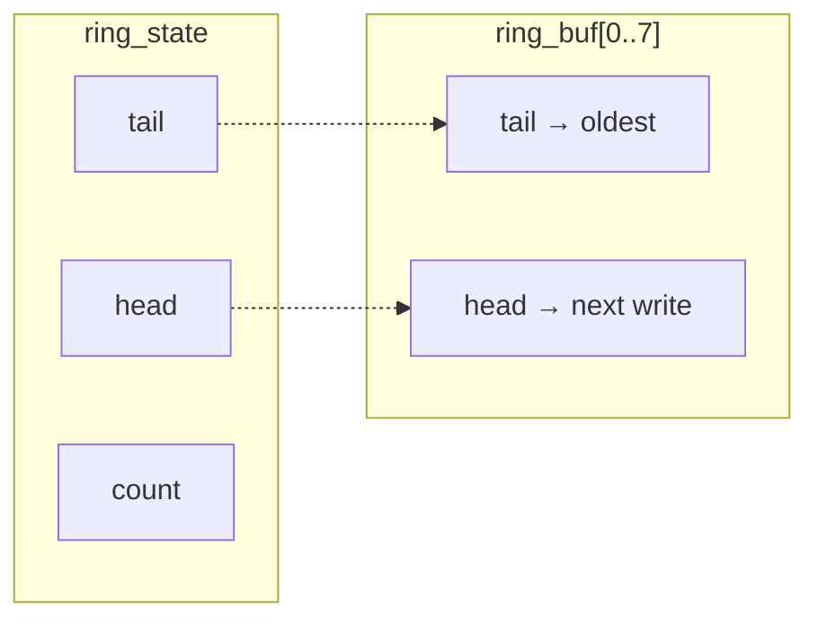

[← Bit Patterns](04-bit-patterns.md) | [Book 2](index.md) | [Recursion →](06-recursion.md)

# Chapter 5 — Records

Chapter 2 indexed bytes in a table. Each element was one byte wide, so stride was always 1 and offsets were obvious. Real programs store **records**: several fields packed together — coordinates, queue indices, flags — with a stride larger than 1.

You can keep field offsets in comments and hope they stay correct. Wirth's advice is the opposite: fix the **representation** first, then write the algorithm against that layout. AZM's `.type` blocks are that representation. You describe the record once; `sizeof` and `offset` supply the numbers your instructions need.

This chapter reviews layout types from Book 1 Chapter 13, applies them to field reads and writes through HL and IX and builds a **ring buffer** — a fixed-size FIFO queue over a byte table — as the main worked example. The companion listing is [`examples/05_ring_buffer.asm`](examples/05_ring_buffer.asm).

---

## The problem: a queue without moving memory

A FIFO queue (first in, first out) needs:

- storage for N elements
- a write index (where the next push goes)
- a read index (where the next pop comes from)
- a count of how many elements are valid (or equivalent logic)

Shifting the whole table on every pop is wasteful on a small machine. A **ring buffer** keeps indices in workspace RAM and only moves the indices. Storage is a fixed byte array; push writes at `head` and advances; pop reads at `tail` and advances. When an index reaches capacity, it wraps to 0.

No allocator, no linked list nodes — just bytes, offsets and compare/branch. That is the Book 2 sweet spot: representation before algorithm, with every memory access visible.

---

## Define the layout once

A record is a packed field list inside `.type` / `.endtype`:

```asm
RingState .type
head    .byte
tail    .byte
count   .byte
.endtype
```

Field lines do **not** allocate memory. They only describe shape. Storage still comes from `.ds`, `.db` or `.dw`:

```asm
RING_CAP .equ 8

ring_buf:
    .ds RING_CAP

ring_state:
    .ds RingState
```

`ring_buf` reserves eight data bytes. `ring_state` reserves `sizeof(RingState)` bytes — three bytes for `head`, `tail` and `count` in order. When the length is a named constant, `.ds RING_CAP` and `.ds byte[8]` mean the same reservation; the type-array form uses literal lengths in the current assembler, not named constants.

Name the compile-time constants you will use in instructions:

```asm
RING_HEAD   .equ offset(RingState, head)
RING_TAIL   .equ offset(RingState, tail)
RING_COUNT  .equ offset(RingState, count)
STATE_SIZE  .equ sizeof(RingState)
```

If you add a field to `RingState`, reassemble and every `.equ` that uses `offset` updates. The algorithm code keeps symbolic names instead of hardcoded 0, 1, 2.

---

## `sizeof` and `.ds Type[n]`

`sizeof(Type)` is the record's exact packed size in bytes. For scalars:

| Type | `sizeof` |
|------|----------|
| `byte` | 1 |
| `word` | 2 |
| `addr` | 2 |

For arrays in size positions, literal lengths multiply:

```asm
BUF_BYTES .equ sizeof(byte[8])   ; = 8
```

If the capacity is a named constant, use the constant directly:

```asm
BUF_BYTES .equ RING_CAP
```

`.ds` accepts a type expression wherever it needs a byte count:

```asm
ring_buf:
    .ds RING_CAP

ring_state:
    .ds RingState
```

These forms are equivalent to `.ds 8` and `.ds 3` here. With a literal length you can also write `.ds byte[8]`; that documents element width when capacity is fixed in source. Initialized data still uses `.db` / `.dw`; `.ds` only reserves space.

Labels stay **untyped**. `ring_state` is an address, not a permanent `RingState` variable. You pass that address in a register and use `offset(RingState, field)` constants at the access site — same rule as in the AZM layout design docs.

---

## Reading and writing fields

### HL plus offset

When HL points at the start of a `RingState` record:

```asm
  ld de, RING_COUNT
  add hl, de
  ld a, (hl)            ; A = count
```

For offsets 0–127, the constant fits in `(ix + d)` form, which is usually shorter.

### IX-relative access

Load the record base into IX once, then use symbolic displacements:

```asm
  ld ix, ring_state
  ld a, (ix + RING_HEAD)
  ld (ix + RING_COUNT), a
```

`RING_HEAD` is the constant 0; `RING_TAIL` is 1; `RING_COUNT` is 2. The assembler substitutes the numeric displacement; the Z80 encodes `(ix + 0)` as `(ix + 0)` and so on.

This is the pattern queue routines use: IX holds `ring_state` for the whole push/pop; HL walks `ring_buf` when the routine needs `base + index`.

### Run-time index into the byte table

`head` and `tail` are dynamic indices (0 .. RING_CAP−1). To address `ring_buf[head]`:

```asm
  ld a, (ix + RING_HEAD)
  ld hl, ring_buf
  ld b, 0
  ld c, a
  add hl, bc            ; HL = ring_buf + head
  ld a, e               ; byte to store (saved in E)
  ld (hl), a
```

AZM does not emit multiply/add for runtime indices. Layout types give you field offsets and record sizes; index × stride and table base + offset remain ordinary Z80 instructions — by design, so the machine stays visible.

---

## Layout casts for constant addresses

When the index and field path are known at assembly time, a **layout cast** folds the address into one expression:

```asm
  ld hl, <RingState>ring_state.count
```

Parts:

- `<RingState>` — layout to apply
- `ring_state` — base label
- `.count` — field path (no `[i]` when accessing a single record)

The assembler computes `ring_state + offset(RingState, count)` and emits `ld hl, imm16`.

For an array of records with a constant index:

```asm
  ld hl, <byte[8]>ring_buf[3]
```

That is `ring_buf + 3` when the element type is `byte`. For a table of structures:

```asm
  ld hl, <Sprite[16]>sprite_table[2].flags
```

expands to `sprite_table + 2 * sizeof(Sprite) + offset(Sprite, flags)`.

Runtime registers are rejected inside the brackets:

```asm
  ld hl, <byte[8]>ring_buf[hl]    ; error: HL is not a constant
```

Use layout casts at call sites where the index is fixed (initialization, debug checks, table-driven dispatch with `.equ` indices). Use HL/BC arithmetic when the index lives in a register during push/pop.

The long form and the cast must agree:

```asm
  ld hl, ring_state + offset(RingState, count)
  ld hl, <RingState>ring_state.count
```

---

## Ring buffer structure

Separate **data** (the ring) from **control** (indices and count):

```asm
RingState .type
head    .byte       ; next write index
tail    .byte       ; next read index
count   .byte       ; bytes currently stored
.endtype

ring_buf:
    .ds RING_CAP

ring_state:
    .ds RingState
```

**Invariants** (when the routines are correct):

- `0 <= count <= RING_CAP`
- `head` and `tail` are each in `0 .. RING_CAP - 1`
- the oldest byte is at `ring_buf[tail]` when `count > 0`
- the next free slot for push is `ring_buf[head]` when `count < RING_CAP`

Push fails closed when `count == RING_CAP` (returns with carry clear). Pop fails when `count == 0`. The companion program documents that policy in register contracts.

### Memory diagram

After pushing `$11`, `$22`, `$33` and then popping all three, the buffer may still hold those bytes in RAM, but `count` is 0 and the logical queue is empty:

```
  ring_buf ($8000)          ring_state ($8008)
  ┌───┬───┬───┬───┬───┬───┬───┬───┐   ┌──────┬──────┬───────┐
  │11 │22 │33 │   │   │   │   │   │   │ head │ tail │ count │
  └───┴───┴───┴───┴───┴───┴───┴───┘   │  3   │  3   │   0   │
    0   1   2   3   4   5   6   7       └──────┴──────┴───────┘
              ▲
              └── head and tail both advanced past the consumed cells
```

After three more pushes without pops, `count` is 3 again and `head` points at the next free cell while `tail` marks the oldest live byte:



When `head` or `tail` would become `RING_CAP`, wrap to 0:

```asm
ring_advance_index:
    inc a
    cp RING_CAP
    ret c                 ; still in range
    xor a                 ; wrap to 0
    ret
```

If `RING_CAP` is a power of two (8, 16, 32, …), you can replace `cp` / `xor` with `and RING_CAP - 1` after `inc a` — one instruction wrap. The compare form works for any capacity and is what the example uses.

---

## `ring_push` and `ring_pop`

### Push

```asm
; ring_push: append one byte; carry set on success, carry clear when full
.routine in A,IX out carry clobbers BC,DE,HL
ring_push:
    ld e, a
    ld a, (ix + RING_COUNT)
    cp RING_CAP
    jr nc, _full
    ld a, (ix + RING_HEAD)
    ld hl, ring_buf
    ld b, 0
    ld c, a
    add hl, bc
    ld a, e
    ld (hl), a
    ld a, (ix + RING_HEAD)
    call ring_advance_index
    ld (ix + RING_HEAD), a
    ld a, (ix + RING_COUNT)
    inc a
    ld (ix + RING_COUNT), a
    scf
    ret
_full:
    or a
    ret
```

The byte to store starts in A; the routine moves it to E while using A for comparisons and loads. Carry flag is the success/fail signal — no separate error code byte unless the caller wants one in workspace.

### Pop

```asm
; ring_pop: remove oldest byte; carry set on success, carry clear when empty
.routine in IX out A,carry clobbers BC,DE,HL
ring_pop:
    ld a, (ix + RING_COUNT)
    or a
    jr z, _empty
    ld a, (ix + RING_TAIL)
    ld hl, ring_buf
    ld b, 0
    ld c, a
    add hl, bc
    ld e, (hl)
    ld a, (ix + RING_TAIL)
    call ring_advance_index
    ld (ix + RING_TAIL), a
    ld a, (ix + RING_COUNT)
    dec a
    ld (ix + RING_COUNT), a
    ld a, e
    scf
    ret
_empty:
    or a
    ret
```

FIFO order: bytes leave in the same order they arrived because `tail` chases `head` around the ring.

---

## Register contracts on routines

Book 1 Chapter 12 introduced the `.routine` directive and register contracts. Book 2 algorithm routines should carry them.

| Tag | Meaning |
|-----|---------|
| `.routine in` | Registers the caller must set before `call` |
| `.routine out` | Registers and flags that carry meaningful values across returning exits |
| `.routine clobbers` | Registers destroyed (not restored) |

Place `.routine` immediately before the callable entry. Use `@name:` only when the source unit exports that symbol; call sites always use the plain symbol name, such as `call ring_push`.

For `ring_push` and `ring_pop`, put success/failure meaning in the human `;` line and name the carrier in `.routine out` as `carry` (not `F.C`). Carry clear means full or empty respectively. The shown `ring_pop` returns A = 0 on its empty path, but callers still must test carry before treating A as a popped byte.

Run the checker when you want machine verification:

```sh
azm --rc warn examples/05_ring_buffer.asm
```

---

## `main`: test sequence

The companion program:

1. Clears `ring_state` through IX.
2. Pushes `$11`, `$22`, `$33`, then pops three times (FIFO).
3. Stores the last pop in `pop_result` — expect `$33`.
4. Pushes eight more bytes to fill the ring, then attempts a ninth push with `$CC`.
5. Stores `push_ok` = 0 if that push failed (carry clear), 1 if it incorrectly succeeded.

After `halt`, inspect:

| Label | Address | Expected |
|-------|---------|----------|
| `pop_result` | `$800B` | `$33` |
| `push_ok` | `$800C` | `$00` (ring full) |
| `ring_state.count` | `$800A` | `$08` |

---

## Records inside records

When a field is itself a layout, use `.field`:

```asm
Pos .type
x       .byte
y       .byte
.endtype

Actor .type
tile    .byte
pos     .field Pos
.endtype

POS_X .equ offset(Actor, pos.x)
```

Nested paths work in `offset` and in layout casts: `<Actor>player.pos.x`. Arrays inside records use bracket indices with compile-time values: `offset(Scene, sprites[2].color)`.

Unions (`.union` / `.endunion`) share the same offset rules; the union's size is the largest member. Chapter 4's packed flags fit naturally as a `byte` or small union inside a larger record — same machinery, no new access path.

---

## Examples

| File | What to verify |
|------|----------------|
| [`examples/05_ring_buffer.asm`](examples/05_ring_buffer.asm) | FIFO pop `$33`, `push_ok` = 0 on full ring |

```sh
azm examples/05_ring_buffer.asm
azm --rc warn examples/05_ring_buffer.asm
```

Single-step through `ring_push` once with the emulator: watch `head` and `count` update via `(ix + RING_HEAD)` and confirm HL targets the expected cell in `ring_buf`.

---

## Summary

- **`.type` / `.endtype`** describe packed layout; they do not emit bytes by themselves.
- **`sizeof(Type)`** and **`offset(Type, field)`** are compile-time constants — name them with `.equ` and use them in code and `.ds`.
- **`.ds byte[8]`**, **`.ds RING_CAP`**, **`.ds RingState`** and literal record arrays such as **`.ds Record[4]`** reserve exact byte counts.
- **IX + offset constants** is the idiomatic in-record access; **HL + BC** handles `table + runtime_index`.
- **Layout casts** `<Type>label.field` and `<Type[N]>table[i].field` fold constant addresses; runtime indices use explicit arithmetic.
- A **ring buffer** implements a FIFO with head, tail, count and wrap — no memory shifting.
- **Register contracts** on `.routine` entries document success/fail conventions (here, the carry flag) as well as register roles.

---

## Exercises

1. Without assembling, compute `sizeof(RingState)`, `offset(RingState, tail)` and `offset(RingState, count)` for the chapter's three-byte layout. Write the three `.equ` lines.
2. Add a `flags` byte to `RingState` after `count`. Which `.equ` lines change? Which push/pop code must change?
3. Rewrite the `ring_buf[head]` address setup using DE as base and keeping the index in C. Keep the same contract on `ring_push`.
4. Change `RING_CAP` to 16 and use `and 15` in `ring_advance_index` instead of `cp` / `xor`. Prove on paper that `head` never reaches 16.
5. Write a `ring_peek` routine that returns the oldest byte in A without removing it. Document `.routine in`, `.routine out` and `.routine clobbers`; fail with carry clear when empty.
6. Load the address of `ring_state.head` into HL using a layout cast, then using `ring_state + offset(RingState, head)`. Assemble both forms and confirm the same immediate.
7. Reserve `Event` records with `Event .type` / `code .byte` / `param .word` / `.endtype` and `.ds Event[4]`. Write a loop that zeroes every `param` field using `sizeof(Event)` as stride.

---

[← Bit Patterns](04-bit-patterns.md) | [Book 2](index.md) | [Recursion →](06-recursion.md)
