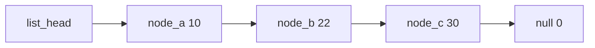

[← Composition](07-composition.md) | [Book 3](index.md) | [Capstone →](09-capstone.md)

# Chapter 8 — Pointer Structures

Chapter 5 packed several fields into one record, but every byte still lived in a table you indexed by number. Chapter 6 walked a byte table recursively by advancing HL. This chapter chains **nodes** through **stored addresses**: each record holds data plus a `.word` link to the next node (or zero for “none”).

The CPU still only sees bytes. A pointer is a 16-bit address copied into a `.word` field. To reach the next node, you load that word into HL and use HL the same way you used a table base in Chapter 2 — except the “next index” is whatever address was stored, not `base + stride`.

The companion listing is [`examples/08_linked_list.asm`](examples/08_linked_list.asm): a static three-node list, sum and find walks, and insert-at-head into a pre-allocated spare node.

---

## The problem: variable shape without shifting memory

A ring buffer (Chapter 5) keeps all elements in one byte array and moves **indices**. Inserting in the middle of a plain array means copying bytes — expensive on a small machine.

A **singly linked list** stores each element in its own small record. One field holds the payload; another holds the address of the next record. Insert at the **head** is a few stores: wire the new node’s link to the old head, then store the new node’s address in `list_head`. No block copy.

The trade is explicit: you pay an extra two bytes per node for the link, and you cannot jump to “element 4” in one arithmetic step. You follow links from the head until you arrive or hit **null**.

---

## Node layout: data plus link

Describe the shape once with `.type`:

```asm
.type ListNode
value   .byte
next    .word
.endtype

LIST_VALUE  .equ offset(ListNode, value)
LIST_NEXT   .equ offset(ListNode, next)
NODE_SIZE   .equ sizeof(ListNode)
```

`sizeof(ListNode)` is 3: one data byte, then a little-endian 16-bit link. The link field uses `.word` because it holds a full address — the same width as `word` and `addr` in Book 1 Chapter 13. AZM also offers `.addr` when you want the layout name to say “this field is a pointer”; for flat AZM listings, `.word` is enough as long as you treat it as an address in comments and AZMDoc.

**Null** is the address **0**. A missing next node is stored as `.dw 0`. At run time you test the pointer in HL with:

```asm
    ld a, h
    or l
    jr z, .at_end
```

`or l` sets Z only when both H and L are zero — the same 16-bit zero test used throughout the course, without a 16-bit compare instruction.

---

## Static nodes in fixed RAM

Book 3 does not use a heap allocator. You **name** nodes as labels and connect them at assembly time or in `main`:

```asm
node_a:
    .db $10
    .dw node_b
node_b:
    .db $22
    .dw node_c
node_c:
    .db $30
    .dw 0

list_head:
    .dw node_a
```

`list_head` is not a node; it is one word of storage that holds the address of the first node. The three nodes can live anywhere in RAM; only the links define order.

You can also reserve uninitialized nodes and fill them in code:

```asm
node_spare:
    .ds ListNode
```

Chapter 8’s demo pushes `$40` into `node_spare` at the head after the static chain is built.

### Memory diagram

After assembly, RAM might look like this (addresses illustrative):

```
  list_head ($800C)          nodes
  ┌─────────┐               node_a ($8000)     node_b ($8003)     node_c ($8006)
  │ node_a ─┼──────────────►│ 10 │ node_b ────►│ 22 │ node_c ────►│ 30 │  0  │
  └─────────┘               └────┴─────────────└────┴─────────────└────┴─────┘
       │                         value  next          value  next         value  next
       └─────────────────────────┘
```

Traversal starts by loading the word at `list_head` into HL, not by loading the address of `list_head` unless you intend to walk from a pointer variable.



---

## Load the head pointer into HL

`list_head` holds a word at a known label. Book 1 Chapter 4’s absolute word load applies:

```asm
    ld hl, (list_head)
```

That expands to a read of the little-endian word at `list_head`. HL now points at `node_a`’s first byte (the `value` field at offset 0).

To read **only** the link field of the node currently in HL:

```asm
    ld bc, LIST_NEXT
    add hl, bc
    ld e, (hl)
    inc hl
    ld d, (hl)
    ex de, hl          ; HL = next node address
```

Low byte first, then high byte — Z80 little-endian order. After `ex de, hl`, HL is ready for another null test or another field access at offset 0.

---

## Traverse: `list_sum_u16`

Summing the list is a `while`-shaped loop (Chapter 2’s invariant style): HL is the current node; DE holds the running 16-bit sum because each payload is one byte but the total can exceed 255.

```asm
; list_sum_u16: sum value bytes along list starting at HL (null = 0)
;!      in        HL
;!      out       HL
;!      clobbers  AF, BC, DE, HL
@list_sum_u16:
    ld de, 0
ListSumLoop:
    ld a, h
    or l
    jr z, ListSumDone
    ld a, (hl)
    add a, e
    ld e, a
    jr nc, ListSumNoCarry
    inc d
ListSumNoCarry:
    ld bc, LIST_NEXT
    add hl, bc
    ld a, (hl)
    ld c, a
    inc hl
    ld a, (hl)
    ld h, a
    ld l, c
    jr ListSumLoop
ListSumDone:
    ex de, hl
    ret
```

**Invariant at `ListSumLoop`:** DE is the sum of all `value` bytes in nodes strictly before the node HL points at (if any). When HL is null, DE is the full sum returned in HL via `ex de, hl`.

For the static chain `$10`, `$22`, `$30`, the result is `$003C` (60). The companion stores it in `list_sum`.

This is the part that catches people coming from arrays: HL is not an index; it is a full address that changes to unrelated addresses as you follow `next`.

---

## Find: `list_find_u8`

Search reuses the same advance pattern, comparing `(hl)` to the target byte in B:

```asm
; list_find_u8: find first node with value A; HL = node or 0, carry set if found
;!      in        HL, A
;!      out       HL, carry
;!      clobbers  AF, BC, DE
@list_find_u8:
    ld b, a
ListFindLoop:
    ld a, h
    or l
    jr z, ListFindMissing
    ld a, (hl)
    cp b
    jr z, ListFindFound
    ld bc, LIST_NEXT
    add hl, bc
    ld a, (hl)
    ld c, a
    inc hl
    ld a, (hl)
    ld h, a
    ld l, c
    jr ListFindLoop
ListFindFound:
    scf
    ret
ListFindMissing:
    ld hl, 0
    or a
    ret
```

Carry set means HL points at a node whose `value` matches. Carry clear means HL is 0 — including the empty list case when `list_head` was 0.

The demo searches for `$22` and expects `find_hit = 1` and `find_node` equal to the address of `node_b`.

---

## Insert at head: `list_push_head`

**Insert at head** needs a free node address (here `node_spare`), a byte value in A, and the current head word:

```asm
; list_push_head: prepend node DE with value A; updates list_head
;!      in        A, DE
;!      out       (list_head) = DE
;!      clobbers  AF, BC, HL
@list_push_head:
    push af
    ld hl, list_head
    ld a, (hl)
    ld c, a
    inc hl
    ld a, (hl)
    ld b, a
    pop af
    ld (de), a
    ex de, hl
    ld (hl), c
    inc hl
    ld (hl), b
    ex de, hl
    ld hl, list_head
    ld (hl), e
    inc hl
    ld (hl), d
    ret
```

Steps in plain terms:

1. `push af` holds the incoming value while you read the old head.
2. Read the old head link into BC (low byte in C, high in B).
3. `pop af` and store the payload at `(de)`; store BC into `next` via `ex de, hl`.
4. Store DE into `list_head`.

After `ld de, node_spare` / `ld a, $40` / `call list_push_head`, the list order is spare → a → b → c. The new sum is `$0064` (100).

```asm
    ld de, node_spare
    ld a, $40
    call list_push_head
```

No recursion is required for a linear list; a loop mirrors the data shape. Chapter 6’s recursive table walk is the alternative when you want unwind semantics, at the cost of stack depth.

---

## Layout casts for node fields

When the node address and field path are known at assembly time, layout casts from Chapter 5 still apply:

```asm
    ld hl, <ListNode>node_b.value
    ld a, (hl)

    ld hl, <ListNode>node_b.next
    ld e, (hl)
```

For the head variable:

```asm
    ld hl, <word>list_head
```

Runtime traversal cannot put HL inside brackets — use explicit `add hl, bc` with `LIST_NEXT` as the chapter routines do.

---

## AZMDoc on pointer routines

Pointer routines follow the same `@` entry and `;!` tags as the ring buffer and factorial helpers:

| Tag | Role for lists |
|-----|----------------|
| `;! in` | HL = current node or head pointer; A or DE for push/find |
| `;! out` | HL = sum, found node, or 0; carry for find |
| `;! clobbers` | Include every register the link walk destroys |

Document whether zero in HL means end-of-list or “not found” — here both use HL = 0 with carry distinguishing find success.

```sh
azm --rc warn examples/08_linked_list.asm
```

---

## Optional: BST insert with two `.word` links

A **binary search tree** adds a second link per node: left and right children, each a `.word` (zero if absent).

```asm
.type TreeNode
value   .byte
left    .word
right   .word
.endtype
```

**Insert only** (no search routine in the companion file): walk from the root in HL. If HL is null, you are done — in a static demo you pre-allocate the node and store its address from the parent. If HL is non-null, compare the new key with `(hl)` and descend to `left` or `right` using the same little-endian load as `next`, until you reach a null child slot and store the new node’s address there.

```asm
TREE_VALUE .equ offset(TreeNode, value)
TREE_LEFT  .equ offset(TreeNode, left)
TREE_RIGHT .equ offset(TreeNode, right)

; bst_insert_u8: insert A into tree rooted at HL (HL may be 0 = empty slot ptr)
; Parent must pass address of left/right word or list_head-style root storage.
; This sketch assumes HL points at a node; use a separate root word in real code.
```

The control flow is a loop, not a self-call — depth is bounded by tree height, and you avoid stack cost from Chapter 6 unless you deliberately choose recursive search later. A full BST companion would also need a static node pool and a `root` word; the linked-list program is enough for one assemble-and-halt exercise.

---

## `main`: what to inspect at `halt`

```asm
    ld hl, (list_head)
    call list_sum_u16
    ld (list_sum), hl

    ld a, $22
    ld hl, (list_head)
    call list_find_u8
    ...

    ld de, node_spare
    ld a, $40
    call list_push_head

    ld hl, (list_head)
    call list_sum_u16
    ld (sum_after), hl

    halt
```

| Label | Expected |
|-------|----------|
| `list_sum` | `$003C` (60) |
| `find_hit` | `$01` |
| `find_node` | address of `node_b` |
| `sum_after` | `$0064` (100) |

---

## Examples

| File | What to verify |
|------|----------------|
| [`examples/08_linked_list.asm`](examples/08_linked_list.asm) | Sum 60, find `$22`, sum 100 after head insert |

```sh
cd azm-book/book3/examples
azm 08_linked_list.asm
azm --rc warn 08_linked_list.asm
```

Single-step `list_sum_u16` once: watch HL jump from `node_a` to `node_b` to `node_c` by loading `next`, not by adding a stride to a table base.

---

## Summary

- A **pointer** in flat AZM is a 16-bit address stored in a **`.word`** field; **null** is 0, tested with `ld a, h` / `or l` / `jr z`.
- **`.type`** describes node shape (`value` + `next`); `offset` and `sizeof` name field displacements and record size.
- **`list_head`** holds the head address; **`ld hl, (list_head)`** loads it; link fields load with little-endian byte reads at `LIST_NEXT`.
- **Traverse** and **find** are loops that advance HL through `next`; **insert at head** writes the new node’s link to the old head, then updates `list_head`.
- **Static pools** (`node_a`, `node_spare`) replace a heap; wiring is your responsibility in data or init code.
- **BST** nodes extend the same `.word` link idea with `left` and `right`; insert walks down comparisons until a null child slot accepts an address.

---

## Exercises

1. Draw the memory diagram after inserting `$40` at the head of the chapter list. Which node does `list_head` point at? What is `node_a.next`?
2. Without assembling, write the null test for DE instead of HL. Why does `or e` alone fail to test a 16-bit pointer?
3. Add `list_count_u8`: return the number of nodes in A. Document `;! in` / `;! out` / `;! clobbers`. Empty list should return 0.
4. Implement **insert at tail** using a spare node and a walk to the last link. How many memory reads does tail insert cost versus head insert?
5. Change `next` to `.addr` in the layout only. Does any instruction encoding change? What changes in the reader’s understanding?
6. Write `list_get_u8`: given zero-based index B, return the value byte in A (carry clear if index out of range). Do not use multiplication; advance B times.
7. For a three-node `TreeNode` pool, initialize a root and insert `5`, `3`, `8` with `bst_insert_u8` sketch logic. Draw the tree boxes and `.word` arrows on paper.

---

[← Composition](07-composition.md) | [Book 3](index.md) | [Capstone →](09-capstone.md)
