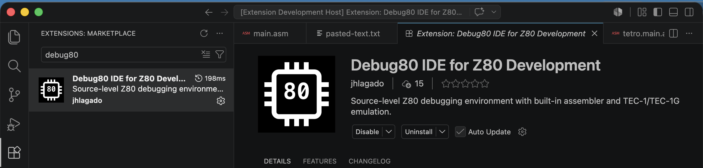
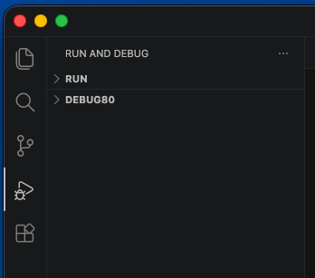
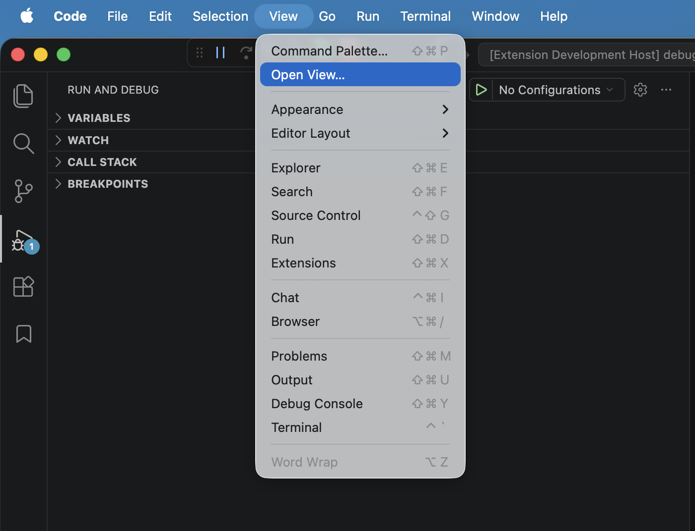
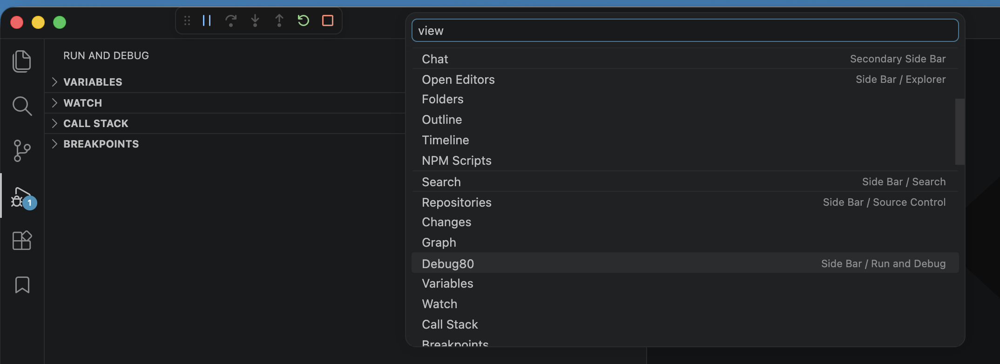
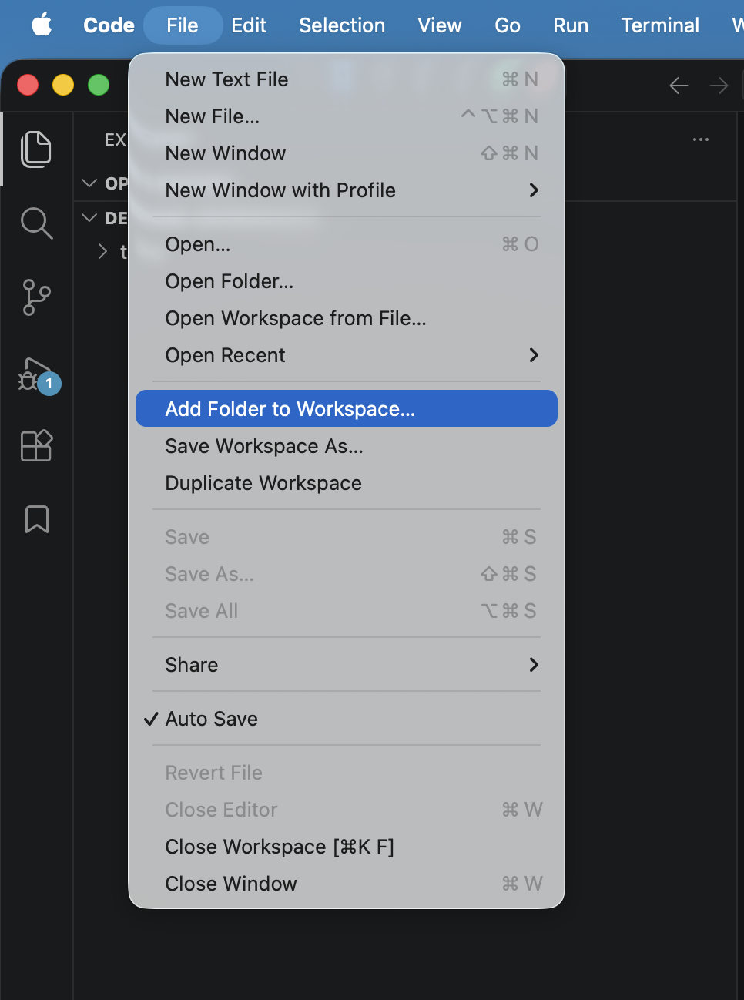
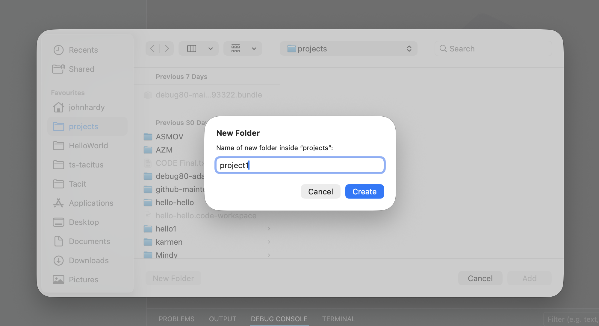
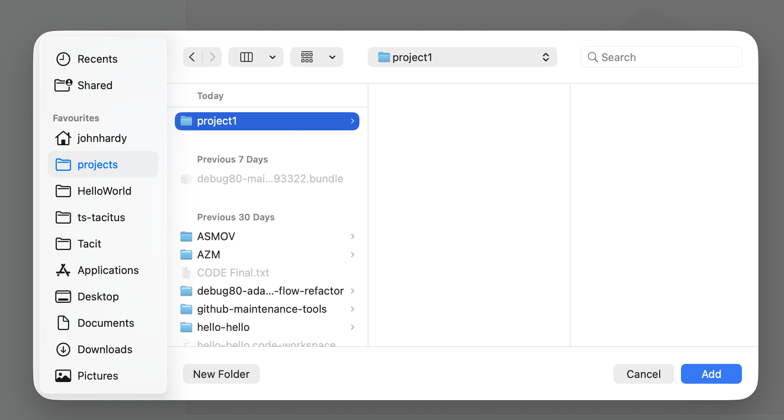
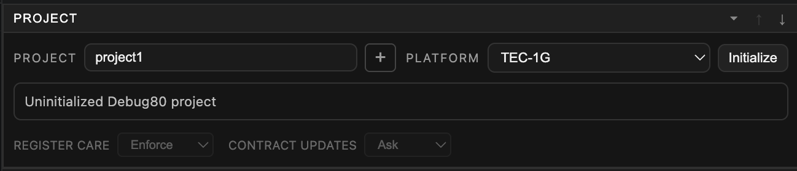
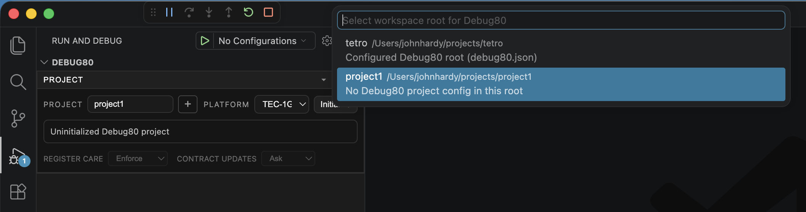

# Install And Add A Folder

Debug80 runs inside Visual Studio Code. The first job is to install VS Code, add the Debug80 extension and add a folder to the workspace for your Z80 project.

Open <https://code.visualstudio.com/> and install the current VS Code build for your operating system. Debug80 declares support for VS Code `1.92.0` and later.

## Install Debug80

Open VS Code and choose **Extensions** from the Activity Bar. Search for:

```text
Debug80 IDE for Z80 Development
```

Install the extension published by `jhlagado`. After installation, VS Code may ask you to reload the window. Reloading starts the extension in the current VS Code session.



Debug80 adds syntax highlighting for `.asm` and `.z80` files. It also adds a debugger type called `z80` and a Debug80 view in the **Run and Debug** sidebar.

## Find The Debug80 Panel

Open the **Run and Debug** sidebar. The Debug80 panel appears there because the extension contributes a view named **Debug80** to the debug view.



If the panel is hidden, open the Command Palette and run:

```text
Debug80: Open Debug80 View
```

You can also open the view from the VS Code menu. Choose **View > Open View...**, then search for **Debug80**.





The panel may ask for a Debug80 project. That is the expected state before you add and initialize a project folder.

## Start With A Workspace Folder

The empty state means VS Code is running Debug80 and is waiting for an initialized Debug80 project.

Start by adding a folder to the workspace. Debug80 treats every workspace folder as a possible project. When you select an uninitialized folder, Debug80 can turn it into a Debug80 project by writing `debug80.json` at the root of that folder.

Treat the panel as the home position for Debug80 work. VS Code has its own Run and Debug controls, but Debug80 adds the project and hardware context for the selected folder.

## Add Project Folders To The Workspace

Debug80 works from folders in the VS Code workspace. A folder can hold source files, build output and the `debug80.json` file that describes how to build and run the program.

Add a project folder with **File > Add Folder to Workspace**. Choose the folder that should own the Z80 project. For source files in `/projects/blink`, add `blink` as the workspace folder.



For a new project, you can create the folder from the folder chooser. Name it clearly; the folder name is what you will see in the Debug80 Project selector.



Select the new folder and click **Add**.



Debug80 sees each workspace folder as a possible project. At first, the folder may be uninitialized. An uninitialized folder is visible to Debug80 and ready for a generated `debug80.json`.



A Debug80 project is a folder with `debug80.json` at its root. When you initialize the folder, Debug80 writes that file into the folder. After that, the folder becomes a first-class Debug80 project and appears in the Project selector as a project you can build, debug and send to hardware.

If the workspace contains more than one folder, use the Project selector to choose the folder you want Debug80 to work on.



For an existing project, add the folder that already contains `debug80.json`.

Debug80 can work on multiple projects in the same workspace. To add another project, use **File > Add Folder to Workspace** again. Debug80 will see the added folder and show it in the Project selector.

## Project Files

Debug80 project configuration lives in one file at the root of the project folder:

```text
debug80.json
```

The next chapter uses Debug80 to create `debug80.json`, a starter source file and a build folder.

## Folder And Target

The folder is the project container. It holds `debug80.json`, source files and build output.

After initialization, Debug80 adds a target to the project. A target is the runnable program Debug80 builds and launches from that folder. The next chapter creates the starter target and shows how it appears in the panel.
