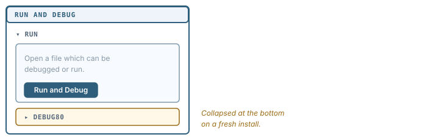
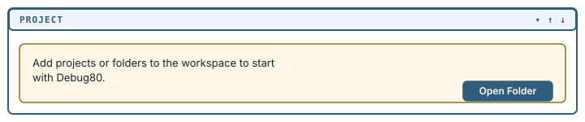
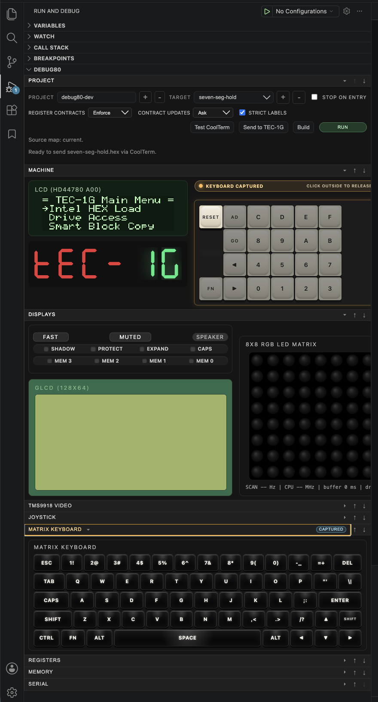

[Book 1](index.md) | [Open a folder, make a project →](02-open-a-folder.md)

# Install Debug80

Debug80 is a Z80 development environment that runs inside VS Code. You write assembly, it assembles the code, loads it into an emulated TEC-1G, and lets you step through your own source while the emulated machine runs.

The extension carries the AZM assembler, the Glimmer compiler and the TEC-1 and TEC-1G emulation inside itself.

## Install VS Code

Debug80 needs VS Code **1.100.0** or later. Download it from [code.visualstudio.com](https://code.visualstudio.com/).

## Install the extension

Open the **Extensions** view from the Activity Bar down the left edge of the window.

Search for `debug80` and install **Debug80 IDE for Z80 Development**, published by `jhlagado`.

The extension takes over `.asm`, `.z80` and `.asmi` files for syntax highlighting, and `.glim` files for Glimmer. If you already have another Z80 assembly extension installed you do not need it, and Debug80 will set the language mode on those files itself.

## Find Debug80 in the sidebar

Debug80 has no icon of its own in the activity bar. It lives inside VS Code's **Run and Debug** sidebar, as one section among the several VS Code puts there itself: Variables, Watch, Call Stack, Breakpoints. Debug80 is the last of them, and it starts shut.

Open the Run and Debug sidebar, look to the bottom of the list, and click **DEBUG80**.



The book calls it **the Debug80 panel** from here on.

If DEBUG80 is not in the list at all, the extension has not activated. Use VS Code's **View > Open View…** picker and choose Debug80 from the list.

## The empty state

With no folder open, the panel has one thing to say:

```text
Add projects or folders to the workspace to start with Debug80.
```

and one button, **Open Folder**.



## The panel with a program running

This is the same section several chapters from now, with a project open and a program running:



Everything below `DEBUG80` belongs to Debug80: the project row you have already met, then the emulated machine, its displays, a keyboard, and further sections for registers, memory and the serial line.

---

[Book 1](index.md) | [Open a folder, make a project →](02-open-a-folder.md)
