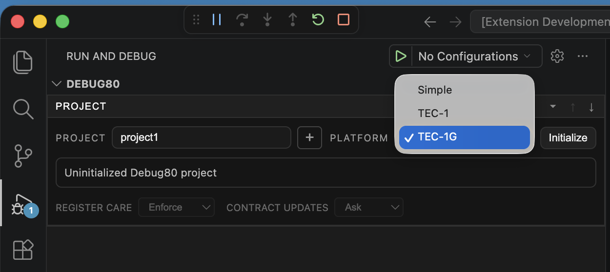
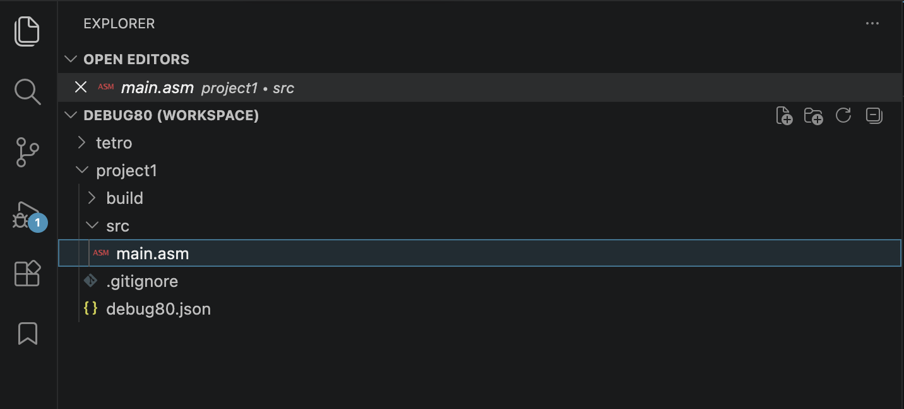
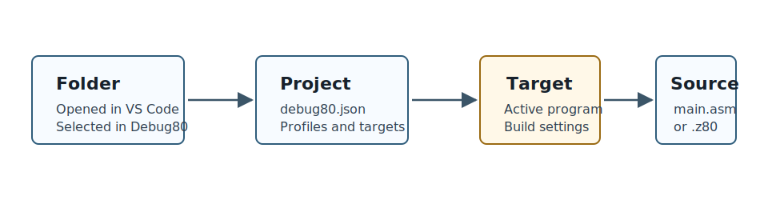
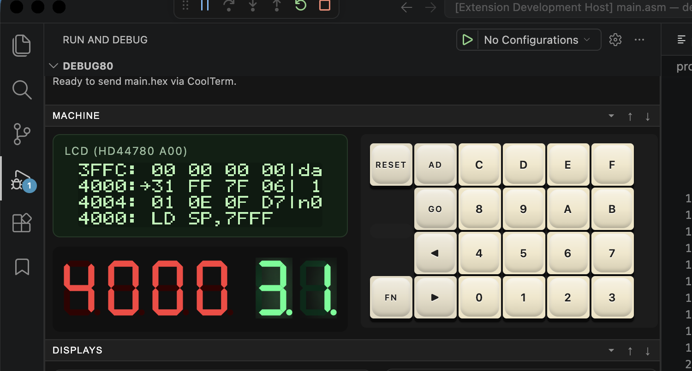
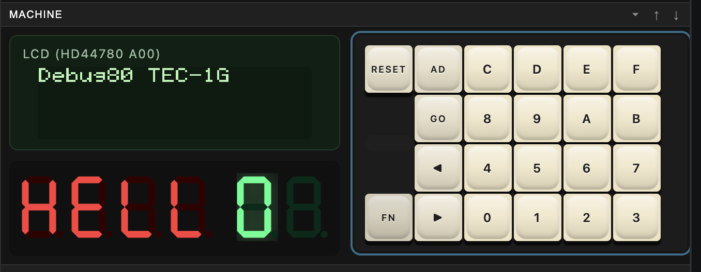

[← Install And Add A Folder](01-install-and-add-a-folder.md) | [Book 1](index.md) | [Run The Starter Target →](03-build-and-step.md)

# Create A TEC-1G Project

A Debug80 project is a folder with `debug80.json` at its root. That file turns an ordinary workspace folder into something Debug80 can build, launch and emulate.

Inside a project, Debug80 runs **targets**. A target is the program entry point Debug80 can build and run. It names the assembly source file, the build output location and the platform that should run the result.

One project can hold several targets. A folder might gather a few small programs, experiments or examples, each with its own target. The target answers the daily question: which program do you want to run now?

Debug80 can discover likely targets from file names. Files named `main.asm`, files ending in `.main.asm` and files ending in `.z80` are targets. The generated project starts with one target based on `src/main.asm`; later, you can add more targets and select the one you want from the Debug80 panel.

When you build or start debugging, Debug80 uses the selected target. It assembles the target's source file with AZM, writes the artifacts under the target's build directory, loads the generated code into the emulator and shows the result on the selected platform panel.

The TEC-1G platform exercises the main Debug80 workflow: AZM source, monitor ROM, emulator panel, serial workflow and CoolTerm hardware transfer.

Select the uninitialized folder in the Debug80 Project section, choose **TEC-1G** in the platform selector, then click **Initialize**.



That creates a TEC-1G project for the MON-3 platform, with the starter target placed at `0x4000`, the user-code area for that platform.

If you prefer the keyboard, **Debug80: Create Project** in the Command Palette does the same job. The panel is the clearer path for a first project, because it shows the selected folder, the platform and the initialization state in one place.

## Choose The Platform

The platform selector is where you choose the machine Debug80 should model. Use **TEC-1G** for this first project. Use **TEC-1** when you are working with the classic board.

| Platform | Use it when | User code starts at |
|---|---|---:|
| TEC-1 | You are working with the classic 1980s TEC-1 board and its monitor environment. | `0x0800` or `0x0900`, depending on the platform settings |
| TEC-1G | You are working with the modern TEC-1G board, which keeps TEC-1 compatibility and adds MON-3-oriented hardware features. | `0x4000` |

Picking **TEC-1G** selects the MON-3 platform settings: start address, ROM assets and hardware behaviour. Reach for **TEC-1** instead when you are working with classic TEC-1 monitor behaviour.

Your platform choice sets the first shape of the project. The generated TEC-1G project starts with a single target.

## Files Created

After initialization, open the VS Code Explorer. A fresh TEC-1G project looks like this:

```text
debug80.json
.gitignore
src/main.asm
build/
```

`debug80.json` stores the project and its targets, and is the file that makes the folder a Debug80 project. `src/main.asm` is the starter target. `build/` receives generated files after the first build. `.gitignore` keeps generated output out of version control.



Now open the Debug80 panel. The **Project** row shows your folder, and the **Target** selector shows the starter target named `main`. With one target, Debug80 selects it for you; once a project grows several targets, this selector becomes part of the daily workflow. Before the first build, the panel reports `Source map: missing, build the selected target.`


The starter target is named `main.asm`, so Debug80 can recognise it from the target naming convention. Appendix B shows the target fields in `debug80.json` after you have built and run the first target.

## Read The Target As A Sentence

The target can be read as a sentence:

```text
Assemble src/main.asm, write artifacts under build, run the result as TEC-1G / MON-3.
```



That sentence is more useful than memorizing every `debug80.json` field on the first day. You will inspect the configuration in Appendix B after the workflow is clear.

The important first-day values are:

- `sourceFile`: the target Debug80 gives to AZM.
- `outputDir`: the directory that receives generated files.
- `artifactBase`: the base name used for generated files.
- `platform`: the platform Debug80 runs.

## Open The Starter Target

Open `src/main.asm`. The TEC-1G project creator writes this starter target:

```asm
; Debug80 starter (TEC-1G / MON-3)
; Prints a message on the LCD, then continuously scans "HELLO" on the
; six-digit seven-segment display.

api_scan_segments       .equ 10
api_string_to_lcd       .equ 13
api_command_to_lcd      .equ 15

lcd_clear               .equ 0x01
lcd_row1                .equ 0x80

        ORG 0x4000

start:
        ld      sp,0x7fff

        ld      b,lcd_clear
        ld      c,api_command_to_lcd
        rst     0x10

        ld      b,lcd_row1
        ld      c,api_command_to_lcd
        rst     0x10
        ld      hl,lcd_line1
        ld      c,api_string_to_lcd
        rst     0x10

scan_hello:
        ld      de,seven_seg_hello
        ld      c,api_scan_segments
        rst     0x10
        jr      scan_hello

lcd_line1:
        .db     "Debug80 TEC-1G",0

; MON-3 seven-segment character codes for "HELLO ".
seven_seg_hello:
        .db     0x6e,0xc7,0xc2,0xc2,0xeb,0x00
```

Debug80 assembles the target with AZM when you launch it. AZM turns the source text into Z80 machine code and writes the files Debug80 needs for source-level debugging.

## The Origin Address

`ORG 0x4000` tells AZM where to place the following bytes in Z80 memory. On the TEC-1G platform, `0x4000` is the start address for MON-3 user programs.

The monitor ROM still exists in the emulated machine. Your program lives in RAM at `0x4000`, while MON-3 provides the monitor environment around it.

`start:` is a label. A label gives a name to an address.

The target uses MON-3 calls through `RST 0x10`. The value in `C` selects the MON-3 service:

- `api_command_to_lcd` sends LCD commands such as clear-screen and row positioning.
- `api_string_to_lcd` prints the zero-terminated string at `HL`.
- `api_scan_segments` refreshes the six-digit seven-segment display from the bytes at `DE`.

After the LCD text is written, the program loops at `scan_hello:`. Each pass asks MON-3 to scan the six bytes in `seven_seg_hello`, so the seven-segment display keeps showing `HELLO`.

Save `src/main.asm`.

## Run It From MON-3

Click **Build** in the Project section. Debug80 assembles the program with AZM and loads it into the emulated TEC-1G at `0x4000`. Run it the way you would on the bare board, straight from the monitor.

The panel comes up in the MON-3 monitor. Press **AD** to enter address mode, then key in:

```text
4000
```

The seven-segment display shows the address, and the LCD monitor view shows the bytes at that address.



Press **GO** to run the program at the displayed address. The LCD shows the target message, and the seven-segment display is refreshed from `seven_seg_hello`.



This first run proves the whole path before you start single-stepping: AZM assembled the source at `0x4000`, Debug80 loaded the HEX into the emulator, MON-3 jumped to the program, and the program produced visible TEC-1G output.

## Why The Target Uses MON-3

The target uses monitor services rather than raw port writes. That keeps the first target compact while still giving visible output on the TEC-1G panel.

It also introduces a normal TEC-1G pattern: user code runs from RAM, calls MON-3 routines, and keeps display hardware refreshed in a loop.

The same build and debug sequence applies when you replace the starter with your own code.

[← Install And Add A Folder](01-install-and-add-a-folder.md) | [Book 1](index.md) | [Run The Starter Target →](03-build-and-step.md)
