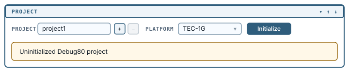
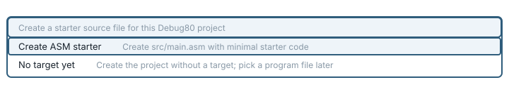
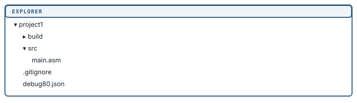

[← Install Debug80](01-install-debug80.md) | [Book 1](index.md) | [Targets →](03-targets.md)

# Open a folder, make a project

Debug80 works on an ordinary folder. Open one and the panel shows one of three states: no folder, a folder that is not yet a project, or a project.

## Open a folder

Click **Open Folder** in the panel, or use VS Code's own **File > Open Folder**, and choose an empty folder. We will call it `project1`.

The header row now names the folder, and beside it sit a **+** to add another folder to the workspace and a **−** to remove one. Below the header a card reads:

```text
Uninitialized Debug80 project
```

A folder becomes a Debug80 project when it contains `debug80.json`, either at the folder root or under `.vscode/`.

## Choose a platform and initialize

The uninitialized state adds two controls to the header row: a **Platform** dropdown and an **Initialize** button.



The dropdown offers **Simple**, **TEC-1** and **TEC-1G**. The examples throughout this book use **TEC-1G**. Choose it, then click **Initialize**.

Debug80 asks one more question, in a picker at the top of the window:

```text
Create a starter source file for this Debug80 project
```



with two standing options. **Create ASM starter** writes `src/main.asm` with a small working program. **No target yet** creates the project without one, and you pick a program file later. If the folder already holds assembly files they are listed above those two, so you can adopt an existing file instead.

Choose **Create ASM starter**.

If you would rather choose from all five profile kits rather than a platform (`Simple / Default`, `TEC-1 / MON-1B`, `TEC-1 / Classic 2K`, `TEC-1G / MON-3` and `TEC-1G / Custom`), run **Debug80: Create Project** from the Command Palette instead of using the panel. The panel's Platform dropdown picks the default kit for the platform you chose, which for TEC-1G is `TEC-1G / MON-3`.

## The project files

Four things appear in the folder:

```text
project1/
  debug80.json     the project
  .gitignore       ignores build output
  src/main.asm     the starter program
  build/           empty, for build output
```



The project's Debug80 configuration is stored in `debug80.json`, an ordinary file you can read and edit:

```json
{
  "projectVersion": 2,
  "projectPlatform": "tec1g",
  "defaultProfile": "mon3",
  "defaultTarget": "main",
  "azm": { "symbolCase": "strict" },
  "profiles": {
    "mon3": {
      "platform": "tec1g",
      "description": "TEC-1G monitor-first profile with user code at 0x4000."
    }
  },
  "targets": {
    "main": {
      "sourceFile": "src/main.asm",
      "outputDir": "build",
      "artifactBase": "main",
      "platform": "tec1g",
      "profile": "mon3"
    }
  }
}
```

`profiles` describes the machine: TEC-1G running the MON-3 monitor, with your code at `0x4000`. `targets` describes what to build. Appendix C documents every field.

The generated file is longer than the extract above; it also records the memory map, the monitor ROM the profile brings with it, and the source roots the assembler searches.

No JSON schema ships for `debug80.json`, so editing it by hand gets no autocomplete. Prefer the panel and the commands for routine changes.

## The starter program

Open `src/main.asm`:

```asm
; Debug80 starter (TEC-1G / MON-3)
; Prints a message on the LCD, then continuously scans "HELLO " on the
; six-digit seven-segment display.

API_SCAN_SEGMENTS       .equ 10
API_STRING_TO_LCD       .equ 13
API_COMMAND_TO_LCD      .equ 15

LCD_CLEAR               .equ 0x01
LCD_ROW1                .equ 0x80

        .org    0x4000

Start:
        LD      B,LCD_CLEAR
        LD      C,API_COMMAND_TO_LCD
        RST     0x10

        LD      B,LCD_ROW1
        LD      C,API_COMMAND_TO_LCD
        RST     0x10

        LD      HL,LcdLine1
        LD      C,API_STRING_TO_LCD
        RST     0x10

ScanHello:
        LD      DE,SevenSegHello
        LD      C,API_SCAN_SEGMENTS
        RST     0x10
        JR      ScanHello

LcdLine1:
        .db     "Debug80 TEC-1G",0

; MON-3 seven-segment character codes for "HELLO ".
SevenSegHello:
        .db     0x6e,0xc7,0xc2,0xc2,0xeb,0x00
```

Every service the program uses comes from MON-3 through `RST 0x10`, with the call number in C. The `.org 0x4000` is where TEC-1G user code lives, and it matches the `appStart` the profile wrote into `debug80.json`.

## Several folders at once

The **+** beside the folder name adds a folder, and Debug80 offers to initialize it if it is not already a project. The **−** removes the selected folder from the workspace without touching anything on disk, and it is disabled when only one folder is open.

With several folders open, the folder-name button becomes a picker: click it to choose which one Debug80 is working on.

---

[← Install Debug80](01-install-debug80.md) | [Book 1](index.md) | [Targets →](03-targets.md)
