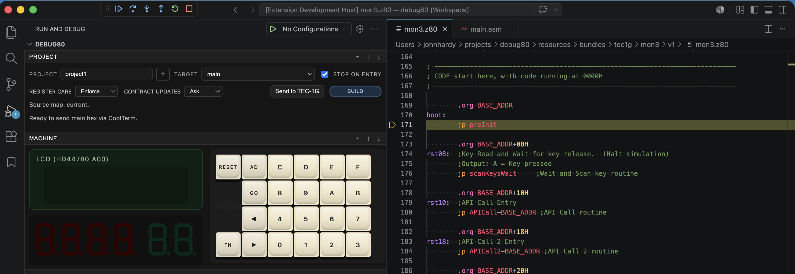
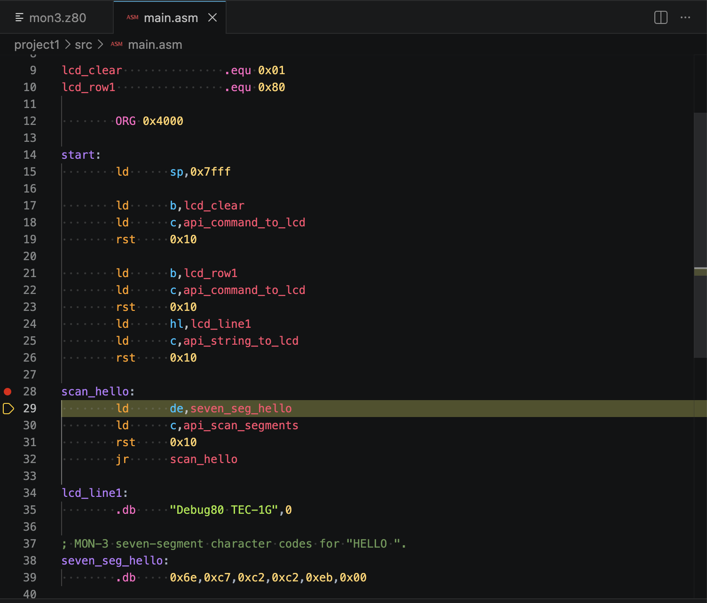
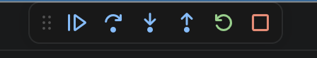
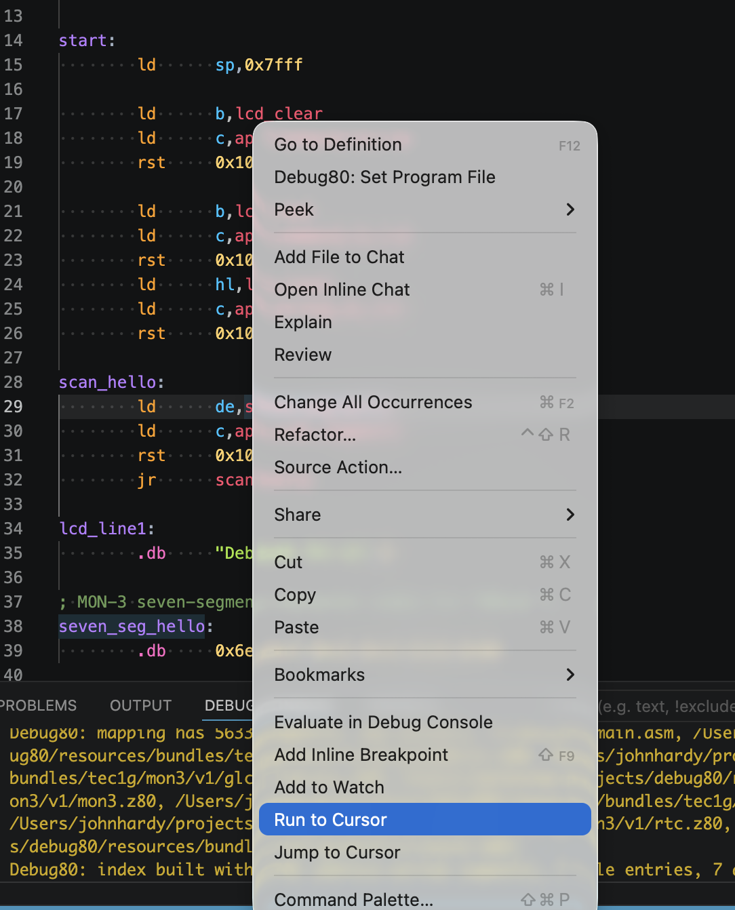
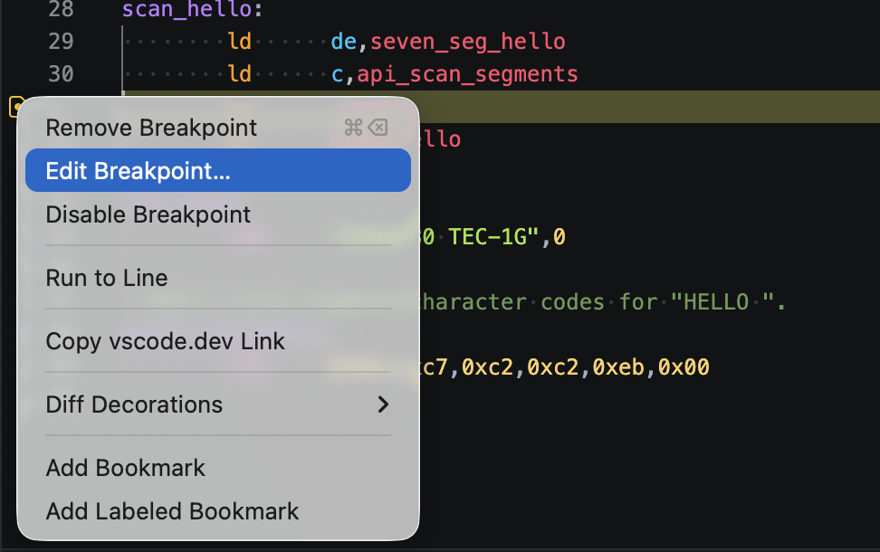
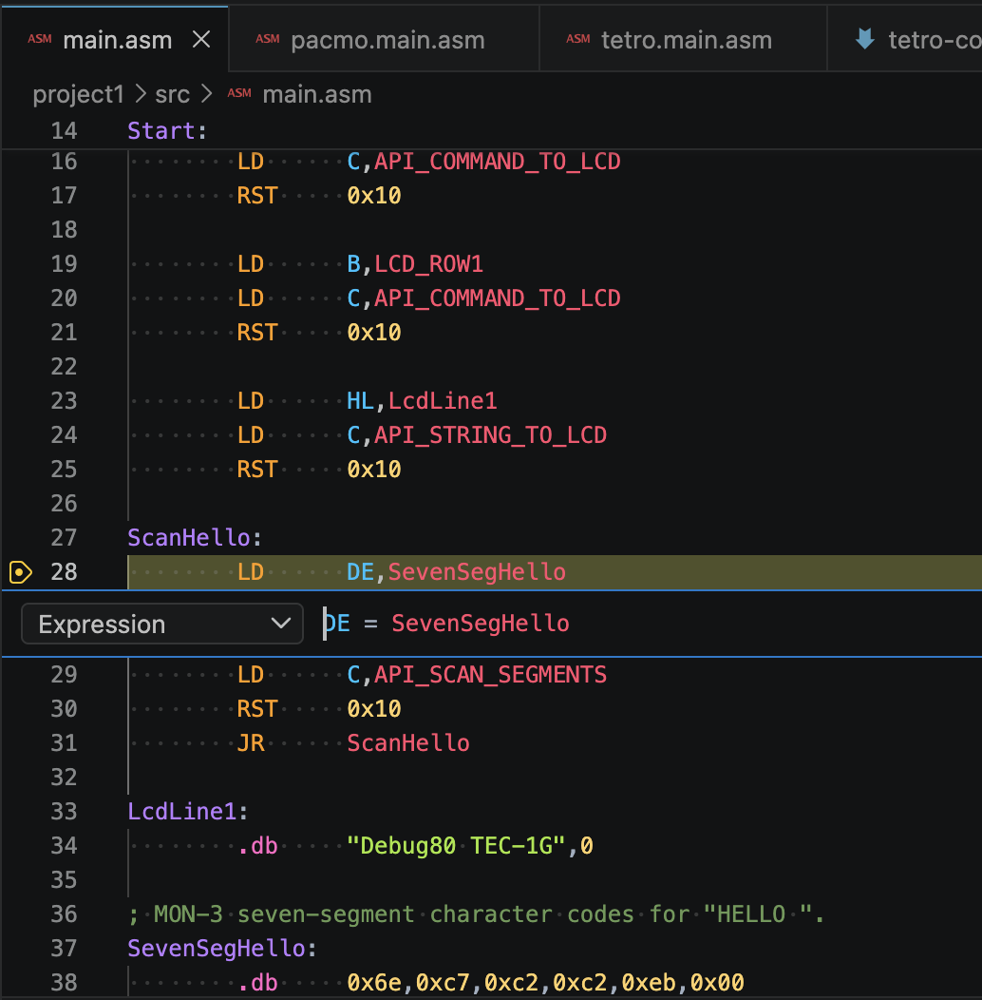

[← Create A TEC-1G Project](02-create-a-tec1g-project.md) | [Book 1](index.md) | [Inspect The Starter Target →](04-inspect-the-machine.md)

# Run The Starter Target

You have already run the starter target from MON-3. Now run the same program under the debugger, where you can stop it mid-flight and watch the Z80 work.

The starter target is simple. It writes a message to the LCD, then refreshes the seven-segment display in a loop.

## Build The Target

In the Project section, tick **Stop on entry**, then click **Build**. Debug80 hands the active target to AZM, loads the assembled program into the emulated Z80 and launches the TEC-1G platform.



**Stop on entry** decides what happens the instant the machine starts. Cleared, the program runs straight away. Ticked, Debug80 halts at the first instruction the Z80 executes: address `$0000` in the MON-3 ROM, not your program.

This launch also writes the build artifacts. The order is what matters here: AZM assembles the source, then Debug80 loads and debugs the result.

## The Program Counter

The Z80 program counter, usually written as PC, holds the address of the next instruction. At the reset pause, PC is `$0000` and the editor sits in the MON-3 ROM, not in your file. That is the machine starting from cold, exactly as the hardware does.

To stop on your own first instruction, set a source breakpoint at `Start` and let the program run to it. When execution stops there, the editor highlights `LD B,LCD_CLEAR` and PC reads `0x4000`, the address AZM generated for that line.

Those two facts are the whole trick of source-level debugging. PC gives the debugger its position in the emulated machine; the source map gives it the matching line in your file. The editor shows the instruction in readable form, and the register view shows the address the Z80 will execute next.

The first instruction prepares the first MON-3 LCD command:

```asm
        LD      B,LCD_CLEAR
```

The following instruction loads `API_COMMAND_TO_LCD` into `C`, then `RST 0x10` asks MON-3 to run that service. The first service clears the LCD.

## Step Through Startup

The two stepping keys you will use most are F10 and F11.

F10 is **Step Over**. It executes the current instruction and stops at the next instruction in the current flow. When the current instruction calls a subroutine, F10 runs that routine as one action and stops after the call returns.

F11 is **Step Into**. It follows execution into subroutines. In Z80 code, it also follows software interrupts, so stepping into `RST 0x10` takes you into the MON-3 service routine.

With the starter target, the first steps send commands to MON-3 with `RST 0x10`, write the LCD text, and then enter the display refresh loop. Use F10 when you want to move over the MON-3 calls and stay with the target. Use F11 when you want to trace into the monitor code and see how the service runs.

Step once from `LD B,LCD_CLEAR`. PC advances to the next source instruction. Continue stepping and watch PC move through the LCD setup code toward `ScanHello`.

The repeated pattern is:

```asm
        LD      C,API_COMMAND_TO_LCD
        RST     0x10
```

or:

```asm
        LD      C,API_STRING_TO_LCD
        RST     0x10
```

The value in `C` chooses the MON-3 service. The value in `B`, `HL` or `DE` supplies the data for that service.

This is the smallest useful debugging cycle: stop, inspect, step, inspect again.

## Set A Breakpoint

Click in the editor gutter beside an instruction line. VS Code adds a red marker, and Debug80 binds it to the Z80 address generated for that line.

Breakpoints bind to instruction addresses, so a marker on a blank line, a comment or a bare label snaps to the nearest real instruction — or stays hollow if there is none nearby. Drop one beside `ScanHello:` and it binds to the first instruction of the loop, `LD DE,SevenSegHello`. Let the program run, and it stops there with the yellow arrow resting on that line.



## Run, Pause And Step

The VS Code debug toolbar drives the emulated Z80 whenever a session is running or paused.



Left to right:

- **Continue / Pause** — the first button toggles. Paused, it runs from the current instruction; running, it becomes **Pause** and returns control to the debugger.
- **Step Over** (F10) — run one instruction, treating a `CALL` or `RST` as a single step.
- **Step Into** (F11) — follow execution into routines, including `RST 0x10` into MON-3.
- **Step Out** (Shift-F11) — run the current routine to its return. Use it to climb back out after F11 took you into the monitor.
- **Build** — use the Project section's Build button when you want a fresh assembled run of the active target.
- **Stop** — end the debug session.

Continue the starter target and it writes the LCD text once, then spins in the `ScanHello` loop, keeping the seven-segment display refreshed.

## Run To Cursor

**Run to Cursor** reaches one spot without leaving a breakpoint behind. During a session, right-click an instruction line and choose it from the editor menu.



Debug80 resolves the line through the source map, runs to the matching machine address and stops there. Try it on the `ScanHello:` loop: Debug80 runs through the LCD setup and halts where the seven-segment refresh begins.

Like every source-line feature, this leans on the last successful build. If a line will not resolve, build the target again to refresh the source map, then place the cursor and retry.

## Conditional Breakpoints

A plain breakpoint stops every time it is hit. A conditional one stops only when the machine is in a state you care about. Right-click a breakpoint and choose **Edit Breakpoint**.



Type a Debug80 expression into the inline editor. A condition such as `C = API_SCAN_SEGMENTS` on the `RST 0x10` inside `ScanHello` fires the breakpoint only when register `C` holds the segment-scan service number. The same idea lets you stop when a counter reaches zero, a pointer lands on an address, or a key value appears, instead of breaking on every pass.



Each time execution reaches the line, Debug80 evaluates the expression. A true or non-zero result stops the program; a false or zero result lets it run on. If the expression itself errors, Debug80 stops at the breakpoint and writes the error to the Debug Console.

Conditional breakpoints share the expression language with the Watch panel. Appendix G lists the registers, flags, symbols, memory reads and operators you can use.

## Edit And Build

Change something visible and watch it survive the round trip to the emulator. Edit `LcdLine1`, swapping the text between the quotes for your own:

```asm
LcdLine1:
        .db     "Hello from Z80",0
```

Save, then click **Build** in the Debug80 panel. Debug80 assembles the source, loads the new program and starts the target. The LCD shows your new message, and the `ScanHello` loop keeps the seven-segment display refreshed as before.

[← Create A TEC-1G Project](02-create-a-tec1g-project.md) | [Book 1](index.md) | [Inspect The Starter Target →](04-inspect-the-machine.md)
