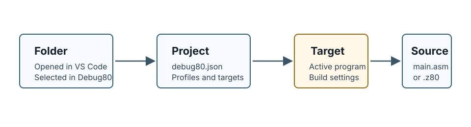
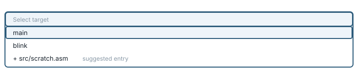
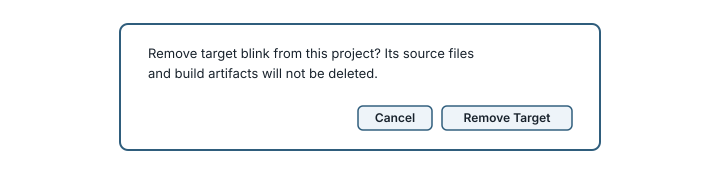
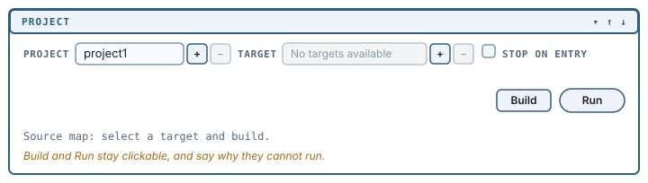

[← Open a folder, make a project](02-open-a-folder.md) | [Book 1](index.md) | [Build and run →](04-build-and-run.md)

# Targets

A folder can hold many assembly files. Only some of them are programs; the rest are includes, experiments and half-finished ideas. A **target** is Debug80's record of one program: which file is its entry point, where its build output goes, and which machine it runs on.

**`debug80.json` is the truth. File names only ever make suggestions.**

## What a target records

Your project has one target, named `main`:

```json
"targets": {
  "main": {
    "sourceFile": "src/main.asm",
    "outputDir": "build",
    "artifactBase": "main",
    "platform": "tec1g",
    "profile": "mon3"
  }
}
```



`sourceFile` is the entry point - the file handed to the assembler. `outputDir` and `artifactBase` decide where the output lands and what it is called, so this target produces `build/main.hex`. `platform` and `profile` say which machine it runs on.

The target's name is the key, `main`. Debug80 derives it from the source file name, dropping the extension and a trailing `.main` if there is one, so `game.main.asm` yields a target called `game`. If that name is taken it appends `-2`.

## What counts as a program file

Debug80 will consider three kinds of file: `.asm`, `.z80` and `.glim`. A Glimmer file only qualifies if it contains a top-level `program` declaration, because a `.glim` file without one is a part of a program rather than a program.

Among those, two names are treated as suggestions: `main.asm` and `main.z80`. A file with either name is marked **suggested** when Debug80 offers you a list.

The convention marks a file in a list; it does not decide anything.

## Add a target

The **+** beside the **Target** dropdown adds one. Debug80 lists every eligible program file that is not already a target, annotating the ones that match the naming convention, and you choose.

Add a second program to see it work. Create `src/blink.asm`:

```asm
; A second program, so the project has something to choose between.

API_SCAN_SEGMENTS       .equ 10

        .org    0x4000

Start:
        LD      DE,Pattern
        LD      C,API_SCAN_SEGMENTS
        RST     0x10
        JR      Start

Pattern:
        .db     0x7d,0x00,0x7d,0x00,0x7d,0x00
```

Click **+** beside **Target**, choose `src/blink.asm`, and a second target named `blink` appears in the dropdown. It inherits its settings from the existing target - same platform, same profile, same output folder - with only the source file and artifact name changed.

You can also right-click any `.asm`, `.z80` or `.glim` file in the Explorer and choose **Debug80: Set Program File** to point the current target at it instead.

## Choose the active target

The **Target** dropdown selects which one Build and Run act on. Debug80 remembers your choice per project.



Discovered files that are not yet targets appear in the dropdown prefixed with `+`. Choosing one adds it as a target and selects it.

If you change the target while a debug session is running, Debug80 says so rather than silently switching underneath you:

```text
Debug80: Selected target blink. Press Build to apply it to the current session.
```

## Remove a target

The **−** beside the dropdown removes the selected target. Debug80 confirms first, and is explicit about what removal means:

```text
Remove target blink from this project? Its source files and build artifacts will not be deleted.
```



Removing a target edits `debug80.json` and nothing else. Your source file stays exactly where it is. The button is disabled when the selected entry is a discovered file rather than a configured target, because there is nothing to remove.

## A project with no targets

Remove every target and the project is still a project. This is a legitimate state, not a broken one, and it is what **No target yet** produces during initialization.



The dropdown then reads `No targets available` if nothing eligible is on disk, or lists discovered files with their `+` prefix if there are any. **Build** and **Run** stay visible and clickable, and refuse with a message rather than failing obscurely:

```text
Debug80: This project has no targets yet. Pick a program file from the target dropdown first.
```

A project with no targets is useful while a codebase is still only includes and fragments.

## Targets whose files have gone

If a target names a source file that no longer exists, Debug80 hides it from the list rather than offering you something that cannot build. The entry stays in `debug80.json`, so restoring the file brings the target back.

## Everything here is also a command

Every action in this chapter has a Command Palette equivalent, which is what makes them scriptable and keyboard-reachable:

| Action | Command |
|---|---|
| Add a target | **Debug80: Add Target** |
| Remove a target | **Debug80: Remove Target** |
| Choose the active target | **Debug80: Select Active Target** |
| Point a target at a file | **Debug80: Set Program File** |
| Add a workspace folder | **Debug80: Add Workspace Folder** |
| Remove a workspace folder | **Debug80: Remove Workspace Folder** |

## Summary

- A target records one program: `sourceFile`, `outputDir`, `artifactBase`, `platform` and `profile`.
- `debug80.json` is the truth. `main.asm` and `main.z80` are only marked **suggested** in a list.
- Eligible program files are `.asm`, `.z80` and `.glim`; a `.glim` file needs a top-level `program` declaration.
- **+** adds a target, **−** removes it without touching source files, and the dropdown selects the active one.
- Discovered files appear in the dropdown prefixed with `+`; choosing one adds and selects it.
- Zero targets is a legitimate state. Build and Run say so plainly instead of failing.
- Every one of these actions is also a Command Palette command.

---

[← Open a folder, make a project](02-open-a-folder.md) | [Book 1](index.md) | [Build and run →](04-build-and-run.md)
