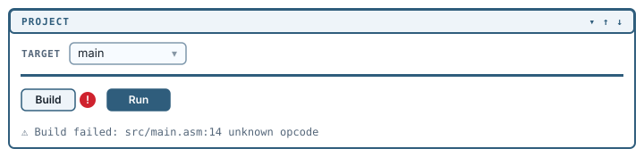
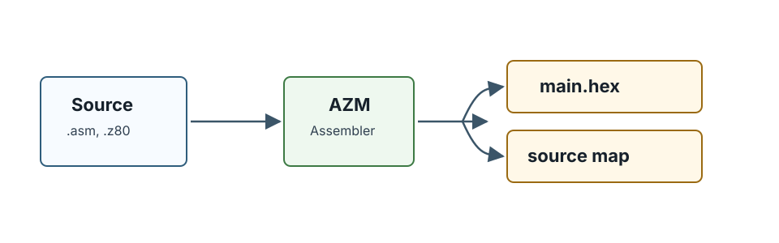
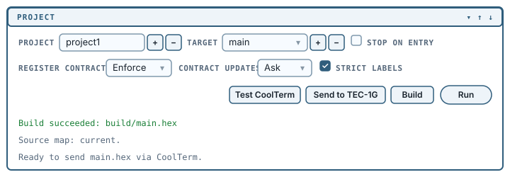
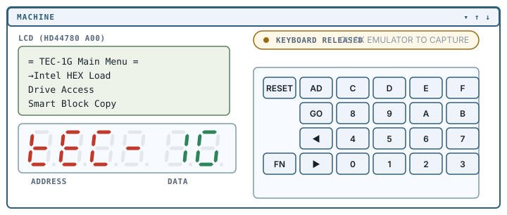

# Building and running

**Build** assembles your program. **Run** assembles it and starts the emulated machine.

## A build

With `main` selected, **Build** assembles that target without
launching it.

Debug80 hands your entry file to the assembler, writes the output into the target's `outputDir`, and stops. The panel reports what happened on its own line:

```text
Build succeeded: build/main.hex
```

If the build fails, that line turns red with a warning mark, a red `!` indicator appears beside the **Build** button, and the errors arrive in the Problems panel attached to the lines that caused them. The full assembler output goes to the Debug80 output channel.



The `build/` directory now contains:

```text
build/
  main.hex               the program, as Intel HEX
  main.bin               the same bytes, raw
  main.d8.json           the source map
  main.lst               the assembler listing
  main.regcontracts.txt  the register contracts report
```



`main.hex` is what runs, on the emulator and on real hardware alike. `main.d8.json` is the **source map**: it records which addresses came from which lines of which files, and every source-level debugging feature depends on it.

A Glimmer target also emits its generated assembly as `main.asm`. [Glimmer targets](11-glimmer-targets.md) describes its build pipeline and output.

## The source map status line

Under the build line the panel shows the current source-map status:

```text
Source map: current.
```

Five other messages are possible, and each includes the required remedy:

| Line | Meaning |
|---|---|
| `Source map: select a target and build.` | No target is selected. |
| `Source map: missing, build the selected target.` | The target has never been built. |
| `Source map: stale, build recommended.` | Source has changed since the last build. |
| `Source map: unreadable, rebuild the selected target.` | The file exists but could not be read. |
| `Source map: invalid, rebuild the selected target.` | The file was read but did not parse. |

A stale map can send breakpoints and stepping to old locations. A missing, unreadable or invalid map disables the editor and debugger features that depend on it. When debugging behaves oddly, read this line before anything else.

## A run

The **Run** action performs the next stage.

Debug80 builds the target, then launches it: it loads the monitor ROM and your program into an emulated TEC-1G and starts a debug session.





**Run** changes colour rather than label: grey when nothing is running, amber while starting, green while running, blue when paused at a breakpoint. Both buttons are disabled while a session is starting.

If a session is already running, **Run** stops it and starts again, so after an edit one press gets you the new build on a fresh machine.

There is no `launch.json` to write; Debug80 supplies the debug configuration.

## Choosing between Build and Run

**Run** suits the edit-and-test cycle. **Build** suits work that needs
the artifacts but not the machine: sending a HEX file to real
hardware, checking whether code assembles, or building a target other
than the one currently being debugged.

## Stop on entry

The **Stop on entry** checkbox pauses the CPU at the machine's launch address instead of letting it run, and applies to this VS Code window for as long as it is open.

## The other three controls

The row below **Stop on entry** holds **Register Contracts**, **Contract Updates** and **Strict labels**.

**Register Contracts** defaults to Enforce, which means AZM checks how your routines use registers and fails the build when it proves a conflict. If a build fails complaining about registers rather than syntax, that is the control responsible, and setting it to Audit reports the problem without stopping you. It is also why a build writes `main.regcontracts.txt`.

[Appendix D](appendices/d-azm-options-row.md) covers all three: what they change, which of them can rewrite your source, and which one is saved into `debug80.json`.

## Reading the state as data

**Debug80: Copy Project Status (JSON)** copies the panel's full view
of the project as JSON. The result records the project state, target
list, selected target, build, source map and hardware status, which
helps when the visible state does not explain what Debug80 is doing.
