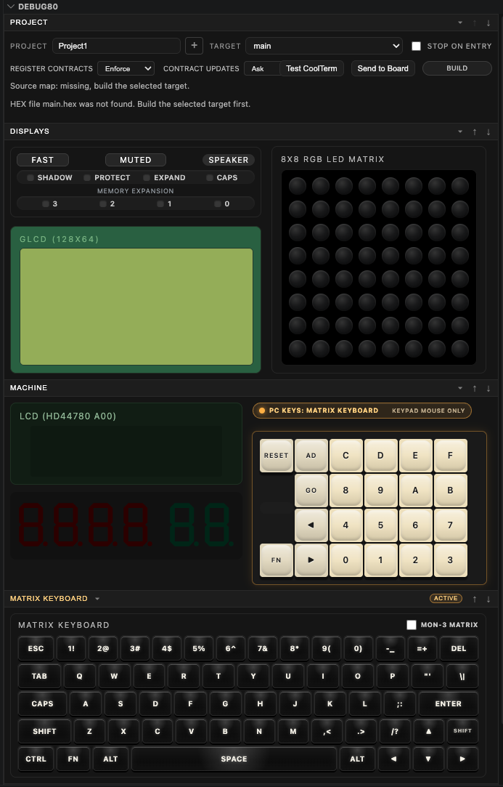

[← Run The Debugger](03-build-and-step.md) | [Book 1](index.md) | [Build Options And Source Maps →](05-use-the-debug80-panel.md)

# Inspect A Running Program

Paused execution gives you time to inspect a program from several angles. Use the source map to connect labels and source lines with the CPU state, memory and visible TEC-1G output.

The Debug80 view groups the project controls, display hardware, machine front panel and keyboard state in one place. This chapter breaks those areas down so you know where to look while a target is running or paused.

## Symbols And Constants In Variables

The **Variables** panel shows source-map-backed **Symbols** and **Constants** after a successful build. Constants show their assembled value. Memory-backed symbols show conservative raw memory information: address, current bytes, readable ASCII where possible and source location.

These scopes use the source map from the last successful build. Build the target again when symbols need to be generated or refreshed.

## Watch Expressions

The **Watch** panel evaluates Z80-focused expressions while execution is paused. Use Watches when you want a small set of facts to stay visible while stepping. A symbol by itself evaluates to its address or constant value; square brackets read one byte from memory. Comparisons use symbols such as `=`, `!=`, `<>`, `<`, `<=`, `>` and `>=`.

Build the active target again when a symbol Watch needs to be generated or refreshed. Appendix A lists the shared expression language used by Watches and conditional breakpoints.

## Call Stack Naming

The **Call Stack** view names the current Z80 execution frame from the nearest known symbol in the source map.

`ScanHello+3` means the current PC is three bytes after the `ScanHello` label. The following frames come from the monitor and library source. These are source-map names for execution locations.

## The Registers Section

Debug80 keeps CPU registers in its own **Registers** section, close to the memory and hardware views. PC names the next instruction address. SP names the top of the Z80 stack. AF, BC, DE, HL, IX and IY are the main working register pairs.

Step a target and watch PC change. When the highlighted source line and PC describe the same instruction, the source view and machine state agree.

## The Memory Section

The **Memory** section shows bytes relative to CPU registers or an absolute address:

- PC
- SP
- BC
- DE
- HL
- IX
- IY
- Absolute

Choose **PC** for the current instruction. Choose **Absolute** when you want to type an address yourself.

The memory panel refreshes while execution is paused. The ASCII column makes strings and readable bytes easy to spot.

Use **Absolute** when the address comes from source or hardware notes. Use a register-relative view when the address comes from CPU state: PC for instructions, SP for the stack and HL when a routine uses HL as a pointer.

## The Machine Section

The **Machine** section shows the front-panel parts of the TEC-1G: LCD, seven-segment display and keypad.

Visible output stays beside the usual debugger state.

## Panel Focus And Keypad Input

VS Code sends key presses to the editor until the webview has focus. Click inside the Machine section before using keyboard shortcuts for the keypad. The on-screen keys work even when keyboard focus is unclear.

The keypad sends input to the emulated TEC-1G runtime. Programs that read the keypad receive hardware-style key input.

On macOS, some Control key combinations are reserved by the operating system. Debug80 accepts the Mac Command key as the TEC-1G matrix keyboard's Control modifier, so **Command-C** behaves like matrix **Control-C**, and **Command-Up** behaves like matrix **Control-Up**. This only affects the emulated matrix keyboard; MON-3 and the Z80 keyboard API still receive the same key state.

The exact key meanings depend on the monitor or program that is running. When you debug keypad code, stop at the input routine and watch the register or memory location that receives the key.

## LCD And Seven-Segment Output

The LCD and seven-segment display update from emulated I/O. TEC-1G programs often reach those devices through MON-3 services, so writes to the LCD and seven-segment refresh loops appear directly in the Machine panel.

## Displays Section

The **Displays** section contains TEC-1G display hardware beyond the front-panel LCD and seven-segment digits, including the GLCD and 8x8 RGB matrix.

Debug80 renders RGB matrix duty-cycle brightness, so a dim pixel and a bright pixel can indicate different timing in the program.

## Speaker, Speed And Mute

The display area includes speaker, speed and mute controls. Use **MUTED** to prevent sound while debugging. The speed control lets the panel request a different run mode from the emulator.

[← Run The Debugger](03-build-and-step.md) | [Book 1](index.md) | [Build Options And Source Maps →](05-use-the-debug80-panel.md)
