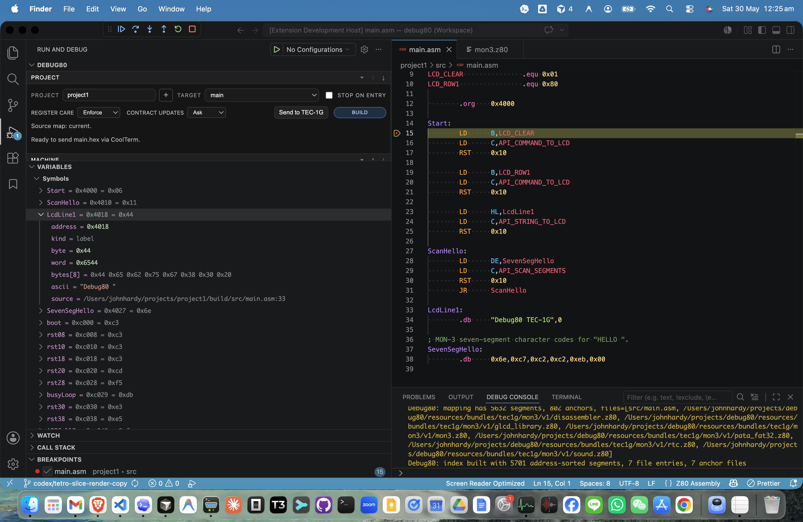
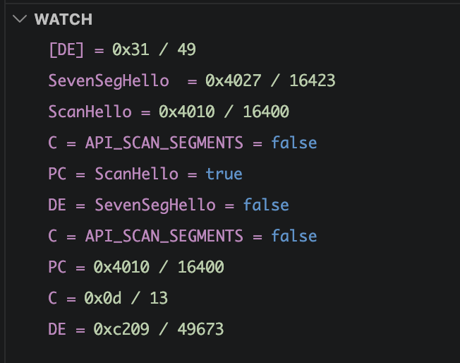
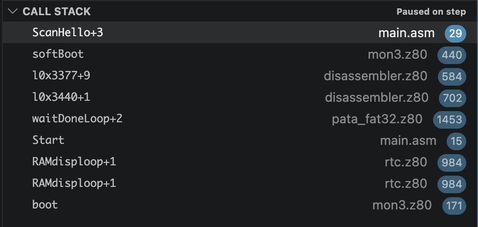
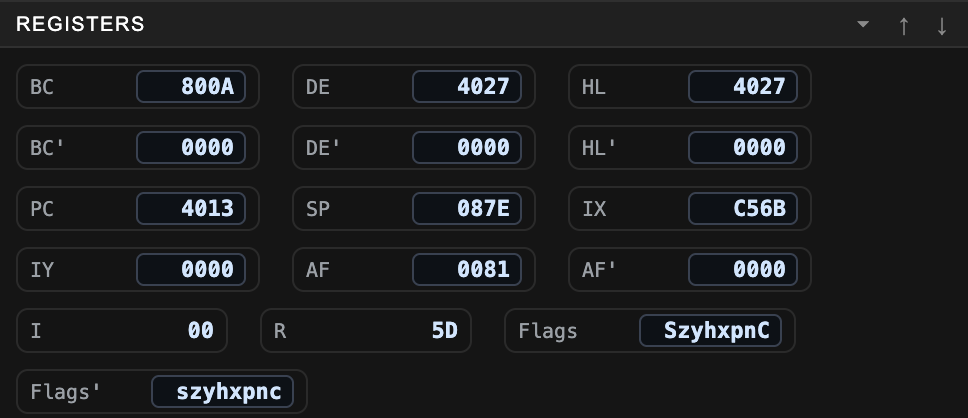
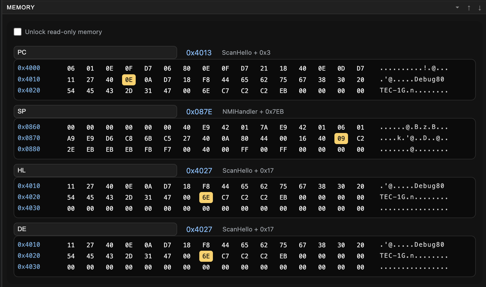
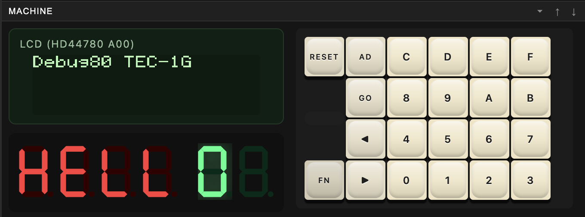
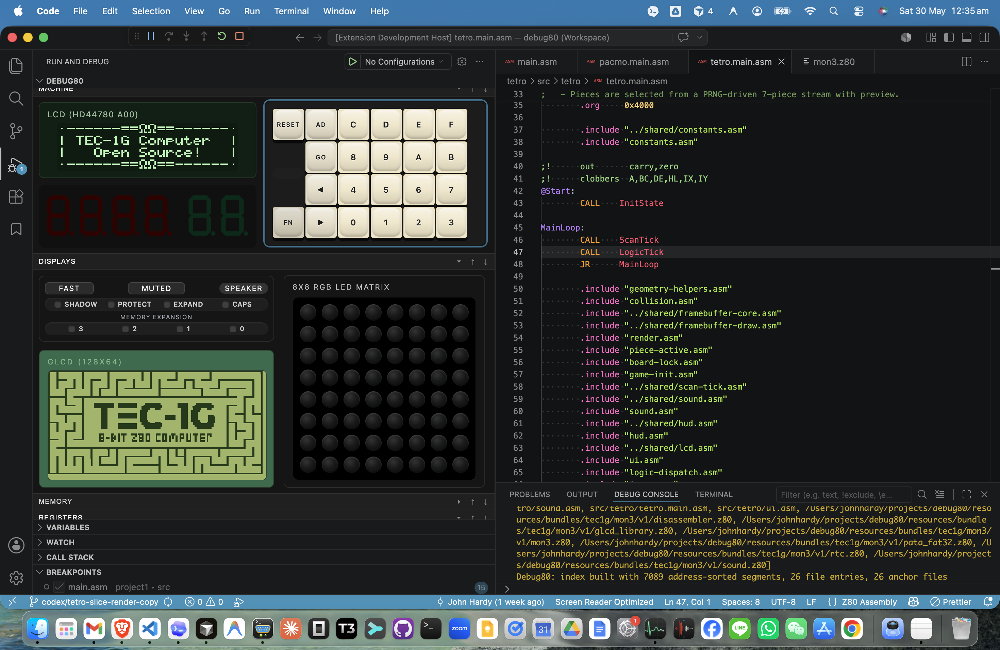
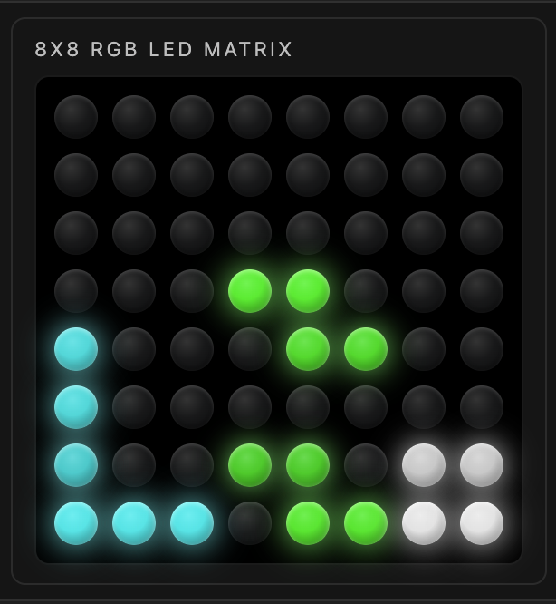

[← Run The Debugger](03-build-and-step.md) | [Book 1](index.md) | [Build Options And Source Maps →](05-use-the-debug80-panel.md)

# Inspect A Running Program

Paused execution gives you time to inspect a program from several angles. Start with the source-map-backed symbols in VS Code, then use Debug80's Registers, Memory and Machine sections to connect source lines with CPU state and visible TEC-1G output.

## Symbols And Constants In Variables

Open the **Run and Debug** sidebar and expand **Variables**. Debug80 uses this standard VS Code panel for source-map-backed symbols and constants.

After a successful build, Debug80 can show **Symbols** and **Constants** scopes. Constants show their assembled value. Memory-backed symbols show conservative raw memory information: address, current bytes, readable ASCII where possible and source location.

These scopes use the source map from the last successful build. Build the target again when symbols need to be generated or refreshed.

## Watch Expressions

Open the **Watch** panel while execution is paused. Debug80 evaluates Z80-focused Watch expressions against the current CPU state, memory and source-map symbols.

Use Watches when you want a small set of facts to stay visible while stepping. The example shows direct register reads, source-map symbols, comparisons and a byte read through `DE`. A symbol by itself evaluates to its address or constant value; square brackets read one byte from memory.

Build the active target again when a symbol Watch needs to be generated or refreshed. Appendix C lists the shared expression language used by Watches and conditional breakpoints.

## Call Stack Naming

Open the **Call Stack** view while the program is paused. Debug80 names the current Z80 execution frame from the nearest known symbol in the source map.

In the screenshot, `ScanHello+3` means the current PC is three bytes after the `ScanHello` label. The following frames come from the monitor and library source. This is symbolic naming for execution locations, based on the source map.

## The Registers Section

Registers live in Debug80's dedicated **Registers** section, close to the memory and hardware views. PC names the next instruction address. SP names the top of the Z80 stack. The register pairs AF, BC, DE, HL, IX and IY are the main working registers you will inspect while debugging Z80 programs.

Step a target and watch PC change as the Z80 executes each instruction. When the highlighted source line and PC describe the same instruction, the source view and machine state agree.

## The Memory Section

Open the **Memory** section while the session is paused. The memory panel can show bytes relative to several registers:

- PC
- SP
- BC
- DE
- HL
- IX
- IY
- Absolute

Choose **PC** to see the bytes at the current instruction. Choose **Absolute** when you want to type an address yourself.

The memory panel refreshes while the debug session is paused. In the example, the PC view shows instruction bytes, while HL and DE point at the seven-segment data. The ASCII column makes strings and readable bytes easy to spot.

Use **Absolute** when the address comes from the source or hardware manual. Use a register-relative view when the address comes from the CPU state. For example, use PC to inspect instructions, SP to inspect the stack and HL when a routine uses HL as a pointer.

## The Machine Section

The **Machine** section shows the front-panel parts of the TEC-1G that you touch most often: LCD, seven-segment display and keypad.

This view keeps visible output beside the usual debugger state, so you can connect a source line with the device it drives.

## Panel Focus And Keypad Input

VS Code sends key presses to the editor until the webview has focus. Click inside the Machine section before using keyboard shortcuts for the keypad.

If input goes to the source editor, click the keypad area and try again. The on-screen keys work even when keyboard focus is unclear.

The keypad sends input to the emulated TEC-1G runtime. Programs that read the keypad see the same kind of input they would receive from the hardware keypad.

The exact key meanings depend on the monitor or program that is currently running. When you are debugging your own program, stop at the code that reads the keypad and watch the relevant register or memory location.

Use an on-screen key first. Then switch to keyboard shortcuts after the panel has focus and the program is reading input as expected.

## LCD And Seven-Segment Output

The LCD and seven-segment display update from the emulated I/O ports. TEC-1G programs often reach those devices through MON-3 services.

When a program writes to the LCD, the panel shows the result. When a program refreshes the seven-segment display in a loop, the panel shows the current display state while the CPU continues to run.

## Displays Section

The **Displays** section contains TEC-1G display hardware beyond the front-panel LCD and seven-segment digits.

The RGB matrix is useful for programs that scan LEDs over time. Debug80 renders the duty-cycle brightness, so a dim pixel and a bright pixel can indicate different timing in the program.

## Speaker, Speed And Mute

The TEC-1G panel includes speaker, speed and mute controls in the display area. Use **MUTED** to prevent sound while debugging. The speed control lets the panel request a different run mode from the emulator.

[← Run The Debugger](03-build-and-step.md) | [Book 1](index.md) | [Build Options And Source Maps →](05-use-the-debug80-panel.md)
