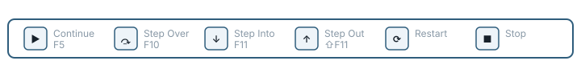
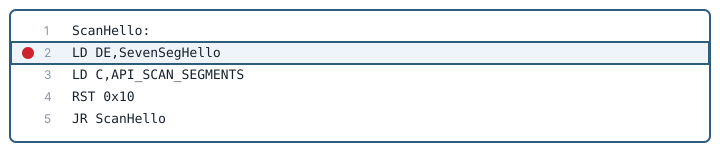
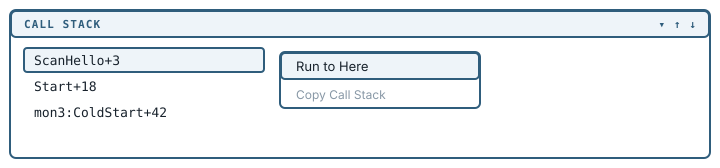

[← Build and run](04-build-and-run.md) | [Book 1](index.md) | [Inspect a running program →](06-inspect-the-machine.md)

# Run the debugger

Debugging means running a program under control. You can stop execution, inspect registers and memory, step one instruction at a time, and continue when you are ready.

## Start a session

Select your target and click **Run**, or press **F5**. Debug80 assembles the target, loads the program and the monitor ROM into the emulated Z80, and starts the machine.

**Stop on entry** decides what happens the instant it starts. Cleared, the program runs straight away. Ticked, Debug80 halts at the target's configured entry point before any of it executes - for a TEC-1G project under MON-3 that is address `$0000` in the monitor ROM, well before your own code at `0x4000`.

Tick it now, and click **Run**.

## The debug toolbar

The VS Code debug toolbar controls the emulated Z80 while a session is running.

Left to right:

- **Continue / Pause** - continue from the current instruction. While the program is running the same button becomes **Pause**.
- **Step Over** - press **F10** to execute the current instruction and stop at the next one in the current flow. When the current instruction calls a subroutine, F10 runs that routine as one action and stops after it returns.
- **Step Into** - press **F11** to follow execution into a subroutine. In Z80 code this also follows software interrupts, so stepping into `RST 0x10` takes you into the MON-3 service routine.
- **Step Out** - press **Shift-F11** to run until the current routine returns to its caller.
- **Restart** - restart the session.
- **Stop** - end the session.

The panel's own **Run** button tracks all of this. It turns green while the program runs and blue when it is paused.

## The program counter

The Z80 program counter, usually written as PC, holds the address of the next instruction. When the debugger pauses, PC says where execution will resume.

Source-level debugging connects that address back to your assembly. The source map from the last successful build records which source line produced the instruction at each address, so the editor can show you the line while the register view shows the machine address.

The source-map status line from the last chapter decides whether any of this can be trusted. If it does not read `current`, the line the editor highlights may not be the instruction the Z80 is about to run. Build again first.

## Step, then inspect

Use F10 to stay in your program and move past calls as single operations. Use F11 when the called code matters and you want the instructions inside it. Use Shift-F11 once F11 has taken you somewhere you have seen enough of.

That is the smallest useful debugging cycle: stop, inspect, step, inspect again.

## Set a breakpoint

Click in the editor gutter beside an instruction line. VS Code adds a red marker and Debug80 binds it to the Z80 address generated for that line.

Breakpoints bind to instruction addresses, so place them on executable lines. When execution reaches that address, Debug80 pauses before running the instruction.

Set one on the `LD DE,SevenSegHello` line inside `ScanHello`, then **Continue**. The program runs through its LCD setup, reaches your line and stops.

Use **Continue** to run from one breakpoint to the next, and **Pause** to interrupt a running program wherever it happens to be.

## Run to Cursor, and Run to Here

**Run to Cursor** reaches one spot without leaving a breakpoint behind. During a session, right-click an instruction line and choose it from the editor menu.

Debug80 resolves the line through the source map, runs to the matching address and stops there.

Debug80 adds a second one of these for the call stack. Right-click a frame in the **Call Stack** view and choose **Run to Here** to continue until execution returns to that frame. It is the quick way out of a routine you stepped too far into, when Step Out would take several presses.

If a line will not resolve, build the target again to refresh the source map.

## Conditional breakpoints

A plain breakpoint stops every time. A conditional one stops only when the machine is in a state you care about. Right-click a breakpoint and choose **Edit Breakpoint**.

Type a Debug80 expression into the inline editor. Conditions can use registers, flags, symbols from the source map and byte reads from memory, so you can stop when a counter reaches zero, when a pointer lands on an address, or when a particular key value appears, instead of breaking on every pass.

Each time execution reaches the line, Debug80 evaluates the expression. A true or non-zero result stops the program; a false or zero result lets it run on. If the expression itself errors, Debug80 writes the error to the Debug Console and treats the condition as false.

Conditional breakpoints share their expression language with the Watch panel. Appendix A lists the registers, flags, symbols, memory reads and operators you can use.

## Editing while debugging

You do not have to stop a session to change your program. Save any source file in the project while the session runs and Debug80 rebuilds it a moment later, refreshing the source map so breakpoints keep landing where you meant them.

Build errors arrive in the Problems panel. The running machine carries on with the code it already has until you **Run** again.

## Summary

- **Run** or **F5** starts a session; **Stop on entry** halts at the configured entry point, `$0000` in the monitor ROM for TEC-1G.
- F10 steps over, F11 steps into and follows `RST` calls, Shift-F11 steps out.
- Breakpoints bind to instruction addresses through the source map. A stale source map means the highlighted line may not match the PC.
- **Run to Cursor** reaches a line; **Run to Here** on a call-stack frame runs until execution returns to it.
- Conditional breakpoints take a Debug80 expression; an erroring expression counts as false.
- Saving a source file during a session rebuilds automatically.

---

[← Build and run](04-build-and-run.md) | [Book 1](index.md) | [Inspect a running program →](06-inspect-the-machine.md)
