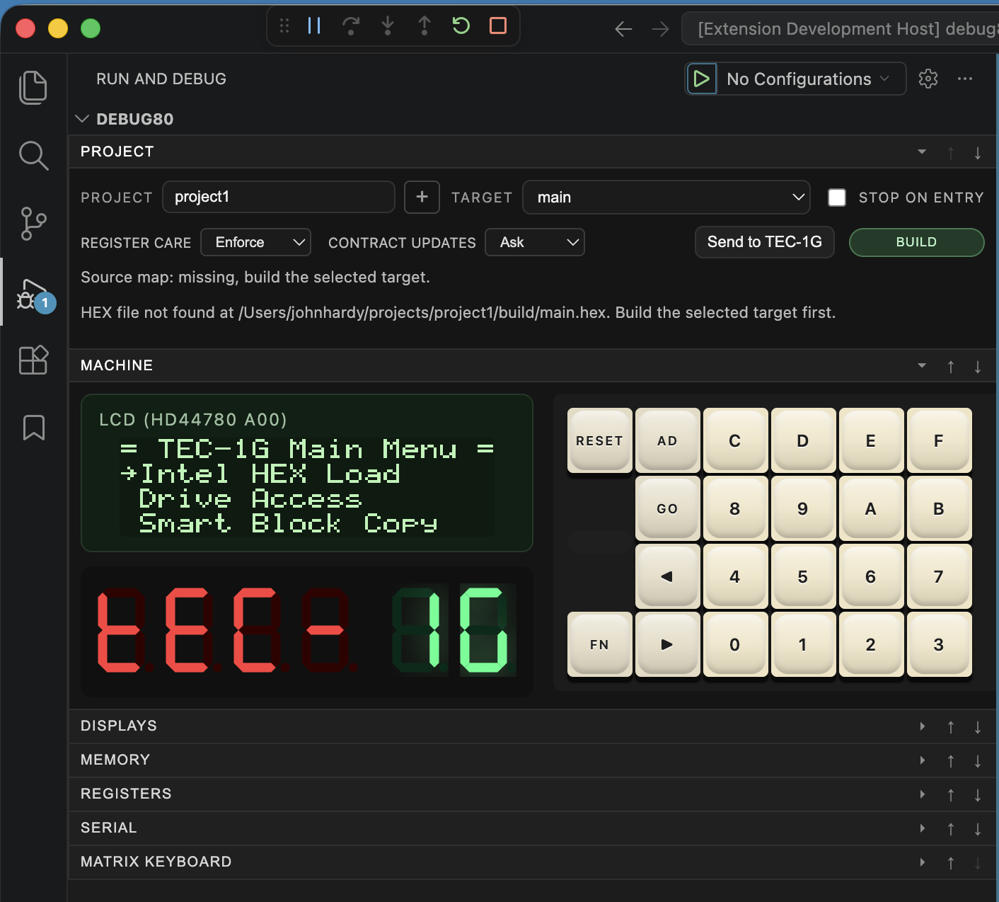
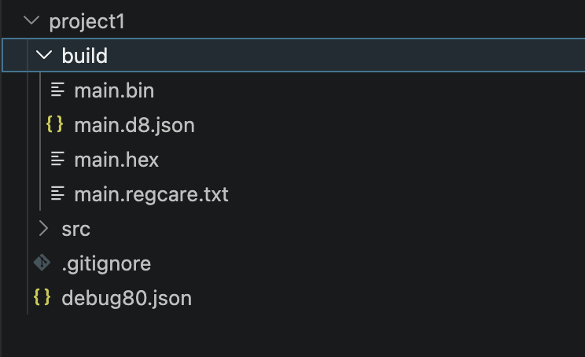
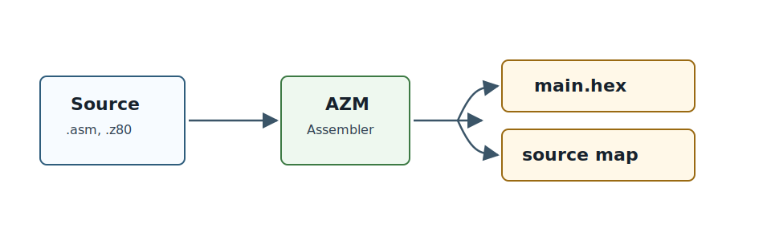
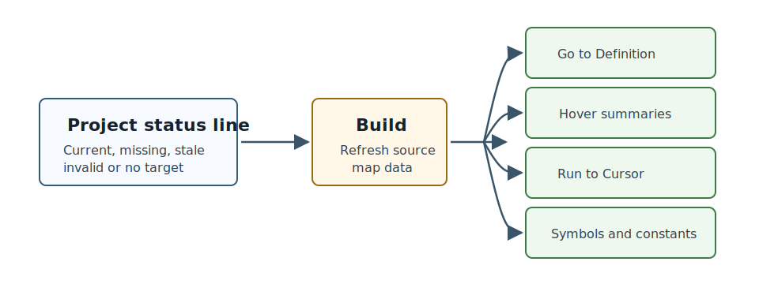

[← Inspect A Running Program](04-inspect-the-machine.md) | [Book 1](index.md) | [Source Navigation And ROM Source →](06-artifacts-roms-and-mapping.md)

# Build Options And Source Maps

The **Project** section controls the next build: project, target, platform and register-care settings.

## Project And Target

The **Project** row selects the workspace folder. In a multi-folder window, choose the folder before you build.

The **Target** row selects the runnable program inside that folder. The selected target controls the source file, build output and platform settings used by **Build** and F5.

**Stop on entry** pauses the next launch at the first instruction the Z80 executes. Use it when you want a controlled start from reset. Leave it clear when you want the target to run immediately.

## Build Output

When you click **Build**, Debug80 asks AZM to assemble the active target. AZM writes the generated files under the target's build directory.

The `.hex` file is the important user-facing artifact: Debug80 loads it into the emulator and can send the same file to a real TEC-1G through CoolTerm. The `.bin` file is the same program as a raw binary image.

The JSON source-map file connects source lines, symbols and generated addresses.

The `main.regcare.txt` file records register-care diagnostics from the build. It is most useful when Register Care is in **Audit** mode, because you can inspect the findings without blocking the build.

These files are generated output. Edit the source files, then build the target again.

## Source Map Status

The Project section reports the source-map status for the active target. The source map connects source files, labels and generated Z80 addresses. Debug80 uses it for source breakpoints, stepping, Run to Cursor, Variables symbols, Watches, symbolic Call Stack names, Go to Definition, symbol hover and workspace symbol search.

Read the status line before using source-map-backed features:

- `Source map: current.` means the selected target has a readable source map and it appears up to date.
- `Source map: missing, build the selected target.` means the target needs a successful build before source-map features are available.
- `Source map: stale, build recommended.` means one or more mapped source files appear newer than the source map.
- `Source map: invalid, rebuild the selected target.` means Debug80 needs a fresh source map for the selected target.
- `Source map: select a target and build.` means source-map features start after target selection and a successful build.

Build the active target when navigation, symbols, source breakpoints or Run to Cursor need fresh address data.

## Register Care

**Register Care** controls how strictly Debug80 treats AZM register-care diagnostics during launch.

Register care checks whether routines use registers according to their AZMDoc contracts. A contract can say which registers a routine expects as input, which registers it returns as output, which registers it clobbers and which registers it preserves. Those checks catch common assembly mistakes: a routine overwrites a register the caller still needs, a caller fails to prepare an input register, or a documented return value no longer matches the code.

The selector has three modes:

- **Enforce** treats register-care problems as launch-blocking diagnostics.
- **Audit** reports register-care findings as advisory diagnostics while allowing the workflow to continue.
- **Off** skips the register-care check for launch.

Use **Enforce** when you want contracts to protect the build. Use **Audit** when you are introducing contracts to existing code and want a list of issues before making them blocking.

## Contract Updates

**Contract Updates** controls whether Debug80 may update AZMDoc register-care comments while launching.

- **Ask** lets Debug80 prompt before applying updates.
- **Auto** allows automatic updates.
- **Never** keeps launch read-only for contract updates.

Leave this on **Ask** while learning the workflow. Change it after you are comfortable reviewing the contract update being offered.

## Build Controls And Machine State

Use the Project section for controls that affect the next build. Use Variables, Watch, Call Stack, Registers, Memory, Machine and Displays for the state of the running machine.

[← Inspect A Running Program](04-inspect-the-machine.md) | [Book 1](index.md) | [Source Navigation And ROM Source →](06-artifacts-roms-and-mapping.md)
