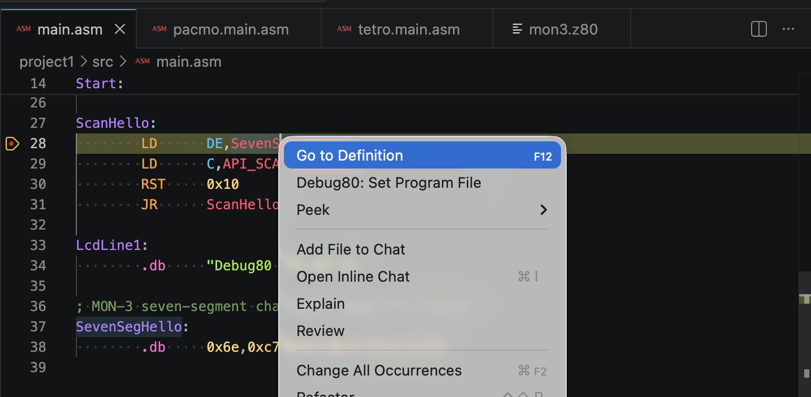
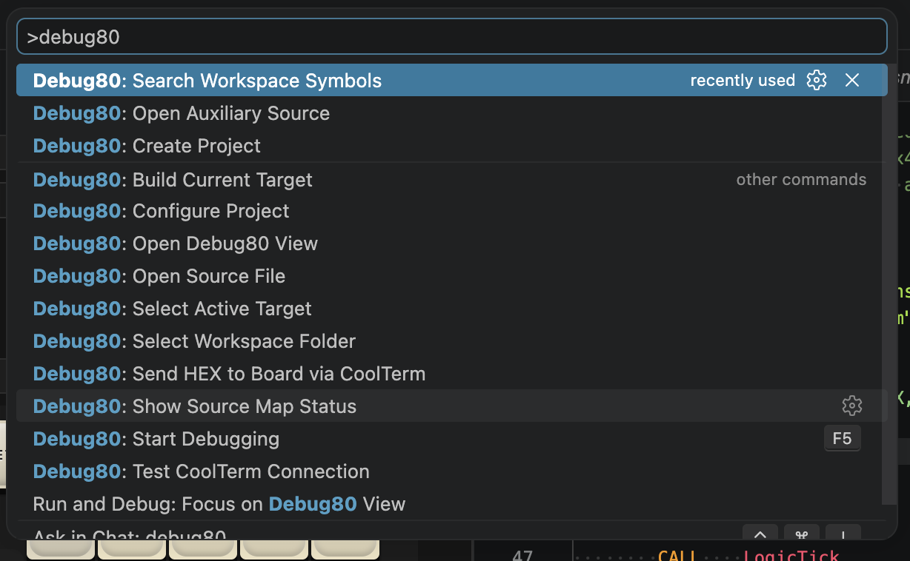
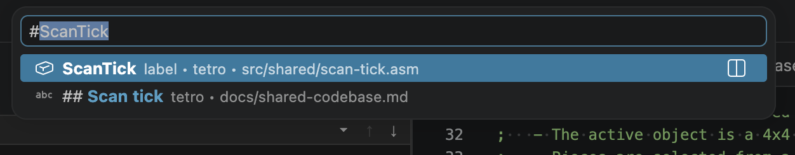
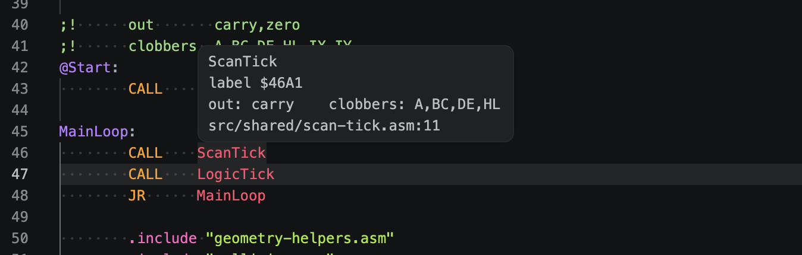
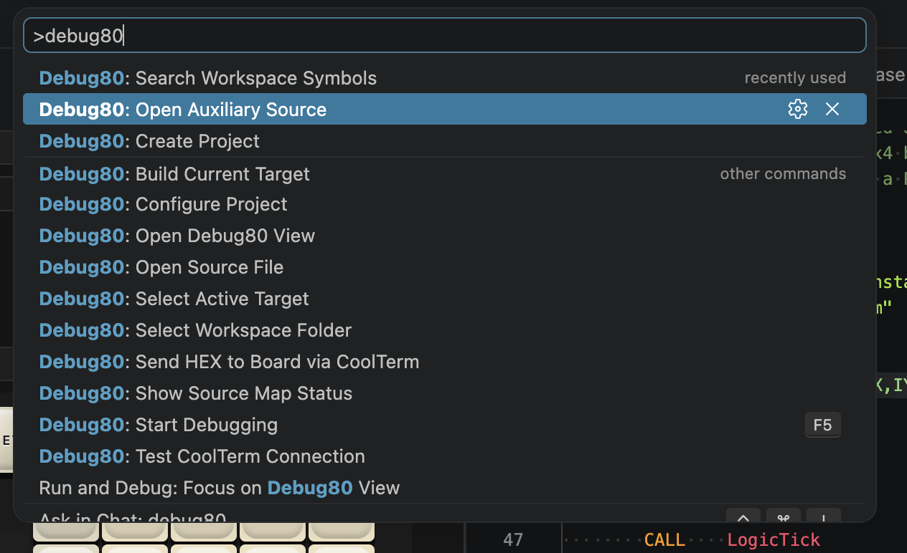
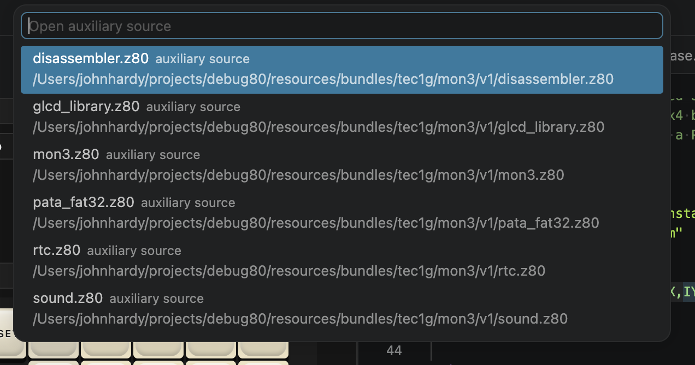

[← Build Options And Source Maps](05-use-the-debug80-panel.md) | [Book 1](index.md) | [Send To Hardware And Keep Working →](07-send-to-hardware-and-keep-working.md)

# Source Navigation And ROM Source

A successful build gives Debug80 a current source map. That map lets VS Code navigate assembly symbols, show compact symbol details and open source that belongs to the TEC-1G monitor.

## Go To Definition

Place the cursor on a symbol in a `.asm` or `.z80` file and press F12. Debug80 opens the definition recorded in the last successful build.



Build again after changing labels, constants or include files.

## Workspace Symbol Search

Workspace symbol search lists symbols from the active target: labels, constants, routines and data symbols.





This is target-based search. Select the target, build it, then search the symbols from that target.

## Symbol Hover

Hover over a known assembly symbol to see its source-map summary: name, kind, address or value, source file and line.

For routines with nearby AZMDoc register-care comments, Debug80 can also show a one-line contract summary:

```text
in: A,HL    out: carry    clobbers: B,C    preserves: DE,IX
```

Hover appears for symbols that resolve through the source map. Build the target when hover needs current symbol data.



## ROM Source

The TEC-1G / MON-3 platform runs with monitor ROM in the emulated machine. User programs normally start at `0x4000`; reset code and monitor routines live in ROM.

When execution enters monitor code, the current PC may point outside your source file. Use auxiliary source when a monitor call changes registers unexpectedly or when the Call Stack shows an address inside ROM.





Opening auxiliary source gives you the monitor code around routines such as MON-3 display, disk, clock and sound support.

[← Build Options And Source Maps](05-use-the-debug80-panel.md) | [Book 1](index.md) | [Send To Hardware And Keep Working →](07-send-to-hardware-and-keep-working.md)
