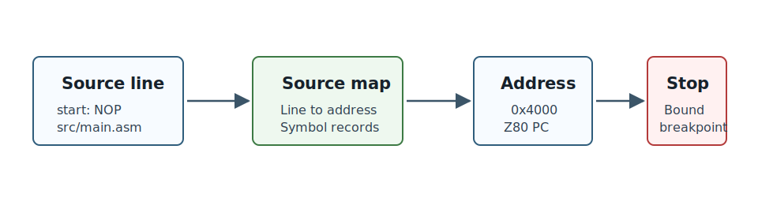

# Read Artifacts And ROM Source

Debug80 writes build artifacts during launch and loads monitor assets for monitor-backed profiles. Their roles explain breakpoints, ROM source and hardware transfer.

## The Build Folder

After a successful launch, open the `build/` folder. Debug80 writes the files produced by AZM there.

The target controls the folder and base name. In a scaffolded project, `outputDir` is usually `build`, and `artifactBase` is often `main`. That gives file names such as:

```text
build/main.hex
source-map output
```

> **Image placeholder:** Explorer showing `build/main.hex` and the generated source-map file.

These files are generated output. Edit the source files, then rebuild to generate fresh artifacts.


## Intel HEX

The `.hex` file contains the generated program bytes in Intel HEX format. Debug80 loads those bytes into the emulated Z80 memory when it starts the session.

The same `.hex` file is the file Debug80 sends to a real board through CoolTerm. Chapter 7 uses it for the hardware transfer.

This gives the emulator and the board a shared program image. You debug the program in VS Code, then send the generated HEX file to the real machine.

## Source Map

The source map records source files, generated address ranges and symbols in a form Debug80 can read. Debug80 uses the source map from the last successful build.

When you set a breakpoint in source, Debug80 needs an address for that source line. When execution stops at an address, Debug80 needs a source line to show in the editor. The source map supplies that relationship.

Normal debugging uses the source map through Debug80. Keep the operating rule simple: build the target again when navigation, symbols or breakpoints need fresh address data.



The source map is the reason source-level debugging works after assembly. The Z80 executes addresses and bytes. You write files and lines. Debug80 needs a map between those two worlds.

## Go To Definition

After a successful build, Debug80 can navigate from a symbol reference to the symbol definition.

Place the cursor on a symbol in a `.asm` or `.z80` file and press F12, or run VS Code's **Go to Definition** command. Debug80 uses the source map from the last successful build and opens the definition location.

The last successful build is the source of truth. Build again after changing labels, constants or include files so Debug80 can use the current source map.

When source-map data needs to be generated or refreshed, Debug80 asks for a build before using the navigation result.

> **Image placeholder:** Source editor with cursor on a symbol and the definition target shown after F12.

## Workspace Symbol Search

VS Code's **Go to Symbol in Workspace** command can search symbols contributed by Debug80. Debug80 contributes labels, constants, routines and data symbols from the active target.

Workspace symbol search uses the active Debug80 target. Build the active target after changing targets, then use symbol search for labels, constants, routines and data symbols in that target.

> **Image placeholder:** VS Code workspace symbol picker showing Debug80 symbols from the active target.

## Symbol Hover

Hover over a known assembly symbol to see a compact summary from the source map. The summary can include the symbol name, kind, address or value, source file and line.

For routines with nearby AZMDoc register-care comments, Debug80 can also show a one-line contract summary:

```text
in: A,HL    out: carry    clobbers: B,C    preserves: DE,IX
```

Hover appears for symbols that resolve through the source map. Build the target when hover needs current symbol data.

> **Image placeholder:** Symbol hover showing name, kind, address and source location.

## Monitor ROM

The TEC-1G / MON-3 project runs with monitor ROM in the emulated machine. Your program starts at `0x4000`, while reset code and monitor routines live in ROM.

When execution enters monitor code, the current PC may point outside your source file. Debug80 can open the monitor source material for the active platform profile.

Run:

```text
Debug80: Open ROM Source
```

Use this when a monitor call does something unexpected or when the call stack shows an address inside the ROM.

> **Image placeholder:** Command Palette showing **Debug80: Open ROM Source**.

> **Image placeholder:** MON-3 source open beside user source.

ROM source is especially useful when your program calls a monitor routine. If a call changes registers you expected to preserve, or if control returns somewhere unexpected, opening the ROM source gives you the surrounding monitor code for the current address.

## Bundled Assets

Debug80 ships bundled ROM assets for the built-in monitor profiles. The TEC-1G / MON-3 profile refers to paths such as:

```text
roms/tec1g/mon3/mon3.bin
```

The TEC-1 platform uses the same pattern for MON-1B:

```text
roms/tec1/mon1b/mon-1b.bin
```

If those files exist in your workspace, Debug80 uses them. If they are absent and the profile has a bundled asset entry, Debug80 uses the copy packaged with the extension.

Run this command when you want local copies:

```text
Debug80: Copy Bundled Assets into Workspace
```

Copy assets when you want to inspect monitor source, compare a ROM or keep a project self-contained. Ordinary debugging with a bundled profile can use the packaged assets.

> **Image placeholder:** Explorer showing copied `roms/tec1g/mon3` assets.

## Before Moving On

You are ready for hardware transfer when you can identify the `.hex` file for the active target. The board transfer sends the generated HEX file.
