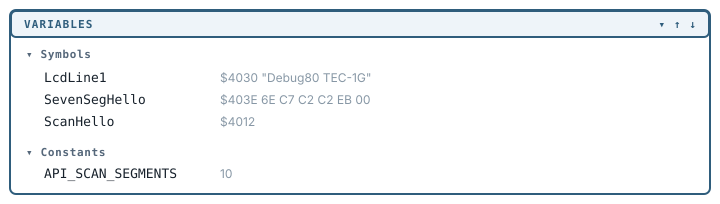
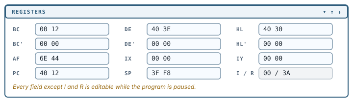
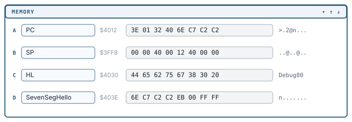
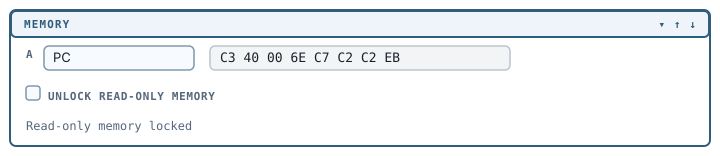
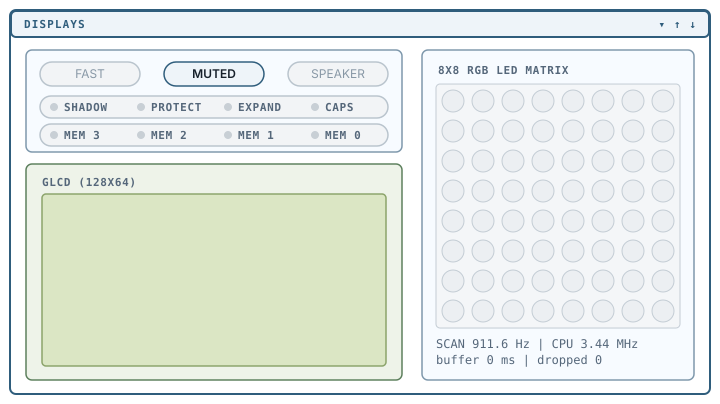

# Inspecting a running program

VS Code provides the Variables, Watch and Call Stack panels. Debug80 adds Registers, Memory, Machine and Displays sections for the Z80 and the board.

## Symbols and Constants in Variables

The **Variables** panel shows source-map-backed **Symbols** and **Constants** after a successful build. Constants show their assembled value. Memory-backed symbols show their address, current bytes, readable ASCII where there is any, and source location.



## Watch expressions

The **Watch** panel evaluates Z80 expressions while execution is paused, so a small set of facts can stay on screen while you step. A symbol on its own evaluates to its address or constant value, and square brackets read a byte from memory. Comparisons use `=`, `!=`, `<>`, `<`, `<=`, `>` and `>=`.

Appendix A lists the full expression language, which Watch shares with conditional breakpoints.

## Call Stack naming

The **Call Stack** view names the current Z80 frame from the nearest known symbol in the source map. `ScanHello+3` means the PC is three bytes past the `ScanHello` label. Frames below it come from the monitor and library source.

## Registers

Debug80 keeps the CPU registers in their own **Registers** section: the pairs `BC`, `DE`, `HL`, `AF`, `IX`, `IY`, the shadow set `BC'`, `DE'`, `HL'`, `AF'`, and `PC` and `SP`. The interrupt and refresh registers `I` and `R` are read-only.



Each debugger step advances PC to the next instruction.

These fields are editable while the program is paused. Selecting a
field and typing a value prepares the edit; **Enter** commits it and
**Escape** reverts it. The flag strings beside the pairs work the same
way, allowing a branch to be tested with a flag set or clear.

## Memory

The **Memory** section is four independent views, labelled **A** to **D**, which default to following `PC`, `SP`, `HL` and `DE`.



Each view has an anchor box that accepts three kinds of value:

- a register name, so the view follows that register as it changes
- a symbol from the source map, such as `SevenSegHello`
- an absolute address: plain hex, `0x`-prefixed, or `d:` followed by a decimal number

Beside the anchor, Debug80 shows the resolved address and the nearest symbol with an offset.

A view shows sixteen bytes either side of its anchor, row-aligned, with an ASCII gutter and the anchor byte highlighted. Rows hold sixteen bytes when there is room and eight when the sidebar is narrow. While the program is paused the views refresh about twice a second.

### Editing memory

Every byte in a memory view is an editable field. Selecting one and
typing a value prepares the edit; **Enter** commits it and **Escape**
reverts it. Editing works only while the program is paused.



Bytes in ROM are marked read-only, and **Unlock read-only memory** in the section makes them writable. Until you tick it, an edited byte snaps back and Debug80 reports:

```text
Read-only memory locked
```

## The Machine section

The **Machine** section shows the front-panel parts of the TEC-1G: the 20x4 LCD, the six seven-segment digits and the hex keypad.

## Displays

The **Displays** section holds the rest of the TEC-1G's output: the speed and mute controls, the status and memory-bank indicators, the 128x64 GLCD and the 8x8 RGB LED matrix.

Debug80 renders the RGB matrix with duty-cycle brightness, so pixel brightness indicates the program's timing as well as its output.



**SLOW** and **FAST** switch the emulated clock. **MUTED** and **SOUND** control the speaker, which starts muted; audio unlocks on your first click or key press in the panel.

## Keyboard focus

The hex keypad, matrix keyboard and joystick can compete for physical
key input. Clicking a surface gives it keyboard focus; the on-screen
controls continue to work regardless of that focus.

[Video, input and serial](09-video-input-and-serial.md) explains the input priority, focus indicator, release command and macOS key handling.
