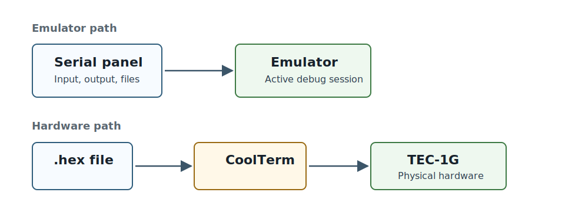

# Send To Hardware And Keep Working

Debug80 sends the active target's Intel HEX file to real hardware through CoolTerm. CoolTerm owns the serial port. Debug80 controls CoolTerm through its localhost Remote Control Socket.

This chapter also covers the next step after the first successful transfer: adding more targets, choosing platforms and recovering from common failures.

## Install CoolTerm

Download CoolTerm from:

<https://freeware.the-meiers.org>

On macOS, the first launch may require approval in **System Settings > Privacy & Security**. You can also right-click CoolTerm in Finder, choose **Open** and confirm the launch.

## Enable The Remote Control Socket

In CoolTerm, open **Preferences > Scripting**.

Enable **Remote Control Socket** and keep the port set to:

```text
51413
```

Leave **HTTP Server** disabled. Debug80 connects to CoolTerm at:

```text
127.0.0.1:51413
```

When CoolTerm is running with that socket enabled, Debug80 can detect it and show **Send to Board** in the Project section.

> **Image placeholder:** CoolTerm Preferences > Scripting with Remote Control Socket enabled on port `51413`.

The socket is local to your computer. Debug80 is not taking over the serial device directly; it is asking CoolTerm to send the file through the connection CoolTerm owns.

## Configure The Serial Port

Open CoolTerm's connection options. Select the serial port for your USB serial adapter and use the TEC-1 monitor settings:

```text
4800 baud
8 data bits
No parity
2 stop bits
```

If the board misses characters during transfer, adjust CoolTerm's transmit delay settings.

> **Image placeholder:** CoolTerm serial connection options showing `4800`, 8 data bits, no parity and 2 stop bits.

Keep these settings with the hardware notes for your board. A wrong stop-bit or baud setting can look like a bad program because the monitor receives corrupted characters.

## Build And Send

Select the correct project and target in Debug80. Build the target so its `.hex` file exists in the build folder.

Put the TEC-1G into MON-3 receive mode before sending. The final review needs the exact key sequence for the board shown in the screenshots.

Click **Send to Board** in the Project section. Debug80 sends the active target's HEX file through CoolTerm and waits for the board response:

```text
PASSED
```

If the button is hidden, check that CoolTerm is running and the Remote Control Socket is enabled. If Debug80 reports that the HEX file is missing, build the target again.

> **Image placeholder:** Debug80 Project section with **Send to Board** visible.

> **Image placeholder:** TEC-1G in MON-3 receive mode.

> **Image placeholder:** Successful `PASSED` response after transfer.

After a successful transfer, run the program on the board and compare the result with the emulator. The emulator is the faster place to debug, and the board is the final check that the serial transfer and hardware assumptions match.

## Add Another Target

A Debug80 project can hold more than one runnable program. Each runnable program is a target.

The target records the source file, build folder, artifact base name and platform settings. The active target is the one launched by F5 and by the Project section's build button.

Debug80 discovers likely AZM entry sources by filename. Current discovery rules look for:

```text
*.z80
*.main.asm
```

A regular `.asm` file can still be part of your program. It may be included by another source file or selected explicitly, but the discovery rule keeps ordinary helper files from becoming targets by accident.

Use the **Target** selector in the Project section to change the active target.

You can also run:

```text
Debug80: Select Active Target
```

After selection, F5 and **Build** use that target.

> **Image placeholder:** Target selector showing several targets.

Use separate targets for separate entry programs. Use includes for shared support code. That arrangement keeps the target selector meaningful while still letting programs share definitions and routines.

## Set The Program File

To bind a source file to the current target, right-click an `.asm` or `.z80` file in the Explorer or editor and run:

```text
Debug80: Set Program File
```

Debug80 updates the project configuration so the target points at that source file.

`debug80.json` can name a `defaultTarget`. Debug80 uses it when there is no remembered target selection for the current project.

Keep the default target pointed at the program you normally want to launch first. Use the panel selector for day-to-day switching.

If you accidentally bind the wrong source file, use **Debug80: Set Program File** again on the intended file. The project file stores the latest selection.

## Choose A Different Platform

The platform controls the machine Debug80 emulates for a target. Book 1 used TEC-1G / MON-3. Debug80 also ships simpler profiles for other kinds of Z80 work.

Choose **Simple / Default** for small Z80 programs that need RAM, CPU state and basic terminal-style I/O. The Simple kit starts user code at `0x0900`.

Choose **TEC-1 / MON-1B** when you are working with classic TEC-1 monitor behaviour. This profile includes a monitor-first layout with user code at `0x0800`. Its panel focuses on the TEC-1 keypad, seven-segment display, speaker, serial path and memory inspection.

Choose **TEC-1 / Classic 2K** for classic TEC-1 RAM-program work at `0x0900`.

Choose **TEC-1G / MON-3** for the main TEC-1G workflow. The profile places user code at `0x4000` and models the MON-3-oriented machine: keypad, seven-segment display, LCD, GLCD, RGB matrix, matrix keyboard, serial path, memory protection and expansion behaviour.

Choose the platform that matches the assumptions in your program. A program that writes TEC-1G LCD ports needs the TEC-1G platform. A small CPU-only exercise may be clearer on the Simple platform.

## Recover From Common Failures

Most Debug80 failures name the missing file, target or build artifact. Start with the Debug Console message, then check the matching failure path.

If the project is missing, check the Project selector in the Debug80 panel. Make sure it points at the folder that contains your Z80 source and Debug80 configuration. If the config file is in a child folder, open that child folder or add it to the VS Code window and select it in the panel.

If F5 starts the wrong target, check the **Target** selector in the Project section. You can also run **Debug80: Select Active Target**. If the project still starts another target, inspect `defaultTarget` in `debug80.json` and any VS Code launch configuration that names a target explicitly.

If the source opens in the wrong editor column or the panel opens where you do not expect it, check `sourceColumn` and `panelColumn` in your launch configuration. Appendix B lists those options.

If the build fails, read the first assembler diagnostic. Later messages often follow from the first failure. Check that the active target points at the source file you meant to assemble, then check include paths, included files and the output folder.

Debug80 uses AZM for the current assembly workflow. Source written for another assembler may need syntax changes before AZM can assemble it.

If a breakpoint is hollow, move it to an instruction line and rebuild. A source line that contains only a comment, a blank line or a label may not have generated code at that exact line. Debug80 needs a generated address before it can bind the breakpoint.

If Go to Definition, hover, workspace symbols or Variables-panel symbols are missing, build the active target. These features use the source map from the last successful build. If they look stale, build again so Debug80 can read the current source-map data.

If the panel does not update, pause the session and open the relevant accordion section. Memory views and register views are easiest to read while paused. Keyboard input requires focus inside the webview, so click the panel before typing.



If CoolTerm is not detected, open CoolTerm and check **Preferences > Scripting**. The Remote Control Socket must be enabled on port `51413`. CoolTerm must be running while Debug80 checks for it.

## What To Review Next

After the first successful board transfer, review the path from source to hardware:

1. You edit AZM source in VS Code.
2. Debug80 launches the active target.
3. AZM writes `.hex`, `.lst` and source-map data.
4. Debug80 loads the `.hex` into the emulator and uses the source map for source debugging, navigation, hovers and symbol views.
5. CoolTerm sends the same `.hex` to the board.

That path is the core Debug80 workflow. Later work adds richer programs, more targets and more hardware features, but it follows the same sequence.
