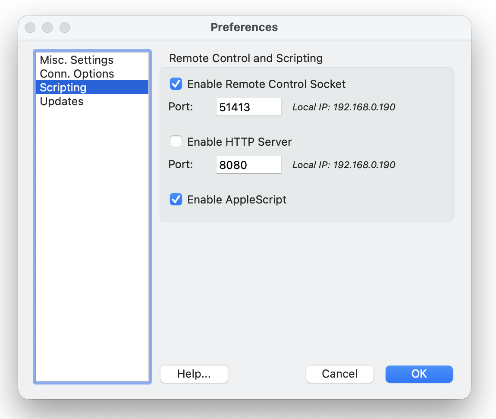
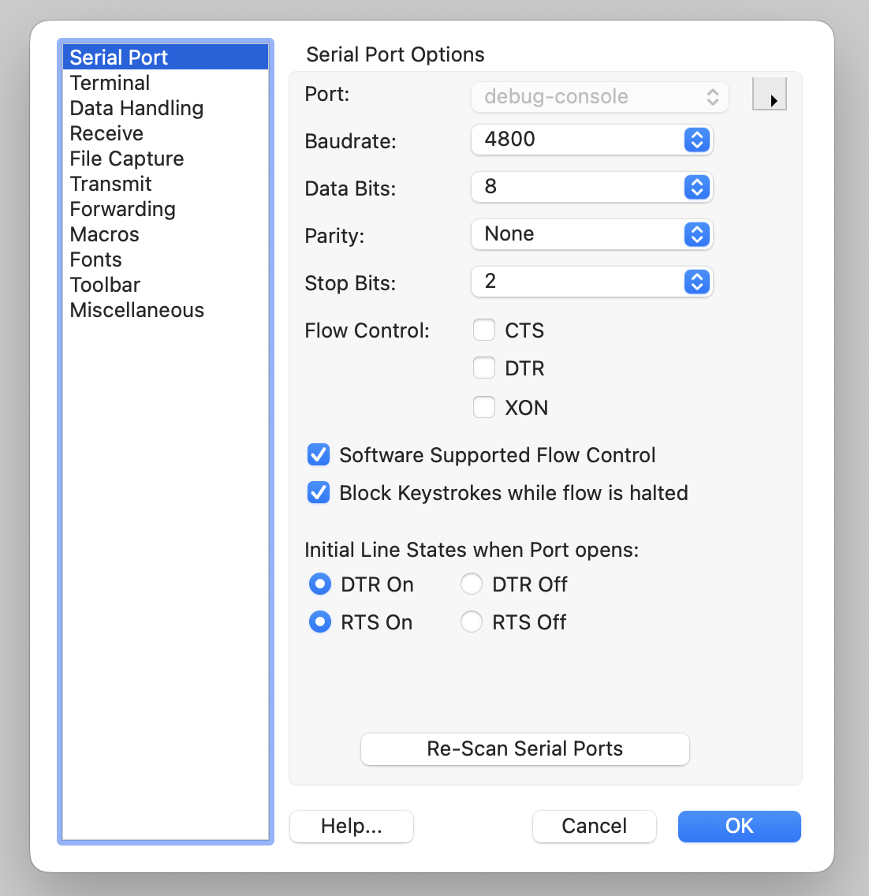

[← Source Navigation And ROM Source](06-artifacts-roms-and-mapping.md) | [Book 1](index.md) | [Appendix A — Command Reference →](appendices/a-command-reference.md)

# Send To Hardware And Keep Working

Debug80 sends the active target's Intel HEX file to real hardware through CoolTerm. CoolTerm owns the serial port. Debug80 controls CoolTerm through its localhost Remote Control Socket.

This means the hardware path has two parts. CoolTerm must be configured to talk to the TEC-1G serial port, and CoolTerm must also accept remote-control commands from Debug80.

## Install CoolTerm

Download CoolTerm from:

<https://freeware.the-meiers.org>

On macOS, the first launch may require approval in **System Settings > Privacy & Security**. You can also right-click CoolTerm in Finder, choose **Open** and confirm the launch.

Debug80 uses CoolTerm for board transfer. Install it before you try **Send to Board**. The emulator's Serial section can send data to the emulated machine, but hardware transfer uses CoolTerm and a real serial connection.

## Enable The Remote Control Socket

In CoolTerm, open **Preferences > Scripting**. Enable **Remote Control Socket** and keep the port set to:

```text
51413
```

Leave **HTTP Server** disabled. Debug80 connects to CoolTerm at:

```text
127.0.0.1:51413
```



The socket is local to your computer. Debug80 sends commands to CoolTerm, and CoolTerm sends the file through the serial connection it owns.

Debug80 needs **Enable Remote Control Socket** and port `51413`. The local IP shown in CoolTerm is informational.

## Configure The Serial Port

Open **Connection > Options** in CoolTerm. Select the serial port for your USB serial adapter and use the TEC-1G monitor settings:

```text
4800 baud
8 data bits
No parity
2 stop bits
```



These settings describe the physical serial link to the board. The port name depends on your USB serial adapter and operating system, but the line settings are fixed for this workflow: `4800 8 N 2`.

When CoolTerm is running with the Remote Control Socket enabled, Debug80 can detect it and show **Send to Board** in the Project section.

If the board misses characters during transfer, adjust CoolTerm's transmit delay settings.

Keep these settings with the hardware notes for your board. The monitor needs matching stop-bit and baud settings to receive characters correctly.

## Build And Send

Select the correct project and target in Debug80. Build the target so its `.hex` file exists in the build folder.

Put the TEC-1G into MON-3 Intel HEX Load mode before sending. The final review needs the exact key sequence for the board shown in the screenshots.

Click **Send to Board** in the Project section. Debug80 sends the active target's HEX file through CoolTerm and reports when the file has been sent.

MON-3 reports the load result on the TEC-1G seven-segment display:

```text
PASS   load accepted
ERROR  checksum or write verification failed
```

Debug80 reports that CoolTerm sent the file. MON-3 reports the load result on the TEC-1G display. The serial startup message `TEC-1G Connected` belongs to MON-3 startup.

When **Send to Board** is hidden, start CoolTerm and enable the Remote Control Socket. When Debug80 asks for a HEX file, build the target again.

> **Image placeholder:** Debug80 Project section with **Send to Board** visible.

> **Image placeholder:** TEC-1G in MON-3 Intel HEX Load mode.

> **Image placeholder:** TEC-1G seven-segment display showing `PASS` after a successful load.

After a successful transfer, run the program on the board and compare the result with the emulator. The emulator is the faster place to debug, and the board is the final check that the serial transfer and hardware assumptions match.

## Add Another Target

A Debug80 project can hold more than one runnable program. Each runnable program is a target.

The target records the source file, build folder, artifact base name and platform settings. The active target is the one launched by F5 and by the Project section's build button.

Debug80 discovers likely targets by filename. Current discovery rules look for:

```text
*.z80
*.main.asm
main.asm
```

The exact name `main.asm` is treated as a target because it is the common starter target name. A file ending in `.main.asm`, such as `display-test.main.asm`, is also treated as a target. Any `.z80` file is treated as a target.

A regular `.asm` file can still be part of your program. It may be included by another source file or selected explicitly with **Debug80: Set Program File**. Target discovery keeps helper files out of the Target selector.

Use the **Target** selector in the Project section to change the active target.

You can also run:

```text
Debug80: Select Active Target
```

After selection, F5 and **Build** use that target.

> **Image placeholder:** Target selector showing several targets.

Use separate targets for separate entry programs. Use includes for shared support code. That arrangement keeps the target selector meaningful while still letting programs share definitions and routines.

## Set The Program File

To bind a file to the current target, right-click an `.asm` or `.z80` file in the Explorer or editor and run:

```text
Debug80: Set Program File
```

Debug80 updates the project configuration so the target points at that file.

`debug80.json` can name a `defaultTarget`. Debug80 uses it as the fallback target for the current project.

Keep the default target pointed at the program you normally want to launch first. Use the panel selector for day-to-day switching.

To change a target, run **Debug80: Set Program File** again on the intended file. The project file stores the latest selection.

## Choose A Different Platform

The platform controls the machine Debug80 emulates for a target. The project you created uses TEC-1G / MON-3.

Choose **TEC-1** when you are working with the classic 1980s TEC-1 board. TEC-1 platform settings focus on the keypad, seven-segment display, speaker, serial path and memory inspection used by classic monitor workflows.

Choose **TEC-1G / MON-3** for the main TEC-1G workflow. TEC-1G is compatible with the TEC-1 line but adds MON-3-oriented hardware: keypad, seven-segment display, LCD, GLCD, RGB matrix, matrix keyboard, serial path, memory protection and expansion behaviour.

Choose the platform that matches the board your program expects. A program that writes TEC-1G LCD ports needs the TEC-1G platform. A classic TEC-1 monitor program should use a TEC-1 platform.

## Recover From Setup Problems

Most Debug80 diagnostics name the file, target or build artifact that needs attention. Start with the Debug Console message, then check the matching setup path.

For project selection problems, check the Project selector in the Debug80 panel. Make sure the workspace contains the folder that owns the program and that `debug80.json` exists at the root of that folder. Select an uninitialized folder in the Debug80 panel to initialize it.

For target selection problems, check the **Target** selector in the Project section. You can also run **Debug80: Select Active Target**. The `defaultTarget` field in `debug80.json` controls the fallback target.

For build problems, read the first assembler diagnostic. Later messages often follow from the first diagnostic. Check that the active target points at the intended file, then check include paths, included files and the output folder.

Debug80 uses AZM for the current assembly workflow. Source written for another assembler may need syntax changes before AZM can assemble it.

For hollow breakpoints, move the breakpoint to an instruction line and build the target. Comments, blank lines and label-only lines may share their generated address with a nearby instruction, while Debug80 binds breakpoints to generated instruction addresses.

For Go to Definition, hover, workspace symbols or Variables-panel symbols, build the active target. These features use the source map from the last successful build. Build again so Debug80 can read current source-map data.

For panel update questions, pause the session and open the relevant accordion section. Memory views and register views are easiest to read while paused. Keyboard input requires focus inside the webview, so click the panel before typing.


For CoolTerm detection, open CoolTerm and check **Preferences > Scripting**. Enable the Remote Control Socket on port `51413` and keep CoolTerm running while Debug80 checks for it.

## What To Review Next

After the first successful board transfer, review the path from source to hardware:

1. You edit AZM source in VS Code.
2. Debug80 launches the active target.
3. AZM writes `.hex` and source-map data.
4. Debug80 loads the `.hex` into the emulator and uses the source map for source debugging, navigation, hovers and symbol views.
5. CoolTerm sends the same `.hex` to the board.

That path is the core Debug80 workflow. Later work adds richer programs, more targets and more hardware features, but it follows the same sequence.

[← Source Navigation And ROM Source](06-artifacts-roms-and-mapping.md) | [Book 1](index.md) | [Appendix A — Command Reference →](appendices/a-command-reference.md)
