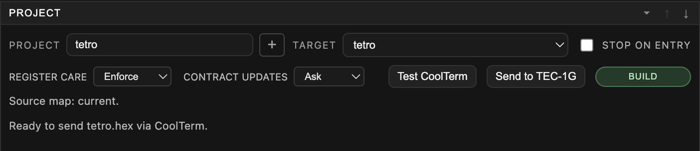
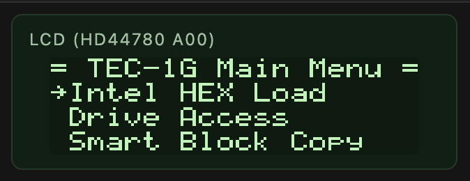
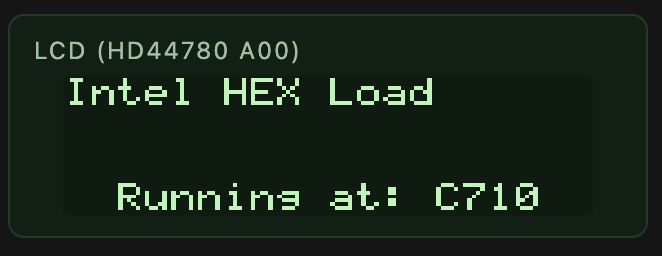

[← Source Navigation And ROM Source](06-artifacts-roms-and-mapping.md) | [Book 1](index.md) | [Copy Monitor ROM Source →](08-copy-monitor-rom.md)

# Send To TEC-1G Hardware

Debug80 sends the active target's Intel HEX file to real hardware through CoolTerm. CoolTerm owns the serial port. Debug80 controls CoolTerm through its localhost Remote Control Socket.

## Install CoolTerm

Download CoolTerm from:

<https://freeware.the-meiers.org>

On macOS, the first launch may require approval in **System Settings > Privacy & Security**. You can also right-click CoolTerm in Finder, choose **Open** and confirm the launch.

Install CoolTerm before you try **Send to TEC-1G**. The emulator's Serial section talks to the emulated machine; hardware transfer uses CoolTerm and a real serial connection.

## Enable The Remote Control Socket

In CoolTerm, open **Preferences > Scripting**. Enable **Remote Control Socket** and keep the port set to `51413`.

The socket is local to your computer. Debug80 sends commands to CoolTerm, and CoolTerm sends the file through the serial connection it owns. The local IP shown in CoolTerm is informational.

## Configure The Serial Port

Open **Connection > Options** in CoolTerm. Select the serial port for your USB serial adapter and use the TEC-1G monitor settings shown below.

The port name depends on your USB serial adapter and operating system. The line settings are fixed for this workflow: `4800 8 N 2`.

For a TEC-1G target, the Project section shows **Send to TEC-1G**. That button sends the active target's HEX file through CoolTerm.

If the board misses characters during transfer, adjust CoolTerm's transmit delay settings.

## Build And Send

Select the correct project and target in Debug80. Build the target so its `.hex` file exists.

Put the TEC-1G into MON-3 Intel HEX Load mode before sending.

The TEC-1G display shows the loader state while it waits for incoming data.

Click **Send to TEC-1G** in the Project section. Debug80 sends the active target's HEX file through CoolTerm and reports when the file has been sent.

MON-3 reports the load result on the TEC-1G seven-segment display: `PASS` for an accepted load or `ERROR` for a checksum or write verification failure.

Debug80 reports that CoolTerm sent the file. The final load result comes from the TEC-1G display, not from serial text. The serial startup message `TEC-1G Connected` belongs to MON-3 startup.

If sending fails before the transfer begins, start CoolTerm and check that the Remote Control Socket is enabled. When Debug80 asks for a HEX file, build the target again.

After a successful transfer, run the program on the board and compare the result with the emulator. The emulator is the faster place to debug, and the board is the final check that the serial transfer and hardware assumptions match.

## If Transfer Fails

Start with the part of the path that failed:

- If Debug80 cannot connect to CoolTerm, open CoolTerm and check that the Remote Control Socket is enabled on port `51413`.
- If Debug80 asks for a HEX file, build the active target.
- If the TEC-1G displays `ERROR`, check that the board is in Intel HEX Load mode and try the transfer again.
- If characters appear to be missed, add transmit delay in CoolTerm.

[← Source Navigation And ROM Source](06-artifacts-roms-and-mapping.md) | [Book 1](index.md) | [Copy Monitor ROM Source →](08-copy-monitor-rom.md)
