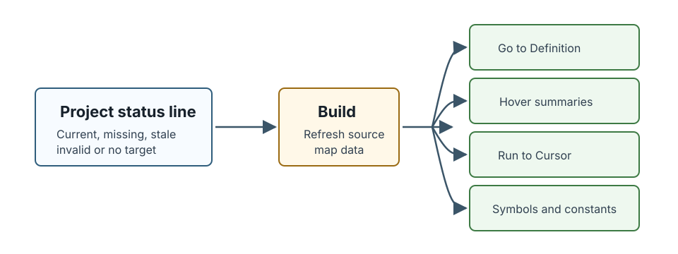
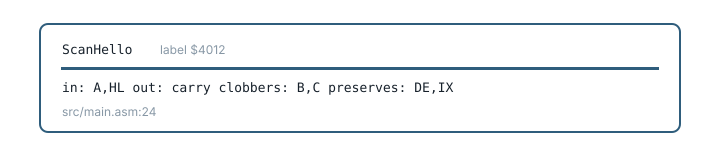

[← Inspect a running program](06-inspect-the-machine.md) | [Book 1](index.md) | [Glimmer targets →](11-glimmer-targets.md)

# Source navigation and ROM source

A successful build gives Debug80 a current source map. That map lets VS Code navigate assembly symbols, show compact symbol details and open source that belongs to the TEC-1G monitor.

If Go to Definition stops resolving or hover goes quiet, check the source-map status line in the panel before looking for anything more interesting. **Debug80: Show Source Map Status** reports the same thing in more detail.



## Go to Definition

Right-click a symbol in a `.asm`, `.z80`, `.asmi` or `.glim` file and choose **Go to Definition**. Debug80 opens the definition recorded in the last successful build.

## Workspace symbol search

Workspace symbol search lists symbols from the active target: labels, constants, routines and data symbols.

Open the VS Code Command Palette with **Shift-Command-P** on macOS or **Shift-Control-P** on Windows and Linux, then run **Debug80: Search Workspace Symbols**. You can also press **Command-T** on macOS or **Control-T** on Windows and Linux to open VS Code's symbol picker directly.

## Symbol hover

Hover over a known assembly symbol to see its source-map summary: name, kind, address or value, source file and line.



For routines with nearby AZMDoc register contract comments, Debug80 can also show a one-line contract summary:

```text
in: A,HL    out: carry    clobbers: B,C    preserves: DE,IX
```

## ROM source

User programs normally start at `0x4000`; reset code and monitor routines live in ROM. Debug80 supplies the platform monitor ROM internally for ordinary TEC-1 and TEC-1G projects.

When execution enters monitor code, the current PC may point outside your source file. Use **Debug80: Open Auxiliary Source** from the Command Palette when a monitor call changes registers unexpectedly or when the Call Stack shows an address inside ROM.

Opening auxiliary source gives you the monitor code around routines such as MON-3 display, disk, clock and sound support.

When you want to edit or debug the monitor itself, copy the monitor ROM source into the project. [Appendix E](10-copy-monitor-rom.md) describes that workflow.

---

[← Inspect a running program](06-inspect-the-machine.md) | [Book 1](index.md) | [Glimmer targets →](11-glimmer-targets.md)
