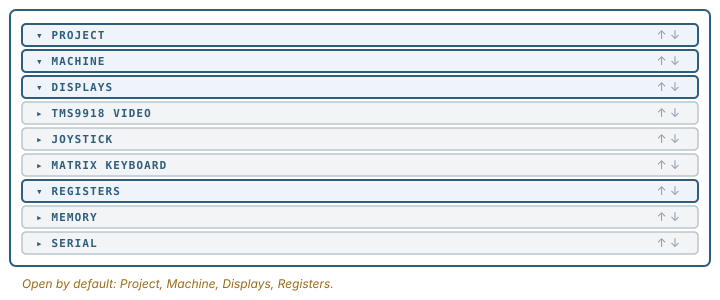
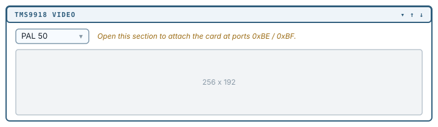
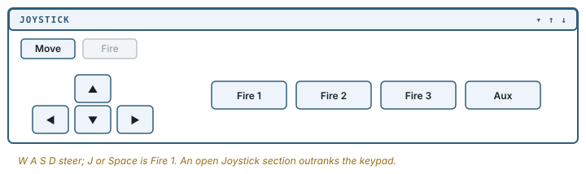
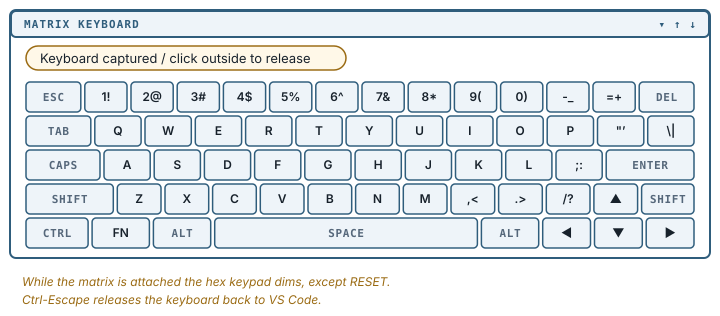
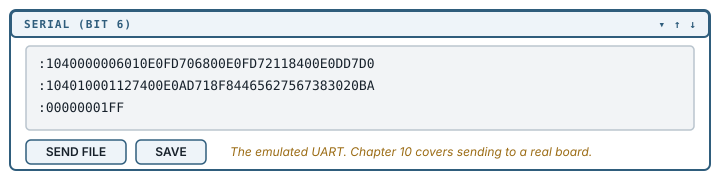

[← Source navigation and ROM source](07-source-navigation.md) | [Book 1](index.md) | [Send to TEC-1G hardware →](09-send-to-hardware.md)

# Video, input and serial

The Machine and Displays sections cover the TEC-1G as it comes. The rest of the panel covers what you can plug into it: a video card, a joystick, a full keyboard and a serial line.

## The sections, and their order

The TEC-1G panel has nine sections: Project, Machine, Displays, TMS9918 Video, Joystick, Matrix Keyboard, Registers, Memory and Serial. Project, Machine, Displays and Registers start open; the rest start closed.



Every header carries **↑** and **↓** buttons to move a section up or down, and the layout you end up with is remembered.

**Debug80: Reset Panel Layout** puts the default order and open state back. It does nothing on the Simple platform, which has no accordion.

Sections other than Project stay hidden until a debug session is running.

## TMS9918 Video

The **TMS9918 Video** section emulates the video card on the TEC-Deck expansion, which gives the TEC-1G a 256x192 display with sprites, driven from its own 16 KiB of video RAM.

Opening the section attaches the card at ports `0xBE` and `0xBF`. Closing it detaches.



A selector switches between **PAL 50** and **NTSC 60**, which changes the frame rate a program pacing itself on vertical blank will see.

## Joystick

The **Joystick** section emulates the TEC-1G joystick as a D-pad with **Fire 1**, **Fire 2**, **Fire 3** and an auxiliary button. Click them, or use the keyboard: `W`, `S`, `A` and `D` for the directions, `J` or `Space` for Fire 1, `I` for Fire 2, `K` for Aux, and `L` for Fire 3.



The arrow keys switch role with the **Move** and **Fire** toggle: in Move mode they steer, and in Fire mode they map to the four fire buttons. Switching modes drops any arrow key you are holding, so a held direction cannot leak through as a fire press.

When several input surfaces are eligible, the joystick outranks the hex keypad. Dead keypad input usually means an open Joystick section.

## Matrix Keyboard

The **Matrix Keyboard** section emulates the TEC-1G's full keyboard as a five-row QWERTY matrix. Click keys, or type once the matrix owns the keyboard.



While the matrix is attached the hex keypad is dimmed and does not accept clicks, with one exception: **RESET**, which stays live so you can always reset the machine.

A pill above the keypad tells you who currently owns physical keys and what to do about it:

```text
Keyboard captured / click outside to release
```

It also reports when the joystick has taken over, and when the keyboard has been released back to VS Code. **Ctrl-Escape** releases the matrix without reaching for the mouse.

On macOS, Command chords are deliberately not routed, so **Command-S** and **Command-P** stay VS Code shortcuts while the emulator has focus. Option chords are read from the physical key rather than the character macOS produces, so **Option-S** reaches the matrix as `S` rather than as `ß`.

## Serial

The **Serial** section is the emulated bit-banged UART (4800 baud on the TEC-1G, 9600 on the TEC-1). It shows what the running program has sent.



**SEND FILE** feeds a file into the emulated machine one character at a time, pacing itself so a program polling the port can keep up, and it can be cancelled while it runs. **SAVE** writes the captured buffer out, choosing a `.hex` extension when every line looks like Intel HEX.

This section talks to the *emulated* machine and never touches a physical port.

## Reset, and what survives it

**RESET** on the keypad resets the emulated machine. On the TEC-1G it also releases every held key, joystick direction and matrix key first, so nothing is stuck down across the reset, and it preserves the monitor's configuration state so MON-3 comes back up the way it went down.

Holding **FN** while pressing RESET latches the function key for the first keypad read after reset. That reproduces holding a key down while a real board boots, which is how MON-3's startup options are selected.

There is no NMI button. Non-maskable interrupts happen as a consequence of input: pressing a key raises one, and the video card raises one at vertical blank while it is attached. Releasing an input cancels an NMI that has not yet been taken.

---

[← Source navigation and ROM source](07-source-navigation.md) | [Book 1](index.md) | [Send to TEC-1G hardware →](09-send-to-hardware.md)
