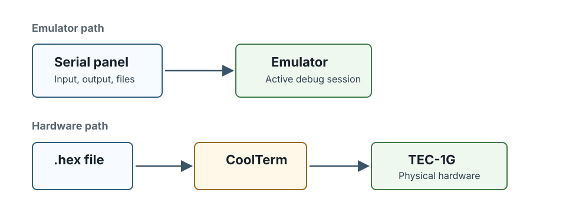

[← Video, input and serial](08-video-input-and-serial.md) | [Book 1](index.md) | [Appendix A — Debug expressions →](appendices/a-debug-expressions.md)

# Sending to TEC-1G hardware

Debug80 sends the active target's Intel HEX file to real hardware through CoolTerm. CoolTerm owns the serial port. Debug80 controls CoolTerm through its localhost Remote Control Socket.

## CoolTerm installation

CoolTerm is available from:

<https://freeware.the-meiers.org>

On macOS, the first launch may require approval in **System Settings > Privacy & Security**. You can also right-click CoolTerm in Finder, choose **Open** and confirm the launch.



## The Remote Control Socket

Under CoolTerm's **Preferences > Scripting**, **Remote Control Socket**
must be enabled on port `51413`.

The local IP shown in CoolTerm is informational.

## Serial port configuration

CoolTerm's **Connection > Options** selects the serial port for the USB
adapter, whose name depends on the adapter and operating system. This
workflow requires line settings of `4800 8 N 2`.

## Building and sending

With the correct project and target selected, **Build** creates the
required `.hex` file. This stage uses **Build** rather than **Run**
because the artifact, not the emulator, is required.

The **Test CoolTerm** action checks CoolTerm's remote control socket before a
transfer. It does nothing else: no port is opened and no build is needed. The
test therefore separates "CoolTerm is not reachable" from "the transfer
failed". On success Debug80 reports:

```text
Debug80: Connected to CoolTerm remote socket.
```

The TEC-1G must be in MON-3 Intel HEX Load mode before transmission.

**Send to TEC-1G** in the Project section starts the transmission.

The button's label follows the platform, so a TEC-1 project reads **Send to TEC-1** and anything else reads **Send to Board**. It is enabled once a target is selected and a HEX file exists; the panel's hardware status line displays any missing requirement:

```text
Ready to send main.hex via CoolTerm.
```

Debug80 does not read anything back from the board. MON-3 reports the load result on the TEC-1G seven-segment display: `PASS` for an accepted load, `ERROR` for a checksum or write verification failure.

If your target has no `outputDir`, the send path looks for the HEX beside `debug80.json` rather than in `build/`. Scaffolded projects always set `outputDir`, so this only bites hand-edited configs.

The serial startup message `TEC-1G Connected` belongs to MON-3 startup, not to the transfer.

## Transfer failures

The observed failure identifies which part of the path to inspect:

- If Debug80 cannot connect to CoolTerm, open CoolTerm and check that the Remote Control Socket is enabled on port `51413`.
- If Debug80 asks for a HEX file, build the active target.
- If the TEC-1G displays `ERROR`, check that the board is in Intel HEX Load mode and try the transfer again.
- If characters appear to be missed, add transmit delay in CoolTerm.

---

[← Video, input and serial](08-video-input-and-serial.md) | [Book 1](index.md) | [Appendix A — Debug expressions →](appendices/a-debug-expressions.md)
