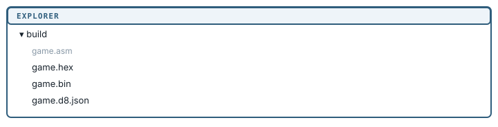

[← Copy monitor ROM source](10-copy-monitor-rom.md) | [Book 1](index.md) | [Appendix A — Debug expressions →](appendices/a-debug-expressions.md)

# Glimmer targets

So far you have written Z80 by hand. Debug80 builds one other kind of program: Glimmer, a reactive game language that compiles to readable Z80 assembly. The compiler ships inside the extension, so there is nothing extra to install.

The language itself belongs to the [Glimmer book](../../glimmer-book/book0/), which starts from an empty file and builds up to two complete games. What follows is only what Debug80 does with a `.glim` file.

## A Glimmer file is another target

A `.glim` file becomes a target the same way an assembly file does, with one extra condition: it must contain a top-level `program` declaration. A `.glim` file without one is a part of a program rather than a program, so Debug80 leaves it out of the target list.

Add one with **+** beside the **Target** dropdown, or run **Debug80: Add Target**. Everything from the Targets chapter applies unchanged - the same dropdown, the same **−** to remove, the same rule that `debug80.json` is the truth.

## What a Glimmer build produces

Select a Glimmer target and click **Build**. The output differs slightly from an assembly build:

```text
build/
  game.asm       the generated Z80 assembly
  game.hex       the program
  game.bin       the same bytes, raw
  game.d8.json   the source map
```



The extra file is `game.asm`. Glimmer compiles to assembly first and leaves the result where you can read it, so when you want to know what a declaration cost, you open it and count.

There is no `.lst` listing and no register-contracts report. Glimmer runs contract checking internally while it compiles, so those artifacts have nothing to add.

## Debugging Glimmer

Breakpoints, stepping and the source map all work on `.glim` files. Set a breakpoint inside a block body and the debugger stops there, in your Glimmer source, with the registers and memory views showing the Z80 underneath.

Step past the end of a block and you continue into the generated assembly, which is how you see the machinery a declaration produced. Both sides are one program, and you can step through either.

The editor features from the source-navigation chapter cover `.glim` too: Go to Definition, hover and workspace symbol search all work once a build is current.

## Strict labels and Glimmer

The **Strict labels** checkbox writes `azm.symbolCase` for the whole project, and it applies to the assembly Glimmer generates as much as to assembly you write. Generated code is consistent about capitalization, so leaving it on costs you nothing.

## Summary

- Debug80 builds `.glim` files as ordinary targets. The compiler ships in the extension.
- A `.glim` file needs a top-level `program` declaration to be eligible as a target.
- A Glimmer build adds the generated `.asm` beside the usual hex, binary and source map, and produces no listing or contracts report.
- Breakpoints and stepping work in `.glim` source; stepping past a block continues into the generated assembly.
- The language itself is the subject of the [Glimmer book](../../glimmer-book/book0/).

Appendix B lists every command, Appendix C every field of `debug80.json`, and Appendix D the assembler settings in the panel.

---

[← Copy monitor ROM source](10-copy-monitor-rom.md) | [Book 1](index.md) | [Appendix A — Debug expressions →](appendices/a-debug-expressions.md)
