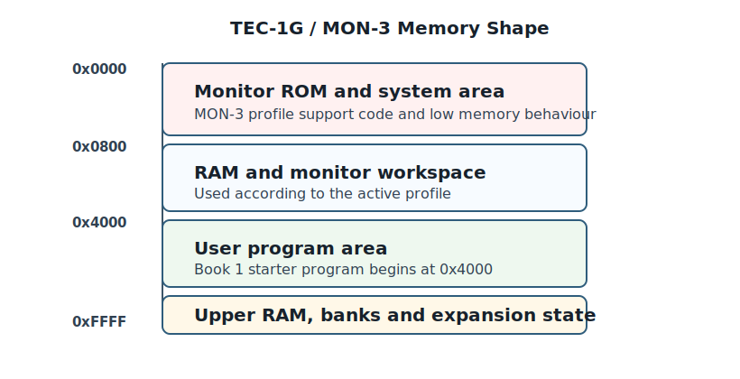

# Appendix E — TEC-1G Quick Reference

This appendix collects the TEC-1G facts used in Book 1. It is a quick reference for the Debug80 panel and MON-3 profile, not a full hardware manual.

## MON-3 Memory Shape

The TEC-1G / MON-3 profile places user code at:

```text
0x4000
```

The emulator also models monitor ROM, RAM, expansion memory and system-control state. The panel exposes important state through labels such as **SHADOW**, **PROTECT**, **EXPAND** and **CAPS**.



## Panel Sections

| Section | Shows |
|---|---|
| Project | Folder, target, launch options, build state and board transfer. |
| Displays | GLCD, RGB matrix, system LEDs and memory expansion indicators. |
| Machine | LCD, seven-segment display and keypad. |
| Matrix Keyboard | Matrix keyboard mode, modifiers and key grid. |
| Serial | Emulated serial input, output, file send, save and clear. |
| Registers | Z80 register state. |
| Memory | Memory views around registers or an absolute address. |

## Serial Settings For Hardware Transfer

Use these CoolTerm settings for the TEC-1 monitor workflow:

```text
4800 baud
8 data bits
No parity
2 stop bits
```

Add the exact TEC-1G / MON-3 receive-mode sequence after hardware testing or author confirmation.

## Common Debugging Clues

If the panel display changes while stepping, the program is writing the corresponding I/O ports.

If the editor highlights ROM source, execution has entered monitor code.

If a memory write appears to vanish, check whether the program is writing a ROM-protected region or whether the visible panel state depends on a banked memory setting.
