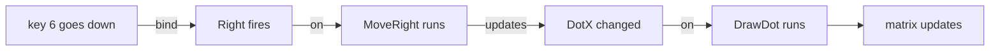

[Book](index.md)

# Chapter 1 - The Shape of a Game

Strip any game down to its working parts and you find four kinds of thing.
Facts the program remembers: where the player is, what the score says.
Moments that arrive from outside: a key goes down. Rules: when this moment
arrives, change that fact. And pictures: what the player sees, drawn from
the facts.

Glimmer is a language for writing games as exactly those four kinds of
thing. You declare the facts, the moments, and the connections between
them; you write the rules and the pictures as small blocks of Z80
assembly; and Glimmer builds the running program around your
declarations.

And Glimmer keeps you close to the machine while you do it. The
language inside every block is Z80 assembly itself: the real
instruction set, the real registers, the real flags. The declarations
around the blocks form a thin layer in front of the assembler. They say
what state to reserve, which inputs to poll, and when each block of
your assembly runs; from them Glimmer writes out one ordinary
assembly-language source file with your blocks inside it, and the
assembler takes it from there. Whenever you are curious, you can open
that file and read what every declaration became. Learning Glimmer is
learning a way of organising Z80 assembly you already know how to
write.

This chapter teaches the shape of a Glimmer game through three tiny
programs, each one step up from the last. You will read them here and run
them in chapter 2, once the tools are installed.

The machine is the TEC-1G, a Z80 single-board computer with a hex keypad
and an 8x8 RGB LED matrix. The game grows from one lit pixel to a dot you
steer with the keypad.

## A dot appears

Here is a complete Glimmer program. It lights one white pixel in the
middle of the matrix.

```text
program Mover

platform tec1g-mon3
display matrix8x8

state DotX : byte = 3 changed

render DrawDot
    on DotX
begin
    ld a,(DotX)
    ld b,a          ; B = x
    ld c,3          ; C = y, the middle row
    ld a,COLOR_WHITE
    call FbPlot
end
```

The file extension is `.glim`. Walk it from the top.

`program Mover` names the program. `platform tec1g-mon3` and
`display matrix8x8` pick the hardware: a TEC-1G running the MON-3
monitor, drawing on the 8x8 matrix. Those two lines give the program its
keypad, its display, and a small library of drawing helpers.

```text
state DotX : byte = 3 changed
```

A `state` declaration creates a fact: a named variable the program
remembers between frames. Glimmer declarations read aloud as English
sentences, and this one reads *DotX is a byte, starting at 3, already
changed*. The word `changed` matters shortly.

```text
render DrawDot
    on DotX
begin
    ...
end
```

A `render` block draws a picture from facts. The header carries its name
and one more line: `on DotX` declares *why this block runs* - on any
frame where `DotX` changed. Between `begin` and `end` sits ordinary Z80,
which you already read fluently: load the x position into B, the row
into C, the colour into A, and call `FbPlot`, one of the helpers the
display choice provides. Everything between `begin` and `end` is real
assembly; Glimmer adds nothing of its own inside a block.

Now, what happens when this runs. A Glimmer program spends its life in
**frames**. Every frame, the program checks which facts changed and runs
the blocks that declared an interest in them, then shows the result.
`DotX` was declared `changed`, so on the very first frame `DrawDot` runs
and the pixel appears. From the second frame on, `DotX` sits still, so
`DrawDot` rests - and the matrix keeps glowing, because showing the
current picture is the program's own job, every frame, forever.

One fact, one picture, one connection between them: `on DotX`. That
connection is the idea the whole language grows from.

## The dot responds

A game listens. Next step: pressing key 6 nudges the dot to the right.

```text
program Mover

platform tec1g-mon3
display matrix8x8

state DotX : byte = 3 changed

pulse Right

bind key KEY_6 rising -> Right

effect MoveRight
    on Right
    updates DotX
begin
    ld a,(DotX)
    cp 7
    jr nc,_stop     ; at the right edge: stay
    inc a
    ld (DotX),a
_stop:
end

render DrawDot
    on DotX
begin
    call FbClear
    ld a,(DotX)
    ld b,a          ; B = x
    ld c,3          ; C = y, the middle row
    ld a,COLOR_WHITE
    call FbPlot
end
```

Three new declarations arrived. Take them in order.

```text
pulse Right
```

A `pulse` is a moment given a name: a fact that holds for exactly one
frame and then clears itself. Where a `state` cell remembers, a pulse
announces.

```text
bind key KEY_6 rising -> Right
```

A `bind` connects an input to the pulse it fires. The arrow always
points from the event's source to the pulse. `rising` means the pulse
fires on the frame the key first goes down - one press, one pulse.

```text
effect MoveRight
    on Right
    updates DotX
```

An `effect` block is a rule. Its header answers two questions: `on
Right` says why it runs - on any frame where `Right` fired - and
`updates DotX` says what it changes. The body is the rule itself, in
plain Z80: step right, and at column 7 stay put. The edge of the world
is part of the rule, written where the rule lives.

`DrawDot` gained one line, `call FbClear`, because the dot now moves:
each redraw starts from a clean framebuffer and plots the dot at its
current place.

Now trace one keypress through the program:



Written flat, the same chain:

```text
something changed
the block that depends on it runs
the output updates
```

You have met this shape before, in a spreadsheet. Change one cell and
the formulas that reference it recompute, then the sheet in front of you
updates. You write the formulas; the spreadsheet decides when to run
them. A program built this way is called **reactive**, and in a Glimmer
program the chain is readable straight off the page: `bind ... ->
Right`, `on Right`, `updates DotX`, `on DotX`.

Each block stays about its own business. `MoveRight` never mentions
drawing; `DrawDot` never mentions keys. The declarations connect them,
which means you can read any block on its own and read the whole game's
design from the headers.

## Holding a key down

Pressing key 6 five times to cross the screen is keying, and a game
wants steering: hold the key, the dot keeps moving. In the `bind` line,
`rising` becomes `held period 8`:

```text
bind key KEY_6 held period 8 -> Right
```

A `held` binding fires on the first press, then fires again every 8
frames for as long as the key stays down. Movement at a playable pace,
declared in one line. Tune the feel by changing the number.

Add the matching key and rule for leftward travel, and the program is
whole:

```text
program Mover

platform tec1g-mon3
display matrix8x8

state DotX : byte = 3 changed

pulse Left
pulse Right

bind key KEY_4 held period 8 -> Left
bind key KEY_6 held period 8 -> Right

effect MoveLeft
    on Left
    updates DotX
begin
    ld a,(DotX)
    or a
    jr z,_stop      ; at the left edge: stay
    dec a
    ld (DotX),a
_stop:
end

effect MoveRight
    on Right
    updates DotX
begin
    ld a,(DotX)
    cp 7
    jr nc,_stop     ; at the right edge: stay
    inc a
    ld (DotX),a
_stop:
end

render DrawDot
    on DotX
begin
    call FbClear
    ld a,(DotX)
    ld b,a          ; B = x
    ld c,3          ; C = y, the middle row
    ld a,COLOR_WHITE
    call FbPlot
end
```

Read it top to bottom, aloud: *Mover, on the TEC-1G, drawing on the
matrix. DotX is a byte, starting at 3, already changed. Two moments,
Left and Right. Key 4 held fires Left every 8 frames; key 6 held fires
Right. On Left, MoveLeft updates DotX. On Right, MoveRight updates DotX.
On DotX, DrawDot.* The declarations are the design; the blocks are the
craft. A stranger to the Z80 could read the headers and tell you what
this game does, and a Z80 programmer can read any single block and know
everything it touches.

The two small labels inside the blocks deserve a word: labels beginning
with `_` are local to their block, so `MoveLeft` and `MoveRight` can
each have their own `_stop`. Blocks fall through their last line -
Glimmer supplies the return.

## The program behind the program

A `.glim` file is source code, and Glimmer is its compiler - a compiler
whose output is assembly language. From the 47 lines of `mover.glim` it
writes one ordinary AZM assembly file of 487 lines, containing
everything the running game needs: the frame loop, the keypad polling,
the held-key timing, the change tracking, and your blocks inside it.
Three excerpts from that file show what the declarations became.

The state:

```asm
; --- state storage ---
DotX:             .db 3
Left:             .db 0
Right:            .db 0
Changed0:         .db %00000001   ; flags dispatch tests
```

`state DotX : byte = 3` became a labelled byte holding 3, and each
pulse became a byte of its own. `Changed0` is the change tracking
itself: one bit per fact, and bit 0 - DotX's bit - starts set. That is
the word `changed` from the declaration, doing its work before the
first frame.

The loop:

```asm
; --- runtime loop ---
Start:
        call    FbClear
        call    HudBlankDig
MainLoop:
        call    ScanFrame            ; show one full frame, then blank
        call    GlimPollBindings     ; game work runs in the blank window
        call    GlimRunLogicEffects
        call    GlimMergeRaised
        call    GlimRunRenderEffects
        call    GlimEndFrame
        jp      MainLoop
```

Read it top to bottom and it is this chapter's frame, spelled out: show
the picture, poll the keys, run the rules whose facts changed, draw
what changed, tidy up, go again. Every routine it calls is further down
in the same file, in the same plain assembly.

And your own code:

```asm
; --- logic block MoveRight ---
.routine
Glim_MoveRight:
    ld a,(DotX)
    cp 7
    jr nc,_stop     ; at the right edge: stay
    inc a
    ld (DotX),a
_stop:
        ld      a,(Raised0)          ; deliver to later phases this frame
        or      CHG_DOTX
        ld      (Raised0),a
        ret
```

The body you wrote sits at the centre, spacing and comments exactly as
you typed them. Around it, the wrapping: a label so the dispatcher can
call the block, and after `_stop:`, three generated instructions that
set DotX's change bit - the line `updates DotX`, compiled. The
`.routine` directive above the label hands the block to AZM's
register-contract checking, a safety net the book returns to when
programs grow larger.

This file assembles to the bytes the Z80 executes, and you can open
it, follow it, and step through it with a debugger whenever you want
to see a declaration's whole story. Chapter 2 does all three.

So the division of labour, for this program and for every program in
this book: **Glimmer owns the loop, and you own the behaviour.** The
frames, the polling, the timing, and the bookkeeping come from your
declarations. The rules and the pictures are yours, in real Z80, each a
few lines with one job and a declared reason to run.

## Summary

- A game is facts, moments, rules, and pictures. Glimmer programs
  declare them directly: `state`, `pulse` and `bind`, `effect`, and
  `render`.
- A Glimmer program runs in **frames**: each frame, blocks whose `on`
  facts changed get to run, and the display shows the result.
- Block headers carry the connections: `on` says why a block runs,
  `updates` says what it changes. Bodies are ordinary Z80, verbatim.
- `changed` on a state declaration marks the fact changed before the
  first frame, which is how a program draws itself at startup.
- A `rising` binding fires once per press; `held period N` fires on the
  press and every N frames while the key stays down.
- The reactive chain reads off the page: something changed, the block
  that depends on it runs, the output updates.
- Glimmer compiles the whole program to one readable AZM assembly file,
  with your blocks inside byte for byte.

Next, you install the tools, build this program, and steer the dot
yourself: [First Light]. *(Chapter 2 lands here when drafted.)*

---

[Book](index.md)
