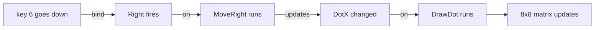

[← Preface](00-preface.md) | [Book](index.md) | [First Light →](02-first-light.md)

# Chapter 1 - The Shape of a Game

Glimmer is a new way to write games for old machines. It takes
techniques from reactive programming, a school of thought the
computing world needed forty years to arrive at, and time-travels
them back to the age of the Z80. You describe the game - what it
remembers, what it responds to, what follows, and what it shows - and
Glimmer builds the running program around your description. That is
the subject of this book, and before we start, here is what I assume
about you: you already read assembly. You can
follow a `ld a,(hl)` and a conditional jump without slowing down, so
you know the pleasure of this machine - nothing between you and the
metal, every byte where you put it. And you know, or you can guess,
where the pain lives. A game never stops asking things of you.
Watch the keys. Keep the display alive. Move that, count this, redraw
the other, every frame, in the right order, forever. The game itself -
the rules, the fun part - ends up buried inside a heap of plumbing,
and the plumbing is nearly the same in every game you will ever write.

The pain has a name. The way we have always programmed these machines
is called *imperative*: the program is a list of orders - do this,
then this, then check that - and seeing that every order lands at the
right moment, frame after frame, is your job and nobody else's.
Reactive programming turns the arrangement around. You write down how
the program should respond when things happen, and machinery does the
watching. The idea took four decades of user interfaces and games to
take shape, generation after generation discovering the same truth:
almost everything an interactive program does is a *reaction*. A key
goes down, so the player moves. A timer runs out, so the block drops.
The score changes, so the display updates. These are ideas from the
future of this machine - they had to be discovered elsewhere, slowly,
before anyone could carry them home to it - and none of them is
exotic. If you have ever used a spreadsheet, changed one cell and
watched every formula that mentions it follow, you have felt the
model in your hands. That feeling is most of the theory, and the rest
is small enough for one chapter.

So Glimmer lets you write the game as reactions, in the
preface's four words. You declare the facts your game remembers, you
name the moments it must respond to, and you write the rules and the
pictures as a few lines of real Z80 each, with a label saying when
they should run. Then Glimmer builds the machinery around them - the
loop, the key scanning, the timing, the change-tracking - and calls
your code at exactly the moments you declared. That inversion is the whole trick. You stop orchestrating
and start declaring, and the plumbing stops being your problem.

Now, I know what a Z80 programmer thinks when someone offers to
generate code for them, because I think it too: *what is this thing
hiding from me?* Here is Glimmer's answer, and it is the reason I like
the system enough to write a book about it. The language inside every
rule is Z80 assembly itself - the real instruction set, the real
registers, the real flags. The declarations are a thin layer in front
of the assembler, and what comes out is one ordinary assembly-language
source file with your code inside it, which you can open, read, and
step through whenever you want to know what a declaration cost you.
Nothing is hidden; it is only *organised*. Everything you know about
the Z80 carries straight in.

Our machine is the TEC-1G, a Z80 single-board computer with a hex
keypad and an 8x8 RGB LED matrix - sixty-four pixels, each one
mixing red, green and blue. Small, yes. But I promise you that by the end of
this book those sixty-four pixels will be running complete games, and
you will move on from them to a proper video chip with sprites. In
this chapter we start where every journey on new hardware should
start: we are going to put one dot on the 8x8 matrix and make it obey
you. I will show you the program in three small steps, and you will
run all three yourself in chapter 2, once we have the tools installed.

## A dot appears

Here is a complete Glimmer program - the whole file, nothing left out.
It lights one white pixel in the middle of the 8x8 matrix.

```text
program Mover

platform tec1g-mon3
display matrix8x8

state DotX : byte = 3 changed

render DrawDot
    on DotX
begin
    ld a,(DotX)
    ld b,a          ; B = x
    ld c,3          ; C = y, the middle row
    ld a,COLOR_WHITE
    call FbPlot
end
```

Twelve lines that matter, and you can already read half of them. Let
me walk you through the other half, top to bottom.

`program Mover` names the program. `platform tec1g-mon3` and
`display matrix8x8` tell Glimmer what hardware we are aiming at: a
TEC-1G running the MON-3 monitor, drawing on the 8x8 matrix. These two
lines buy you a lot - the keypad wiring, the display driver, and a
small library of drawing helpers all come from this choice, and we
will meet them as we need them.

```text
state DotX : byte = 3 changed
```

This is our first *fact*: a named variable that the program remembers.
Pick up one habit immediately, because it will serve you
for the whole book: Glimmer declarations are built to be read aloud.
Try this one - "DotX is a byte, starting at 3, already changed." Every
declaration in the language passes that test, and whenever you are
unsure what a line means, saying it out loud is the fastest way to
find out. That word `changed` at the end is doing something important,
and I will come back to it in a moment.

```text
render DrawDot
    on DotX
begin
    ...
end
```

And here is our first *rule* - Glimmer calls them blocks. A `render`
block is where we turn memory into light. Its header carries two
things: a name, and the line `on DotX`, which answers the question
every block must answer - *when should this code run?* This one runs
on any frame where `DotX` changed. Between `begin` and `end` you are
back on home ground: load the x position into B, the row into C, the
colour into A, and call `FbPlot`, one of those helpers the display
choice gave us. Everything between `begin` and `end` is real assembly,
passed through untouched. Glimmer adds no syntax of its own inside a
block - that space belongs to you and the Z80.

So what actually happens when this program runs? A Glimmer program
lives its life in **frames**. Every frame, the machinery checks which
facts changed and runs the blocks that declared an interest in them,
then shows the result and goes round again. That is where `changed`
earns its keep: it marks `DotX` as already changed *before the first
frame*, so `DrawDot` runs once at startup and our pixel appears.
Without it, the program would sit there with a dark screen, politely
waiting for a change that never comes - a mistake you will make
exactly once, and then never again. From the second frame on, `DotX`
holds still, so `DrawDot` rests. The pixel stays lit because keeping
the display alive is the machinery's job, not yours.

One fact, one rule, and one declared connection between them: `on
DotX`. That connection is the seed the entire language grows from.

## The dot responds

A pixel that ignores you is scenery. We are making a game, so the next
step is obvious: when you press key 6, the dot should move right. Here
is the program again with that ability added - three new declarations
and one new block.

```text
program Mover

platform tec1g-mon3
display matrix8x8

state DotX : byte = 3 changed

pulse Right

bind key KEY_6 rising -> Right

effect MoveRight
    on Right
    updates DotX
begin
    ld a,(DotX)
    cp 7
    jr nc,_stop     ; at the right edge: stay
    inc a
    ld (DotX),a
_stop:
end

render DrawDot
    on DotX
begin
    call FbClear
    ld a,(DotX)
    ld b,a          ; B = x
    ld c,3          ; C = y, the middle row
    ld a,COLOR_WHITE
    call FbPlot
end
```

Let me introduce the newcomers in the order they appear, because each
one exists to answer a question the previous one raises.

```text
pulse Right
```

A keypress is a different kind of thing from a position. `DotX` is a
fact that persists - it outlives every frame that draws it. A press of
key 6 is a *moment*: it happens, and then it is gone, and if the
program does not catch it, it never happened at all. Glimmer gives
moments their own declaration, the **pulse**. A pulse is a fact that
holds for exactly one frame and then clears itself. Where a state cell
remembers, a pulse announces.

```text
bind key KEY_6 rising -> Right
```

The **bind** line is the wire from the physical world to your pulse.
Read the arrow the way it points: key 6, on a new press, fires
`Right`. The word `rising` means the pulse fires on the frame the key
first goes down - one press, one pulse, however long you hold the key.
We will want a different behaviour for movement soon, and Glimmer has
one waiting, but rising is the shape to learn first because it is the
shape of every clean button press in every game: fire, rotate, start.

```text
effect MoveRight
    on Right
    updates DotX
```

And here is the rule that gives the moment its meaning. When I say
rule, I mean something specific, and the word keeps this meaning for
the whole book: a rule is a decision the game makes when a moment
arrives. The `effect` block is where rules live. Its header answers two questions this
time: `on Right` - run on any frame where `Right` fired - and
`updates DotX` - this block *changes* that fact, so everyone watching
`DotX` should hear about it. The body is your Z80 again, and the
edge of the world is in there with it: `cp 7`, and at column 7 we
stay put. The rule about where the dot may
go lives inside the rule that moves it, written by you, in
instructions you can count. Glimmer decides *when* your code runs; it
never decides *what* your code does.

`DrawDot` picked up one new line, `call FbClear`, for a reason you can
guess: the dot moves now, so each redraw starts from a clean
framebuffer and plots the dot where it currently is. Old position
gone, new position lit.

Now comes the moment the whole model clicks. Follow one press of
key 6 with me, through the program:



Something changed; the code that depends on it ran; the output
updated. This is the spreadsheet from the start of the chapter,
caught in the act. Change one cell and the formulas that reference it
recompute, and the sheet in front of you updates. You never call a
formula; you write it, and the spreadsheet works out when it must
run. Here the same idea is running on a Z80, and the reason I am
teaching you Glimmer rather than any other way of building Z80 games
is sitting right there in the source: the whole chain is readable off
the page. `bind ... ->
Right`, `on Right`, `updates DotX`, `on DotX`. Four declarations, and
you can trace the route from keypress to pixel with a finger.

A quieter consequence follows, and it will matter more and more as
our programs grow. `MoveRight` never mentions drawing. `DrawDot`
never mentions keys. Each block minds its own business, and the
declarations do the connecting. That means you can read any block on
its own and understand it completely - and you can read a program's
whole design from its headers without touching a line of assembly.
When we get to programs with thirty blocks, that property is the
difference between a codebase and a haystack.

## Holding a key down

Play the game we have so far in your head. To cross the screen, you
press key 6 seven times. That is data entry, not steering. What we
want is the arcade behaviour: hold the key, the dot keeps moving. In
most systems that means writing a repeat timer - a counter you arm,
decrement, test and reload, with edge cases on press and release. In
Glimmer, look at what it costs:

```text
bind key KEY_6 held period 8 -> Right
```

One word and one number. A `held` binding fires on the first press,
then fires again every 8 frames for as long as the key stays down.
That period is the *feel* of your controls - drop it to 4 and the dot
sprints, raise it to 15 and the dot trudges - and tuning it is editing
one digit. The repeat machinery you would have hand-built is still
there, of course; Glimmer writes it for you, and later in this chapter
I will show you exactly where it lives so you can see there is no
magic in it.

Add the mirror-image key and rule for leftward travel, and our little
program is complete:

```text
program Mover

platform tec1g-mon3
display matrix8x8

state DotX : byte = 3 changed

pulse Left
pulse Right

bind key KEY_4 held period 8 -> Left
bind key KEY_6 held period 8 -> Right

effect MoveLeft
    on Left
    updates DotX
begin
    ld a,(DotX)
    or a
    jr z,_stop      ; at the left edge: stay
    dec a
    ld (DotX),a
_stop:
end

effect MoveRight
    on Right
    updates DotX
begin
    ld a,(DotX)
    cp 7
    jr nc,_stop     ; at the right edge: stay
    inc a
    ld (DotX),a
_stop:
end

render DrawDot
    on DotX
begin
    call FbClear
    ld a,(DotX)
    ld b,a          ; B = x
    ld c,3          ; C = y, the middle row
    ld a,COLOR_WHITE
    call FbPlot
end
```

Before we look under the hood, do one thing for me. Read this file
from the top, out loud, the way I showed you: "Mover, on the TEC-1G,
drawing on the 8x8 matrix. DotX is a byte, starting at 3, already changed.
Two moments, Left and Right. Key 4 held fires Left every 8 frames; key
6 held fires Right. On Left, MoveLeft updates DotX. On Right,
MoveRight updates DotX. On DotX, DrawDot." You have recited the
entire design of a working piece of software. The declarations are the
design; the blocks are the craft. Show the headers to someone who has
never seen a Z80 and they could tell you what this game does. Show any
single block to a Z80 programmer and they know everything it touches.

Two small mechanical notes about those blocks, and then the best part.
Labels that start with an underscore, like `_stop`, are local to their
block - both movement rules own a `_stop` of their own without
quarrelling. And blocks fall off their last line - Glimmer supplies
the return, so you write the work and skip the ceremony.

## The program behind the program

A `.glim`
file is source code, and Glimmer is its compiler - a compiler whose
output is assembly language. From the 47 lines of `mover.glim` it
writes one ordinary Z80 assembly file of 487 lines that contains the
entire running game: the frame loop, the keypad polling, the held-key
timing, the change tracking, and your blocks inside it. Here are three
excerpts from that file, so you can see your own declarations looking
back at you.

The state:

```asm
; --- state storage ---
DotX:             .db 3
Left:             .db 0
Right:            .db 0
Glim_HeldKey:     .db $FF
Glim_HeldCount:   .db 0
Changed0:         .db %00000001   ; flags dispatch tests
```

There is `state DotX : byte = 3` - a labelled byte holding 3, exactly
what you would have written yourself. Each pulse is a byte too, and
the two `Glim_` cells under them are the held-key repeat clock,
written for you. And
`Changed0` is the change tracking we have been talking about all
chapter, revealed as one humble byte: one bit per fact, and bit 0 -
DotX's bit - starts set. That is the word `changed` from your
declaration, compiled into a single 1.

The loop:

```asm
; --- runtime loop ---
Start:
        call    FbClear
        call    HudBlankDig
MainLoop:
        call    ScanFrame            ; show one full frame, then blank
        call    GlimPollBindings     ; game work runs in the blank window
        call    GlimRunLogicEffects
        call    GlimMergeRaised
        call    GlimRunRenderEffects
        call    GlimEndFrame
        jp      MainLoop
```

Read it top to bottom and you are reading this chapter again, in
assembly: show the picture, poll the keys, run the rules whose facts
changed, draw what changed, tidy up, go round again. Every routine it
calls sits further down in this same file, in this same plain style,
and you can follow any of them to the end.

And your own code:

```asm
; --- logic block MoveRight ---
.routine
Glim_MoveRight:
    ld a,(DotX)
    cp 7
    jr nc,_stop     ; at the right edge: stay
    inc a
    ld (DotX),a
_stop:
        ld      a,(Raised0)          ; deliver to later phases this frame
        or      CHG_DOTX
        ld      (Raised0),a
        ret
```

In the middle of that sits your own work: your body, your spacing,
your comment - copied in byte for byte, down to the indentation. Around it, Glimmer's
wrapping: a label so the dispatcher can call your rule, and after
`_stop:`, three generated instructions that set DotX's change bit.
That is the line `updates DotX`, compiled - you declared what the
block changes, and this is the machinery telling everyone who watches
`DotX` that news arrived. The `.routine` directive above it enrols the
block in the assembler's register-contract checking, a safety net we
will lean on properly when our programs get bigger.

This file assembles to the bytes the Z80 executes. You can open it,
follow it, and step through it with a debugger whenever you want the
whole story of a declaration - and in the next chapter, you will.

So here is the deal Glimmer offers, and it holds for every program in
this book: **Glimmer owns the loop, and you own the behaviour.** The
frames, the polling, the timing and the bookkeeping are generated from
your declarations, in the open, where you can audit every byte. The
rules and the pictures are yours, in real Z80, each a few lines with
one job and a declared reason to run. Your evenings go to the game.

## Summary

- A game is a loop of **frames**: read input, apply rules, show the
  result, repeat.
- Facts are `state` cells; moments are `pulse`s; `bind` wires a key to
  a pulse; `effect` blocks hold the rules; `render` blocks turn facts
  into light.
- Block headers say when code runs (`on`) and what it changes
  (`updates`). Bodies are your own Z80, passed through verbatim.
- `changed` marks a fact as changed before the first frame - that is
  how a program draws itself at startup.
- `rising` fires once per press; `held period N` autorepeats every N
  frames. Control feel is a number you edit.
- The reactive chain - something changed, the dependent block runs,
  the output updates - is readable straight off the page, from `bind`
  to `on` to `updates` to `on`.

Enough reading over my shoulder. In the next chapter you install the
tools, build a program of your own, and press its keys yourself:
[First Light](02-first-light.md).

---

[← Preface](00-preface.md) | [Book](index.md) | [First Light →](02-first-light.md)
