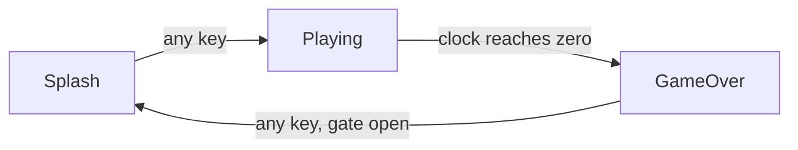

[← Routines, Parts and Imports](12-routines-parts-and-imports.md) | [Book](index.md) | [A Small Matrix Game →](14-a-small-matrix-game.md)

# Chapter 13 - Cards

A game is at least three programs. The title screen blinks an
invitation and waits for a key; it holds no rules and keeps no score.
The play screen is the game itself: rules, clock, score. The game-over
screen shows the result, then waits to offer another round. Three sets
of facts on display, three sets of rules, three pictures - and at any
instant, exactly one of the three is running.

In every program you have written so far, every block is in play on
every frame. Holding all three screens in one file that way calls for
a Mode fact and the same test at the top of every body: *am I the
screen that owns this block?* This chapter's game has thirteen blocks,
which would mean thirteen copies of that test - and the headers, the
design you read off the page, would say nothing about which screen
owns what.

Glimmer's word for a screen or mode is a **card**, from HyperCard:
exactly one card is active at a time. You declare a card in one line,
every declaration after that line belongs to it, and blocks in a
card's section run only while their card is active. The mode test
moves out of the bodies and into the shape of the file.

## Gate

The chapter's game is Gate. At the splash, two pixels blink in the
middle of the matrix; any key starts a round. A round is 512 frames on
a clock drawn as a shrinking green bar, and every press of GO scores a
point on the seven-segment display. When the clock drains, the score
appears as a red bar, and after a ninety-frame pause any key returns
to the splash.



The game is one file, `gate.glim`, and this chapter walks it top
to bottom. It opens above any `card` line, and everything declared
there is global - owned by no card, alive on all of them:

```text
program Gate

platform tec1g-mon3
display matrix8x8

state Score    : byte
state PromptOn : byte
state Armed    : byte

pulse AnyKeyP
pulse HitP
pulse BlinkTick
pulse TimeUp
pulse GateOpenP

timer Blink       : byte = 16 -> BlinkTick
timer PlayClock   : word = 0  -> TimeUp once
timer RestartGate : word = 0  -> GateOpenP once

bind key any    rising -> AnyKeyP
bind key KEY_GO rising -> HitP
```

Every declaration here is chapter 4 and chapter 7 material. `Blink`
is an oscillator, ticking every 16 frames for the life of the program.
`PlayClock` and `RestartGate` are one-shot timers holding zero: idle
until a block writes them, and the blocks that write them arrive with
their cards. The two bindings overlap on purpose - a press of GO fires
both `HitP` and `AnyKeyP`, as chapter 4 said `bind key any` would -
and the cards below sort out who listens.

## A card is a section

The first `card` line follows the globals, and the splash screen is
everything from that line to the next one:

```text
card Splash

enter ShowSplash
    updates PromptOn
begin
    call FbClear
    call HudBlankDig
    ld a,1
    ld (PromptOn),a
end

effect BlinkPrompt
    on BlinkTick
    updates PromptOn
begin
    ld a,(PromptOn)
    xor 1
    ld (PromptOn),a
end

render DrawPrompt
    on PromptOn
begin
    call FbClear
    ld a,(PromptOn)
    or a
    jr z,_done
    ld b,3
    ld c,3
    ld a,COLOR_WHITE
    call FbPlot
    ld b,4
    ld c,3
    ld a,COLOR_WHITE
    call FbPlot
_done:
end

effect StartGame
    on AnyKeyP
    goto Playing
end
```

`card Splash` is the entire declaration: one line, no `begin`, no
body. It starts a section, and the section runs until the next `card`
line - or the end of the file, for the last card.

Every block in the section is **card-gated**: it dispatches only
while Splash is the active card. `BlinkTick` fires every 16 frames
forever, and `BlinkPrompt` answers it only at the splash; during a
round the same tick fires, finds no active listener, and clears at
frame end like any pulse. The block's position in the file is its
entire mode test.

The three `card` lines also generate two names you can use in code.
`Card` is an AZM enum - `Card.Splash`, `Card.Playing`,
`Card.GameOver` - and `CurrentCard` is a built-in byte cell, a fact
like any other, legal in `on` and `updates`. It starts at the first
declared card, which makes Splash the start card, and it starts marked
changed, so frame one delivers it. What consumes that delivery is the
block at the top of the section.

## Arriving on a card

`ShowSplash` is an `enter` block: it runs once, on the frame its
card becomes active. It carries no `on` line - arriving is the
trigger - and it dispatches
ahead of the card's other blocks in its phase, so the card is set up
before any of its rules run. It takes `updates`, and it may take
`goto`.

`ShowSplash` prepares a clean screen: clear the framebuffer, blank the
seven-segment digits (`HudBlankDig` is the display's counterpart to
`FbClear`), and set `PromptOn`. The `updates` line delivers `PromptOn`
to the render phase the same frame - the chapter 5 rule - so the
prompt is lit on the very first frame of the card, with the blink
timer taking over from there.

Entry is edge-triggered: an enter block runs when the program
*changes* to its card. Frame one counts - the start card is entered
like any other - and so does every later return, so each trip back
from the game-over screen repaints a fresh splash. The generated code
that detects the edge closes this chapter.

## Leaving a card

```text
effect StartGame
    on AnyKeyP
    goto Playing
end
```

`goto` in a block header is an unconditional transition: after the
block runs, the program switches to the named card. `StartGame` has
nothing else to do, and with `goto` in the header, `begin` is
optional - a header-only routing block closes directly with `end`.
Three lines of header are the whole "press any key" pattern chapter 4
promised: a `bind key any`, a pulse, and a card transition.

A `goto` compiles to an update of `CurrentCard`, and exactly when the
switch lands earns its own section, once all three cards are on the
page.

## The round

```text
card Playing

enter StartRound
    updates Score, PlayClock
begin
    xor a
    ld (Score),a
    ld hl,512           ; the round: 512 frames on the clock
    ld (PlayClock),hl
end

effect ScorePoint
    on HitP
    updates Score
begin
    ld a,(Score)
    inc a
    ld (Score),a
end

render ShowScore
    on Score
begin
    ld a,(Score)
    ld l,a
    ld h,0
    call HudWriteU16
end

render DrawClock
    on FrameCount
begin
    call FbClear
    ld hl,(PlayClock)
    add hl,hl
    add hl,hl           ; HL * 4: frames-left / 64 lands in H
    ld a,h              ; A = bar pixels, 8 down to 0
    or a
    jr z,_done
    ld b,a
_col:
    push bc
    ld a,b
    dec a
    ld b,a              ; B = x for this pixel
    ld c,3              ; C = y, the middle row
    ld a,COLOR_GREEN
    call FbPlot
    pop bc
    djnz _col
_done:
end

effect EndRound
    on TimeUp
    goto GameOver
end
```

`StartRound` zeroes the score and arms the clock, and arming on entry
is the point. Declare `PlayClock : word = 512` instead, and the
countdown spends itself while the splash blinks: `TimeUp` fires into a
frame where no active block listens, the clock settles at zero, and
the round that eventually starts has no end. Armed by the enter block,
the countdown lives inside the card that owns it.

`DrawClock` reads the timer cell directly. A one-shot's cell *is* the
countdown - chapter 7's rule - so `PlayClock` is the frames remaining,
and two `add hl,hl` put frames-remaining divided by 64 into H: a bar
of eight pixels down to none, one pixel per 64 frames left. Running
`on FrameCount`, the block redraws every frame of the round and never
draws outside it, because the card gates it along with everything
else in the section.

The gating also settles the overlapping bindings. During a round, one
press of GO raises `HitP` and `AnyKeyP` together. `HitP` finds
`ScorePoint`; `AnyKeyP`'s two consumers, `StartGame` and `Restart`,
sit on the other two cards, gated off. The press scores a point and
does nothing else - routing you never had to write.

## The gated restart

```text
card GameOver

enter ShowFinal
    updates Score, Armed, RestartGate
begin
    xor a
    ld (Armed),a        ; close the restart gate
    ld hl,90            ; and schedule its opening
    ld (RestartGate),hl
end

render FinalBar
    on Score
begin
    call FbClear
    ld a,(Score)
    cp 9
    jr c,_len
    ld a,8              ; the bar tops out at the matrix edge
_len:
    or a
    jr z,_done
    ld b,a
_col:
    push bc
    ld a,b
    dec a
    ld b,a
    ld c,3
    ld a,COLOR_RED
    call FbPlot
    pop bc
    djnz _col
_done:
end

effect OpenGate
    on GateOpenP
    updates Armed
begin
    ld a,1
    ld (Armed),a
end

effect Restart
    on AnyKeyP
    updates CurrentCard
begin
    ld a,(Armed)
    or a
    jr z,_done          ; gate still closed: stay
    ld a,Card.Splash
    ld (CurrentCard),a
_done:
end
```

The last card earns the program its name. A player mashing GO at the
end of a round would sail past the result screen without seeing it, so
restart waits behind a gate: `ShowFinal` closes it and arms
`RestartGate`, ninety frames later `GateOpenP` fires and `OpenGate`
opens it - the delayed one-shot chapter 7 promised - and only then
does a key press travel.

`Restart` is the travel, and it is a transition that depends on a
runtime test. `goto` is unconditional once its block runs, so a
conditional transition writes `CurrentCard` itself: declare
`updates CurrentCard`, and store a `Card` value on the branch that
leaves. The enum members are ordinary AZM constants, so
`ld a,Card.Splash` is plain Z80 with a generated name in it.

Look at what `Restart` does when the gate is shut: the body stores
nothing, yet `updates CurrentCard` still marks the cell changed. That
is harmless by design. Entry is edge-triggered - an enter block runs
only when the card actually changed to its card - so marking
`CurrentCard` changed while staying on GameOver re-runs nothing.

## Facts that changed while you were away

`FinalBar` draws the score, and it depends on `Score` - a fact whose
last change happened during the round, frames before this card
existed on screen. Chapter 5's delivery rule is exactly-once: each of
those changes was delivered in its own frame, to the blocks active at
the time, and the flag dropped at that frame's end. **A card-gated
block never sees flags raised while its card was inactive.** Left to
itself, `FinalBar` would wait on a flag that already came and went.

The idiom that fixes it sits in the enter block's header:

```text
enter ShowFinal
    updates Score, Armed, RestartGate
```

`Score` is in the `updates` list, and the body never stores to it.
`updates` is a declaration, and Glimmer compiles the declaration: the
generated wrapper after `ShowFinal`'s body raises every listed flag,
stores or no stores. From `gate.main.asm`:

```asm
        ld      a,(Raised0)          ; deliver to later phases this frame
        or      CHG_SCORE + CHG_ARMED
        ld      (Raised0),a
```

One of those two raises is a **re-raise**: `Score` holds the value it
held a moment ago, and its flag goes up again, so `FinalBar` runs on
the card's first frame and paints the result. The rule to carry: when
a card's renders depend on facts that changed while the card was away,
list those facts in the enter block's `updates`.

## Transitions land at frame boundaries

`StartGame` runs in the middle of a frame, in the logic phase. Splash
blocks are still mid-frame around it - so when does Splash stop and
Playing start? The generated file answers with two pieces.

First, `CurrentCard` is the *next-card* register. Here is what
`goto Playing` became, from `gate.main.asm`:

```asm
Glim_StartGame:
        ld      a,Card.Playing      ; goto Playing
        ld      (CurrentCard),a
        ld      a,(Next1)            ; a consumer already ran: defer to next frame
        or      CHG_CURRENTCARD
        ld      (Next1),a
        ret
```

A goto is an update of `CurrentCard`, and the flag machinery you know
from chapter 5 handles it. `CurrentCard`'s consumers are the enter
blocks, and they dispatch at the head of the phase - by the time any
goto runs, they have had their turn this frame, so the change defers
to `Next1` and arrives whole at the next frame's start.

Second, dispatch gates never test `CurrentCard`. They test a copy
latched once per frame, at the top of the loop:

```asm
MainLoop:
        call    ScanFrame            ; show one full frame, then blank
        call    GlimPollBindings     ; game work runs in the blank window
        ld      a,(CurrentCard)    ; latch: card transitions land at
        ld      (GlimActiveCard),a  ; frame start, never mid-frame
```

So every card switch lands at a frame boundary. The frame that
decides to leave finishes as the old card: its blocks complete their
phases, its pulses clear at frame end. The destination activates at
the next frame's start, enter blocks first. Concretely: the press
that leaves the splash raises `AnyKeyP` - and `HitP` too, when the
key is GO - but that frame's active card is still Splash, so
`ScorePoint` is gated off, and both pulses are gone before Playing
wakes. A goto cannot leak its frame's triggers into the destination
card; every round starts with a zero score, whichever key started it.

## The card machinery

Build the file and open the output:

```sh
glimmer build gate.glim
```

In the generated file, the cards are one enum and three bytes of
storage:

```asm
Card              .enum Splash, Playing, GameOver
```

```asm
CurrentCard:      .db Card.Splash   ; writable next card, starts changed
GlimActiveCard:   .db Card.Splash   ; frame-latched card all gates test
GlimPrevCard:     .db $FF          ; enter edge detector ($FF = before any card)
```

`CurrentCard` is where gotos and conditional stores write.
`GlimActiveCard` is the latched copy every gate tests.
`GlimPrevCard` starts at $FF, a value matching no card, which is how
frame one registers as an entry to Splash. Gate's three states and
five pulses fill all eight bits of `Changed0`, so `CurrentCard`'s
flag opens the second bank - and starts set:

```asm
Changed0:         .db %00000000   ; flags dispatch tests
Changed1:         .db %00000001   ; flags dispatch tests
```

A card gate is the dispatch test you have read since chapter 3, with
one comparison in front. Here is `ScorePoint`'s, from the logic
dispatcher:

```asm
        ld      a,(GlimActiveCard)
        cp      Card.Playing
        jr      nz,_skip_ScorePoint
        ld      a,(Changed0)
        and     GlimDep_ScorePoint__B0
        jr      z,_skip_ScorePoint
        call    Glim_ScorePoint
_skip_ScorePoint:
```

Wrong card, skip; right card, the flag test proceeds as ever. Three
instructions in front of the familiar dispatch buy each block its
section of the file.

An enter dispatch adds the edge. Here is `ShowFinal`'s, with the two
instructions that follow the last enter dispatch in the phase:

```asm
        ld      a,(GlimActiveCard)
        cp      Card.GameOver
        jr      nz,_skip_ShowFinal
        ld      a,(GlimPrevCard)
        cp      Card.GameOver
        jr      z,_skip_ShowFinal
        ld      a,(Changed1)
        and     GlimDep_ShowFinal__B1
        jr      z,_skip_ShowFinal
        call    Glim_ShowFinal
_skip_ShowFinal:
        ld      a,(GlimActiveCard)
        ld      (GlimPrevCard),a
```

Three tests: the active card is GameOver, the previous card was
anything else - the edge - and `CurrentCard`'s flag is up. Then, once
every enter block has had its chance, `GlimPrevCard` catches up with
the present, and the edge stays disarmed until the card genuinely
changes again. That middle test is what makes the re-raise idiom and
`Restart`'s every-run change mark safe: a raised flag alone, with
both card bytes equal, walks past every enter block in the file.

## Summary

- A `card` line starts a section: one line, and everything after it
  belongs to that card until the next `card` line or the end of the
  file. Declarations before the first card are global.
- Cards compile to a `Card` enum and a built-in `CurrentCard` cell,
  legal in `on` and `updates`. The first card is the start card, and
  `CurrentCard` starts marked changed, so frame one enters it.
- Blocks in a card's section are card-gated: their dispatch tests the
  active card before the change flags. Their position in the file is
  their mode test.
- An `enter` block runs once, on the frame its card becomes active,
  ahead of the card's other blocks in its phase. It carries no `on`
  line, and takes `updates` and `goto`. Entry is edge-triggered
  through `GlimPrevCard`, so it runs when the card actually changes.
- `goto` in a block header switches cards after the block runs, and
  `begin` is optional beside it. A transition that depends on a
  runtime test declares `updates CurrentCard` and stores a `Card`
  value on the branch that leaves.
- `CurrentCard` is the next-card register; every gate tests the
  frame-latched `GlimActiveCard`, so transitions land at frame
  boundaries and a goto's own frame stays with the old card.
- A card-gated block never sees flags raised while its card was
  inactive. An enter block's `updates` re-raises the facts the card's
  renders need - stores or no stores.

Facts, moments, rules, pictures, and now modes: the whole toolkit is
on the table, and the next chapter spends all of it on one complete
game.

---

[← Routines, Parts and Imports](12-routines-parts-and-imports.md) | [Book](index.md) | [A Small Matrix Game →](14-a-small-matrix-game.md)
