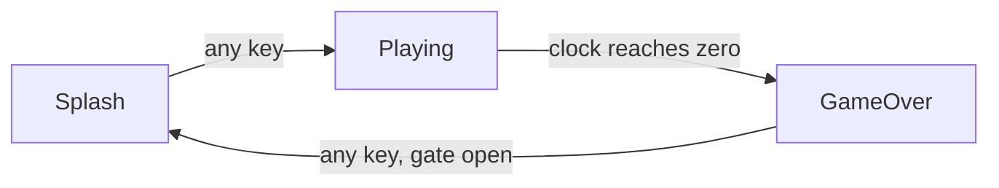

[← Routines, Parts and Imports](12-routines-parts-and-imports.md) | [Book](index.md) | [A Small Matrix Game →](14-a-small-matrix-game.md)

# Chapter 13 - Cards

Picture any arcade machine you have ever stood in front of. The screen
that drew you over - the attract screen, blinking its invitation - is
a little program of its own: it keeps no score, obeys no joystick, and
knows nothing about what happens after the coin drops. Put the coin in
and a different program takes over: rules, clock, score. Lose, and a
third one shows you the damage and waits to offer another round. Every
real game is at least three programs wearing one cabinet, and at any
instant exactly one of the three is running. Until today, you have had
no way to say so.

Here is what would happen if you tried. In every program you have
written so far, every block is in play on every frame. To hold three
screens in one file with the toolkit you have, you would reach for
what every programmer reaches for: a Mode fact, and the same guard at
the top of every single body - *am I the screen that owns this
block?* This chapter's game has thirteen blocks, so that is thirteen
copies of one test. And the cost is worse than the typing: the
headers, the design you have learned to read straight off the page,
would say nothing about which screen owns what. The first question a
reader asks of any block - when does this run? - would be answered
down in the bodies, in assembly, thirteen times.

Glimmer's word for a screen or mode is a **card**, borrowed from
HyperCard, which built whole applications out of stacks of them.
Exactly one card is active at a time. You declare a card in one line,
every declaration after that line belongs to it, and blocks in a
card's section run only while their card is active. The mode test
does not get shortened; it leaves the bodies entirely and moves into
the shape of the file.

## Gate

The chapter's game is Gate, and I will be straight with you about it:
as a game, it is a shell. At the splash, two pixels blink in the
middle of the 8x8 RGB LED matrix, and any key starts a round. A round
is 512 frames on a clock drawn as a shrinking green bar, and every
press of GO scores a point on the seven-segment display. When the
clock drains, the score appears as a red bar, and after a ninety-frame
pause any key returns to the splash. Press GO, number goes up - no
arcade would take it. I built it that way on purpose. This chapter
builds the cabinet; the next one puts the game in it, and the cabinet
deserves your full attention once, with no game in the way.



The whole game is one file, `gate.glim`, and we are going to walk it
top to bottom. It opens above any `card` line, and everything declared
up there is global - owned by no card, alive on all of them:

```text
program Gate

platform tec1g-mon3
display matrix8x8

state Score    : byte
state PromptOn : byte
state Armed    : byte

pulse AnyKeyP
pulse HitP
pulse BlinkTick
pulse TimeUp
pulse GateOpenP

timer Blink       : byte = 16 -> BlinkTick
timer PlayClock   : word = 0  -> TimeUp once
timer RestartGate : word = 0  -> GateOpenP once

bind key any    rising -> AnyKeyP
bind key KEY_GO rising -> HitP
```

You could have written every line of this weeks ago - it is all
chapter 4 and chapter 7 material. `Blink` is an oscillator, ticking
every 16 frames for the life of the program. `PlayClock` and
`RestartGate` are one-shot timers holding zero: idle until a block
writes them, and the blocks that write them arrive with their cards.
The overlap in the bindings is deliberate: a press of GO fires both `HitP` and
`AnyKeyP`, exactly as chapter 4 said `bind key any` would. In any
previous chapter that overlap would be a problem to untangle. Here,
the cards below sort out who listens, and you will watch them do it.

## A card is a section

The first `card` line follows the globals, and the splash screen is
everything from that line to the next one:

```text
card Splash

enter ShowSplash
    updates PromptOn
begin
    call FbClear
    call HudBlankDig
    ld a,1
    ld (PromptOn),a
end

effect BlinkPrompt
    on BlinkTick
    updates PromptOn
begin
    ld a,(PromptOn)
    xor 1
    ld (PromptOn),a
end

render DrawPrompt
    on PromptOn
begin
    call FbClear
    ld a,(PromptOn)
    or a
    jr z,_done
    ld b,3
    ld c,3
    ld a,COLOR_WHITE
    call FbPlot
    ld b,4
    ld c,3
    ld a,COLOR_WHITE
    call FbPlot
_done:
end

effect StartGame
    on AnyKeyP
    goto Playing
end
```

`card Splash` is the entire declaration - one line, no `begin`, no
body. It does not open a block; it starts a *section*, and the section
runs until the next `card` line, or the end of the file for the last
card.

Every block in the section is **card-gated**: it dispatches only
while Splash is the active card. Watch what that buys you with the
blink. `BlinkTick` fires every 16 frames forever - it is a global,
nothing stops it - and `BlinkPrompt` answers it only at the splash.
During a round the same tick fires, finds no active listener, and
clears at frame end like any pulse. The block's position in the file
is its entire mode test. You wrote no guard, and none is missing.

The three `card` lines also hand you two names you can use in code.
`Card` is an AZM enum - `Card.Splash`, `Card.Playing`,
`Card.GameOver` - and `CurrentCard` is a built-in byte cell, a fact
like any other, legal in `on` and `updates`. It starts at the first
declared card, which is how Splash becomes the start card, and it
starts marked changed, so frame one delivers it. Who consumes that
delivery? The block at the top of the section, and it is new.

## Arriving on a card

`ShowSplash` is an `enter` block: it runs once, on the frame its card
becomes active. Look at what its header does not carry - there is no
`on` line, because arriving *is* the trigger. It dispatches ahead of
the card's other blocks in its phase, so the card is set up before any
of its rules run. It takes `updates`, and, as you will see in a
moment, it may take `goto`.

The body prepares a clean screen: clear the framebuffer, blank the
seven-segment digits (`HudBlankDig` is the display's counterpart to
`FbClear`), and set `PromptOn`. The `updates` line delivers `PromptOn`
to the render phase the same frame - the chapter 5 rule - so the
prompt is lit on the very first frame of the card, with the blink
timer taking over from there.

I said "runs once", and I mean it precisely, because the
precision is the feature. Entry is edge-triggered: an enter block runs
when the program *changes* to its card, not while the program sits on
it. Frame one counts - the start card is entered like any other - and
so does every later arrival, so each trip back from the game-over
screen repaints a fresh splash. Setup that runs once per arrival is
exactly what a title screen wants, and exactly what a new round wants,
and it is the behaviour you would have hand-built with a DidInit flag
and a guard. That pairing is what `enter` means. The generated code that
detects the edge closes this chapter.

## Leaving a card

```text
effect StartGame
    on AnyKeyP
    goto Playing
end
```

`goto` in a block header is an unconditional transition: after the
block runs, the program switches to the named card. `StartGame` has
nothing else to do, and with `goto` in the header, `begin` is
optional - a header-only routing block closes directly with `end`.
Three lines of header are the whole "press any key" pattern chapter 4
promised you: a `bind key any`, a pulse, and a card transition.

A `goto` compiles to an update of `CurrentCard`, and the question of
exactly *when* the switch lands is a good one - good enough that I am
saving it for its own section, once all three cards are on the page.

## The round

```text
card Playing

enter StartRound
    updates Score, PlayClock
begin
    xor a
    ld (Score),a
    ld hl,512           ; the round: 512 frames on the clock
    ld (PlayClock),hl
end

effect ScorePoint
    on HitP
    updates Score
begin
    ld a,(Score)
    inc a
    ld (Score),a
end

render ShowScore
    on Score
begin
    ld a,(Score)
    ld l,a
    ld h,0
    call HudWriteU16
end

render DrawClock
    on FrameCount
begin
    call FbClear
    ld hl,(PlayClock)
    add hl,hl
    add hl,hl           ; HL * 4: frames-left / 64 lands in H
    ld a,h              ; A = bar pixels, 8 down to 0
    or a
    jr z,_done
    ld b,a
_col:
    push bc
    ld a,b
    dec a
    ld b,a              ; B = x for this pixel
    ld c,3              ; C = y, the middle row
    ld a,COLOR_GREEN
    call FbPlot
    pop bc
    djnz _col
_done:
end

effect EndRound
    on TimeUp
    goto GameOver
end
```

`StartRound` zeroes the score and arms the clock, and arming on entry
is the point, so let me argue for it by showing you the alternative.
Declare `PlayClock : word = 512` instead, and the countdown starts
spending itself the moment the program boots - while the splash is
still blinking. `TimeUp` fires into a frame where no active block
listens, the clock settles at zero, and the round that eventually
starts has no end. Armed by the enter block, the countdown begins when
the round begins: the timer lives inside the card that owns it.

`DrawClock` reads the timer cell directly. A one-shot's cell *is* the
countdown - chapter 7's rule - so `PlayClock` is the frames
remaining, and the two `add hl,hl` put frames-remaining divided by 64
into H: a bar of eight pixels down to none, one pixel per 64 frames
left. Running `on FrameCount`, the block redraws every frame of the
round and never draws outside it, because the card gates it along
with everything else in the section.

And here the gating settles those overlapping bindings from the top
of the file. During a round, one press of GO raises `HitP` and
`AnyKeyP` together. `HitP` finds `ScorePoint`; `AnyKeyP`'s two
consumers, `StartGame` and `Restart`, sit on the other two cards,
gated off. The press scores a point and does nothing else - routing
you never had to write.

## The gated restart

```text
card GameOver

enter ShowFinal
    updates Score, Armed, RestartGate
begin
    xor a
    ld (Armed),a        ; close the restart gate
    ld hl,90            ; and schedule its opening
    ld (RestartGate),hl
end

render FinalBar
    on Score
begin
    call FbClear
    ld a,(Score)
    cp 9
    jr c,_len
    ld a,8              ; the bar tops out at the matrix edge
_len:
    or a
    jr z,_done
    ld b,a
_col:
    push bc
    ld a,b
    dec a
    ld b,a
    ld c,3
    ld a,COLOR_RED
    call FbPlot
    pop bc
    djnz _col
_done:
end

effect OpenGate
    on GateOpenP
    updates Armed
begin
    ld a,1
    ld (Armed),a
end

effect Restart
    on AnyKeyP
    updates CurrentCard
begin
    ld a,(Armed)
    or a
    jr z,_done          ; gate still closed: stay
    ld a,Card.Splash
    ld (CurrentCard),a
_done:
end
```

The last card is where the program lives up to its name, and it exists
because of something you would discover in your first minute of
playtesting: a player mashing GO at the end of a round sails straight
past the result screen without ever seeing it. So restart waits
behind a gate. `ShowFinal` closes it and arms `RestartGate`; ninety
frames later `GateOpenP` fires and `OpenGate` opens it - the delayed
one-shot chapter 7 promised - and only then does a key press travel.

`Restart` is the travel, and it is our first transition that depends
on a runtime test. `goto` is unconditional once its block runs, so a
conditional transition writes `CurrentCard` itself: declare
`updates CurrentCard`, and store a `Card` value on the branch that
leaves. The enum members are ordinary AZM constants, so
`ld a,Card.Splash` is plain Z80 with a generated name in it.

Before you move on, look closely at what `Restart` does when the gate
is shut, because it looks like a bug and is not. The body stores
nothing, yet `updates CurrentCard` still marks the cell changed. That
is harmless by design. Entry is edge-triggered - an enter block runs
only when the card actually changed to its card - so marking
`CurrentCard` changed while staying on GameOver re-runs nothing.

## Facts that changed while you were away

There is a subtler problem hiding on this card, and it is worth
seeing before I show you the cure. `FinalBar` draws the score, and it
depends on `Score` - a fact whose last change happened during the
round, frames before this card existed on screen. Now recall chapter
5's delivery rule: exactly-once. Each of those changes was delivered
in its own frame, to the blocks active at the time, and the flag
dropped at that frame's end. **A card-gated block never sees flags
raised while its card was inactive.** A card that was asleep missed
the news. Left to itself, `FinalBar` would wait forever on a flag
that already came and went, and the game-over screen would show you a
blank 8x8 matrix.

The cure sits in the enter block's header, and you have already read
past it once:

```text
enter ShowFinal
    updates Score, Armed, RestartGate
```

`Score` is in the `updates` list, and the body never stores to it.
That is not an oversight; it is the idiom. `updates` is a
declaration, and Glimmer compiles the declaration: the generated
wrapper after `ShowFinal`'s body raises every listed flag, stores or
no stores. From `gate.main.asm`:

```asm
        ld      a,(Raised0)          ; deliver to later phases this frame
        or      CHG_SCORE + CHG_ARMED
        ld      (Raised0),a
```

One of those two raises is a **re-raise**: `Score` holds the value it
held a moment ago, and its flag goes up again, so `FinalBar` runs on
the card's first frame and paints the result. The card slept through
the announcement, so its enter block re-announces it on arrival. The
rule to carry: when a card's renders depend on facts that changed
while the card was away, list those facts in the enter block's
`updates`.

## Transitions land at frame boundaries

Time to pay the debt from the splash. `StartGame` runs in the middle
of a frame, in the logic phase, with Splash's other blocks still
mid-frame around it - so when does Splash stop and Playing start? The
generated file answers with two pieces, and together they hand you a
guarantee you never had to ask for.

First, `CurrentCard` is the *next-card* register. What `goto Playing`
became, from `gate.main.asm`:

```asm
Glim_StartGame:
        ld      a,Card.Playing      ; goto Playing
        ld      (CurrentCard),a
        ld      a,(Next1)            ; a consumer already ran: defer to next frame
        or      CHG_CURRENTCARD
        ld      (Next1),a
        ret
```

A goto is an update of `CurrentCard`, and the flag machinery you know
from chapter 5 handles it. `CurrentCard`'s consumers are the enter
blocks, and they dispatch at the head of the phase - by the time any
goto runs, they have had their turn this frame, so the change defers
to `Next1` and arrives whole at the next frame's start.

Second, dispatch gates never test `CurrentCard`. They test a copy
latched once per frame, at the top of the loop:

```asm
MainLoop:
        call    ScanFrame            ; show one full frame, then blank
        call    GlimPollBindings     ; game work runs in the blank window
        ld      a,(CurrentCard)    ; latch: card transitions land at
        ld      (GlimActiveCard),a  ; frame start, never mid-frame
```

So every card switch lands at a frame boundary. The frame that
decides to leave finishes as the old card: its blocks complete their
phases, its pulses clear at frame end. The destination activates at
the next frame's start, enter blocks first. Make it concrete: the
press that leaves the splash raises `AnyKeyP` - and `HitP` too, when
the key is GO - but that frame's active card is still Splash, so
`ScorePoint` is gated off, and both pulses are gone before Playing
wakes. A goto cannot leak its frame's triggers into the destination
card, which means every round starts with a zero score, whichever key
started it. You did not design that guarantee and you wrote no code
toward it; it is the kind of correctness a declared transition gives
you without being asked.

## The card machinery

I have made a lot of claims about gates and edges this chapter, so
let us go and point at them. Build the file and open the output:

```sh
glimmer build gate.glim
```

In the generated file, the cards are one enum and three bytes of
storage:

```asm
Card              .enum Splash, Playing, GameOver
```

```asm
CurrentCard:      .db Card.Splash   ; writable next card, starts changed
GlimActiveCard:   .db Card.Splash   ; frame-latched card all gates test
GlimPrevCard:     .db $FF          ; enter edge detector ($FF = before any card)
```

`CurrentCard` is where gotos and conditional stores write.
`GlimActiveCard` is the latched copy every gate tests. `GlimPrevCard`
starts at $FF, a value matching no card, which is how frame one
registers as an entry to Splash. And a small milestone in passing: Gate's three states and five pulses fill all eight bits of
`Changed0`, so `CurrentCard`'s flag opens the second bank - and
starts set:

```asm
Changed0:         .db %00000000   ; flags dispatch tests
Changed1:         .db %00000001   ; flags dispatch tests
```

A card gate is the dispatch test you have been reading since chapter
3, with one comparison in front. Here is `ScorePoint`'s, from the
logic dispatcher:

```asm
        ld      a,(GlimActiveCard)
        cp      Card.Playing
        jr      nz,_skip_ScorePoint
        ld      a,(Changed0)
        and     GlimDep_ScorePoint__B0
        jr      z,_skip_ScorePoint
        call    Glim_ScorePoint
_skip_ScorePoint:
```

Wrong card, skip; right card, the flag test proceeds as ever. Three
instructions in front of the familiar dispatch are the entire price
of the section machinery - that is what each block pays for living in
a card.

An enter dispatch adds the edge. `ShowFinal`'s, together with the two
instructions that follow the last enter dispatch in the phase:

```asm
        ld      a,(GlimActiveCard)
        cp      Card.GameOver
        jr      nz,_skip_ShowFinal
        ld      a,(GlimPrevCard)
        cp      Card.GameOver
        jr      z,_skip_ShowFinal
        ld      a,(Changed1)
        and     GlimDep_ShowFinal__B1
        jr      z,_skip_ShowFinal
        call    Glim_ShowFinal
_skip_ShowFinal:
        ld      a,(GlimActiveCard)
        ld      (GlimPrevCard),a
```

Read the three tests in order: the active card is GameOver; the
previous card was anything else - there is your edge; and
`CurrentCard`'s flag is up. Then, once every enter block has had its
chance, `GlimPrevCard` catches up with the present, and the edge
stays disarmed until the card genuinely changes again. That middle
test is what makes the re-raise idiom and `Restart`'s every-run
change mark safe: a raised flag alone, with both card bytes equal,
walks past every enter block in the file.

## Summary

- A `card` line starts a section: one line, and everything after it
  belongs to that card until the next `card` line or the end of the
  file. Declarations before the first card are global.
- Cards compile to a `Card` enum and a built-in `CurrentCard` cell,
  legal in `on` and `updates`. The first card is the start card, and
  `CurrentCard` starts marked changed, so frame one enters it.
- Blocks in a card's section are card-gated: their dispatch tests the
  active card before the change flags. Their position in the file is
  their mode test.
- An `enter` block runs once, on the frame its card becomes active,
  ahead of the card's other blocks in its phase. It carries no `on`
  line, and takes `updates` and `goto`. Entry is edge-triggered
  through `GlimPrevCard`, so it runs when the card actually changes.
- `goto` in a block header switches cards after the block runs, and
  `begin` is optional beside it. A transition that depends on a
  runtime test declares `updates CurrentCard` and stores a `Card`
  value on the branch that leaves.
- `CurrentCard` is the next-card register; every gate tests the
  frame-latched `GlimActiveCard`, so transitions land at frame
  boundaries and a goto's own frame stays with the old card.
- A card-gated block never sees flags raised while its card was
  inactive. An enter block's `updates` re-raises the facts the card's
  renders need - stores or no stores.

The cabinet is built and its machinery is proven, and in the next
chapter we put a game inside it - one complete game, spending
everything you have learned: [A Small Matrix
Game](14-a-small-matrix-game.md).

---

[← Routines, Parts and Imports](12-routines-parts-and-imports.md) | [Book](index.md) | [A Small Matrix Game →](14-a-small-matrix-game.md)
