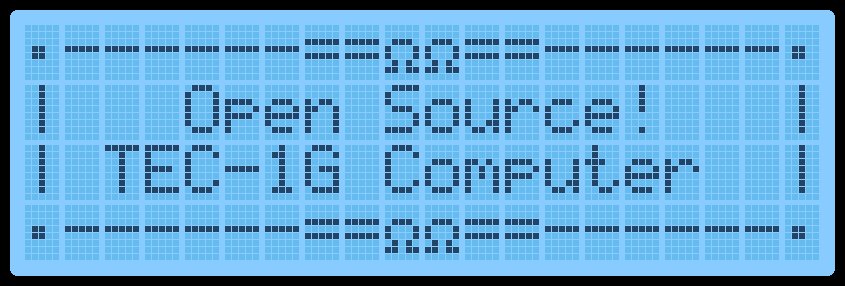

[← MON-3 User Guide](index.md) | [Guide](index.md) | [Main Menu →](02-main-menu.md)

# Basic Operation

With the monitor loaded into the ROM socket and all the jumpers set
correctly for the ROM used.  Turn the TEC on.  If it loads,  a welcome banner
will be displayed on the LCD, and a short tune will be heard.

## Cold Reset

When the TEC turns on after being powered down, a Cold Reset occurs.  A
Cold Reset signified with the display of the welcome banner and a short
tune.  A Cold Reset will configure the Monitor for first-time use after
powering it on.  It will default Monitor variables and configure the LCD for
first use.

If the TEC isn't responding normally or something "weird" is occurring, a
manual Cold Reset can be performed.   Programs loaded in RAM will be
retained when a manual Cold Reset is done. To do a manual Cold Reset,
while pressing and releasing the RESET key, hold the Fn key down.  The
distinctive LCD Banner and music tone will indicate that the Cold Reset
was successful.  A manual Cold Reset on the HexPad will still work if the
Matrix Keyboard is in use.

## Warm Reset

A Warm Reset occurs when pressing and releasing the RESET key.  A warm
reset returns the TEC to its initial editing location on a Cold Reset.  It's a
quick way to go back to the start of a code block or break code execution.

[← MON-3 User Guide](index.md) | [Guide](index.md) | [Main Menu →](02-main-menu.md)
