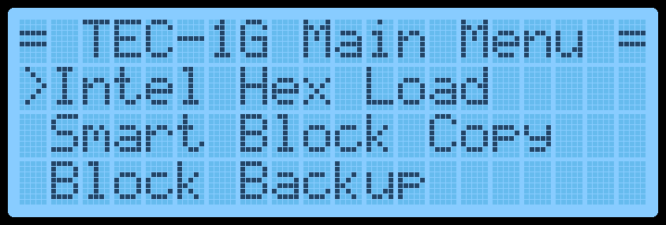
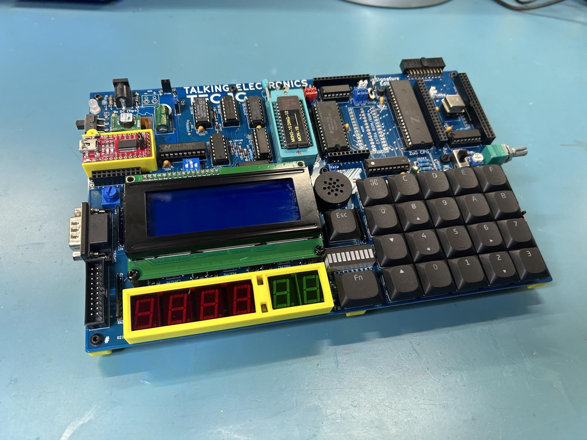

[← Basic Operation](01-basic-operation.md) | [Guide](index.md) | [Memory Map →](03-memory-map.md)

# Main Menu

A menu is provided on the LCD screen to help navigate some of the
built-in routines within the monitor.  The menu will appear on a Cold Reset.

Navigating the menu should be intuitive.  Press the Plus or Minus keys to
scroll down and up.  Press GO to run the selected routine.  A right-facing
Arrow indicates which menu item is currently selected.  Something that
might not be obvious is how to exit the menu and change into Data Entry
mode.  This is achieved by pressing the AD key.  Once this is known, it's
hard to forget it.  Menus can be nested up to 3 deep.  Pressing the AD key
will exit to the parent menu or enter Data Entry mode if at the main menu.


The current items on the menu are:

| Menu Text | Description |
| --- | --- |
| Intel HEX Load | Receive data in Intel HEX file format via the FTDI connector. |
| Drive Access | Catalog and load files from PATA or SD Card expansion boards. Save and restore the session. |
| Smart Block Copy | Move a block of code and update all 2-byte addresses that are within the block. |
| Block Backup | Move a block of code. |
| Export Z80 Assembly | Display Z80 assembly to a serial terminal via the FTDI connector. |
| Export Raw Data | Send binary data via the FTDI connector. |
| Export Hex Dump | Display a 16-byte per line HEX dump to a serial terminal via the FTDI connector. |
| Import Binary File | Receive data in binary format via the FTDI connector. |
| Music Routine | Play musical notes at a given address. |
| Settings | Update monitor settings. |
| Credits | Display the people who made the TEC-1G. |



## Intel HEX Load

Intel created a text file format that contains information on loading bytes
into memory.  When this routine is run, the TEC seven segments will go
blank and wait for a file to be received.  This is done via the FTDI connector
and serial terminal.  When data is transmitted, the rightmost segment will
illuminate in a pattern.  This indicates data is being read.  Once the file has
fully loaded, the letters "PASS" will display on the seven segments.  This
means that the load was successful.  Press any key to exit.  If the segments
display the word "FAIL", then there is something wrong with the file or your
serial connection.

## Drive Access

With a PATA drive or Micro SD card expansion boards installed, access the
files on the drive and load them to the TEC.  For more information refer to
the Hard Drive Access section for detailed usage information.

## Smart Block Copy

This clever routine shifts a program from one memory location to another
and changes all absolute jumps and calls.  Memory pointers are also
altered if the memory pointers are within the start and end address of the
program being relocated.   Any reference to a location outside the start and
end range is not altered.

The block copy treats Data bytes as instructions and might change data
bytes.  IE: .db C3, 23, 01 could be seen as a JP 0123 instruction.

When this routine is run, it will ask for a START, END and DESTINATION
address.  Type in the 16-bit address via the HEX PAD and use the Plus or
Minus keys to change the selected parameter.  Press GO to run the routine.

Here is an example of copying 4000H-4009H to location 2000H

```asm
 Original                                   After Copy

 4000 11 09 40      LD DE,4009              2000 11 09 20      LD DE,2009
 4003 E7            RST 20                  2003 E7            RST 20
 4004 FE 13         CP 13                   2004 FE 13         CP 13
 4006 C2 00 40      JP NZ,4000              2006 C2 00 20      JP NZ,2000
 4009 C9            RET                     2009 C9            RET
```

## Block Backup

This routine simply copies a data block from one address location to
another.   No bytes are altered during this copy routine..  This routine is
useful to copy data reference tables, like music data, for the music routine.

When this routine is run, it will ask for a START, END and DESTINATION
address.  Type in the 16-bit address via the HEX PAD and use the Plus or
Minus keys to change the selected parameter.  Press GO to run the routine.

Here is an example of copying 4000H-4009H to location 2000H

```asm
 Original                                   After Copy

 4000 11 09 40      LD DE,4009              2000 11 09 40      LD DE,4009
 4003 E7            RST 20                  2003 E7            RST 20
 4004 FE 13         CP 13                   2004 FE 13         CP 13
 4006 C2 00 40      JP NZ,4000              2006 C2 00 40      JP NZ,4000
 4009 C9            RET                     2009 C9            RET
```

## Export Z80 Assembly

If the TEC is connected to a serial terminal via an FTDI to USB adaptor, code
that is stored or written on the TEC can be disassembled and sent to the
terminal.  This is a great way to view the code that is on the TEC in a
readable format and could be passed into a Z80 compiler on a PC.

When this routine is run, it will ask for a START and END address.  Type in
the 16-bit address via the HEX PAD and use the Plus or Minus keys to
change the selected parameter.  Press GO to run the routine.

Here is an example of its output.
```asm
 4000 3E 3F         LD A,3F
 4002 D3 01         OUT (02),A
 4004 3E 04         LD A,04
 4006 D3 02         OUT (02),A
 4008 CF            RST 08
 4009 C9            RET
```

## Export Raw Data

This routine will send TEC binary data to a serial connection.  It's a way to
save code written on the TEC to a PC.  As binary data is being sent, the data
can only be properly viewed through a HEX file viewer or HEX dump
routine.

When this routine is run, it will ask for a START and END address.  Type in
the 16-bit address via the HEX PAD and use the Plus or Minus keys to
change the selected parameter.  Press GO to run the routine.

## Export Hex Dump

This routine displays binary data in a readable format to a serial terminal
connected via an FTDI to USB adaptor.  It will display up to 16 bytes per line.

When this routine is run, it will ask for a START and END address.  Type in
the 16-bit address via the HEX PAD and use the Plus or Minus keys to
change the selected parameter.  Press GO to run the routine.

Here is an example of its output.

```asm
      C100: 31 80 08 21 00 40 CD FC C5 AF D3 05 D3 06 DB 03
      C110: 47 E6 10 C2 00 80 3A 9F 08 E6 04 0E 01 B1 D3 FF
      C120: 32 9D 08 78 E6 02 32 9E 08 3A 9D 08 E6 01 28 0B
      C130: 21 00 C0 11 00 00 01 00 01 ED B0 21 00 40 22 86
      C140: 08 22 A0 08 DB 03 0F 38 06 DB 00 E6 20 18 08 CD
```

## Import Binary File

This routine will upload a binary file from a PC onto the TEC via an FTDI to
USB adaptor.  This is the opposite of the Export Raw Data routine and will
load binary data to a given address on the TEC.

When this routine is executed, it will ask for a START and END address.  This
address range must match the size of the binary file being sent.  Type in
the 16-bit address via the HEX PAD and use the Plus or Minus keys to
change the selected parameter.  Press GO to run the routine.  The TEC will
wait for data to be received and will end when END-START+1 bytes are
received.

## Music Routine

Use this routine to play some notes to the TEC speaker.  It is based on John
Hardy's Mon1 routine adjusted for a 4 MHz clock speed.  The routine uses
similar input codes, making it suitable for existing tunes to be used.

When this routine is executed, it will ask for a START address of the music
data-type in the 16-bit address via the HEX PAD.  Press GO to run the
routine.

Two octaves are playable.  Here is a reference to the note code and its
musical note.  A Pause is represented by 00, and any other note code that
isn't listed will exit the routine.

```text
  Note        Code        Note       Code        Note       Code        Note        Code

    G          01          C#          07          G          0D          C#         13

    G#         02           D          08         G#          0E          D          14

    A          03          D#          09          A          0F         D#          15

    A#         04           E          0A         A#          10          E          16

    B          05           F          0B          B          11          F          17

    C          06          F#          0C          C          12          F#         18
```

The following page contains examples tunes that can be typed in a played

### Bealach

```text
06, 06, 0A, 0D, 06, 0D, 0A, 0D, 12, 16, 14, 12, 0F, 11, 12, 0F
0D, 0D, 0D, 0A, 12, 0F, 0D, 0A, 08, 06, 08, 0A, 0F, 0A, 0D, 0F
06, 06, 0A, 0D, 06, 0D, 0A, 0D, 12, 16, 14, 12, 0F, 11, 12, 0F
0D, 0D, 0D, 0A, 12, 0F, 0D, 0A, 08, 06, 08, 0A, 06, 12, 00, 1F
```

### Angels On High

```text
0F, 0F, 0F, 0F, 0F, 0F, 12, 12, 12, 12, 12, 10, 0F, 0F, 0F, 0F
0F, 0F, 0D, 0D, 0F, 0F, 12, 12, 0F, 0F, 0F, 0D, 0B, 0B, 0B, 0B
0F, 0F, 0F, 0F, 0F, 0F, 12, 12, 12, 12, 12, 10, 0F, 0F, 0F, 0F
0F, 0F, 0D, 0D, 0F, 0F, 12, 12, 0F, 0F, 0F, 0D, 0B, 0B, 0B, 0B
12, 12, 12, 12, 14, 12, 10, 0F, 10, 10, 10, 10, 12, 10, 0F, 0D
0F, 0F, 0F, 0F, 10, 0F, 0D, 0B, 0D, 0D, 0D, 06, 06, 06, 06, 06
0B, 0B, 0D, 0D, 0F, 0F, 10, 10, 0F, 0F, 0F, 0F, 0D, 0D, 00, 00
00, 12, 12, 12, 12, 14, 12, 10, 0F, 10, 10, 10, 10, 12, 10, 0F
0D, 0F, 0F, 0F, 0F, 10, 0F, 0D, 0B, 0D, 0D, 0D, 06, 06, 06, 06
06, 0B, 0B, 0D, 0D, 0F, 0F, 10, 10, 0F, 0F, 0F, 0F, 0D, 0D, 0D
0D, 0B, 0B, 0B, 0B, 0B, 0B, 0B, 0B, 00, 00, 00, 00, 00, 00, 1F
```




*Image credit: Gerald M Eberhardt.*

## Settings

The settings allow the user to configure the monitor.  Powering off the TEC
will return these settings to their default state.  Some settings will be
retained if an RTC Add-on board is connected with battery backup.

   -   Toggle Key Beep - Turn the keypress 'beep' indication on or off.
   -   Set Baud Rate - Modify the Baud rate for serial transmission.
   -   Toggle GLCD Term - Use the GLCD (if fitted) as a terminal
   -   Toggle Address Inc - Turn the automatic address increase after a byte
       has been keyed on or off.
   -   Configure RTC - Set Time/Date of RTC (if RTC Add-on is connected).
   -   Reset RTC & PRAM - Reset RTC for initial use and initialise NVRAM.
   -   Toggle EXPAND - software controlled the expansion socket to toggle
       between lower and upper 16Kb memory for a 32Kb ROM/RAM chip.

## Credits

Display the people who developed and tested the TEC-1G
   -   Mark Jelic - Designer of the TEC-1G
   -   Brian Chiha - Mon3 Programmer 🥚
   -   Craig Hart - TECnical Expert
   -   Ian McLean - Tester and QA
   -   James Elphick - Tester and QA
   -   John Hardy & Ken Stone - The original designers

[← Basic Operation](01-basic-operation.md) | [Guide](index.md) | [Memory Map →](03-memory-map.md)
