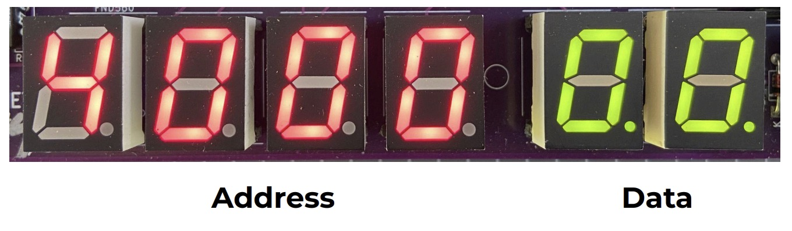
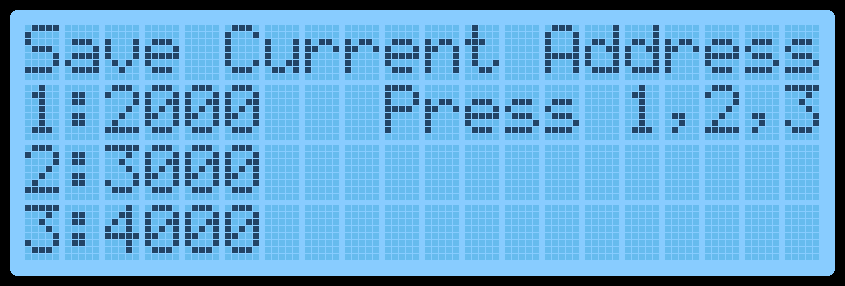
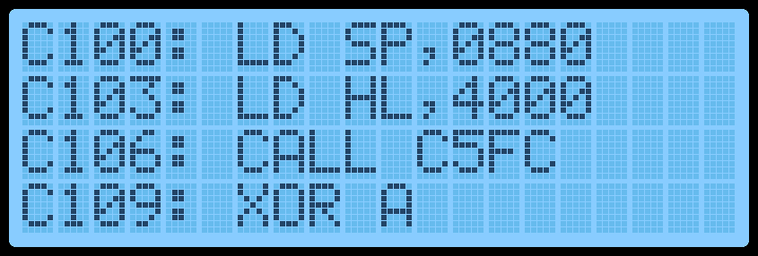

[← Memory Map](03-memory-map.md) | [Guide](index.md) | [Matrix Keyboard →](05-matrix-keyboard.md)

# Data Entry Mode

## Basic Operation

Data Entry Mode allows the user to enter Z80 Op Codes directly into the
TEC.  To access Data Entry Mode from the Main Menu, simply press the AD
key.  In this mode, the 4 left seven-segment displays will show the current
editing address, and the 2 right segments will display the byte at that
address.

The decimal place LED on the segments indicates which part, Address or
Data, is currently enabled for direct updates.   In the picture above, the dots
are on the Data segments.

The initial starting address is 4000H.   This address was chosen as it's within
the Protect RAM area.

To update a byte at an address, simply use the 0-F keys on the keypad.
After the byte has been entered, by default when the next byte is keyed,
the current editing address will automatically move to the next address
location.  This saves the user from pressing the Plus key after each byte is
added.  This option can be switched off in the Settings menu.

To navigate to another address, press the Plus or Minus key.  Or press the
AD key.  When using the AD key, the decimal place dots will move to the
address segments, indicating that the address field is updatable.  Key a
new 16-bit address using the 0-F keys.  Press the AD key to move back to
data updating mode.

And finally, to execute code, navigate to the address where the code starts
and press the GO key.  Protect mode will be honoured if switched on.  If the
code ends with a RET instruction (C9), execution will cleanly exit back to the
monitor.  The LCD screen will display the code start address while running.

## LCD Screen

One thing to note is that while data is being entered, the decimal place
LED on the data segments will change from displaying two lights to one.
The one light will indicate which Nibble (half byte) has been entered.   This
will help know if the whole byte has been entered or not.

If a mistake is made during data entry and the byte is to be re-entered.  To
stop the address from automatically incrementing, press the AD key twice.
This will reset the Nibble counter and allow a new byte to be entered.

If any key is held down, after a short period, the key will automatically
repeat.  This is mostly useful while holding down the Plus or Minus key to
quickly move to a new address.  But can also be used to populate memory
with 00 or FF or anything else.

In Data Entry Mode, the LCD Screen will display 12 bytes of data.  4 bytes
before the current editing location and 8 bytes from the current editing
location.  These bytes are displayed in groups of 4 (3 lines).  A right arrow
indicates the byte at the current editing location.

Displayed on the right side of the screen is the current edit mode, da=Data,
ad=Address, the current byte in LCD ASCII and the Nibble Counter.  The
picture below shows: The current address is 4000, Data mode, ">" = 3E in
ASCII and 0 nibble count.

On the 4th line of the LCD, the Z80 Assembly of the current OP Code(s) is
shown.  This can be useful to see what instruction is currently being keyed.

By displaying a range of bytes on the LCD, the user can check if the correct
bytes have been entered without individually moving to each address.

## Function Keys

Various extra options can be selected via the Function Key.  To use these
functions, hold the Fn key down and press any other key.

The routines attached to the Function Key are:

| Shortcut | Routine | Description |
| --- | --- | --- |
| `Fn-AD` | Main Menu | Display the Main Menu. |
| `Fn-0` | Save Current Address | Press `1`, `2` or `3` to save the current editing address in RAM so you can quickly jump to this location later. Three addresses can be saved. This is useful if your code is in a location other than `4000H` and the Reset button has been pressed. Press `AD` to exit the routine. The initial default address is `4000H`. |
| `Fn-1`, `Fn-2`, `Fn-3` | Quick jump to Address | Move the monitor's current editing location to the saved address set by `Fn-0`. |
| `Fn-4` | Intel Hex Load | Shortcut to the Main Menu routine. |
| `Fn-5` | Toggle GLCD Term | Use the GLCD as a terminal. |
| `Fn-6` | Save Session | Save all RAM to disk. Requires the PATA Drive or Micro SD Card Expansion boards. See Hard Drive Access for more information. |
| `Fn-7` | Restore Session | Load session from disk. Requires the PATA Drive or Micro SD Card Expansion boards. See Hard Drive Access for more information. |
| `Fn-8` | Fill with NOPs | Fill a selected area of memory with NOP instruction `00H`. Provide a from and to address and confirm by pressing `C`. |
| `Fn-A` | Restore from Backup | Reverse of the `Fn-B` routine. Defaults the To/From/Dest addresses to copy back from backup. Values can still be modified if necessary. |
| `Fn-B` | Block Backup | Shortcut to the Main Menu routine. |
| `Fn-C` | Smart Block Copy | Shortcut to the Main Menu routine. |
| `Fn-D` | Disassembly View | Switch between Data Entry View and Disassembly View. Disassembly View displays the next 4 assembly instructions. To move through the instructions, press the Plus or Minus keys. Data entry can still be done in this mode if desired. |
| `Fn-E` | Toggle Expand | Toggle the Expansion Socket Expand flag. This switches between the upper and lower memory of the 32Kb ROM/RAM in the expansion socket. |
| `Fn-F` | Catalog | Catalog the Drive and list files for loading. Requires the PATA Drive or Micro SD Card Expansion boards. |
| `Fn-Plus` | Insert Byte | Insert an NOP instruction at the current editing location and move all bytes up to max RAM by one address upwards. It will also do a Smart Block Copy to all moved bytes. This routine can add a Breakpoint (`F7`) or missing opcodes to an existing program. |
| `Fn-Minus` | Delete Byte | Delete a byte from the current editing location and move all bytes down by one address. It will also do a Smart Block Copy to all moved bytes. |
| `Fn-Reset` | Cold Reset | Perform a Cold Reset. This resets the TEC to its default state. |

[← Memory Map](03-memory-map.md) | [Guide](index.md) | [Matrix Keyboard →](05-matrix-keyboard.md)
