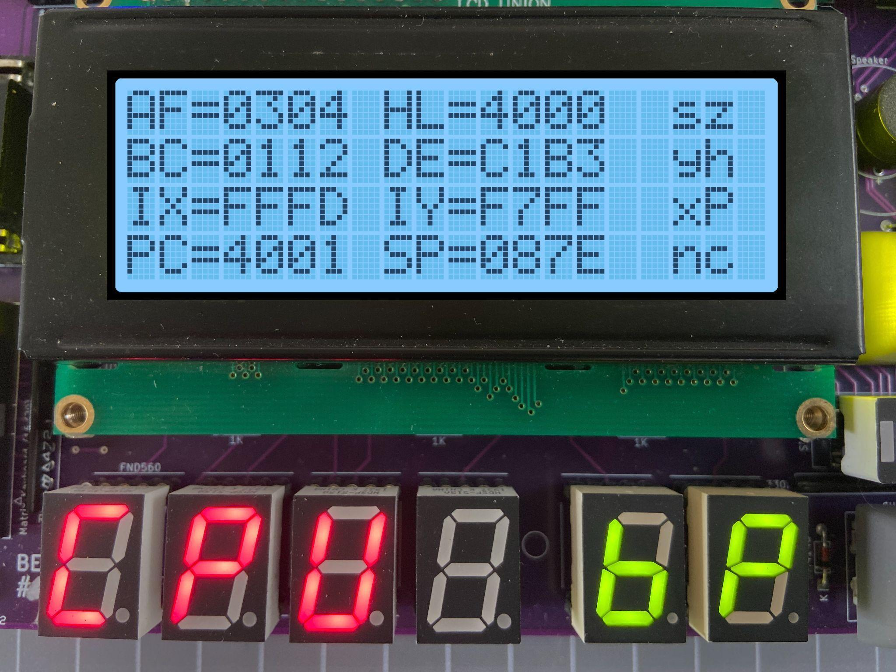

[← Matrix Keyboard](05-matrix-keyboard.md) | [Guide](index.md) | [Tiny Basic →](07-tiny-basic.md)

# Debugging Programs

Breakpoints can be inserted within a program which can help with viewing
the state of the CPU registers.  To break the execution of your code, insert
RST 30H or  F7 at the current address where the break should occur.

An easy way to insert a byte into an existing program is to press Fn-Plus.
This will insert a NOP instruction at the current address.  Then change this
byte to F7.

When the execution of code is interrupted with a breakpoint, the TEC will
pause and display register information on the LCD screen.

The contents of the Z80 CPU registers AF, HL, BC, DE, IX, IY, the Program
Counter and Stack Pointer are displayed.  CPU Flags are also displayed.
Flags that are set are in Capitals.  To continue code execution press the GO
key and to quit execution and return to the Monitor press the AD key.
Finally, to remove an inserted Breakpoint press Fn-Minus at the address
where the Breakpoint is.  This will remove the breakpoint and adjust the
code to its original state.  Note: Breakpoints will be ignored if a connection
is made between the + and the D5 pins on the G.IMP header.  Warning: Do
not connect the + to the - pin on the G.IMP header!!! This will short out the
TEC!

[← Matrix Keyboard](05-matrix-keyboard.md) | [Guide](index.md) | [Tiny Basic →](07-tiny-basic.md)
