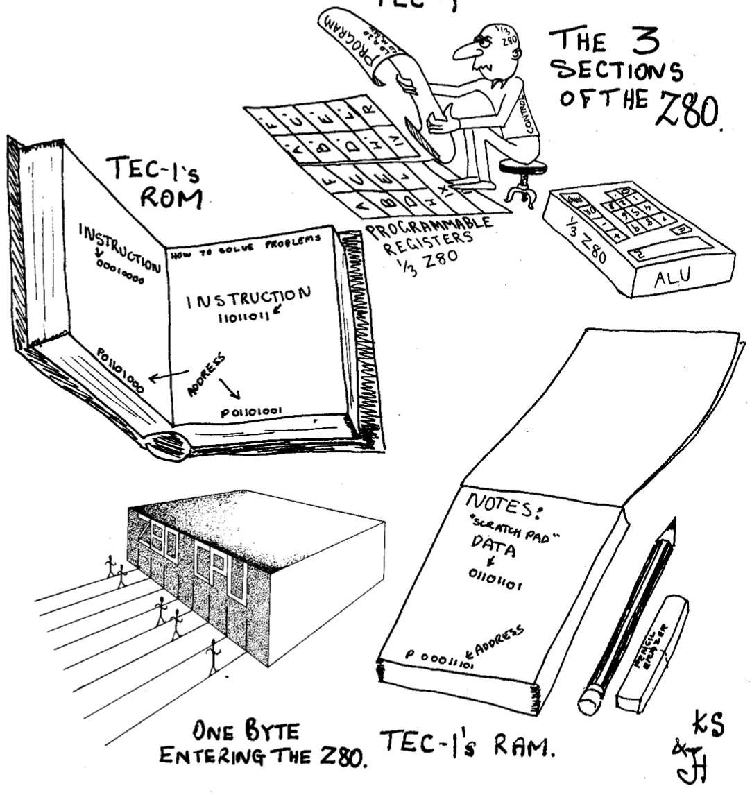

[← Tiny Basic](07-tiny-basic.md) | [Guide](index.md) | [TEC Magazine Code on the TEC-1G →](09-tec-magazine-code-on-the-tec-1g.md)

# Terminal Monitor

TMON has been removed from Mon3 as of v1.5 but it can be loaded as a
stand-alone program.  See the GitHub for source files.
The Terminal Monitor (TMON) is a complete serial port-based monitor for
the TEC-1G, designed for users who prefer to interact with the TEC-1G via a
terminal.

## Starting up TMON

Connect a serial terminal to the TEC-1G via the FTDI to USB connector.
Then, select Terminal Monitor from the main menu by pressing GO and
look at the serial terminal.


```asm
TMON for TEC-1G Version 1.0
MON-3 Version: 2023.11
RAM Found between 0000h and 3FFFh - 16384 bytes
1000 >
```


## Using TMON

TMON is an interactive tool that works with a serial terminal e.g. PuTTY or
Tera Term on a PC, or a 'real' VT100 serial terminal such as a Wyse WY-60.
The TEC-1G keypad and 7-seg displays are not used once the program
starts, and do not do anything (except for the testing routines documented
below).

Interactions with TMON are via the serial console. The user types
commands interactively and the results are displayed on the terminal.

All interactions with TMON use HEX format - so a byte is 00 to FF, etc. The
"h" or "0x" is omitted for brevity.

Typically, the ADDR key exits any interactive command, or by entering "Q"
from the terminal.

The above text is the default display when TMON first starts.  TMON is now
awaiting input and commands from the Available Commands list can be
entered.

## The Command Prompt

```text
1000 >
```


The 1000 represents the CURRENT ADDRESS in HEX. Many commands
default to their actions interacting with memory at this address. The
CURRENT ADDRESS changes as with certain commands. e.g. inputting
code and data, and can be set by the ADDR command. By default, TMON
points to itself.

The command input editor is very simple. Invalid inputs are typically
ignored and result in the user simply being returned to the command
prompt. The maximum command length accepted is 40 characters,
however, presently the longest valid command possible is 9 characters in
length. When the user's input exceeds the maximum command length,
the TEC will emit a beep tone to indicate this condition has been reached.
Backspace is supported, to correct typos.

All data entered at all times is assumed to be HEX - 4 bytes for addresses, 2
bytes for data. Invalid data input is ignored.

## DATA mode

When the DATA command is given, TMON switches to interactive data
entry mode. This is signified by the prompt changing as follows:

```text
XXXX nn :
```


XXXX continues to represent the CURRENT ADDRESS however the nn
represents the HEX byte stored at that address, which you are presently
editing.
   -   Enter a HEX byte and it will be written to memory at CADDR;
       CURRENT ADDR is then incremented by one.
   -   ENTER increments CURRENT ADDRESS by one and leaves the
       existing value as-is. This way, any bytes that don't need altering are
       skipped over.
   -   - decrements the CURRENT ADDRESS by one. This allows for
       correcting input errors by going back one address after erroneous
       input.
   -   Q exits data entry mode.

## TMON Commands

Invalid entries will be ignored.

The DATA entry system is very simple and will continue to be improved in
future versions.

| Command | Command | Command |
| --- | --- | --- |
| `HELP` | `?` | `EXIT` |
| `INTEL` | `BEEP` | `BELL` |
| `VER` | `STATE` | `CLS` |
| `RAMCHK` | `GO [xxxx]` | `DUMP [xxxx]` |
| `ADDR [xxxx]` | `DATA [xxxx]` | `INC` |
| `7SEG` | `SMON` | `HALT` |
| `DEBUG` | `KEYTEST` | `FILL xxxx yyyy nn` |
| `PRINT` | | |

Parameters marked with square brackets e.g. \[xxxx\] are optional.

`HELP`
: Displays help text.

`?`
: Displays the list of commands.

`EXIT`
: Reboots the 1G back to MON3.

`INTEL`
: Calls the Intel Hex file transfer routine built into MON-3.

`BEEP`
: Beeps the 1G speaker.

`BELL`
: Sends the BELL command to the remote console.

`VER`
: Displays the version number of TMON and MON-3.

`STATE`
: Displays the state of the 1G system: SHADOW, PROTECT, EXPAND and CAPS LOCK.

`CLS`
: Sends a clear-screen sequence to the remote console.

`RAMCHK`
: Runs a simple test to determine how much RAM is installed, and at what memory address or addresses. Uses whichever bank EXPAND is set to, but does not alter the EXPAND state. Supports multiple discontinuous RAM blocks, if fitted.

`GO xxxx`
: Executes code from the CURRENT ADDRESS, or from `xxxx` if supplied.

`DUMP xxxx`
: Dumps the contents of 64 bytes of memory. It provides HEX and ASCII output so memory can be examined.

: DUMP pauses at completion. Space repeats the command. CADDR continues to increment if auto-increment is on; otherwise the same block repeats. This lets you quickly run through larger blocks without typing the command repeatedly.

: Q quits and returns to the command prompt.

`ADDR xxxx`
: Sets the CURRENT ADDRESS. If no address is supplied, displays the CADDR instead.

`DATA xxxx`
: Interactively inputs data into memory, one hex byte at a time. The value input is stored in the CADDR memory location.

: Enter Q to quit input mode. See the full description of DATA mode above.

`INC ON/OFF`
: Sets auto-increment mode of CADDR. With no parameter supplied, displays the current auto-increment mode. Turning auto-increment off can be helpful for debugging or monitoring.

`7SEG`
: Displays CADDR and the memory byte on TEC 7-segment displays. The `+` and `-` keys increment or decrement CADDR. Pressing the ADDR key exits to TMON.

`SMON`
: Serial data stream monitor. Accepts serial input from the terminal and displays the HEX bytes received on screen. This is useful for debugging terminal communications and understanding control codes received from the PC, such as VT100 sequences. It also demonstrates the limitations of bit-bang serial because it cannot adequately buffer incoming bytes in real time. Try pressing an arrow key or a PC function key.

: Enter Q (capital) to exit SMON back to TMON.

: If a terminal program such as Tera Term is used to add a small delay, such as 20ms, between bytes transmitted from the PC, SMON can accurately show VT100 control codes such as a PC arrow or function key. Without the delay, bit-bang serial normally gets the first byte only, or perhaps the first and fourth or fifth byte.

`HALT`
: Executes a CPU HALT instruction. On TEC-1F, press any key to resume.

`DEBUG`
: Calls the MON-3 debugger/breakpoint tool to examine register contents.

`KEYTEST`
: Tests the selected keyboard. The last pressed key's scancode appears on the 7-segment displays. Fn is displayed with bit 5 set. Matrix keypad keys supported by MON3, not the full matrix keyset, are returned if MATRIX mode is enabled. Pressing the ADDR key exits to TMON.

`FILL xxxx yyyy nn`
: Fills memory between address `xxxx` and `yyyy` with data `nn`. The fill range must be at least 2 bytes long.

<div class="mon3-warning" markdown="1">
**Caution:** No safety checks are done by `FILL`. Any area of memory, including the stack, program code or data, could be overwritten. This does not apply if Protect Mode is on.
</div>

`PRINT your-text-here`
: Echoes `your-text-here` back to the serial terminal.



*Cartoon credit: John Hardy and Ken Stone, TE Issue 10, 1983.*

[← Tiny Basic](07-tiny-basic.md) | [Guide](index.md) | [TEC Magazine Code on the TEC-1G →](09-tec-magazine-code-on-the-tec-1g.md)
