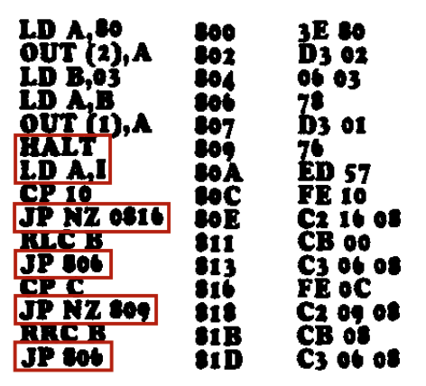

[← Terminal Monitor](08-terminal-monitor.md) | [Guide](index.md) | [Advanced Programming →](10-advanced-programming.md)

# TEC Magazine Code on the TEC-1G

A great way to learn how to use the TEC-1G is to key in programs presented
in the TE Magazines Issues 10 to 15. If the programs are keyed in directly,
they probably won't work. This is because they usually start at addresses
0800H or 0900H. These addresses are reserved for Mon3. To get the code
working, simply update all 2-byte address references to match the address
location of the code on the 1G.

Keypad interactions are a bit more complicated. The old monitors use the
register I and the NMI (Non-Maskable Interrupt) to trigger and save a
keypad press. Mon3 uses polling instead and RST/API calls to do keypad
reading. See the next chapter for more information on RST and API calls.

Below is a conversion table to help convert older code to work on Mon3
when a keypad press is required.

```text
 Old              Mon3          Reason
 Command          Replacement
HALT             RST 08H             RST 08H simulates a HALT command and sets
                                     register A with the key value pressed.

LD A,I           LD C,10H            A LD A,I by itself is 'polling' for a key press.  Call the
                 RST 10H             scanKey API routine (10H) which sets register A with
                                     the key value pressed.
                                     If LD A,I is immediately after a HALT instruction,
                                     then just use RST 08H as described above.
```

Here is an example of magazine code at 0800H with key input converted to
use Mon3 at RAM address 4000H. The code in RED has been modified.

```asm
                                                  LD A,80H      4000     3E 80
                                                  OUT (2),A     4002     D3 02
                                                  LD B,03H      4004     06 03
                                                  LD A,B        4006     78
                                                  OUT (1),A     4007     D3 01
                                                  RST 08H       4009     CF
                                                  CP 10H        400A     FE 10
                                                  JP NZ,4014H   400C     C2 14 40
                                                  RLC B         400F     CB 00
                                                  JP 4006H      4011     C3 06 40
                                                  CP 0CH        4014     FE 0C
                                                  JP NZ,4009H   4016     C2 09 40
                                                  RRC B         4019     CB 08
                                                  JP 4006H      401B     C3 06 40
```



[← Terminal Monitor](08-terminal-monitor.md) | [Guide](index.md) | [Advanced Programming →](10-advanced-programming.md)
