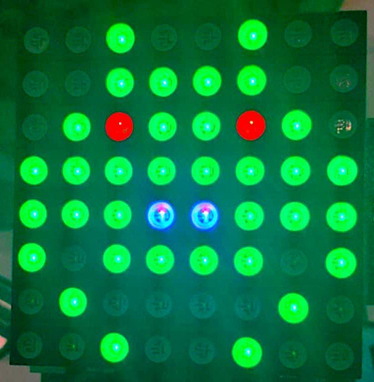
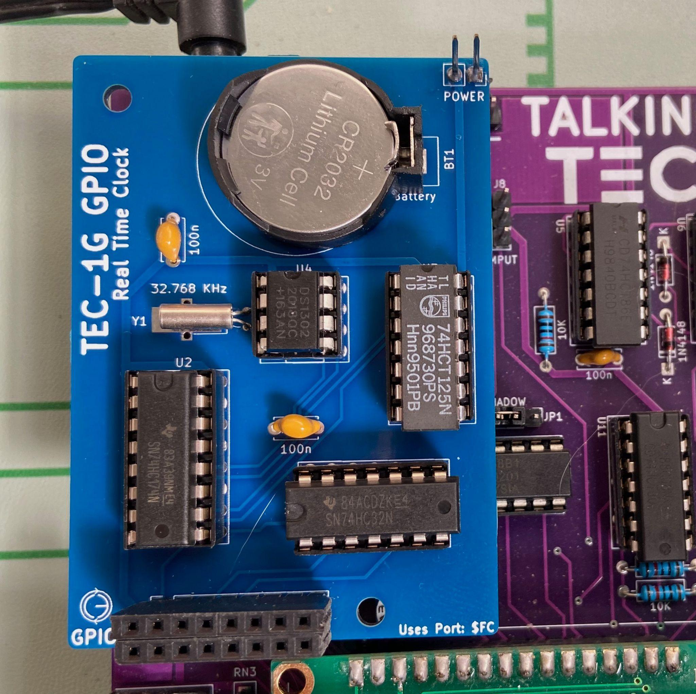
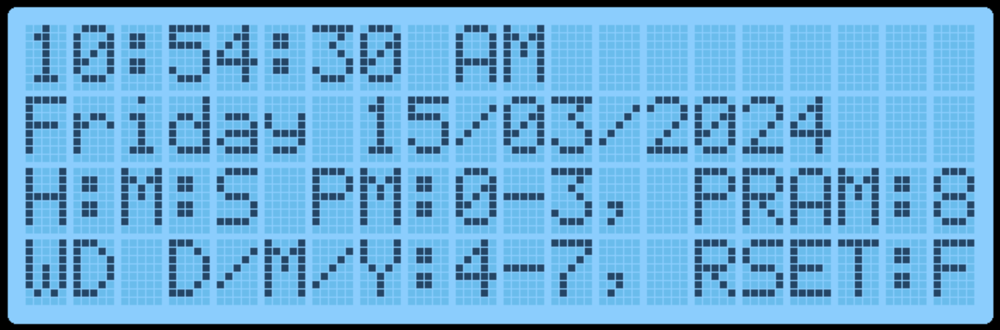
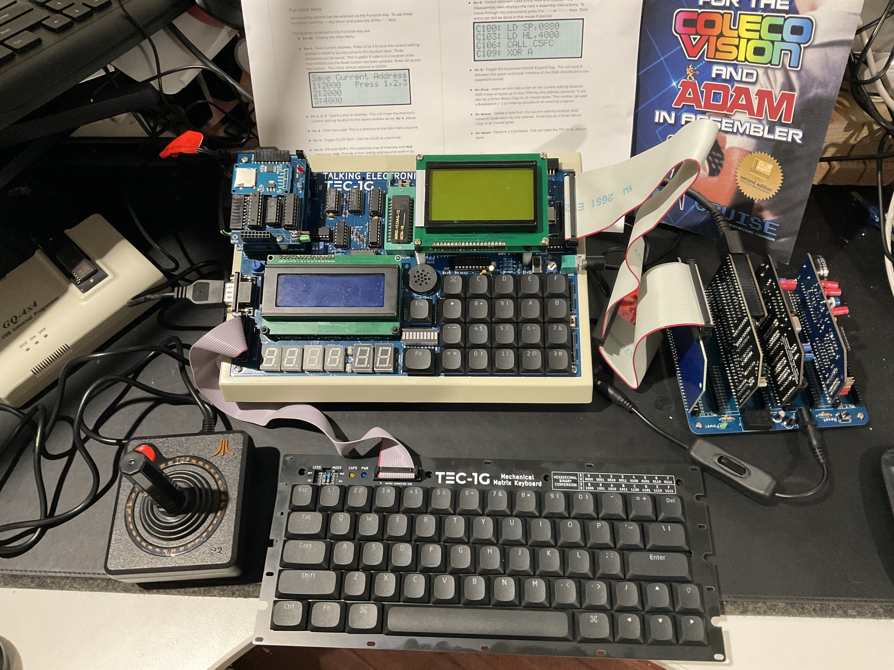
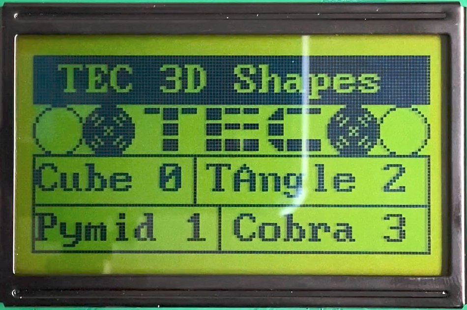
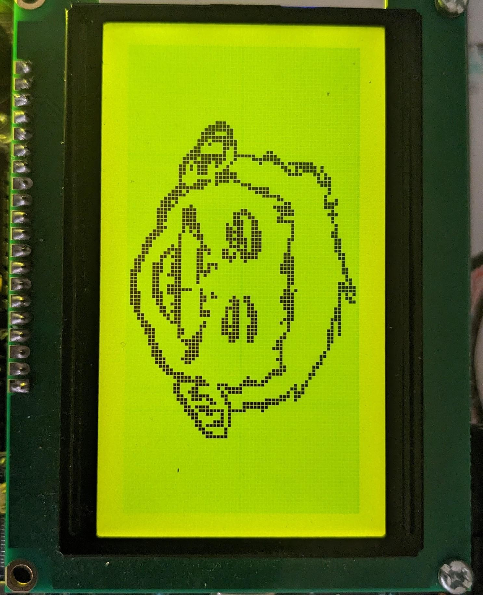

[← TEC Magazine Code on the TEC-1G](09-tec-magazine-code-on-the-tec-1g.md) | [Guide](index.md) | [Hard Drive Access →](11-hard-drive-access.md)

# Advanced Programming

## RST (Restart) commands

To assist when developing Z80 programs, Mon3 contains built-in
functionality that makes it easy to interface with the TEC-1G hardware.

RST commands on the Z80 are one-byte call commands that execute code
at certain address locations defined by the Z80.  The following table
outlines the routines.

| Command | Op Code | Description |
| --- | --- | --- |
| `RST 00H` | `C7` | Software monitor reset. |
| `RST 08H` | `CF` | Key wait and press routine. This simulates a `HALT` command where the TEC waits for a key to be pressed and then continues execution. If a key is currently being held down, the routine waits until the key is released and then detects the next key. The key that has been pressed is stored in register `A`.<br><br>`RST 08H` waits for a keypress.<br>`LD B,A` loads the key to register `B`. |
| `RST 10H` | `D7` | API entry call. Executes a monitor routine. See the API calls section below for details. |
| `RST 18H` | `DF` | API 2 entry call. Graphical LCD routine entry. See the GLCD section below for details. |
| `RST 20H` | `E7` | Scan Seven Segments and Keys. Multiplexes the seven-segment displays and checks for a key press. It can be used to display information on the seven segments and check for a key to be pressed. It must be called in a loop until a key is pressed to maintain seven-segment persistence. Returns Zero flag set when a key is pressed and register `A` with the key value. Register `DE` points to the seven-segment data. See the first program in the Quick Start Programs chapter for an example. Registers `DE`, `A`, and `B` are modified. |

## Interrupts

| Command | Op Code | Description |
| --- | --- | --- |
| `RST 28H` | `EF` | LCD Busy Check. Call before sending a command to the LCD when directly communicating with the LCD. The routine only exits when the LCD Busy flag is not set.<br><br>`RST 28H` checks the LCD busy flag.<br>`LD A,01H` loads `A` with a clear-screen instruction.<br>`OUT (04),A` sends the instruction to the LCD. |
| `RST 30H` | `F7` | Breakpoint entry. Breaks code execution at the current address location. See the Debugging Programs chapter for details. |
| `RST 38H` | `FF` | Maskable interrupt handler. Jumps here with Interrupts Enabled (`EI`), Interrupt Mode 1 (`IM 1`), and when the `INT` pin on the CPU goes low. Mon3 does nothing when this happens, but a user-defined routine can be used. See the Interrupt section below. |


The Z80 CPU has the ability to interrupt the execution of code, handle the
interrupt and then resume code execution.  This is done in software with
Interrupts Enabled (EI) and Interrupt Mode 1 (IM 1) and by hardware when
the INT line on the CPU goes low.  Mon3 ignores interrupts, but a
user-defined routine can be provided to handle the interrupt.  To do this,
the address of the interrupt routine is to be placed at RAM address 0892H.

```asm
       ei                 ; Enable interrupts
       im 1               ; Interrupt mode 1
       ld hl,myINT          ; Interrupt routine
     ld (0892H),hl          ; Save address in 0892H
       ... continue

myINT:
       ld c,03H   ; Bell routine
       rst 10H    ; Call API
       reti       ; Exit Int routine
```


This code will sound a bell tone in the speaker when an interrupt occurs.

## NMI (Non-Maskable Interrupts)

Non-Maskable Interrupts occur when the NMI line on the CPU goes low.
These interrupts will always trigger.  Mon3 ignores the NMI line, but a
user-defined routine can be provided to handle the interrupt.  To do this,
the address of the interrupt routine is to be placed at RAM address 0894H.

```asm
     ld hl,myNMI            ; NMI routine
     ld (0894H),hl          ; Save address in 0894H
       ... continue

myNMI:
       ld c,03H   ; Bell routine
       rst 10H    ; Call API
       retn       ; Exit NMI routine
```


This code will sound a bell tone in the speaker when an NMI occurs.  The
TEC-1G has an NMI jumper that can set NMI to trigger on a Keypad press, a
HALT instruction or externally (no jumper).


*Cartoon credit: Ken Stone, TE Issue 10, 1983.*

## API (Application Programming Interface) commands

The API on Mon3 exposes routines used by Mon3 which can be used in
your own programs. It makes writing code quicker and easier by exposing
monitor services through a small call interface.

### General conventions

The register C holds the API Call number.  All other registers except the IX
register can be used as parameters if needed.  Executing a RST 10H or D7
calls the API.


### General Interface

```asm
ld c,[API Call Number]
rst 10H
```

### Some Examples

```asm
          ;Produce a short Beep from the speaker
0E 03     ld c,3      ;beep call number
D7        rst 10H

          ;Display the letter 'G' on the LCD Screen
0E 0E     ld c,14     ;charToLCD call number
3E 47     ld a,"G"    ;parameter
D7        rst 10H

          ;Wait for a period of time
0E 21     ld c,33     ;timeDelay call number
21 00 30  ld hl,3000H ;parameter
D7        rst 10H
```


To assist with API call number references, the file api_includes.z80, in the
GitHub repository, contains the API Call Number with its Text equivalent for
use with your own code.

See https://github.com/MarkJelic/TEC-1G/tree/main/ROMs/MON3/source

### API Call List

**Utility Calls**

| Call | # | 0x |
| --- | ---: | --- |
| `softwareID` | 0 | 0 |
| `versionID` | 1 | 01 |
| `preInit` | 2 | 02 |
| `beep` | 3 | 03 |
| `convAToSeg` | 4 | 04 |
| `regAToASCII` | 5 | 05 |
| `ASCIIToSegment` | 6 | 06 |
| `stringCompare` | 7 | 07 |
| `HLToString_` | 8 | 08 |
| `AToString` | 9 | 09 |
| `scanSegments` | 10 | 0A |
| `displayError` | 11 | 0B |
| `checkStartEnd` | 30 | 1E |

**Serial Calls**

| Call | # | 0x |
| --- | ---: | --- |
| `serialEnable` | 20 | 14 |
| `serialDisable` | 21 | 15 |
| `txByte` | 22 | 16 |
| `rxByte` | 23 | 17 |
| `intexHexLoad` | 24 | 18 |
| `sendToSerial` | 25 | 19 |
| `receiveFromSerial` | 26 | 1A |
| `sendAssembly` | 27 | 1B |
| `sendHex` | 28 | 1C |
| `genDataDump` | 29 | 1D |
| `stringToSerial` | 45 | 2D |

**System Latch Calls**

| Call | # | 0x |
| --- | ---: | --- |
| `getCaps` | 37 | 25 |
| `getShadow` | 38 | 26 |
| `getProtect` | 39 | 27 |
| `getExpand` | 40 | 28 |
| `setCaps` | 41 | 29 |
| `setShadow` | 42 | 2A |
| `setProtect` | 43 | 2B |
| `setExpand` | 44 | 2C |
| `toggleCaps` | 48 | 30 |

**LCD Calls**

| Call | # | 0x |
| --- | ---: | --- |
| `LCDBusy` | 12 | 0C |
| `stringToLCD` | 13 | 0D |
| `charToLCD` | 14 | 0E |
| `commandToLCD` | 15 | 0F |

**Input Calls**

| Call | # | 0x |
| --- | ---: | --- |
| `scanKeys` | 16 | 10 |
| `scanKeysWait` | 17 | 11 |
| `matrixScan` | 18 | 12 |
| `joystickScan` | 19 | 13 |
| `matrixScanASCII` | 53 | 35 |
| `parseMatrixScan` | 54 | 36 |

**Misc. Calls**

| Call | # | 0x |
| --- | ---: | --- |
| `timeDelay` | 33 | 21 |
| `RTCAPI` | 46 | 2E |
| `random` | 49 | 31 |
| `setDisStart` | 50 | 32 |
| `getDisNext` | 51 | 33 |
| `getDisassembly` | 52 | 34 |
| `LCDConfirm` | 55 | 37 |
| `getGLCDTerm` | 56 | 38 |
| `setGLCDTerm` | 57 | 39 |
| `loadFromDisk` | 58 | 3A |
| `openFile` | 59 | 3B |
| `readSector` | 60 | 3C |
| `writeSector` | 61 | 3D |
| `RGBScan` | 62 | 3E |

**Menu Calls**

| Call | # | 0x |
| --- | ---: | --- |
| `menuDriver` | 31 | 1F |
| `paramDriver` | 32 | 20 |
| `menuPop` | 47 | 2F |

**Sound Calls**

| Call | # | 0x |
| --- | ---: | --- |
| `playNote` | 34 | 22 |
| `playTune` | 35 | 23 |
| `playTuneMenu` | 36 | 24 |

## API Utility Calls

**softwareID #0 (00H)**
Get Software ID String
- Input: nothing
- Return: HL = Pointer to SOFTWARE ASCII String
- Destroy: none

**versionID #1 (01H)**
Get Version Number and Version String
- Input: nothing
- Return: `HL` = pointer to release ASCII string
- Return: `BC` = release major version number
- Return: `DE` = release minor version number
- Destroys: none

**preInit #2 (02H)**
Performs a cold reset as if the TEC-1G had just been powered on. Returns to
MON3 to its default state.

**beep #3 (03H)**
Makes a short beep tone to the TEC Speaker
- Input: nothing
- Destroys: A

**convAToSeg #4 (04H)**
Convert register A to Seven Segment display format
- Inputs: `A` = byte to convert
- Inputs: `DE` = address to store segment values (2 bytes)
- Destroys: `BC`

**regAToASCII #5 (05H)**
Convert register A to ASCII. IE: 2CH -> "2C"
- Input: A = byte to convert
- Output: HL = two-byte ASCII string
- Destroys: A

**ASCIItoSegment #6 (06H)**
ASCII to Segment.  Converts an ASCII character to Seven Segment display
format
- Input: A = ASCII character
- Return: A = Segment character or 0 if out of range
- Destroys: none

**stringCompare #7 (07H)**
Compare two string
- Input: `HL` = source pointer
- Input: `DE` = target pointer
- Input: `B` = bytes to compare (up to 256)
- Output: Zero Flag Set = compare match
- Destroys: `HL`, `DE`, `A`, `BC`

**HLToString #8 (08H)**
Convert HL to ASCII string. IE: 2C0FH -> "2C0F"
- Input: `HL` = value to convert
- Input: `DE` = address of string destination (4 bytes)
- Output: `DE` = address one after last ASCII entry
- Destroys: `A`

**AToString #9 (09H)**
Convert register A to ASCII string. IE: 2CH -> "2C"
- Input: `A` = byte to convert
- Input: `DE` = address of string destination (2 bytes)
- Output: `DE` = address one after last ASCII entry
- Destroys: `A`

**scanSegments #10 (0AH)**
Multiplex the Seven Segment displays with the contents of DE.  Must be
called repetitively for segments to stay persistent.
- Inputs: DE = pointer to 6-byte location of segment data
- Destroys: A, B, DE = DE + 6

**displayError #11 (0BH)**
Display ERROR on the Seven Segments and wait for keypress
- Input: none
- Destroys: all

**checkStartEnd #30 (1EH)**
Check start and end address differences.
- Input: `HL` = address location of START value
- Input: `HL+2` = address location of END value
- Output: `HL` = start address
- Output: `BC` = length of end-start
- Output: Carry = set if end is less than start
- Destroys: `DE`

## API LCD Calls

**LCDBusy #12 (0CH)**
LCD busy check.  Checks the LCD busy flag and loops until LCD isn't busy
- Input: nothing
- Destroys: none

**stringToLCD #13 (0DH)**
ASCII string to LCD.  Writes a string (text) to the current cursor location on
the LCD
- Input: HL = ASCII string terminated with a zero byte
- Destroy: A, HL (moves to end of the list)

```asm
TEXT: .db "HELLO TEC!",0

       ld hl,TEXT
       ld c,13
       rst 10h
```

**charToLCD #14 (0EH)**
ASCII character to LCD.  Writes one character to the LCD at the current
cursor location
- Input: A = ASCII character
- Destroy: none

```asm
ld a,"G"
ld c,14
rst 10h
```

**commandToLCD #15 (0FH)**
Command to LCD.  Sends an LCD instruction to the LCD
- Input: B = Instruction byte
- Destroy: none

```asm
ld b,01  ;clear LCD
  ld c,15
  rst 10h
```

## API Input Calls

**scanKeys #16 (10H)**
Universal Key input detection routine. Supports HexPad and Matrix.  The
routine does not wait for a key press the returns immediately.  Only Hexpad
keys are detected if using the Matrix Keyboard.
- Return: `A` = key value when the status flags indicate a key press
- Return: Zero flag set if a key is pressed
- Return: Carry flag set if a new key press is detected
- Return: Carry flag not set for a key pressed and held, or if no key has been pressed
- Destroys: `DE` if using Matrix Keyboard

Key mapping returned in register `A`:

| Key | Value | Key | Value |
| --- | --- | --- | --- |
| `0-F` | `00-0F` | `Fn-0-F` | `20-2F` (bit 5 set) |
| Plus | `10` | Fn-Plus | `30` |
| Minus | `11` | Fn-Minus | `31` |
| GO | `12` | Fn-GO | `32` |
| AD | `13` | Fn-AD | `33` |

**scanKeysWait #17 (11H)**
Generic Key input detection routine. Supports HexPad and Matrix. Waits
until a key is pressed.  The routine will only detect a key if all keys are
released first.  Only Hexpad keys are detected if using the Matrix Keyboard.
- Return: A = key value (if following are met)
- zero flag set if a key is pressed
- Destroys: DE if using Matrix Keyboard
See table above for return values in register A

**joystickScan #19 (13H)**
Joystick port scan routines.  This routine will return a value based on the
movement/button of the joystick or any combination: IE: UP+DOWN = 03H,
Routine must be called repetitively.
- Input: none
- Output: `A` = joystick return value between `00H-5FH` (0-95)
- Output: Zero flag set if no joystick value returned
- Destroy: none

| Value | Meaning | Value | Meaning |
| --- | --- | --- | --- |
| `01H` | Up | `10H` | Fire 2 |
| `02H` | Down | `20H` | Comm2 (Pin 9) |
| `04H` | Left | `40H` | Fire 1 |
| `08H` | Right | `80H` | Fire 3 |

**matrixScan #18 (12H)**
Key scan routine for the Matrix Keyboard.  This routine detects up to two
key presses at the same time.  Key values stored in DE.  The routine must
be called repetitively.
- Input: none
- Output: `E` = key pressed between `00H-3FH` (0-63)
- Output: `D` = second key, `FF` = no key, `00` = Shift, `01` = Ctrl, `02` = Fn
- Output: Zero flag set if a key is pressed or the combination is valid

Key mapping returned in register `E`; some gaps are present.

| Key | Value | Key | Value | Key | Value | Key | Value | Key | Value | Key | Value |
| --- | --- | --- | --- | --- | --- | --- | --- | --- | --- | --- | --- |
| Shift | `00` | Esc | `0C` | 4 | `17` | D | `27` | O | `32` | Z | `3D` |
| Ctrl | `01` | Space | `0D` | 5 | `18` | E | `28` | P | `33` | `\\` | `3F` |
| Fn | `02` | Single Qt | `0E` | 6 | `19` | F | `29` | Q | `34` | | |
| Up | `03` | Comma | `0F` | 7 | `1A` | G | `2A` | R | `35` | | |
| Down | `04` | Minus | `10` | 8 | `1B` | H | `2B` | S | `36` | | |
| Left | `05` | F.Stop | `11` | 9 | `1C` | I | `2C` | T | `37` | | |
| Right | `06` | `/` | `12` | `;` | `1E` | J | `2D` | U | `38` | | |
| Caps | `07` | 0 | `13` | `=` | `20` | K | `2E` | V | `39` | | |
| Del | `08` | 1 | `14` | A | `24` | L | `2F` | W | `3A` | | |
| Tab | `09` | 2 | `15` | B | `25` | M | `30` | X | `3B` | | |
| Enter | `0A` | 3 | `16` | C | `26` | N | `31` | Y | `3C` | | |

**matrixScanASCII #53 (35H)**
Convert the output of the matrixScan routine to ASCII.  matrixScan returns
values between 0 and 63 (3Fh). These represent key presses on the
keyboard.  This routine will convert the output of matrixScan DE, to the
actual key pressed in ASCII.  If the key doesn't map to an ASCII character
then the matrix key value is returned.
Shift+Key will return the capital or secondary characters, Ctrl+Key will
return the control code.  IE: Ctrl-C will return 03.
- Input: `DE` = value returned from `matrixScan`
- Input: `E` = key, `D` = secondary key
- Output: `A` = key pressed in ASCII
- Destroy: `BC`, `HL`

Example code on using matrixScanASCII can be found in the Quick Start
Programs chapter below.

**parseMatrixScan #54 (36H)**
Parse matrix keyboard input.  This routine checks the key(s) pressed on the
Matrix Keyboard and either returns the key pressed in ASCII or handles
special cases.  The special cases are Key Bounce/Repeat and Caps lock.
This routine includes a call to matrixScanASCII and is designed to come
directly after matrixScan.  As this routine also scans the keyboard, it needs
to be included in a Scan loop.
- Input: `DE` = value returned from `matrixScan`
- Input: `E` = key, `D` = secondary key
- Input: Zero Flag = set if key pressed, from `matrixScan`
- Output: `A` = key pressed in ASCII
- Output: Carry Flag = set if ASCII returned
- Output: Carry Flag = not set if a special case occurred and no ASCII was returned
- Destroy: `BC`, `HL`

```asm
scan_loop:
    ld c,18       ;matrixScan
    rst 10h       ;API call
    ld c,54       ;parseMatrixScan
    rst 10h       ;API call
    jr nc,scan_loop
    ld c,22       ;txByte Send to FTDI
    rst 10h       ;API call
```

## API Serial Data Transfer Calls

**serialEnable #20 (14H)**
Enable BitBang serial port for serial transmit.  Disco LED's glow blue to
indicate ready status.
- Input: none
- Destroy: A

**serialDisable #21 (15H)**
Disable BitBang serial port for serial transmit.  Disco LEDs turn off.
- Input: none
- Destroy: A

**txByte #22 (16H)**
Bit Bang FTDI USB transmit routine.  Send one byte over FTDI USB serial
connection.  It assumes a UART connection of 4800-8-N-2.
- Input: A = byte to transmit
- Output: nothing
- Destroy: none

**rxByte #23 (17H)**
Bit Bang FTDI USB receive routine.  Receive one byte via the FTDI USB
serial connection.  It assumes a UART connection of 4800-8-N-2.  Note
routine will wait until a bit is detected.
- Input: nothing
- Return: A = byte received
- Destroy: none

**intelHexLoad #24 (18H)**
Load an Intel Hex file via the FTDI USB serial connection.  Displays file
progress on the segments and PASS or FAIL at the end of the load.  Intel
Hex file format is a string of ASCII with the following parts:

<div class="intel-hex-diagram" role="group" aria-label="Intel HEX record structure">
  <div class="intel-hex-diagram__labels" aria-hidden="true">
    <span class="intel-hex-diagram__cell intel-hex-diagram__cell--mark">MARK</span>
    <span class="intel-hex-diagram__cell intel-hex-diagram__cell--length">LENGTH</span>
    <span class="intel-hex-diagram__cell intel-hex-diagram__cell--address">ADDRESS</span>
    <span class="intel-hex-diagram__cell intel-hex-diagram__cell--type">RECORD TYPE</span>
    <span class="intel-hex-diagram__cell intel-hex-diagram__cell--data">DATA</span>
    <span class="intel-hex-diagram__cell intel-hex-diagram__cell--checksum">CHECKSUM</span>
  </div>
  <code class="intel-hex-diagram__record" aria-label="Example Intel HEX line: colon, length 10, address 2000, record type 00, data 210621CD7D20CD98203A00213C320021, checksum AF">
    <span class="intel-hex-diagram__cell intel-hex-diagram__cell--mark">:</span><span class="intel-hex-diagram__cell intel-hex-diagram__cell--length">10</span><span class="intel-hex-diagram__cell intel-hex-diagram__cell--address">2000</span><span class="intel-hex-diagram__cell intel-hex-diagram__cell--type">00</span><span class="intel-hex-diagram__cell intel-hex-diagram__cell--data">210621CD7D20CD98203A00213C320021</span><span class="intel-hex-diagram__cell intel-hex-diagram__cell--checksum">AF</span>
  </code>
</div>


MARK is a colon character, LENGTH is the number of bytes per line,
ADDRESS is the 2-byte address of where the data is to be stored.  RECORD
TYPE is 00 for Data and 01 for EOF.  DATA is the bytes to be stored.
CHECKSUM is the addition of all bytes in one line.

- Input: nothing
- Output: nothing
- Destroy: HL,DE,BC,A

**sendToSerial #25 (19H)**
SIO Binary Dump.  Transfer TEC data to a serial terminal.  From address and
Length of data is needed for input.  Use checkStartEnd to get length if
using From/To address.
- Input: `HL` = start address
- Input: `DE` = length in bytes of data to send
- Destroys: `A`, `HL`, `DE`, `BC`

**receiveFromSerial #26 (1AH)**
SIO receives binary data.  Receive binary data from FTDI.  From address
and Length of data is needed for input.  Use checkStartEnd to get length
if using From/To address.
- Input: `HL` = start address
- Input: `DE` = length in bytes of data to receive
- Destroys: `A`, `HL`, `DE`, `BC`

**sendAssembly #27 (1BH)**
Send Assembly instructions to the serial port.  Print out the disassembled
code that is on the TEC in readable assembly language on the serial
terminal.  From address and Length of data is needed for input.  Use
checkStartEnd to get length if using From/To address.
- Input: `HL` = start address
- Input: `DE` = length in bytes of data to disassemble
- Destroys: `A`, `HL`, `DE`, `BC`

**sendHex #28 (1CH)**
Send a traditional HEX dump as text to the serial terminal.  Up to 16 bytes
are displayed per line.    From address and Length of data is needed for
input.  Use checkStartEnd to get length if using From/To address.
- Input: `HL` = start address
- Input: `DE` = length in bytes of data to send as hex
- Destroys: `A`, `HL`, `DE`, `BC`

**genDataDump #29 (1DH)**
Generate data dump in ASCII.  Print the Address and then B number of
bytes.  This routine is a subroutine in the _sendHex routine.
- Input: `B` = number of bytes to display
- Input: `HL` = start address of data dump
- Input: `DE` = address of string destination
- Output: `DE` = zero-terminated address one after the last ASCII entry
- Destroys: `A`, `HL`; `HL` moves to the next address after the last byte

Example output string:

```text
"4000: 23 34 45 56 78 9A BC DE",0
```

**stringToSerial #45 (2DH)**
ASCII string to FTDI Serial Port.  Writes a string (text) to the serial port
- Input: HL = ASCII string terminated with a zero byte
- Destroy: A, HL (moves to end of the list)

```asm
TEXT: .db "HELLO TEC!",0

       ld hl,TEXT
       ld c,55
       rst 10h
```

## API Menu & Parameter Calls

**menuDriver #31 (1FH)**
Menu driver for user programs.  Creates a selectable custom menu/list.
Keys: Go = Select menu item, AD = Exit Menu, Plus/Minus = Navigate menu.
If a menu item is selected by pressing Go, a jump is performed to the
menu routine address (see example below).  If the user routine ends with a
RET instruction, control will be brought back to the menu.  There is no need
to call the menuDriver again after the routine returns.

When an item is selected, the routine that is associated with the menu
entry will be called.  The selected menu item number will be stored at RAM
address 0897H.  Items start from 0.

If after the RET the menu is to be removed or popped off, then call the
menuPop routine prior to the RET.  This will return control to the previous
menu or enter Data Entry mode.

The menu can also be used as a selectable List.  Use menuPop to close the
list once the item has been selected.  See an example below on how to do
this.
- Input: HL = Pointer to Menu configuration.
- Destroys: A, HL

All strings are ZERO terminated! Except the 7 Segment Text must be ASCII
of exactly 6 bytes.  Menu configuration is as follows.

```asm
<# Menu Entries>, <7 Segment Text>, <Menu Text Title>,
[<Menu Text Label>, <Menu Routine Address>]+
  EG: .db 2                 ; Two menu items
      .db "MyGame"          ; 7 segment text (6 bytes)
      .db "Games",0         ; Menu title
      .db "TEC Invaders",0  ; Text and Routine
      .dw invaders
      .db "TEC Maze",0      ; Text and routine
      .dw maze
```

**paramDriver #32 (20H)**
Parameter data entry driver.  Creates a list of editable two-byte parameters.
Keys: Go = Continue, AD = Exit, Plus/Minus = Navigate, 0-F = enter values
- Input: HL = Pointer to Parameter configuration.

Once the Go key is pressed, code will continue after the API call.  The
parameter view on the LCD will automatically be removed and the LCD will
display the prior view to the parameter call.  There is no need to call
menuPop to restore the previous LCD view.

Parameter text can be no longer than 14 characters.  Parameters entered
will be stored in the Param RAM Address locations of two-bytes each.  All
strings are ZERO terminated!    Except the 7 Segment Text must be ASCII
of exactly 6 bytes.  Parameter configuration is as follows.

```asm
<No. of Entries>, <7 Segment Text>, <Parameter Title
Text>, [<Param Text Label>, <Param RAM Address>]+
  EG: .db 3                 ; Three parameters
      .db "Params"          ; 7 segment text (6 bytes)
      .db "= Enter Parameters =",0  ; Parameter title
      .db "Start Address:",0        ; Text and Address
      .dw RAM_LOC_1
      .db "End Address:",0          ; Text and Address
      .dw RAM_LOC_2
      .db "Dest. Address:",0        ; Text and Address
      .dw RAM_LOC_3
```

**menuPop #47 (2FH)**
Replace the current menu with its parent menu if any.  If menus have been
nested, the parent menu will become the active menu.  This is the same as
pressing the AD key but done in software.  If no parent menu exists then
the Monitor mode is changed to Data Entry View.  Useful if using the menu
as a Select List where execution of code is to be continued.
- Input: none.
- Destroys: A

Menu and Parameter Driver Example
Create a Menu with 3 items.  The first item jumps to a routine which is the
standard way to use the menu.  The second item displays a selectable list
that saves a value in RAM and returns to the menu.  The last item will
create a parameter entry list of four 2-byte items.

Constants and RAM locations:

```asm
MENUDRIVER  .EQU 1FH  ;Menu API
PARAMDRIVER .EQU 20H  ;Param API
MENUPOP     .EQU 2FH  ;Menu Pop API

PROGRAM1    .EQU 1000H ;Program 1
BAUD        .EQU 2008H ;Baud value
PARAM1      .EQU 2000H ;two bytes per param
PARAM2      .EQU 2002H
PARAM3      .EQU 2004H
PARAM4      .EQU 2006H
```

Create the main menu:

```asm
0E 1F     ld c,MENUDRIVER
21 00 30  ld hl,menuCFG ;config
D7        rst 10H ;API call

;Code continues in menu routines
```

Main menu configuration:

```asm
menuCFG:
    .db 3   ;three entries
    .db "-Menu-"
    .db "= MENU TITLE =",0
    .db "Run Program",0
    .dw PROGRAM1
    .db "Set Baud Rate",0
    .dw setBaud
    .db "Parameters",0
    .dw createParam
```

Create a selectable list:

```asm
setBaud:
0E 1F     ld c,MENUDRIVER
21 00 30  ld hl,baudCFG ;config
D7        rst 10H ;API call

;Code continues in menu routines
```

Selectable list configuration:

```asm
baudCFG:
    .db 4   ;four entries
    .db "BAUDrt"
    .db "= Select Baud =",0
    .db "1200",0
    .dw baud12
    .db "2400",0
    .dw baud24
    .db "4800",0
    .dw baud48
    .db "9600",0
    .dw baud96
```

Baud rate saving code:

```asm
baud12:
21 00 12  ld hl,1200H ;baud rate
18 0D     jr saveBaud ;cont..

baud24:
21 00 24  ld hl,2400H ;baud rate
18 08     jr saveBaud ;cont..

baud48:
21 00 48  ld hl,4800H ;baud rate
18 03     jr saveBaud ;cont..

baud96:
21 00 96  ld hl,9600H ;baud rate

saveBaud:
22 08 20  ld (BAUD),hl ;save baud
0E 2F     ld c,MENUPOP
D7        rst 10H ;API call
C9        ret ;Return to Main Menu
```

Create parameter entry:

```asm
createParam:
0E 20     ld c,PARAMDRIVER
21 80 30  ld hl,paramCFG ;config
D7        rst 10H ;API call

;Parameter code continues
C9        ret ;Return to Main Menu
```

Parameter entry configuration:

```asm
paramCFG:
    .db 4   ;four entries
    .db "Input "
    .db "= PARAM TITLE =",0
    .db "Start Address",0
    .dw PARAM1
    .db "End Address",0
    .dw PARAM2
    .db "Copy Address",0
    .dw PARAM3
    .db "Backup Address",0
    .dw PARAM4
```

## API Sound Calls

**playNote #34 (22H)**
Play a note.  Play a note with a given frequency and wavelength
- Input: `HL` = frequency (`01-7F`)
- Input: `B` = wavelength (`00-FF`)
- Destroys: `HL`, `BC`, `A`

**playTune #35 (23H)**
Play a series of notes.  To play a note use a reference between 01H and 18H.
Where 01H is the lowest frequency and 18H is the highest frequency.  Use
00H for a pause and any value above 18H to exit.  A single pause can be
used to separate notes.

Note reference table is as follows:

| Note | Code | Note | Code | Note | Code | Note | Code |
| --- | --- | --- | --- | --- | --- | --- | --- |
| G | `01H` | C# | `07H` | G | `0DH` | C# | `13H` |
| G# | `02H` | D | `08H` | G# | `0EH` | D | `14H` |
| A | `03H` | D# | `09H` | A | `0FH` | D# | `15H` |
| A# | `04H` | E | `0AH` | A# | `10H` | E | `16H` |
| B | `05H` | F | `0BH` | B | `11H` | F | `17H` |
| C | `06H` | F# | `0CH` | C | `12H` | F# | `18H` |
- Input: `DE` = address of first note
- Destroy: `A`, `B`, `DE`, `HL`

**playTuneMenu #36 (24H)**
Play a series of notes with the _playTune routine, but the address of the
first note is selected via a parameter menu.
- Input: none
- Destroy: A,B,DE,HL

## API System Latch Calls

**getCaps #37 (25H)**
Get Caps lock state
- Input: none
- Output: A = caps lock state; 0 = off, 80H = on

**getShadow #38 (26H)**
Get SHADOW state
- Input: none
- Output: A = shadow state; 0 = off, 01H = on

**getProtect #39 (27H)**
Get PROTECT state
- Input: none
- Output: A = protect state; 0 = off, 02H = on

**getExpand #40 (28H)**
Get EXPAND state
- Input: none
- Output: A = expand state; 0 = off, 04H = on

**setCaps #41 (29H)**
Set Caps lock state
- Input: A = Desired caps lock state; 0 = off, 80H = on
- Destroy: A

**setShadow #42 (2AH)**
Set Shadow state
- Input: A = Desired shadow state; 0 = off, 01H = on
- Destroy: A

**setProtect #43 (2BH)**
Set Protect state
- Input: A = Desired protect state; 0 = off, 02H = on
- Destroy: A

**setExpand #44 (2CH)**
Set Expand state
- Input: A = Desired expand state; 0 = off, 04H = on
- Destroy: A

## Miscellaneous Calls

**toggleCaps #48 (30H)**
Toggle Caps Lock state. On/Off or vice versa
- Input: none
- Destroy: A


**timeDelay #33 (21H)**
A 16-bit delay routine.  An input delay of 2000H is approximately 50ms.
- Input: HL = delay amount
- Destroys: none

**random #49 (31H)**
Random number generator.  Return a random number between 00H-FFH
- Input: none
- Output: A = pseudo-random number
- Destroy: B

**setDisStart #50 (32H)**
Set Disassembly start address.  Set the first address for disassembly output
- Input: HL = start address
- Output: none
- Destroy: none

**getDisNext #51 (33H)**
Get Disassembly next address.  The new start address for the next output.
- Input: none
- Output: HL = start address
- Destroy: none

**getDisassembly #52 (34H)**
Generate Disassembly line.  Must call setDisStart prior.  Only need to call
setDisStart once as the next address is automatically increased.
- Input: none
- Output: `HL` = pointer to zero-terminated disassembly ASCII
- Destroy: none

**RTCAPI #46 (2EH)**
Call a Real Time Clock (RTI) routine for the RTC add on board.  See the RTC
chapter below for details on this add-on.

- Input: `B` = RTC routine number
- Other inputs depend on the RTC routine.

**LCDConfirm #55 (37H)**
Ask a confirmation message on the LCD before proceeding.  Press 'C' to
confirm or any other key to not confirm.
- Input: none
- Output: Zero Flag = set == confirmed or 'C' pressed
- Destroy: A,HL

**getGLCDTerm #56 (38H)**
Get GLCDTERM state.  Check if using the GLCD as a Terminal
- Input: none
- Output: A = GLCD Terminal state; 0 = off, FF = on

**setGLCDTerm #57 (39H)**
Set GLCD Terminal state
- Input: A = Desired GLCD Terminal state; 0 = off, FF = on
- Destroy: A

loadFromDisk #58 (3AH), openFile #59 (3BH), readFile #60 (3CH),
**writeFile #61 (3DH)**
See the Hard Drive Access section for details of these routines.

**RGBScan #62 (3EH)**
Multiplex the 8x8 RGB Board with 3 colours, Red, Green and Blue.  Need to
be called in a loop.  The Row data is from top to bottom.

- Input: `IY` = 24 bytes of row data: 8 red, 8 green, 8 blue



*This is what's displayed with the data below.*

```asm
LOOP:
    ld iy,RGBDATA
    ld c,62       ;RGBScan
    rst 10h
    jr LOOP

RGBDATA:  .db 00h,00h,24h,00h,18h,00h,00h,00h    ; RED Data
          .db 24h,3Ch,5Ah,0FFh,0FFh,0BDh,42h,24h ; GREEN Data
          .db 00h,00h,00h,00h,18h,00h,00h,00h    ; BLUE Data
```

## Real Time Clock (RTC) Add-On Interface

A RTC add-on board that connects to
the General Purpose IO port on the
TEC-1G can be interfaced with Mon3.
The board uses the DS1302 Real Time
Clock chip.  The RTC chip is designed
to respond on port FCH.

The DS1302 supports 12 and 24 hour
clock modes, a 100 year calendar
(2000-2099) with leap year support,
and 31 bytes of general purpose nonvolatile RAM.  The TEC Designers have
called the NVRAM, "Parameter RAM" or PRAM.



*RTC add-on board connected to the TEC-1G GPIO port.*



*RTC setup display.*

To initially set the RTC, a convenient RTC Setup routine has been provided
in the Settings item in the Main Menu.  Select "Configure RTC".  Press the
following keys to update the time/date: 0 = Hour, 1 = Minute, 2 = Second, 3 =
12/24h, 4 = Day of week, 5 = Day, 6 = Month, 7 = Year, 8 = View RTC PRAM, F =
Reset RTC, AD = Exit.  When viewing RTC PRAM data, Plus = Move Down,
Minus = Move Up, AD = Exit back to RTC Setup.

Mon3 will automatically utilise the internal PRAM to retain some settings
when the TEC-1G is powered down. 14 free bytes are available to be used by
the user. The reserved Mon3 PRAM slots are:

<table class="mon3-emphasis-table">
  <thead>
    <tr>
      <th>Slot</th>
      <th>Reserved for</th>
      <th>Slot</th>
      <th>Reserved for</th>
      <th>Slot</th>
      <th>Reserved for</th>
    </tr>
  </thead>
  <tbody>
    <tr>
      <td><code>0-5</code></td>
      <td>Quick Jump Addresses</td>
      <td><code>12-13</code></td>
      <td>Baud Rate</td>
      <td class="mon3-user-range"><code>16-29</code></td>
      <td class="mon3-user-range">User Free RAM</td>
    </tr>
    <tr>
      <td><code>6-11</code></td>
      <td>Start/End/Dest Addresses</td>
      <td><code>14-15</code></td>
      <td>Addr. Inc. / Beep</td>
      <td><code>30</code></td>
      <td>Mon3 Checksum</td>
    </tr>
  </tbody>
</table>


When the RTC board is first used, TEC-1G settings are saved to the PRAM
during power on.  Manual resetting of the PRAM can also be achieved by
selecting the "Reset RTC & PRAM" option in the Settings item in the Main
Menu.  This will reset the time/date and Mon3 reserved values.

### RTC API Calls

The RTC API uses the standard `RST 10H` call with the addition of the B
register to specify which RTC API function is required. This way, all RTC
functions only occupy a single Mon3 API call.

#### General Interface

```asm
ld c,2EH       ;RTC API call number
ld b,[RTC Call Number]
rst 10H
```

#### Examples

```asm
          ;Get the current time
01 2E 02  ld bc,022EH      ;getTime + RTC API
D7        rst 10H

          ;Set the current time to 10:24:46
01 2E 03  ld bc,032EH      ;setTime + RTC API
21 00 30  ld hl,1024H      ;10 hours, 24 minutes
16 46     ld d,46H         ;46 seconds
D7        rst 10H

          ;Write a byte to the RTC NV Ram
01 2E 0C  ld bc,0C2EH      ;writeRTCbyte + RTC API
11 FF 02  ld de,02FFH      ;Save FF in position 02
D7        rst 10H
```

#### RTC Routine List

| Routine | # | 0x |
| --- | ---: | --- |
| `checkDS1302` | 0 | 0 |
| `resetDS1302` | 1 | 01 |
| `getTime` | 2 | 02 |
| `setTime` | 3 | 03 |
| `getDate` | 4 | 04 |
| `setDate` | 5 | 05 |
| `getDay` | 6 | 06 |
| `setDay` | 7 | 07 |
| `get1224Mode` | 8 | 08 |
| `set12HrMode` | 9 | 09 |
| `set24HrMode` | 10 | 0A |
| `readRTCByte` | 11 | 0B |
| `writeRTCByte` | 12 | 0C |
| `burstRTCRead` | 13 | 0D |
| `BCDToBin` | 14 | 0E |
| `binToBCD` | 15 | 0F |
| `formatTime` | 16 | 10 |
| `formatDate` | 17 | 11 |
| `RTCSetup` | 18 | 12 |

**checkDS1302 #0 (00H)**
Check if a DS1302 is detectable, by verifying that the DS1302's registers
return expected results.
- Input: none
- Output: Carry flag set = no RTC add-on board present
- Destroy: A

**resetDS1302 #1 (01H)**
Resets the DS1302 to a known state - clears existing Time and Calendar.
Does not clear RTC RAM.  Sets DS1302 to 01:00.00 AM, 01/01/2000.
- Input: none
- Destroy: none
Note: To be used only when the RTC requires a settings reset e.g. if it's not
"ticking". Use checkDS1302 to "reset" the DS1302 to a ready state, as part of
program initialization.

**getTime #2 (02H)**
Get time from RTC. Time is formatted in either 12 or 24 hour mode,
depending on selected mode.
- Input: none
- Output: `H` = hour, bit 5=am/pm flag (in 12hr mode). 1=PM
- Output: `L` = minute
- Output: `D` = second
- Destroy: `A`

Note that all returned registers are BCD coded, so 10:24:36 results in
HL=1024h, D=36h

**setTime #3 (03H)**
Sets the time in the RTC chip. Time is formatted in either 12 or 24 hour
mode, depending on selected mode.
- Input: `H` = hour, bit 5=am/pm flag (in 12hr mode). 1=PM
- Input: `L` = minute
- Input: `D` = second
- Destroy: `A`, `E`

The 12/24 hour mode flag is preserved.  Note that all registers are BCD
coded, so 10:24:36 is formatted as HL=1024h, D=36h

**getDate #4 (04H)**
Returns the present Calendar date, month, year.
- Input: none
- Output: `H` = date
- Output: `L` = month
- Output: `DE` = year
- Destroy: `A`

Note that values returned are BCD coded.

**setDate #5 (05H)**
Sets the Calendar to a specified date/month/year.  Invalid dates may be
accepted e.g. 30 February as the DS1302 does not validate dates as
programmed; it simply rolls over at midnight.
- Input: `H` = date
- Input: `L` = month
- Input: `DE` = year 2000-2099, D is assumed to be 20h
- Destroy: `A`

Note that values returned are BCD coded.

**getDay #6 (06H)**
Gets the Day of the week i.e. "Monday", "Tuesday", etc. 01 = Monday, 07 =
Sunday.
- Input: none
- Output: `D` = 01-07 (Day of week)
- Output: `HL` = address of zero terminated DOW string
- Destroy: `A`

The names of the days of the week are stored in the Mon3 ROM; HL points
to the correct string for that day.

**setDay #7 (07H)**
Sets the Day of the week. 01 = Monday, 07 = Sunday.
- Input: D = 01-07 (Day of week)
- Output: Carry Flag set = invalid value supplied
- Destroy: A

**get1224Mode #8 (08H)**
Reports if the RTC is currently in 12 or 24 hour mode.
- Input: none
- Output: A = 00H (24hr), 80H (12hr), Zero flag set
- Destroy: none

**set12HrMode #9 (09H)**
Set RTC to 12 hour mode. That is, the hour is subsequently returned as
01-12, and an AM/PM flag.
- Input: none
- Output: Carry Flag set = already in 12 hr mode
- Destroy: A,D

**set24HrMode #10 (0AH)**
Set RTC to 24 hour mode (also known as Military Time). That is, the hour is
subsequently returned as 00-23.
- Input: none
- Output: Carry Flag set = already in 24 hr mode
- Destroy: A,D

**readRTCByte #11 (0BH)**
Reads a byte from the RTC PRAM.
- Input: D = memory slot to return 0-30
- Output: A = value stored in memory
- Destroy: none

**writeRTCByte #12 (0CH)**
Writes a byte to the RTC PRAM.
- Input: `D` = memory slot to write to 0-30
- Input: `E` = value to store
- Destroy: `A`

**burstRTCRead #13 (0DH)**
Reads all 31 RTC PRAM bytes and fills a user-supplied buffer with that data.
The user buffer should be 31 bytes long.
- Input: HL = location to write to (31 bytes)
- Output: HL = moved to address after last byte
- Destroy: A

**binToBcd #14 (0EH)**
Converts the value in register A from BCD encoded, to binary. i.e. "23h"
becomes "23" decimal.
- Input: A = BCD Value to convert
- Output: A = Binary value of BCD
- Destroy: none

**bcdToBin #15 (0FH)**
Converts the value in register A from binary to BCD. i.e. "52" decimal
becomes "52h".
- Input: A = Binary Value to convert
- Output: A = BCD value of Binary
- Destroy: none

**formatTime #16 (10H)**
Takes a time and fills a user-supplied buffer with an ASCIIZ string
formatted as human-readable text.  The user-supplied buffer should be at
least 12 bytes long.

Bits 7 and 5 of the hour is used to format the time, if it is a 12hr mode
timestamp - AM or PM is appended accordingly.
- Input: `H` = hour (bit 7 = 12/24hr, 1=12hr mode; bit 5 = am/pm flag, 1=PM)
- Input: `L` = minute
- Input: `D` = second
- Input: `IY` = address of user supplied buffer
- Output: `IY` = moved to address after last byte
- Destroy: `A`

**formatDate #17 (11H)**
Takes a date and fills a user-supplied buffer with an ASCIIZ string
formatted as human-readable text.  The user-supplied buffer should be at
least 11 bytes long.
Dates are output as DD/MM/YYYY
- Input: `H` = date
- Input: `L` = month
- Input: `DE` = year (2000-2099)
- Input: `IY` = address of user supplied buffer
- Output: `IY` = moved to address after last byte
- Destroy: `A`

**RTCSetup #18 (12H)**
Standalone application that assists with configuring the RTC for initial use.
The LCD displays the current RTC time and date with the instructions.

Keys: 0 = Hour, 1 = Minute, 2 = Second, 3 = 12/24h, 4 = Day of week, 5 = Day, 6
= Month, 7 = Year, 8 = View RTC PRAM, F = Reset RTC, AD = Exit.

When viewing RTC RAM data, Plus = Move Down, Minus = Move Up, AD =
Exit back to RTC Setup.



*A TEC-1G with various add-on boards. Credit: Andrew McRae.*

## Graphical LCD Add-On Interface

Mon3 includes a Graphical LCD (GLCD) library that will work with the
TEC-DECK Graphical LCD PCB Add-On.  If the Graphical LCD is installed on
the TEC-1G via the TEC-DECK headers, special GLCD API calls can be used
to interface with the GLCD.  The library is for GLCDs with the ST7920 chip.


The GLCD library contains a variety of routines that can produce simple
shapes and lines. These include text, lines, rectangles, circles and pixels.




## GLCD General Conventions

The register A holds the API Call number.  All other registers except the IX
register can be used as parameters if needed.  Executing a RST 18H or DF
calls the GLCD API.


### General Interface

```asm
ld a,[API Call Number]
rst 18H
```

The following code will draw a box and write text to the GLCD

```asm
          ; Initialise and set to Graphics Mode
3E 00     ld a,0          ; Initialise GLCD
DF        rst 18H
3E 04     ld a,4          ; Graphics Mode
DF        rst 18H

          ; Draw Box - Box Outline Example
01 20 00  ld bc,0020H     ; X0, Y0
11 3F 7F  ld de,7F3FH     ; X1, Y1
3E 06     ld a,6 ; Draw a outline box from X0,Y0 to X1,Y1
DF        rst 18H

          ; Plot Graphics to LCD Screen (must do)
3E 0C     ld a,12         ; Plot To LCD
DF        rst 18H

          ;Write Text to the Screen
3E 05     ld a,5          ; Text Mode
DF        rst 18H
0E 01     ld c,01H        ; Row 1
3E 0D     ld a,13         ; Print String
DF        rst 18H
54 45 43 2D 31 47 00 .db "TEC-1G",0
```


initLCD must be called at the start of every program.  The GLCD has two
modes, Text and Graphics.  Both Text and Graphics can be displayed at the
same time.  These modes must be selected before the drawing or text
routine.  Also, plotToLCD must be called to display any graphics drawn to
the screen.  The above example adheres to these principles.

## GLCD API Call List

**Core GLCD Calls**

| Routine | # | 0x |
| --- | ---: | --- |
| `initLCD` | 0 | 0 |
| `clearGBUF` | 1 | 01 |
| `clearGrLCD` | 2 | 02 |
| `clearTxtLCD` | 3 | 03 |
| `setGrMode` | 4 | 04 |
| `setTxtMode` | 5 | 05 |
| `drawBox` | 6 | 06 |
| `drawLine` | 7 | 07 |
| `drawCircle` | 8 | 08 |
| `drawPixel` | 9 | 09 |
| `fillBox` | 10 | 0A |
| `fillCircle` | 11 | 0B |
| `plotToLCD` | 12 | 0C |
| `printString` | 13 | 0D |
| `printChars` | 14 | 0E |
| `delayUS` | 15 | 0F |
| `delayMS` | 16 | 10 |

**Additional GLCD Calls**

| Routine | # | 0x |
| --- | ---: | --- |
| `setBufClear` | 17 | 11 |
| `setBufNoClear` | 18 | 12 |
| `clearPixel` | 19 | 13 |
| `flipPixel` | 20 | 14 |
| `drawGraphic` | 21 | 15 |
| `invGraphic` | 22 | 16 |
| `initTerminal` | 23 | 17 |
| `sendCharToLCD` | 24 | 18 |
| `sendStringToLCD` | 25 | 19 |
| `sendRegToLCD` | 26 | 1A |
| `sendHLToLCD` | 27 | 1B |
| `setCursor` | 28 | 1C |
| `getCursor` | 29 | 1D |
| `displayCursor` | 30 | 1E |
| `autoLF` | 31 | 1F |
| `underline` | 32 | 20 |
| `plotAlways` | 33 | 21 |


## GLCD API Configure Calls

**initLCD #0 (00H)**
Initialise the LCD Screen.  This routine is to be called before any other
routine.
- Input: nothing
- Destroy: All

**clearGBUF #1 (01H)**
Clear the Graphics Buffer.  The Graphics Buffer or GBUF is the internal
memory area that contains pixel data for the LCD.  The drawing routines
write data to the GBUF.  Once all pixels are set, this buffer is then plotted to
the LCD with the plotToLCD Routine.  Clearing the GBUF is a good way to
ensure the pixel area is empty.
- Input: nothing
- Destroy: All

**clearGrLCD #2 (02H)**
Clear the Graphics LCD Screen.  This routine clears the GDRAM or Graphics
screen on the LCD.
- Input: nothing
- Destroy: All

**clearTxtLCD #3 (03H)**
Clear the Text LCD Screen.  This routine clears the DDRAM or Text screen
on the LCD.
- Input: nothing
- Destroy: All

**setGrMode #4 (04H)**
Set the LCD to Graphics Mode.  This routine puts the LCD in Graphics mode
(Extended Instructions). Any further instructions to the LCD will be for the
graphics screen.  It only needs to be called once if multiple graphics
routines are used.
- Input: nothing
- Destroy: AF,DE

**setTxtMode #5 (05H)**
Set the LCD to Text Mode.  This routine puts the LCD in Text mode (Basic
Instructions). Any further instructions to the LCD will be for the text screen.
It only needs to be called once if multiple text routines are used.
- Input: nothing
- Destroy: AF,DE

## GLCD API Graphics Calls

**drawBox #6 (06H)**
Draws a single-line rectangle between two points X1, Y1 and X2, Y2.
- Input: `B` = X1-coordinate (0-127)
- Input: `C` = Y1-coordinate (0-63)
- Input: `D` = X2-coordinate (0-127)
- Input: `E` = Y2-coordinate (0-63)
- Destroy: `AF`, `HL`

```asm
ld bc,0020H    ;X0, Y0
ld de,7F3FH    ;X1, Y1
ld a,6         ;drawBox
rst 18H
```

**drawLine #7 (07H)**
Draws a straight line between X1, Y1 and X2, Y2.  Uses the Bresenham Line
drawing algorithm. http://members.chello.at/~easyfilter/bresenham.html
- Input: `B` = X1-coordinate (0-127)
- Input: `C` = Y1-coordinate (0-63)
- Input: `D` = X2-coordinate (0-127)
- Input: `E` = Y2-coordinate (0-63)
- Destroy: all

```asm
ld bc,0010H    ;X0, Y0
ld de,7F30H    ;X1, Y1
ld a,7         ;drawLine
rst 18H
```

**drawCircle #8 (08H)**
Draw a circle from midpoint to radius.
- Input: `B` = Mid-X-coordinate (0-127)
- Input: `C` = Mid-Y-coordinate (0-63)
- Input: `E` = radius (1-63)
- Destroy: all

```asm
ld bc,0818H    ;Mid X, Mid Y
ld e,08H       ;Radius
ld a,8         ;drawCircle
rst 18H
```

**drawPixel #9 (09H)**
Draws a single Pixel.
- Input: `B` = X-coordinate (0-127)
- Input: `C` = Y-coordinate (0-63)
- Destroy: `AF`, `HL`

```asm
ld bc,4020H    ;X,Y
ld a,9         ;drawPixel
rst 18H
```

**fillBox #10 (0AH)**
Draws a filled rectangle between X1, Y1 and X2, Y2.
- Input: `B` = X1-coordinate (0-127)
- Input: `C` = Y1-coordinate (0-63)
- Input: `D` = X2-coordinate (0-127)
- Input: `E` = Y2-coordinate (0-63)
- Destroy: `AF`, `HL`

```asm
ld bc,0020H    ;X0, Y0
ld de,7F3FH    ;X1, Y1
ld a,10        ;fillBox
rst 18H
```

**fillCircle #11 (0BH)**
Draws a filled circle from a midpoint to a radius.  This routine iteratively
calls the drawCircle routine increasing the radius until it equals the
register E.  There might be gaps in the filled circle, but hey it looks just like
what you get on a BASIC program.
- Input: `B` = Mid-X-coordinate (0-127)
- Input: `C` = Mid-Y-coordinate (0-63)
- Input: `E` = radius (1-63)
- Destroy: all

```asm
ld bc,1018H    ;Mid X, Mid Y
ld e,08H       ;Radius
ld a,11        ;fillCircle
rst 18H
```

## GLCD API Text Calls

**plotToLCD #12 (0CH)**
This routine draws the Graphics Buffer or GBUF to the Graphics LCD
screen.  It is usually called after one of the drawing routines is called.  This
routine must be called for any graphics to appear on the GLCD.  After
plotting the GBUF is cleared.  Use setBufNoClear to retain the GBUF.
- Input: nothing
- Destroy: All

**printString #13 (0DH)**
Prints ASCII text on a given row.   There are 4 text rows on the LCD screen.
The text is to be defined directly after the RST 18H routine and is to be
terminated with a zero.
- Input: `C` = row number (0-3)
- Input: text string on the next line, terminated with zero
- Destroy: all

```asm
ld c,02H       ;Row 2
ld a,13        ;printString
rst 18H
.db 02H, " This Text ", 1BH ,00H
```


There are 128 characters that are available from 00H-7FH.  Conveniently,
Alphanumeric characters align with the ASCII table.


## GLCD API Utility Calls

**printChars #14 (0EH)**
Print Characters on the screen in a given row and column.  This routine is
similar to the one above but character row and column placement can be
made.  Characters to be printed are to be terminated with a zero.

Even though there are 16 columns, only every second column can be
written to and two characters are to be printed.  IE: if one character is to be
printed in column 2, then set B=0 and print " x", putting a space before
the character.
- Input: `B` = column (0-7)
- Input: `C` = row (0-3)
- Input: `HL` = start address of text data
- Destroy: all; `HL` will be at the end of the text data

```asm
ld hl,TEXT_DATA
ld bc,0102H     ;Column 1, Row 2
ld a,14         ;printChars
rst 18H
...
TEXT_DATA:
.db "Hello!",0
```


**delayUS #15 (0FH)**
Delay loop for LCD to complete its instruction.  Every time a command is
sent to the LDC, it requires a small amount of time to complete that
operation.  IE: setting extended instruction mode.  The time needed for
most operations is defined in the LDC specification.  It is usually around
72us.  This routine is used internally, but can also be used directly.  The
delay time depends on how fast the CPU is running.
- Input: nothing
- Destroy: AF,DE

```asm
  ld a,02H    ;Home instruction
  out (07),a  ;send instruction to GLCD
ld a,15     ;delayUS
rst 18H
```

**delayMS #16 (10H)**
This is the same as the above routine, but the delay can be software
controlled.
- Input: DE = delay value
- Destroy: AF,DE

```asm
  ld a,01H    ;Clear instruction
  out (07),a  ;send instruction to GLCD
  ld de,0050H ;longer delay
ld a,16     ;delayMS
rst 18H
```

**setBufClear #17 (11H)**
On every plotToLCD call, clear the graphics buffer GBUF.  Calling this
routine will clear the graphics buffer on every draw to the LCD.  This is
useful if doing animation that requires a new drawing to be displayed on
every plot or frame.
- Input: none
- Destroy: AF

**setBufNoClear #18 (12H)**
Do not clear the graphics buffer on every plotToLCD.  Calling this routine
will not clear the graphics buffer on every draw to LCD.  This is useful for
adding graphics data to an existing drawing.
- Input: none
- Destroy: AF

**clearPixel #19 (13H)**
Removes or clears a single Pixel from the LCD.
- Input: `B` = X-coordinate (0-127)
- Input: `C` = Y-coordinate (0-63)
- Destroy: `AF`, `HL`

```asm
ld bc,4020H     ;X,Y
ld a,19         ;clearPixel
rst 18H
```

**flipPixel #20 (14H)**
Inverts a single Pixel.  If the Pixel is on, it will turn off. If the Pixel is off, it will
turn on.
- Input: `B` = X-coordinate (0-127)
- Input: `C` = Y-coordinate (0-63)
- Destroy: `AF`, `HL`

```asm
ld bc,4020H     ;X,Y
ld a,20         ;flipPixel
rst 18H
```

## GLCD API Drawing Calls

**drawGraphic #21 (15H)**
Draw an ASCII character or Sprite to the GLCD at the current cursor.  ASCII
characters are 6x6 or 5x5 Pixels and most have a gap to the right and
bottom for spacing. plotToLCD is still required to be called after all
graphics have been drawn.

Graphics data is in the format of up to 16 bytes across and 64 bytes down,
where a BIT set will indicate a pixel to be drawn.  If graphics are less than 8
bits wide, then bits are read from the least significant bit.
- Input: `D` = ASCII number
- Input: if `D = 0`, then `HL` = address of graphic data
- Input: if `D = 0`, then `B` = width of graphic in pixels (1-128)
- Input: if `D = 0`, then `C` = height of graphic in pixels (1-64)
- Destroy: all

```asm
ld a,00H        ;Custom graphic
ld hl,picture   ;Data table address
ld b,16         ;B=16 pixels wide
ld c,8          ;C=8 pixels down
ld a,21         ;drawGraphic
rst 18H
ld a,12         ;plotToLCD
rst 18H
```

Graphic data for `picture`:

```asm
picture:
    .db 10000011b,11000001b
    .db 10000100b,00100001b
    .db 10001010b,01010001b
    .db 10001000b,00010001b
    .db 10001010b,01010001b
    .db 10001001b,10010001b
    .db 10000100b,00100001b
    .db 10000011b,11000001b
```

This example displays the image from the current cursor position.


Here is the complete list of ASCII characters 00H-FFH that can be displayed.
Each character is up to 6 x 6 pixels and is numbered left to right, top to
bottom.  The characters align with the standard ASCII Table.


**invGraphic #22 (16H)**
Inverse graphics printing.  Calling this routine will TOGGLE the inverse
drawing flag.  The initial state is normal.  If in inverse mode, a pixel drawn
using the drawGraphic routine is displayed if a BIT is not set.
- Input: none
- Output: none
- Destroy: A

**underline #32 (20H)**
Underline the graphics printing.  Calling this routine will TOGGLE the
underline drawing flag.  The initial state is off.  If in underline mode, the last
pixel row will be set as on.  Only applicable when using the drawGraphic
routine.
- Input: none
- Output: none
- Destroy: A


*The TEC Frogger game uses the GLCD and its API routines.*

## GLCD API Terminal Emulator Calls

**initTerminal #23 (17H)**
Initialise the GLCD for terminal emulation.  This routine is to be called
before any TERMINAL routine is called.  It will set graphics and scroll
buffers.  It also Clears the GBUF, sets the cursor to top left and displays the
cursor.  This routine will also call initLCD.
- Input: none
- Output: none
- Destroy: All

**autoLF #31 (1FH)**
Automatic Line Feed when the cursor reaches the end of the row.  When
the cursor passes the last column, character entered via the
sendCharToLCD will either wrap around, or start on a new line.
- Input: C = 0, Auto LF set, C <> 0, not set
- Output: none
- Destroy: A

**plotAlways #33 (21H)**
When sendCharToLCD is called, determine if the character should be sent
immediately to the GLCD or be held in a buffer.  If held in a buffer, call
plotToLCD to update the GLCD.  The default is ON and characters will be
sent immediately.  Turning this flag OFF can speed up the output if
multiple characters are sent to the screen.  Once sent, characters can be
plotted all at once.  If displaying characters directly from a keyboard input,
this flag should be set ON.
- Input: C = 0, Plot Always set, C non zero, not set
- Output: none
- Destroy: A

**sendCharToLCD #24 (18H)**
Send or handle ASCII characters to the GLCD screen.  This routine displays
ASCII characters to the GLCD screen and handles some special control
characters.  It also handles scrolling history of 10 lines.  Characters are
drawn at the current cursor position.  The Cursor will increment when a
character is drawn.  Characters will automatically be displayed on the LCD.
Some special characters are:
- `CR` / `0DH` moves the cursor down and resets its column.
- `LF` / `0AH` is ignored.
- `FF` / `0CH` clears the terminal and scroll buffer; destroys `AF`, `BC`, `DE`, `HL`.
- `BS` / `08H` deletes the character at the cursor and moves the cursor back one.
- `HT` / `09H` tabs 4 spaces.
- `UP` / `05H` scrolls up one line if possible.
- `DN` / `06H` scrolls down one line if possible.
- Input: `C` = ASCII character to send to the LCD screen, or `C = 0` to draw the cursor only
- Destroy: all

```asm
ld c,65         ;ASCII 'A'
ld a,24         ;sendCharToLCD
rst 18H
ld c,0DH        ;Carriage Return
ld a,24         ;sendCharToLCD
rst 18H
```

**sendStringToLCD #25 (19H)**
Send a string of characters to the GLCD.  Prints a string pointed by DE at
the current cursor.   It stops printing and returns when either a CR is
printed or when the next byte is the same as what is in register C.
- Input: `C` = character to stop printing string
- Input: `DE` = address of string to print
- Destroy: all

```asm
ld de,text      ;Text to display
ld c,0          ;terminate on zero
ld a,25         ;sendStringToLCD
rst 18H
text: .db "Hello TEC-1G!",0
```

**sendRegToLCD #26 (1AH)**
Display a byte or register in ASCII on the GLCD at the current cursor
- Input: C = byte to convert and display
- Destroy: ALL
```asm
ld c,a          ;display register A
ld a,26         ;sendRegToLCD
rst 18H
ld c,7BH        ;display '7B'
ld a,26         ;sendRegToLCD
rst 18H
```
**sendHLToLCD #27 (1BH)**
Display the register HL in ASCII on the GLCD at the current cursor
- Input: HL = 2-byte register to convert and display
- Destroy: ALL

```asm
ld hl,0A6CH     ;display '0A6C'
ld a,27         ;sendHLToLCD
rst 18H
```
**setCursor #28 (1CH)**
Set the Graphic cursor position for Terminal Emulation.  Update is ignored
if either X,Y input is out of bounds.
- Input: `B` = X position in pixels (0-127)
- Input: `C` = Y position in pixels (0-63)
- Destroy: `A`

```asm
ld bc,4020H     ;cursor at X=64, Y=32 (middle of screen)
ld a,28         ;setCursor
rst 18H
```

**getCursor #29 (1DH)**
Get the current cursor position

- Input: none
- Output: `B` = X position in pixels (0-127)
- Output: `C` = Y position in pixels (0-63)

**displayCursor #30 (1EH)**
Turn the cursor ON or OFF.  Default is Cursor ON
- Input: C = 0, Turn cursor on, C=non zero, turn cursor off
- Destroy: ALL

## GLCD Examples

Provided in the TEC-1G GitHub repository are three GLCD programs.  The
programs have already been converted to Intel Hex files and are ready to
load onto the TEC.  All programs start at address 2000H.  Source code for all
programs are provided and can be changed and studied.

The TEC-1G GitHub account is here: https://github.com/MarkJelic/TEC-1G
and the GLCD examples are in the TEC-Deck/Graphical_LCD directory.

lcd_3d_demo
Draw 3D wireframe graphics and rotate them.  This program requires
keypad input to rotate the objects.  Buttons 4,8 and C rotate the object in
the 3-axis.  Plus and Minus will zoom the object in and out.  0 will return to
the main menu.  Pressing GO will exit the program

lcd_mad_program
Draw Alfred E. Neuman's face.  This program draws lines between two
points and creates the face of the Mad Magazine mascot.  It draws one line
at a time, similar to how it would display on an Apple ][.  But if the program
is run at 2022H it will generate instantly.  https://meatfighter.com/mad/

lcd_maze_gen
Create a maze.  This program generates a maze using a recursive
backtracking algorithm.  Watch the maze slowly generate before your eyes.

Some easy-to-type examples have also been provided in the Quick Start
Programs chapter below.



[← TEC Magazine Code on the TEC-1G](09-tec-magazine-code-on-the-tec-1g.md) | [Guide](index.md) | [Hard Drive Access →](11-hard-drive-access.md)
