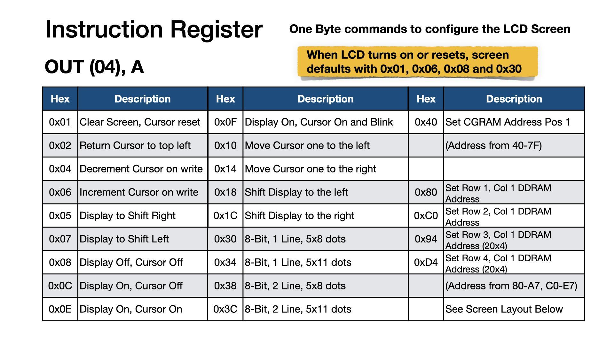
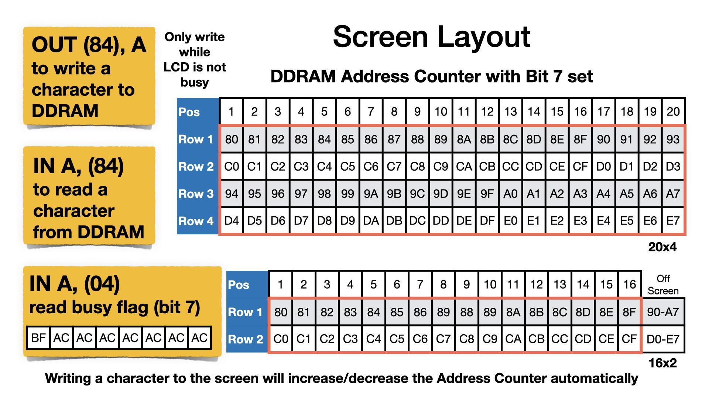
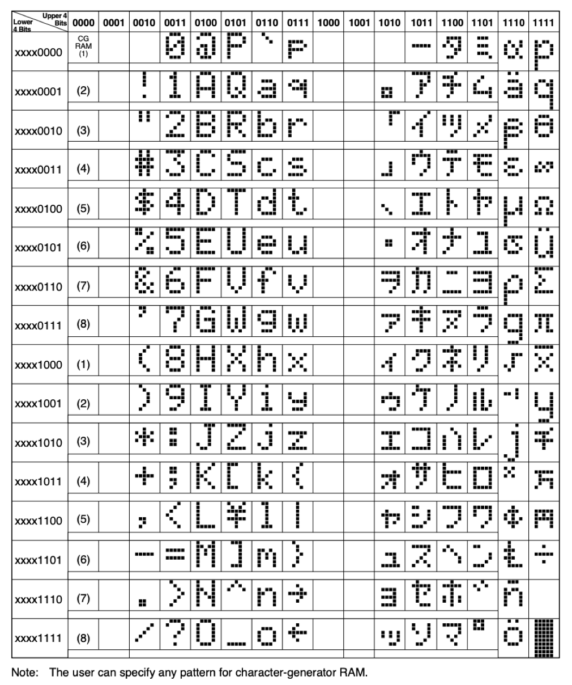
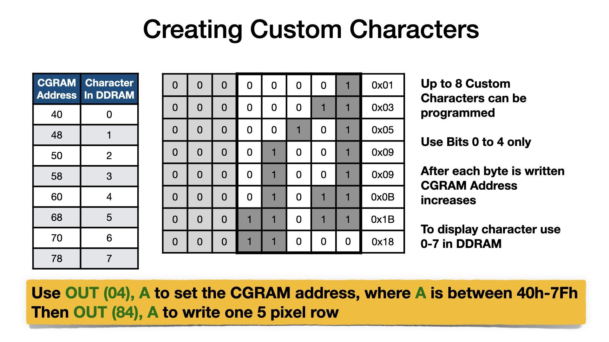
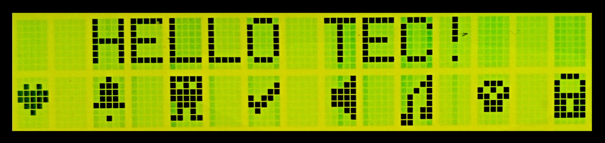

[← Quick Start Programs](12-quick-start-programs.md) | [Guide](index.md) | [Useful Links →](14-useful-links.md)

# Appendix

### Ports

```asm
 Port          Direction       Description

 00H           In              Keypad press encoder
                                  -   Bit 0-4 HexPad
                                  -   Bit 5 Function Key (Active Low)
                                  -   Bit 6-7 N/A

 01H           Out             Seven segment digits switch
                                  -   Bit 0-1 Data Segments
                                  -   Bit 2-5 Address Segments
                                  -   Bit 6 FTDI Rx (Out), Disco LED's
                                  -   Bit 7 Speaker

 02H           Out             Seven segment LED switch
                                  -   Bit 0 G segment
                                  -   Bit 1 F segment
                                  -   Bit 2 C segment
                                  -   Bit 3 D segment
                                  -   Bit 4 E segment
                                  -   Bit 5 DP segment
                                  -   Bit 6 B segment
                                  -   Bit 7 A segment

 03H           In              System Input
                                  -   Bit 0 Matrix Keyboard (DIP-3)
                                  -   Bit 1 Protect Mode (DIP-3)
                                  -   Bit 2 Expand Mode (DIP-3)
                                  -   Bit 3 Expand Status
                                  -   Bit 4 Cartridge Flag
                                  -   Bit 5 General Input
                                  -   Bit 6 Keypress Flag
                                  -   Bit 7 FTDI Tx (In)

 04H           In/Out          LCD Instruction

 05H           Out             LED 8x8 Matrix Horizontal (TEC Expander)

 06H           Out             LED 8x8 Matrix Vertical  (TEC Expander)

 07H           Out             Graphical LCD Instruction

 84H           In/Out          LCD Data
```

### Serial Connection
### Function Key Shortcuts

```asm
 Port          Direction       Description

 87H           Out             Graphical LCD Data

 F8H           In/Out          Spare  (TEC Expander & I/O Bus)

 F9H           In/Out          Spare  (TEC Expander & I/O Bus)

 FAH           In/Out          Spare (I/O Bus)

 FBH           In/Out          Spare (General I/O & I/O Bus)

 FCH           In/Out          RTC (Real Time Clock) (General I/O & I/O Bus)

 FDH           In/Out          SD (Secure Digital) Flash Card (General I/O)

 FEH           In              Matrix Keyboard

 FFH           Out             System Latch
                                  -   Bit 0 Shadow (Active Low)
                                  -   Bit 1 Protect
                                  -   Bit 2 Expand
                                  -   Bit 3 FF-D3 (Mem Bus)
                                  -   Bit 4 FF-D4 (Mem Bus)
                                  -   Bit 5 FF-D5 (Mem Bus)
                                  -   Bit 6 FF-D6 (Mem Bus)
                                  -   Caps Lock (Matrix Keyboard)
```

Serial Connection

```text
 Constant                                    Value

 FTDI to USB Serial Transmission             4800-8-N-2
                                                 -  Baud 4800, 8 Packet Bits
 Baud rate value can be modified                  -  No Parity, 2 Stop bits
 but other constants are the same.
```

Function Key Shortcuts

```text
 0  Quick Links       1-3    Addr. Jump        4   Intel Load        5   GLCD Term

 6  Save Session      7      Load Session      8   NOP's Fill        A   Restore Blk.

 B  Backup Blk.       C      Smart Copy        D   Diss. View        E   Expand

 F  Catalog           AD     Main Menu         +   Insert Byte       -   Delete Byte
```

### LCD Cheatsheet

Z80 instructions to communicate with the LCD screen are given as direct
commands.  IE: OUT (04),A. Mon3 also provides API routines that do the
same but also check for the LCD busy state.  If using direct port
instructions, the LCD busy flag is to be checked prior to the instruction call.
The example code provided uses the API routines.


To move the cursor to Row 2, Column 10 do LD A,0xC9  /  OUT (04),A
For IN A,(04), If Bit 7 is set, then LCD is Busy. Other bits are the current Address Counter






Character Table





Example Using CGRAM and DDRAM

```asm
_stringToLCD   .equ  13
_charToLCD     .equ  14
_commandToLCD  .equ  15
       ; LCD Setup
       ld c,_commandToLCD    4000  0E 0F    ;LCD Instruction API routine
       ld b,01H                   4002  06 01    ;Clear display
       rst 10H                    4004  D7       ;call API routine
       ld b,38H                   4005  06 38    ;8-Bit, 2 Lines, 5x8 Characters
       rst 10H                    4007  D7             ;call API routine
       ; Tell the LCD that next data will be to CGRAM
       ld b,40H                   4008  06 40          ;CGRAM entry
       rst 10H                    400A  D7             ;call API routine
       ; Save multiple characters to CGRAM using lookup table
       ld b,40H                   400B  06 40          ;8 Characters (8 bytes each)
       ld c,_charToLCD            400D  0E 0E          ;LCD Data API routine
       ld hl,403FH                400F  21 3F 40       ;LCD custom character table
loop1:
       ld a,(hl)                  4012  7E             ;get custom character byte
       inc hl                   4013  23       ;move to next item in table
       rst 10H                    4014  D7             ;call API routine
       djnz loop1                 4015  10 FB          ;continue for all 64 char bytes
       ; Display first line of text
       ld c,_commandToLCD    4017  0E 0F               ;LCD Instruction API routine
       ld b,82H                   4019  06 82          ;Move Cursor to Row 1, Col 3
       rst 10H                    401B  D7             ;call API routine
       ld hl,4034H                401C  21 34 40       ;ASCII text
       ld c,_stringToLCD          401F  0E 0D          ;LCD String API routine
       rst 10H                    4021  D7             ;call API routine
       ; Display customer characters
       ld c,_commandToLCD    4022  0E 0F               ;LCD Instruction API routine
       ld b,0C0H                  4024  06 C0          ;Move Cursor to Row 2, Col 1
       rst 10H                    4026  D7             ;call API routine
       ld b,08H                   4027  06 08          ;8 Characters
       ld c,_charToLCD            4029  0E 0E          ;LCD Data API routine
loop2:
       ld a,b                     402B  78             ;set A to current character
       rst 10H                    402C  D7             ;call API routine
       ld a,20H                   402D  3E 20          ;space character
       rst 10H                    402F  D7             ;call API routine
       djnz loop2                 4030  10 F9          ;continue for all 8 characters
       ; All Done, what for key press and exit
       rst 08H                    4032  CF             ;key wait and press (HALT)
       ret                  4033  C9       ;exit

               TEXT TABLE:   4034  48 45 4C 4C 4F 20 54 45 43 21 00  ; "HELLO TEC!"
               CHAR TABLE:   403F  00 0A 1F 1F 0E 04 00 00    ; Heart
                             4047  04 0E 0E 0E 1F 00 04 00    ; Bell
                             404F  1F 15 1F 1F 0E 0A 1B 00    ; Alien
                             4057  00 01 03 16 1C 08 00 00    ; Tick
                             405F  01 03 0F 0F 0F 03 01 00    ; Speaker
                             4067  01 03 05 09 09 0B 1B 18    ; Note
                             406F  00 0E 15 1B 0E 0E 00 00    ; Skull
                             4077  0E 11 11 1F 1B 1B 1F 00    ; Lock
```




[← Quick Start Programs](12-quick-start-programs.md) | [Guide](index.md) | [Useful Links →](14-useful-links.md)
