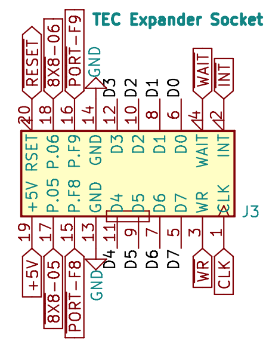
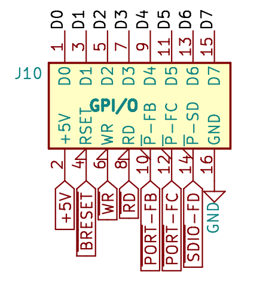
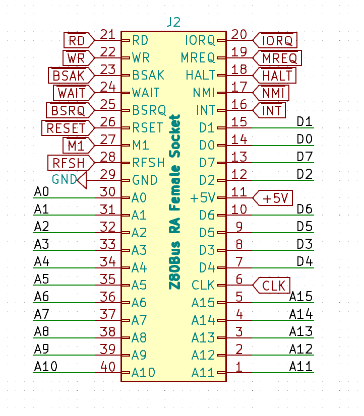
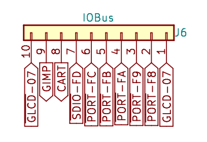
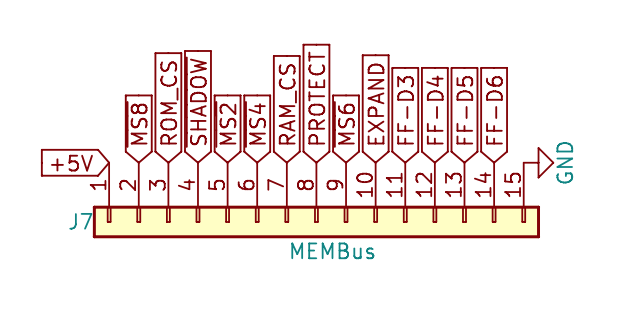
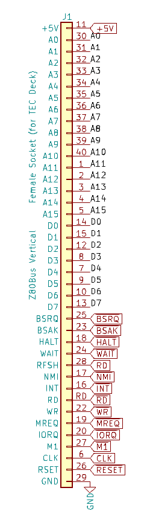

[← Appendix](13-appendix.md) | [Guide](index.md)

# Useful Links

TEC-1G GitHub Repository
https://github.com/MarkJelic/TEC-1G

TEC-1G Programs
https://github.com/tec1group/Software/tree/master/TEC-1G_software

TEC-1G Store (Purchase a TEC-1G and Add-On Boards)
https://www.tindie.com/stores/tec1/

TEC-1 Facebook Page
https://www.facebook.com/groups/tec1z80

Z80 Instruction Set Reference
https://clrhome.org/table/

Online Z80 Compiler and Debugger
https://www.asm80.com/

Rodney Zaks Programming the Z80
https://archive.org/details/ptz80

TEC Seven Segment Value Calculator
https://slartibartfastbb.itch.io/seven-segment-calculator

Ready? Z80 YouTube Channel (TEC related content)
https://www.youtube.com/@ReadyZ80

Mon3 video demonstration
https://youtu.be/0peIG2HKX3Q and https://youtu.be/nHBpxXI-YWY

TEC-1 GitHub Group
https://github.com/tec1group/

Talking Electronics Website including original TEC related magazines
https://www.talkingelectronics.com/te_interactive_index.html

## I/O Connectors

The connector diagrams below cover the Expander Socket, General Purpose
I/O, Z80 Bus Connector and TEC Deck Connectors. Note: pin 28 is `RD`.

[← Appendix](13-appendix.md) | [Guide](index.md)
