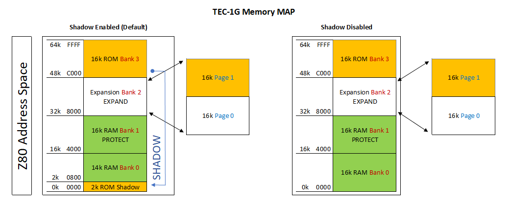
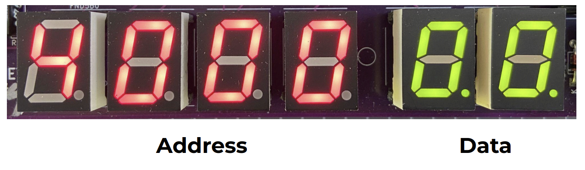
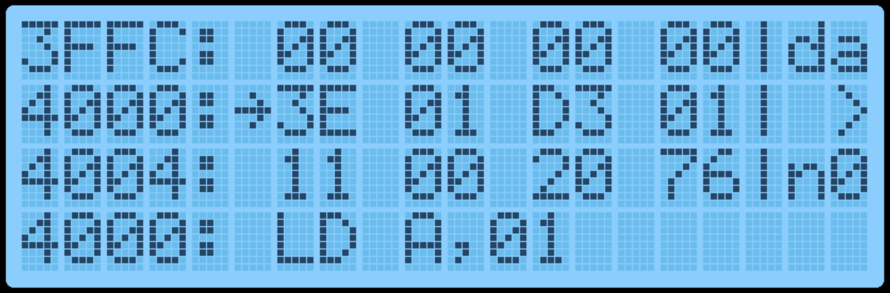
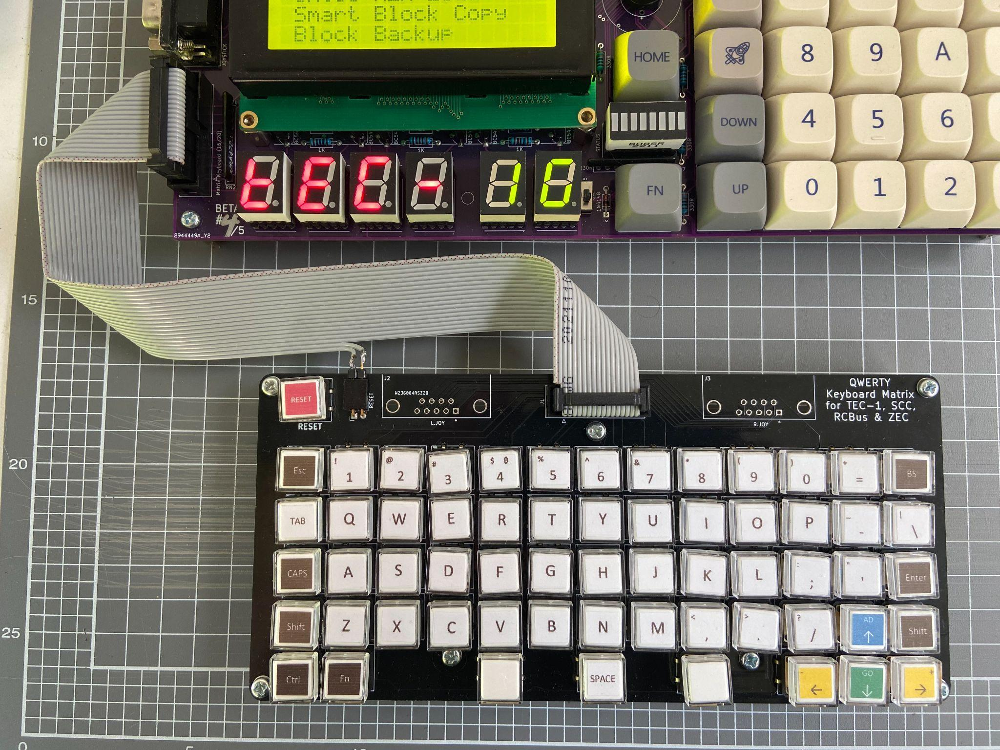

[← Basic Operation and Main Menu](01-basic-operation-and-main-menu.md) | [Guide](index.md) | [Tiny Basic →](03-tiny-basic.md)

# Memory Map and Data Entry Mode

## Memory Map

The table below outlines how the full 64Kb of address space is allocated on
the TEC-1G.

| Address | Contents | Type |
| --- | --- | --- |
| `0000H-00FFH` | Reserved for Z80 instructions | RAM |
| `0100H-07FFH` | PATA/SD Drive area or free RAM | RAM |
| `0800H-087FH` | Reserved for hardware stack | RAM |
| `0880H-0FFFH` | Reserved for monitor RAM | RAM |
| `1000H-3FFFH` | Free RAM | RAM |
| `4000H-7FFFH` | Free RAM (protected) | RAM |
| `8000H-BFFFH` | Expansion socket | RAM/ROM |
| `C000H-FFFFH` | Monitor ROM | ROM |

Some things to be considered are:

- Any RAM location can be updated, but it is highly recommended not to update Monitor Reserved RAM locations. This can/will cause undesirable effects on the running of the TEC. A Cold Reset will restore the TEC to its default running state (hopefully).
- The address range between 4000H-7FFFH is a special area that can be made READ ONLY. This is called a Protected area. Protect mode can be switched on using the configuration 3-DIP switch. If protect is enabled and code is being executed. No RAM update can be done in this range. This feature is designed to protect keyed-in code from being inadvertently erased by a rogue routine.
- The Expansion Socket on the TEC can have a 32Kb ROM or RAM inserted. Only 16Kb can be accessed at one time. To switch between high and low memory use the Expand switch on the configuration 3-DIP switch. The switch can also be overridden in software by toggling the Expand flag in the Settings menu or pressing Fn-E.
- If the monitor ROM is a legacy monitor, IE: Mon1, Mon2, JMon or BMon, The address range 0000H-07FFH will be READ ONLY and will emulate the same addressing that is used for that particular ROM. Shadow mode will be active by default and will be indicated by an illuminated LED segment on the system latch BAR component.

## Data Entry Mode

Data Entry Mode allows the user to enter Z80 Op Codes directly into the
TEC.  To access Data Entry Mode from the Main Menu, simply press the AD
key.  In this mode, the 4 left seven-segment displays will show the current
editing address, and the 2 right segments will display the byte at that
address.

The decimal place LED on the segments indicates which part, Address or
Data, is currently enabled for direct updates.   In the picture above, the dots
are on the Data segments.

The initial starting address is 4000H.   This address was chosen as it's within
the Protect RAM area.

### Basic Operation

To update a byte at an address, simply use the 0-F keys on the keypad.
After the byte has been entered, by default when the next byte is keyed,
the current editing address will automatically move to the next address
location.  This saves the user from pressing the Plus key after each byte is
added.  This option can be switched off in the Settings menu.

To navigate to another address, press the Plus or Minus key.  Or press the
AD key.  When using the AD key, the decimal place dots will move to the
address segments, indicating that the address field is updatable.  Key a
new 16-bit address using the 0-F keys.  Press the AD key to move back to
data updating mode.

And finally, to execute code, navigate to the address where the code starts
and press the GO key.  Protect mode will be honoured if switched on.  If the
code ends with a RET instruction (C9), execution will cleanly exit back to the
monitor.  The LCD screen will display the code start address while running.

One thing to note is that while data is being entered, the decimal place
LED on the data segments will change from displaying two lights to one.
The one light will indicate which Nibble (half byte) has been entered.   This
will help know if the whole byte has been entered or not.

If a mistake is made during data entry and the byte is to be re-entered.  To
stop the address from automatically incrementing, press the AD key twice.
This will reset the Nibble counter and allow a new byte to be entered.

If any key is held down, after a short period, the key will automatically
repeat.  This is mostly useful while holding down the Plus or Minus key to
quickly move to a new address.  But can also be used to populate memory
with 00 or FF or anything else.

### LCD Screen

In Data Entry Mode, the LCD Screen will display 12 bytes of data.  4 bytes
before the current editing location and 8 bytes from the current editing
location.  These bytes are displayed in groups of 4 (3 lines).  A right arrow
indicates the byte at the current editing location.

Displayed on the right side of the screen is the current edit mode, da=Data,
ad=Address, the current byte in LCD ASCII and the Nibble Counter.  The
picture below shows: The current address is 4000, Data mode, ">" = 3E in
ASCII and 0 nibble count.

On the 4th line of the LCD, the Z80 Assembly of the current OP Code(s) is
shown.  This can be useful to see what instruction is currently being keyed.

By displaying a range of bytes on the LCD, the user can check if the correct
bytes have been entered without individually moving to each address.

### Function Keys

Various extra options can be selected via the Function Key.  To use these
functions, hold the Fn key down and press any other key.

The routines attached to the Function Key are:

| Shortcut | Routine | Description |
| --- | --- | --- |
| `Fn-AD` | Main Menu | Display the Main Menu. |
| `Fn-0` | Save Current Address | Press `1`, `2` or `3` to save the current editing address in RAM so you can quickly jump to this location later. Three addresses can be saved. This is useful if your code is in a location other than `4000H` and the Reset button has been pressed. Press `AD` to exit the routine. The initial default address is `4000H`. |

| Shortcut | Routine | Description |
| --- | --- | --- |
| `Fn-1`, `Fn-2`, `Fn-3` | Quick jump to Address | Move the monitor's current editing location to the saved address set by `Fn-0`. |
| `Fn-4` | Intel Hex Load | Shortcut to the Main Menu routine. |
| `Fn-5` | Toggle GLCD Term | Use the GLCD as a terminal. |
| `Fn-6` | Save Session | Save all RAM to disk. Requires the PATA Drive or Micro SD Card Expansion boards. See Hard Drive Access for more information. |
| `Fn-7` | Restore Session | Load session from disk. Requires the PATA Drive or Micro SD Card Expansion boards. See Hard Drive Access for more information. |
| `Fn-8` | Fill with NOPs | Fill a selected area of memory with NOP instruction `00H`. Provide a from and to address and confirm by pressing `C`. |
| `Fn-A` | Restore from Backup | Reverse of the `Fn-B` routine. Defaults the To/From/Dest addresses to copy back from backup. Values can still be modified if necessary. |
| `Fn-B` | Block Backup | Shortcut to the Main Menu routine. |
| `Fn-C` | Smart Block Copy | Shortcut to the Main Menu routine. |
| `Fn-D` | Disassembly View | Switch between Data Entry View and Disassembly View. Disassembly View displays the next 4 assembly instructions. To move through the instructions, press the Plus or Minus keys. Data entry can still be done in this mode if desired. |

| Shortcut | Routine | Description |
| --- | --- | --- |
| `Fn-E` | Toggle Expand | Toggle the Expansion Socket Expand flag. This switches between the upper and lower memory of the 32Kb ROM/RAM in the expansion socket. |
| `Fn-F` | Catalog | Catalog the Drive and list files for loading. Requires the PATA Drive or Micro SD Card Expansion boards. |
| `Fn-Plus` | Insert Byte | Insert an NOP instruction at the current editing location and move all bytes up to max RAM by one address upwards. It will also do a Smart Block Copy to all moved bytes. This routine can add a Breakpoint (`F7`) or missing opcodes to an existing program. |
| `Fn-Minus` | Delete Byte | Delete a byte from the current editing location and move all bytes down by one address. It will also do a Smart Block Copy to all moved bytes. |
| `Fn-Reset` | Cold Reset | Perform a Cold Reset. This resets the TEC to its default state. |

## Matrix Keyboard

### Keyboard Connection

Mon3 will work with the TEC QWERTY or Mechanical Matrix Keyboard
Add-on.  The Keyboard is connected to the Keyboard Socket on the lower
left of the PCB.  How your Keyboard PCB is designed might affect which
pins can be connected.  Please view the TEC-1G Schematic for information
on pin configuration.

To activate the Keyboard, The Matrix switch on the 3-DIP switch is to be
turned on.  This activates the Matrix Keyboard and disables the onboard
Hex Keypad (except Reset).  Mon3 only maps keys present on the TEC-1G to
the Matrix Keyboard.

The Keyboard map to Hex Keypad is as follows:

| Hex Keypad | Matrix Keyboard | Hex Keypad | Matrix Keyboard |
| --- | --- | --- | --- |
| `AD` | `Esc` | `GO` | `Enter` |
| `Plus` | Right Arrow | `Minus` | Left Arrow |
| `0-F`, `Fn` | `0-F`, `Fn` keys | `Reset` | Reset key, if connected |

The full range of keys can be accessed and converted when developing
programs via the matrixScan and matrixToASCII API routines.

## Debugging Programs

### Breakpoints

Breakpoints can be inserted within a program which can help with viewing
the state of the CPU registers.  To break the execution of your code, insert
RST 30H or  F7 at the current address where the break should occur.

An easy way to insert a byte into an existing program is to press Fn-Plus.
This will insert a NOP instruction at the current address.  Then change this
byte to F7.

When the execution of code is interrupted with a breakpoint, the TEC will
pause and display register information on the LCD screen.

### Register Display

The contents of the Z80 CPU registers AF, HL, BC, DE, IX, IY, the Program
Counter and Stack Pointer are displayed.  CPU Flags are also displayed.
Flags that are set are in Capitals.  To continue code execution press the GO
key and to quit execution and return to the Monitor press the AD key.
Finally, to remove an inserted Breakpoint press Fn-Minus at the address
where the Breakpoint is.  This will remove the breakpoint and adjust the
code to its original state.

**Warning:** Breakpoints will be ignored if a connection is made between the `+` and `D5` pins on the G.IMP header. Do not connect the `+` pin to the `-` pin on the G.IMP header. This will short out the TEC.

[← Basic Operation and Main Menu](01-basic-operation-and-main-menu.md) | [Guide](index.md) | [Tiny Basic →](03-tiny-basic.md)
