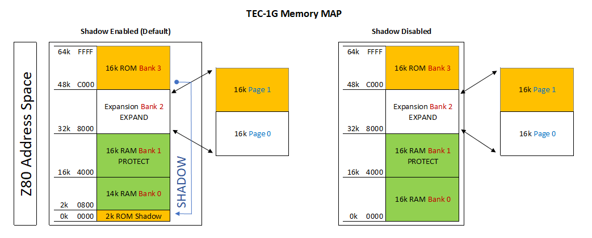
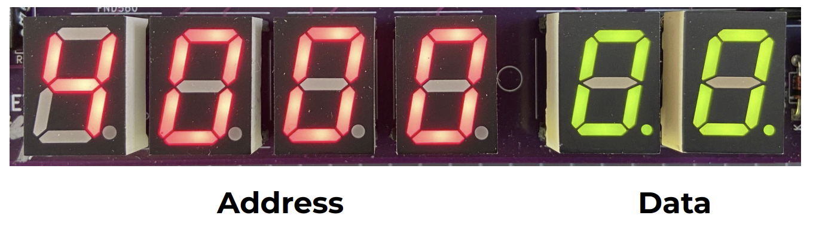
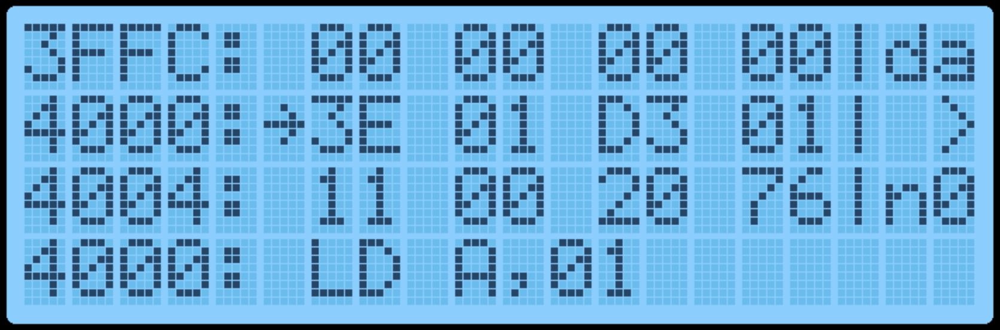
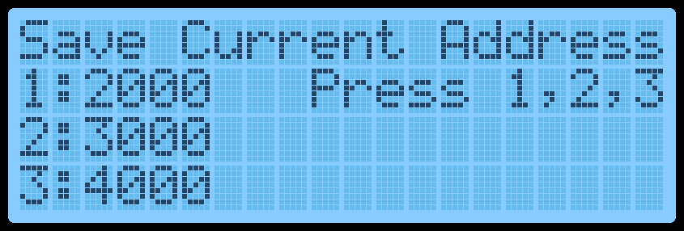
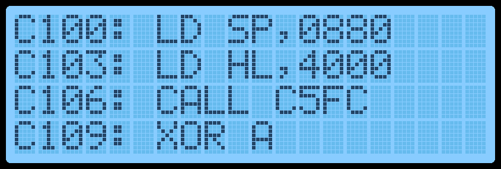
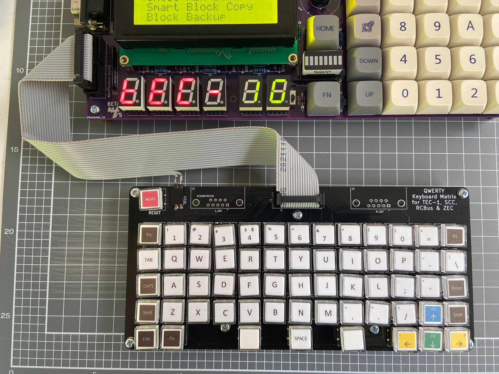
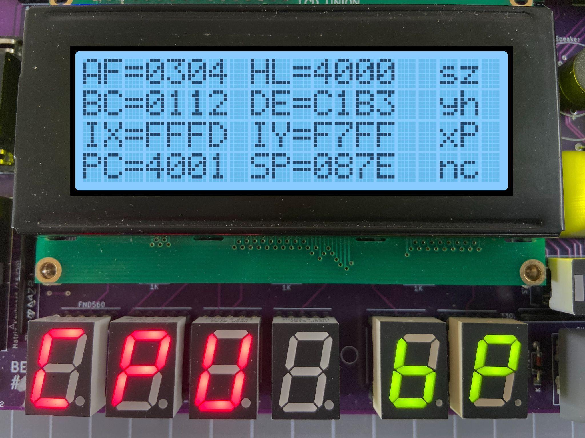

[← Basic Operation and Main Menu](01-basic-operation-and-main-menu.md) | [Guide](index.md) | [Tiny Basic →](03-tiny-basic.md)

# Memory Map and Data Entry Mode

## Memory Map

The table below outlines how the full 64Kb of address space is allocated on
the TEC-1G.

| Address | Contents | Type |
| --- | --- | --- |
| `0000H-00FFH` | Reserved for Z80 instructions | RAM |
| `0100H-07FFH` | PATA/SD Drive area or free RAM | RAM |
| `0800H-087FH` | Reserved for hardware stack | RAM |
| `0880H-0FFFH` | Reserved for monitor RAM | RAM |
| `1000H-3FFFH` | Free RAM | RAM |
| `4000H-7FFFH` | Free RAM (protected) | RAM |
| `8000H-BFFFH` | Expansion socket | RAM/ROM |
| `C000H-FFFFH` | Monitor ROM | ROM |

Some things to be considered are:

- Any RAM location can be updated, but it is highly recommended not to update Monitor Reserved RAM locations. This can/will cause undesirable effects on the running of the TEC. A Cold Reset will restore the TEC to its default running state (hopefully).
- The address range between 4000H-7FFFH is a special area that can be made READ ONLY. This is called a Protected area. Protect mode can be switched on using the configuration 3-DIP switch. If protect is enabled and code is being executed. No RAM update can be done in this range. This feature is designed to protect keyed-in code from being inadvertently erased by a rogue routine.
- The Expansion Socket on the TEC can hold a 32Kb ROM or RAM, of which 16Kb is accessible at one time. The Expand position on the configuration DIP switch selects the low or high half. Software can override it through the Expand flag in Settings or with Fn-E.
- If the monitor ROM is a legacy monitor, IE: Mon1, Mon2, JMon or BMon, The address range 0000H-07FFH will be READ ONLY and will emulate the same addressing that is used for that particular ROM. Shadow mode will be active by default and will be indicated by an illuminated LED segment on the system latch BAR component.

## Data Entry Mode

Data Entry Mode allows Z80 opcodes to be entered directly into the TEC.
The AD key opens it from the Main Menu. In this mode, the four left
seven-segment displays show the current
editing address, and the 2 right segments will display the byte at that
address.

The decimal place LED on the segments indicates which part, Address or
Data, is currently enabled for direct updates.   In the picture above, the dots
are on the Data segments.

The initial starting address is 4000H.   This address was chosen as it's within
the Protect RAM area.

### Basic Operation

The 0-F keys update the byte at the current address. After the byte has
been entered, by default when the next byte is keyed,
the current editing address will automatically move to the next address
location.  This saves the user from pressing the Plus key after each byte is
added.  This option can be switched off in the Settings menu.

The Plus and Minus keys move to adjacent addresses. The
AD key instead moves the decimal-place dots to the address segments,
making the address field editable. The 0-F keys then enter a new
16-bit address, and a second press of AD returns to data updating.

Code execution begins when GO is pressed at the program's starting
address. Protect mode is honoured if switched on. If the
code ends with a RET instruction (C9), execution will cleanly exit back to the
monitor.  The LCD screen will display the code start address while running.

One thing to note is that while data is being entered, the decimal place
LED on the data segments will change from displaying two lights to one.
The one light will indicate which Nibble (half byte) has been entered.   This
will help know if the whole byte has been entered or not.

When a byte needs to be re-entered, pressing AD twice prevents the
automatic address increment. This resets the nibble counter and allows a
replacement byte.

If any key is held down, after a short period, the key will automatically
repeat.  This is mostly useful while holding down the Plus or Minus key to
quickly move to a new address.  But can also be used to populate memory
with 00 or FF or anything else.

### LCD Screen

In Data Entry Mode, the LCD Screen will display 12 bytes of data.  4 bytes
before the current editing location and 8 bytes from the current editing
location.  These bytes are displayed in groups of 4 (3 lines).  A right arrow
indicates the byte at the current editing location.

Displayed on the right side of the screen is the current edit mode, da=Data,
ad=Address, the current byte in LCD ASCII and the Nibble Counter.  The
picture below shows: The current address is 4000, Data mode, ">" = 3E in
ASCII and 0 nibble count.

On the 4th line of the LCD, the Z80 Assembly of the current OP Code(s) is
shown.  This can be useful to see what instruction is currently being keyed.

By displaying a range of bytes on the LCD, the user can check if the correct
bytes have been entered without individually moving to each address.

### Function Keys

The Function key provides extra options. Holding Fn while pressing another
key selects the corresponding function.

The routines attached to the Function Key are:

| Shortcut | Routine | Description |
| --- | --- | --- |
| `Fn-AD` | Main Menu | Display the Main Menu. |
| `Fn-0` | Save Current Address | Keys `1`, `2` and `3` select one of three RAM slots for the current editing address. The saved address provides a quick return to code outside `4000H` after Reset. `AD` exits the routine. The initial default address is `4000H`. |

| Shortcut | Routine | Description |
| --- | --- | --- |
| `Fn-1`, `Fn-2`, `Fn-3` | Quick jump to Address | Moves the monitor's current editing location to the saved address set by `Fn-0`. |
| `Fn-4` | Intel Hex Load | Shortcut to the Main Menu routine. |
| `Fn-5` | Toggle GLCD Term | Uses the GLCD as a terminal. |
| `Fn-6` | Save Session | Saves all RAM to disk. Requires the PATA Drive or Micro SD Card Expansion boards. Hard Drive Access provides more information. |
| `Fn-7` | Restore Session | Loads a session from disk. Requires the PATA Drive or Micro SD Card Expansion boards. Hard Drive Access provides more information. |
| `Fn-8` | Fill with NOPs | Fills a selected area of memory with NOP instruction `00H`. The routine accepts a start address and an end address, then `C` confirms the operation. |
| `Fn-A` | Restore from Backup | Reverses the `Fn-B` routine. The To/From/Dest addresses default to values that copy from the backup, but they can still be modified. |
| `Fn-B` | Block Backup | Shortcut to the Main Menu routine. |
| `Fn-C` | Smart Block Copy | Shortcut to the Main Menu routine. |
| `Fn-D` | Disassembly View | Switches between Data Entry View and Disassembly View. Disassembly View displays the next 4 assembly instructions. Plus and Minus move through the instructions. Data entry remains available in this mode. |

| Shortcut | Routine | Description |
| --- | --- | --- |
| `Fn-E` | Toggle Expand | Toggle the Expansion Socket Expand flag. This switches between the upper and lower memory of the 32Kb ROM/RAM in the expansion socket. |
| `Fn-F` | Catalog | Catalog the Drive and list files for loading. Requires the PATA Drive or Micro SD Card Expansion boards. |
| `Fn-Plus` | Insert Byte | Insert an NOP instruction at the current editing location and move all bytes up to max RAM by one address upwards. It will also do a Smart Block Copy to all moved bytes. This routine can add a Breakpoint (`F7`) or missing opcodes to an existing program. |
| `Fn-Minus` | Delete Byte | Delete a byte from the current editing location and move all bytes down by one address. It will also do a Smart Block Copy to all moved bytes. |
| `Fn-Reset` | Cold Reset | Perform a Cold Reset. This resets the TEC to its default state. |

## Matrix Keyboard

### Keyboard Connection

Mon3 will work with the TEC QWERTY or Mechanical Matrix Keyboard
Add-on.  The Keyboard is connected to the Keyboard Socket on the lower
left of the PCB. The keyboard PCB design determines which pins can be
connected; the TEC-1G schematic documents the pin configuration.

The Matrix position on the three-way DIP switch activates the keyboard and
disables the onboard
Hex Keypad (except Reset).  Mon3 only maps keys present on the TEC-1G to
the Matrix Keyboard.

The Keyboard map to Hex Keypad is as follows:

| Hex Keypad | Matrix Keyboard | Hex Keypad | Matrix Keyboard |
| --- | --- | --- | --- |
| `AD` | `Esc` | `GO` | `Enter` |
| `Plus` | Right Arrow | `Minus` | Left Arrow |
| `0-F`, `Fn` | `0-F`, `Fn` keys | `Reset` | Reset key, if connected |

The full range of keys can be accessed and converted when developing
programs via the matrixScan and matrixToASCII API routines.

## Debugging Programs

### Breakpoints

Breakpoints inserted into a program expose the CPU register state. `RST 30H`,
whose opcode is F7, goes at the address where execution should pause.

Fn-Plus inserts a NOP instruction at the current address. Changing
that byte to F7 creates the breakpoint without shifting the rest of the
program manually.

When the execution of code is interrupted with a breakpoint, the TEC will
pause and display register information on the LCD screen.

### Register Display

The contents of the Z80 CPU registers AF, HL, BC, DE, IX, IY, the Program
Counter and Stack Pointer are displayed.  CPU Flags are also displayed.
Flags that are set appear in capitals. GO continues execution, while
AD stops it and returns to the monitor. At the breakpoint address,
Fn-Minus removes the inserted byte and restores the original code
alignment.

**Warning:** Breakpoints will be ignored if a connection is made between the `+` and `D5` pins on the G.IMP header. Do not connect the `+` pin to the `-` pin on the G.IMP header. This will short out the TEC.

[← Basic Operation and Main Menu](01-basic-operation-and-main-menu.md) | [Guide](index.md) | [Tiny Basic →](03-tiny-basic.md)
