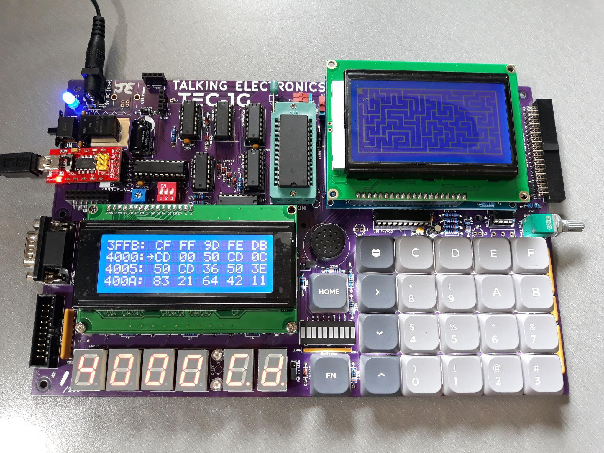
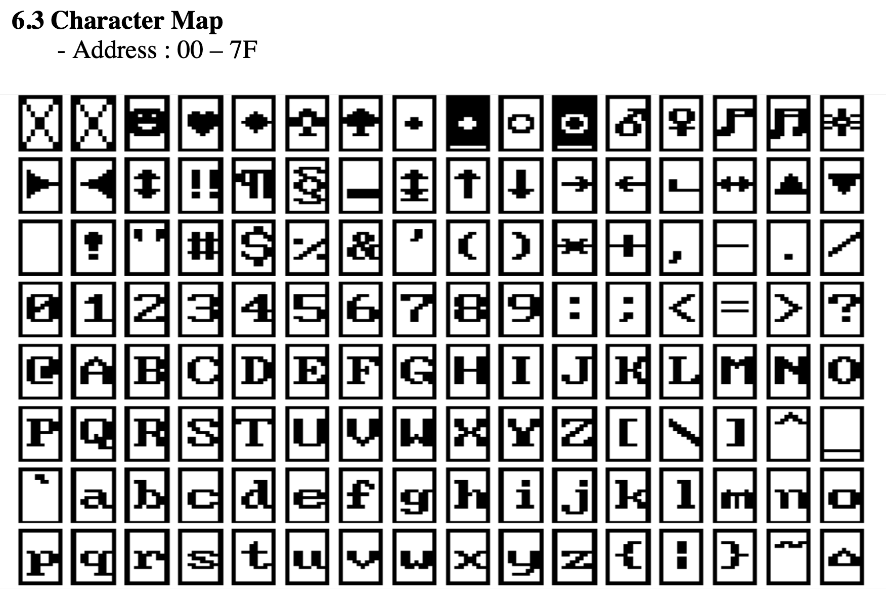
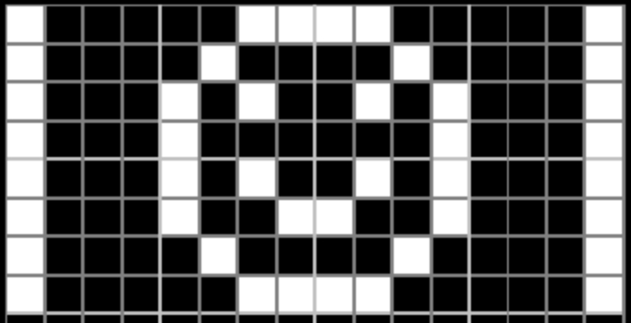
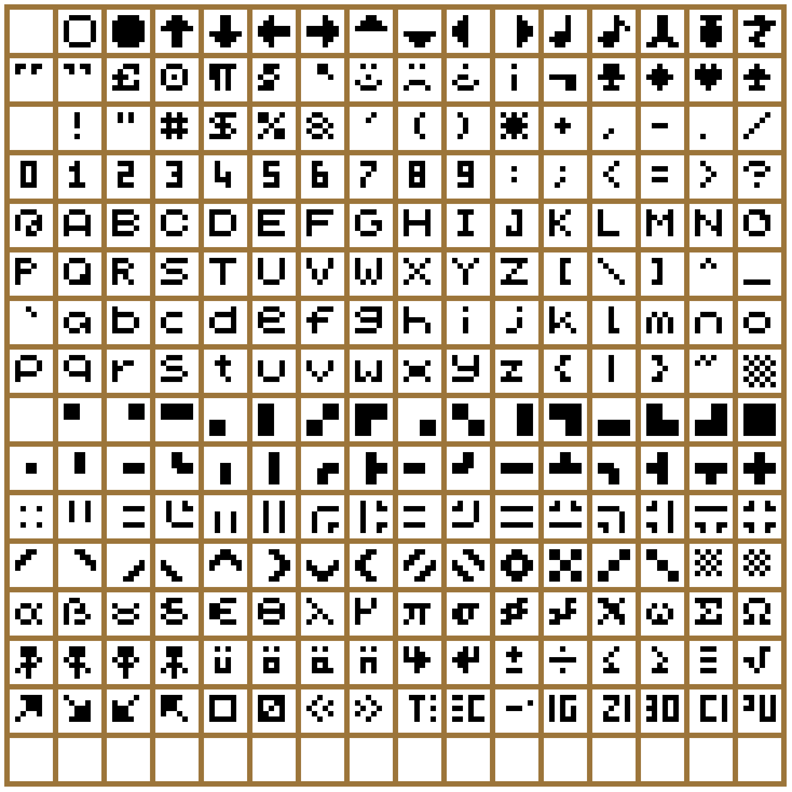
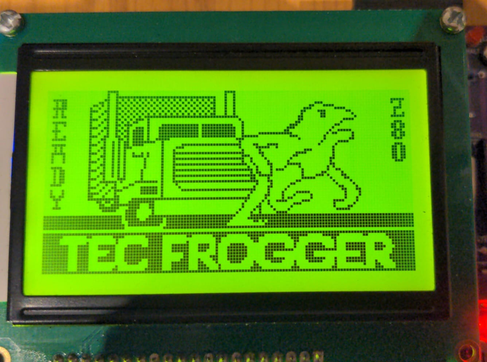
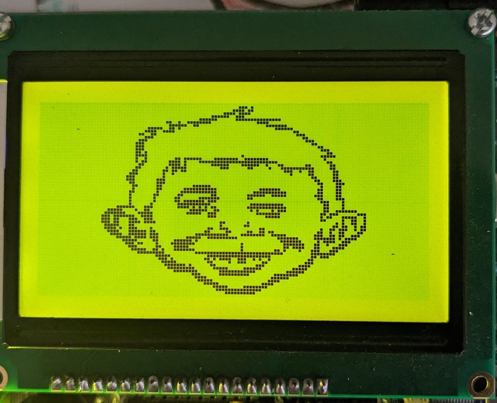

[← Real Time Clock Add-On](06-real-time-clock.md) | [Guide](index.md) | [Hard Drive Access →](08-hard-drive-access.md)

# Graphical LCD Add-On

Mon3 includes a Graphical LCD (GLCD) library that will work with the
TEC-DECK Graphical LCD PCB Add-On.  If the Graphical LCD is installed on
the TEC-1G via the TEC-DECK headers, special GLCD API calls can be used
to interface with the GLCD.  The library is for GLCDs with the **ST7920** chip.



The GLCD library contains a variety of routines that can produce simple
shapes and lines. These include text, lines, rectangles, circles and pixels.


## General Conventions

The register A holds the API Call number.  All other registers except the IX
register can be used as parameters if needed.  Executing a RST 18H or DF
calls the GLCD API.


### General Interface

```asm
ld a,[API Call Number]
rst 18H
```

The following code will draw a box and write text to the GLCD

```asm
          ; Initialise and set to Graphics Mode
3E 00     ld a,0          ; Initialise GLCD
DF        rst 18H
3E 04     ld a,4          ; Graphics Mode
DF        rst 18H

          ; Draw Box - Box Outline Example
01 20 00  ld bc,0020H     ; X0, Y0
11 3F 7F  ld de,7F3FH     ; X1, Y1
3E 06     ld a,6 ; Draw a outline box from X0,Y0 to X1,Y1
DF        rst 18H

          ; Plot Graphics to LCD Screen (must do)
3E 0C     ld a,12         ; Plot To LCD
DF        rst 18H

          ;Write Text to the Screen
3E 05     ld a,5          ; Text Mode
DF        rst 18H
0E 01     ld c,01H        ; Row 1
3E 0D     ld a,13         ; Print String
DF        rst 18H
54 45 43 2D 31 47 00 .db "TEC-1G",0
```


initLCD must be called at the start of every program.  The GLCD has two
modes, Text and Graphics.  Both Text and Graphics can be displayed at the
same time.  These modes must be selected before the drawing or text
routine.  Also, plotToLCD must be called to display any graphics drawn to
the screen.  The above example adheres to these principles.

## GLCD API Call List

| Routine | # | 0x |
| --- | ---: | --- |
| `initLCD` | 0 | 0 |
| `clearGBUF` | 1 | 01 |
| `clearGrLCD` | 2 | 02 |
| `clearTxtLCD` | 3 | 03 |
| `setGrMode` | 4 | 04 |
| `setTxtMode` | 5 | 05 |
| `drawBox` | 6 | 06 |
| `drawLine` | 7 | 07 |
| `drawCircle` | 8 | 08 |
| `drawPixel` | 9 | 09 |
| `fillBox` | 10 | 0A |
| `fillCircle` | 11 | 0B |
| `plotToLCD` | 12 | 0C |
| `printString` | 13 | 0D |
| `printChars` | 14 | 0E |
| `delayUS` | 15 | 0F |
| `delayMS` | 16 | 10 |
| `setBufClear` | 17 | 11 |
| `setBufNoClear` | 18 | 12 |
| `clearPixel` | 19 | 13 |
| `flipPixel` | 20 | 14 |
| `drawGraphic` | 21 | 15 |
| `invGraphic` | 22 | 16 |
| `initTerminal` | 23 | 17 |
| `sendCharToLCD` | 24 | 18 |
| `sendStringToLCD` | 25 | 19 |
| `sendRegToLCD` | 26 | 1A |
| `sendHLToLCD` | 27 | 1B |
| `setCursor` | 28 | 1C |
| `getCursor` | 29 | 1D |
| `displayCursor` | 30 | 1E |
| `autoLF` | 31 | 1F |
| `underline` | 32 | 20 |
| `plotAlways` | 33 | 21 |


## GLCD API Configure Calls

### initLCD #0 (00H)
Initialise the LCD Screen.  This routine is to be called before any other
routine.
- Input: nothing
- Destroy: All

### clearGBUF #1 (01H)
Clear the Graphics Buffer.  The Graphics Buffer or GBUF is the internal
memory area that contains pixel data for the LCD.  The drawing routines
write data to the GBUF.  Once all pixels are set, this buffer is then plotted to
the LCD with the plotToLCD Routine.  Clearing the GBUF is a good way to
ensure the pixel area is empty.
- Input: nothing
- Destroy: All

### clearGrLCD #2 (02H)
Clear the Graphics LCD Screen.  This routine clears the GDRAM or Graphics
screen on the LCD.
- Input: nothing
- Destroy: All

### clearTxtLCD #3 (03H)
Clear the Text LCD Screen.  This routine clears the DDRAM or Text screen
on the LCD.
- Input: nothing
- Destroy: All

### setGrMode #4 (04H)
Set the LCD to Graphics Mode.  This routine puts the LCD in Graphics mode
(Extended Instructions). Any further instructions to the LCD will be for the
graphics screen.  It only needs to be called once if multiple graphics
routines are used.
- Input: nothing
- Destroy: AF,DE

### setTxtMode #5 (05H)
Set the LCD to Text Mode.  This routine puts the LCD in Text mode (Basic
Instructions). Any further instructions to the LCD will be for the text screen.
It only needs to be called once if multiple text routines are used.
- Input: nothing
- Destroy: AF,DE

## GLCD API Graphics Calls

### drawBox #6 (06H)
Draws a single-line rectangle between two points X1, Y1 and X2, Y2.
- Input: `B` = X1-coordinate (0-127)
- Input: `C` = Y1-coordinate (0-63)
- Input: `D` = X2-coordinate (0-127)
- Input: `E` = Y2-coordinate (0-63)
- Destroy: `AF`, `HL`

```asm
ld bc,0020H    ;X0, Y0
ld de,7F3FH    ;X1, Y1
ld a,6         ;drawBox
rst 18H
```

### drawLine #7 (07H)
Draws a straight line between X1, Y1 and X2, Y2.  Uses the
[Bresenham Line drawing algorithm](http://members.chello.at/~easyfilter/bresenham.html).
- Input: `B` = X1-coordinate (0-127)
- Input: `C` = Y1-coordinate (0-63)
- Input: `D` = X2-coordinate (0-127)
- Input: `E` = Y2-coordinate (0-63)
- Destroy: all

```asm
ld bc,0010H    ;X0, Y0
ld de,7F30H    ;X1, Y1
ld a,7         ;drawLine
rst 18H
```

### drawCircle #8 (08H)
Draw a circle from midpoint to radius.
- Input: `B` = Mid-X-coordinate (0-127)
- Input: `C` = Mid-Y-coordinate (0-63)
- Input: `E` = radius (1-63)
- Destroy: all

```asm
ld bc,0818H    ;Mid X, Mid Y
ld e,08H       ;Radius
ld a,8         ;drawCircle
rst 18H
```

### drawPixel #9 (09H)
Draws a single Pixel.
- Input: `B` = X-coordinate (0-127)
- Input: `C` = Y-coordinate (0-63)
- Destroy: `AF`, `HL`

```asm
ld bc,4020H    ;X,Y
ld a,9         ;drawPixel
rst 18H
```

### fillBox #10 (0AH)
Draws a filled rectangle between X1, Y1 and X2, Y2.
- Input: `B` = X1-coordinate (0-127)
- Input: `C` = Y1-coordinate (0-63)
- Input: `D` = X2-coordinate (0-127)
- Input: `E` = Y2-coordinate (0-63)
- Destroy: `AF`, `HL`

```asm
ld bc,0020H    ;X0, Y0
ld de,7F3FH    ;X1, Y1
ld a,10        ;fillBox
rst 18H
```

### fillCircle #11 (0BH)
Draws a filled circle from a midpoint to a radius.  This routine iteratively
calls the drawCircle routine increasing the radius until it equals the
register E.  There might be gaps in the filled circle, but hey it looks just like
what you get on a BASIC program.
- Input: `B` = Mid-X-coordinate (0-127)
- Input: `C` = Mid-Y-coordinate (0-63)
- Input: `E` = radius (1-63)
- Destroy: all

```asm
ld bc,1018H    ;Mid X, Mid Y
ld e,08H       ;Radius
ld a,11        ;fillCircle
rst 18H
```

### plotToLCD #12 (0CH)
This routine draws the Graphics Buffer or GBUF to the Graphics LCD
screen.  It is usually called after one of the drawing routines is called.  This
routine must be called for any graphics to appear on the GLCD.  After
plotting the GBUF is cleared.  Use setBufNoClear to retain the GBUF.
- Input: nothing
- Destroy: All

## GLCD API Text Calls

### printString #13 (0DH)
Prints ASCII text on a given row.   There are 4 text rows on the LCD screen.
The text is to be defined directly after the RST 18H routine and is to be
terminated with a zero.
- Input: `C` = row number (0-3)
- Input: text string on the next line, terminated with zero
- Destroy: all

```asm
ld c,02H       ;Row 2
ld a,13        ;printString
rst 18H
.db 02H, " This Text ", 1BH ,00H
```



There are 128 characters that are available from 00H-7FH.  Conveniently,
Alphanumeric characters align with the ASCII table.

### printChars #14 (0EH)
Print Characters on the screen in a given row and column.  This routine is
similar to the one above but character row and column placement can be
made.  Characters to be printed are to be terminated with a zero.

Even though there are 16 columns, only every second column can be
written to and two characters are to be printed.  IE: if one character is to be
printed in column 2, then set B=0 and print " x", putting a space before
the character.
- Input: `B` = column (0-7)
- Input: `C` = row (0-3)
- Input: `HL` = start address of text data
- Destroy: all; `HL` will be at the end of the text data

```asm
ld hl,TEXT_DATA
ld bc,0102H     ;Column 1, Row 2
ld a,14         ;printChars
rst 18H
...
TEXT_DATA:
.db "Hello!",0
```

## GLCD API Utility Calls

### delayUS #15 (0FH)
Delay loop for LCD to complete its instruction.  Every time a command is
sent to the LDC, it requires a small amount of time to complete that
operation.  IE: setting extended instruction mode.  The time needed for
most operations is defined in the LDC specification.  It is usually around
72us.  This routine is used internally, but can also be used directly.  The
delay time depends on how fast the CPU is running.
- Input: nothing
- Destroy: AF,DE

```asm
  ld a,02H    ;Home instruction
  out (07),a  ;send instruction to GLCD
ld a,15     ;delayUS
rst 18H
```

### delayMS #16 (10H)
This is the same as the above routine, but the delay can be software
controlled.
- Input: DE = delay value
- Destroy: AF,DE

```asm
  ld a,01H    ;Clear instruction
  out (07),a  ;send instruction to GLCD
  ld de,0050H ;longer delay
ld a,16     ;delayMS
rst 18H
```

### setBufClear #17 (11H)
On every plotToLCD call, clear the graphics buffer GBUF.  Calling this
routine will clear the graphics buffer on every draw to the LCD.  This is
useful if doing animation that requires a new drawing to be displayed on
every plot or frame.
- Input: none
- Destroy: AF

### setBufNoClear #18 (12H)
Do not clear the graphics buffer on every plotToLCD.  Calling this routine
will not clear the graphics buffer on every draw to LCD.  This is useful for
adding graphics data to an existing drawing.
- Input: none
- Destroy: AF

### clearPixel #19 (13H)
Removes or clears a single Pixel from the LCD.
- Input: `B` = X-coordinate (0-127)
- Input: `C` = Y-coordinate (0-63)
- Destroy: `AF`, `HL`

```asm
ld bc,4020H     ;X,Y
ld a,19         ;clearPixel
rst 18H
```

### flipPixel #20 (14H)
Inverts a single Pixel.  If the Pixel is on, it will turn off. If the Pixel is off, it will
turn on.
- Input: `B` = X-coordinate (0-127)
- Input: `C` = Y-coordinate (0-63)
- Destroy: `AF`, `HL`

```asm
ld bc,4020H     ;X,Y
ld a,20         ;flipPixel
rst 18H
```

## GLCD API Drawing Calls

### drawGraphic #21 (15H)
Draw an ASCII character or Sprite to the GLCD at the current cursor.  ASCII
characters are 6x6 or 5x5 Pixels and most have a gap to the right and
bottom for spacing. plotToLCD is still required to be called after all
graphics have been drawn.

Graphics data is in the format of up to 16 bytes across and 64 bytes down,
where a BIT set will indicate a pixel to be drawn.  If graphics are less than 8
bits wide, then bits are read from the least significant bit.
- Input: `D` = ASCII number
- Input: if `D = 0`, then `HL` = address of graphic data
- Input: if `D = 0`, then `B` = width of graphic in pixels (1-128)
- Input: if `D = 0`, then `C` = height of graphic in pixels (1-64)
- Destroy: all

```asm
ld a,00H        ;Custom graphic
ld hl,picture   ;Data table address
ld b,16         ;B=16 pixels wide
ld c,8          ;C=8 pixels down
ld a,21         ;drawGraphic
rst 18H
ld a,12         ;plotToLCD
rst 18H
```

Graphic data for `picture`:

```asm
picture:
    .db 10000011b,11000001b
    .db 10000100b,00100001b
    .db 10001010b,01010001b
    .db 10001000b,00010001b
    .db 10001010b,01010001b
    .db 10001001b,10010001b
    .db 10000100b,00100001b
    .db 10000011b,11000001b
```

This example displays the image from the current cursor position.



Here is the complete list of ASCII characters 00H-FFH that can be displayed.
Each character is up to 6 x 6 pixels and is numbered left to right, top to
bottom.  The characters align with the standard ASCII Table.



### invGraphic #22 (16H)
Inverse graphics printing.  Calling this routine will TOGGLE the inverse
drawing flag.  The initial state is normal.  If in inverse mode, a pixel drawn
using the drawGraphic routine is displayed if a BIT is not set.
- Input: none
- Output: none
- Destroy: A

### underline #32 (20H)
Underline the graphics printing.  Calling this routine will TOGGLE the
underline drawing flag.  The initial state is off.  If in underline mode, the last
pixel row will be set as on.  Only applicable when using the drawGraphic
routine.
- Input: none
- Output: none
- Destroy: A



*The TEC Frogger game uses the GLCD and its API routines.*

## GLCD API Terminal Emulator Calls

### initTerminal #23 (17H)
Initialise the GLCD for terminal emulation.  This routine is to be called
before any TERMINAL routine is called.  It will set graphics and scroll
buffers.  It also Clears the GBUF, sets the cursor to top left and displays the
cursor.  This routine will also call initLCD.
- Input: none
- Output: none
- Destroy: All

### autoLF #31 (1FH)
Automatic Line Feed when the cursor reaches the end of the row.  When
the cursor passes the last column, character entered via the
sendCharToLCD will either wrap around, or start on a new line.
- Input: C = 0, Auto LF set, C <> 0, not set
- Output: none
- Destroy: A

### plotAlways #33 (21H)
When sendCharToLCD is called, determine if the character should be sent
immediately to the GLCD or be held in a buffer.  If held in a buffer, call
plotToLCD to update the GLCD.  The default is ON and characters will be
sent immediately.  Turning this flag OFF can speed up the output if
multiple characters are sent to the screen.  Once sent, characters can be
plotted all at once.  If displaying characters directly from a keyboard input,
this flag should be set ON.
- Input: C = 0, Plot Always set, C non zero, not set
- Output: none
- Destroy: A

### sendCharToLCD #24 (18H)
Send or handle ASCII characters to the GLCD screen.  This routine displays
ASCII characters to the GLCD screen and handles some special control
characters.  It also handles scrolling history of 10 lines.  Characters are
drawn at the current cursor position.  The Cursor will increment when a
character is drawn.  Characters will automatically be displayed on the LCD.
Some special characters are:
- `CR` / `0DH` moves the cursor down and resets its column.
- `LF` / `0AH` is ignored.
- `FF` / `0CH` clears the terminal and scroll buffer; destroys `AF`, `BC`, `DE`, `HL`.
- `BS` / `08H` deletes the character at the cursor and moves the cursor back one.
- `HT` / `09H` tabs 4 spaces.
- `UP` / `05H` scrolls up one line if possible.
- `DN` / `06H` scrolls down one line if possible.
- Input: `C` = ASCII character to send to the LCD screen, or `C = 0` to draw the cursor only
- Destroy: all

```asm
ld c,65         ;ASCII 'A'
ld a,24         ;sendCharToLCD
rst 18H
ld c,0DH        ;Carriage Return
ld a,24         ;sendCharToLCD
rst 18H
```

### sendStringToLCD #25 (19H)
Send a string of characters to the GLCD.  Prints a string pointed by DE at
the current cursor.   It stops printing and returns when either a CR is
printed or when the next byte is the same as what is in register C.
- Input: `C` = character to stop printing string
- Input: `DE` = address of string to print
- Destroy: all

```asm
ld de,text      ;Text to display
ld c,0          ;terminate on zero
ld a,25         ;sendStringToLCD
rst 18H
text: .db "Hello TEC-1G!",0
```

### sendRegToLCD #26 (1AH)
Display a byte or register in ASCII on the GLCD at the current cursor
- Input: C = byte to convert and display
- Destroy: ALL
```asm
ld c,a          ;display register A
ld a,26         ;sendRegToLCD
rst 18H
ld c,7BH        ;display '7B'
ld a,26         ;sendRegToLCD
rst 18H
```
### sendHLToLCD #27 (1BH)
Display the register HL in ASCII on the GLCD at the current cursor
- Input: HL = 2-byte register to convert and display
- Destroy: ALL

```asm
ld hl,0A6CH     ;display '0A6C'
ld a,27         ;sendHLToLCD
rst 18H
```
### setCursor #28 (1CH)
Set the Graphic cursor position for Terminal Emulation.  Update is ignored
if either X,Y input is out of bounds.
- Input: `B` = X position in pixels (0-127)
- Input: `C` = Y position in pixels (0-63)
- Destroy: `A`

```asm
ld bc,4020H     ;cursor at X=64, Y=32 (middle of screen)
ld a,28         ;setCursor
rst 18H
```

### getCursor #29 (1DH)
Get the current cursor position

- Input: none
- Output: `B` = X position in pixels (0-127)
- Output: `C` = Y position in pixels (0-63)

### displayCursor #30 (1EH)
Turn the cursor ON or OFF.  Default is Cursor ON
- Input: C = 0, Turn cursor on, C=non zero, turn cursor off
- Destroy: ALL

## GLCD Examples

Provided in the TEC-1G GitHub repository are three GLCD programs.  The
programs have already been converted to Intel Hex files and are ready to
load onto the TEC.  All programs start at address <span class="mon3-address-emphasis">2000H</span>.  Source code for all
programs are provided and can be changed and studied.

The TEC-1G GitHub account is here: [TEC-1G GitHub repository](https://github.com/MarkJelic/TEC-1G)
and the GLCD examples are in the TEC-Deck/Graphical_LCD directory.

### lcd_3d_demo
Draw 3D wireframe graphics and rotate them.  This program requires
keypad input to rotate the objects.  Buttons 4,8 and C rotate the object in
the 3-axis.  <span class="mon3-key-emphasis">Plus</span> and <span class="mon3-key-emphasis">Minus</span> will zoom the object in and out.  0 will return to
the main menu.  Pressing <span class="mon3-key-emphasis">GO</span> will exit the program

### lcd_mad_program
Draw Alfred E. Neuman's face.  This program draws lines between two
points and creates the face of the Mad Magazine mascot.  It draws one line
at a time, similar to how it would display on an Apple ][.  But if the program
is run at <span class="mon3-address-emphasis">2022H</span> it will generate instantly.  See [Meat Fighter's Mad Magazine demo notes](https://meatfighter.com/mad/).

### lcd_maze_gen
Create a maze.  This program generates a maze using a recursive
backtracking algorithm.  Watch the maze slowly generate before your eyes.

Some easy-to-type examples have also been provided in the Quick Start
Programs chapter below.



[← Real Time Clock Add-On](06-real-time-clock.md) | [Guide](index.md) | [Hard Drive Access →](08-hard-drive-access.md)
