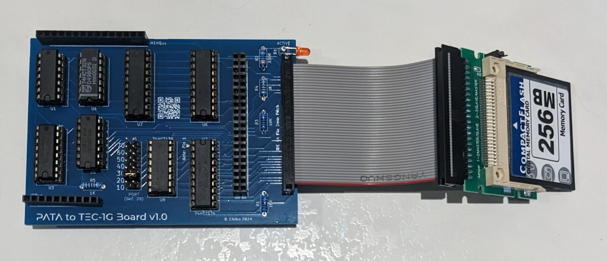
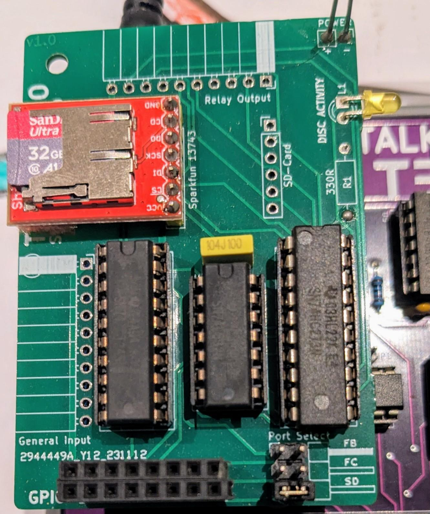
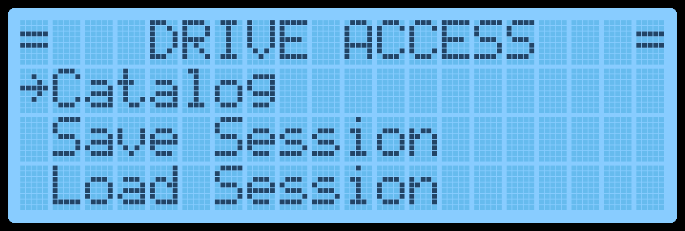
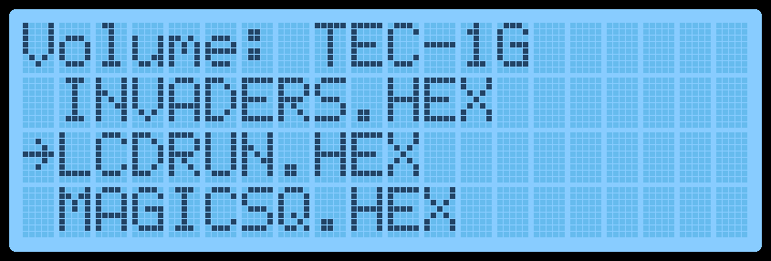
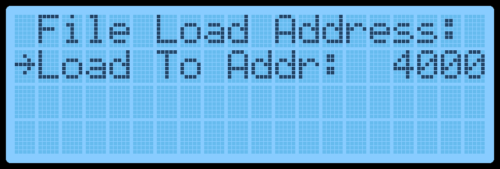
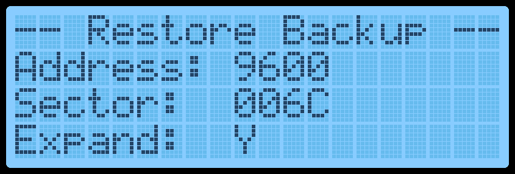

# Hard Drive Access

Mon3 has the ability to read and write to files from certain Hard Drives and
Solid State cards with Add-On boards.  There are two boards that will give
access to these drives, The GPIO/SD board and the PATA board.  The GPIO
board connects a Micro SD card and uses the General Purpose IO port.  The
PATA board connects a PATA laptop hard drive or a Compact Flash card
and uses the TEC Deck connector.



In terms of the particular medium used to store files, there are a few things to note:

- FAT32 (File Allocation Table) is the only file system Mon3 recognises. The drive must be formatted using FAT32 and be on the first MBR partition.
- Mon3 looks at the root directory for files. A maximum of 49 files can be read from the drive.
- Only short name files are displayed. Short file names use up to 8 characters for the file name and 3 for the extension. For example, `INVADERS.HEX`. If a file has a longer name, the FAT32 system automatically creates a shortened version.



With FAT32, files can be copied seamlessly from a PC or Mac to the drive.
A USB to drive reader is required, which can be easily found.

If both GPIO and PATA boards are connected to the TEC, Mon3 will
prioritise the GPIO board then the PATA board.  Details of the Add-on
Boards can be found in the TEC-1G GitHub repository.

Mon3 can only read or write existing files; it cannot create a new file on
the drive. A transfer from the TEC therefore begins with the **Export Raw
Data** menu option, which sends the code to a PC or Mac over serial. The
resulting binary can then be copied to the drive through a USB
SD/PATA/CF adaptor.

## Access to the Drive

**Drive Access** in the Main Menu opens three options: Catalog, Save
Session and Load Session. These options also have shortcuts in Data Entry
mode.



### Catalog

Catalog will display a list of readable files in the root directory of the drive.
Catalog can also be access by from Data Entry mode by pressing <span class="mon3-key-emphasis">Fn-F</span>.  If
Mon3 finds files on the drive, they will be displayed on the LCD screen.



<span class="mon3-key-emphasis">Plus</span> and <span class="mon3-key-emphasis">Minus</span> select a file, <span class="mon3-key-emphasis">GO</span> loads it, and
<span class="mon3-key-emphasis">AD</span> returns to the menu. If the file has the extension *.HEX, it is assumed that this
file is in Intel Hex format and it will automatically convert the file to binary
prior to loading.  Any other extension will ask for a Start Address as to
where the file is to be loaded at.



The Useful Links section lists sources of ready-to-run TEC-1G files for the
drive.

### Save / Load Session

The entire contents of RAM can be saved to a file and loaded back to the
TEC.  This is an equivalent to saving/restoring a session.   It replaces any
need to use Non-Volatile RAM.  It can be used prior to powering down to
save any unfinished work.  Then be able to access the same machine state
later on.

Because Mon3 cannot create files, the session file must already exist on the
PC or Mac.
The filename must be called "MYDATA.TEC" and be exactly 64 Kb in size.
The file can be easily created using the following command line
statements.

| O/S | Command |
| --- | --- |
| MS Windows | `>fsutil file createnew MYDATA.TEC 65536` |
| macOS | `$dd if=/dev/zero of=MYDATA.TEC bs=65536 count=1` |

A File Not Found error appears if Mon3 cannot find `MYDATA.TEC` on the
drive.

Save Session will save normal RAM between <span class="mon3-address-emphasis">0000H-BFFFH</span> and Expansion
RAM if any between <span class="mon3-address-emphasis">8000H-BFFFH</span>.  Save Session can also be access in Data
Entry mode by pressing <span class="mon3-key-emphasis">Fn-6</span>.

Load Session does the reverse of Save Session.  It will ask to Confirm this
task as it will overwrite all existing RAM data.  Load Session can also be
access in Data Entry mode by pressing <span class="mon3-key-emphasis">Fn-7</span>.

While the drive is being accessed, the LCD will display the current progress.



### Error Messages

If any errors occur while accessing the drive, an error message will be
displayed on the LCD and the code will exit after a key is pressed.

Error messages descriptions are below:

| Message | Description |
| --- | --- |
| Disk Timeout | No communication with PATA drive. |
| Data Not Ready | Read data request failed. |
| IDE ERR IO Bad | Data transfer error. |
| Can't read MBR | Could not read sector 0 of drive. |
| MBR Illegal | Malformed MBR record. |
| BPB Read Fail | BIOS parameter block of FAT32 not found. |
| Byt/Sec != 512 | FAT32 bytes per sector is not 512. |
| Root Dir Read | FAT lookup of sector failed. |
| File Not Found | File selected not found in menu configuration. |
| Bad Checksum | HEX file is corrupt. |
| No SD Card | SD card not found. |
| OCR Read Fail | SD addressing mode illegal. |
| Invalid SDCard | SD card cannot be used. |
| CMD16 Failed | SD block size cannot be set to 512. |
| Addr. Too Big | Read sector address greater than file size. |

## Drive Access API Calls

Special API calls support opening, reading and writing files from application
code. The details of these calls and their
limitations are described below.

### loadFromDisk #58 (3AH)
Catalogs files on the disk and displays them on the LCD for
loading.  This is the same as selecting CATALOG from the main menu or
<span class="mon3-key-emphasis">Fn-F</span> from data entry mode.
   -   Input: None
   -   Destroy: ALL

```asm
ld c,58         ;loadFromDisk
rst 10H
```

### openFile #59 (3BH)
Opens an existing file for reading or writing. The routine exits cleanly on success, or
an error will be displayed if file isn't found.  The filename is case sensitive
and must match exactly.  The file must already be existing on the drive.

   -   Input: HL = Pointer to zero terminated File name
   -   Destroy: ALL

```asm
ld hl,filename     ;address of file text
ld c,59            ;openFile
rst 10H

filename: .db "TBASIC.HEX",0
```

### readSector #60 (3CH)
Loads a sector from the opened file. One preceding `openFile` call is
required. A 512-byte sector is loaded at address
<span class="mon3-address-emphasis">0600H-07FFH</span>.   The input is the byte address in the file.  The entire sector
where that byte is will be returned.  An error will display if the input byte is
bigger than actual file size.

   -   Input: HLDE = address in bytes of block to read
   -   Destroy: ALL

```asm
ld hl,0001H     ;upper byte
ld de,2575H             ;lower byte
ld c,60         ;readSector
rst 10H
```

This example will read the sector that contains the byte 12575H and place
that sector in address <span class="mon3-address-emphasis">0600H-07FFH</span>.

### writeSector #61 (3DH)
Writes a sector to an opened file after a `readSector` call. The sector is
saved back to the same file position selected by `readSector`. Data at
address <span class="mon3-address-emphasis">0600H-07FFH</span> can be altered between the read and write calls.

   -   Input: None
   -   Destroy: ALL

```asm
    ld hl,0001H     ;upper byte
    ld de,2575H             ;lower byte
    ld c,60         ;readSector first
    rst 10H

;      ** Modify data at 0600H-07FFH here

    ld c,61         ;writeSector
    rst 10H
```

This example will read a sector first, make some modifications and then
write it back to the file.
