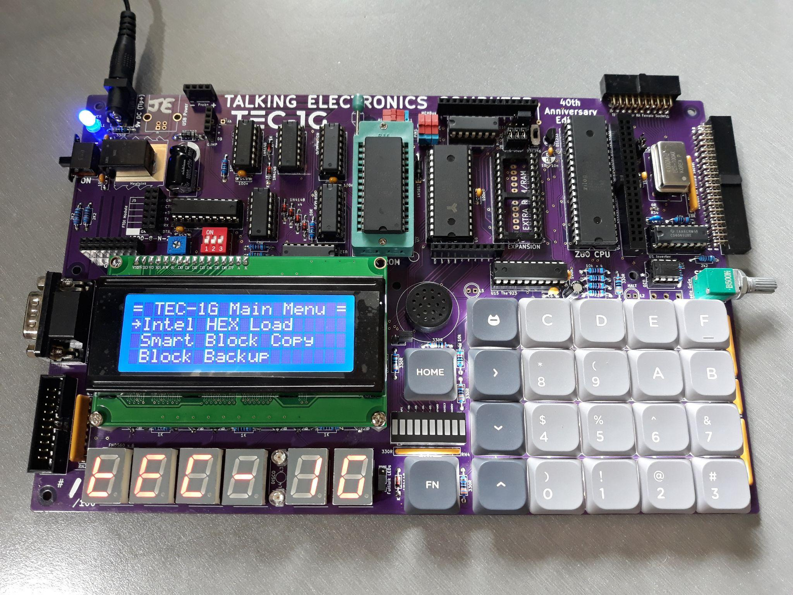

# MON-3 User Guide

**MON3 User Guide v1.6** is Brian Chiha's guide to the MON-3 monitor ROM for the TEC-1G single-board Z80 computer.

## Attribution

This web edition is adapted from the original PDF title page credit: [**User Guide By Brian Chiha v1.6**](https://github.com/MarkJelic/TEC-1G/blob/main/files/MON3_User_Guide_v1-6.pdf). Brian Chiha is the author of this text and should be credited as the author wherever this guide is referenced.

Mon3 (Talking Electronics Computer Monitor version 3) is custom-built for the TEC-1G Single Board Z80 Computer. Mon3 is the heart of the TEC-1G. It brings the hardware to life. Consider it an operating system that provides the ability to program the TEC. The monitor is designed for beginners who are just learning to code Z80 and rich enough for the advanced software developer.

The version of this document matches the monitor's binary file version. For example, version 1.2 of this document is for file `MON3-1G_BC23-12.bin`. The `12` at the end of the file is the version number.

MON-3 provides the operating environment for the TEC-1G: reset behaviour, the main menu, data entry mode, debugging support, terminal monitor, API calls, add-on interfaces, drive access, quick-start programs, and hardware reference material.

## Table of Contents

1. [Basic Operation and Main Menu](01-basic-operation-and-main-menu.md)
   - [Basic Operation](01-basic-operation-and-main-menu.md#basic-operation)
   - [Cold Reset](01-basic-operation-and-main-menu.md#cold-reset)
   - [Warm Reset](01-basic-operation-and-main-menu.md#warm-reset)
   - [Main Menu](01-basic-operation-and-main-menu.md#main-menu)
   - [Intel HEX Load](01-basic-operation-and-main-menu.md#intel-hex-load)
   - [Drive Access](01-basic-operation-and-main-menu.md#drive-access)
   - [Smart Block Copy](01-basic-operation-and-main-menu.md#smart-block-copy)
   - [Block Backup](01-basic-operation-and-main-menu.md#block-backup)
   - [Export Z80 Assembly](01-basic-operation-and-main-menu.md#export-z80-assembly)
   - [Export Raw Data](01-basic-operation-and-main-menu.md#export-raw-data)
   - [Export Hex Dump](01-basic-operation-and-main-menu.md#export-hex-dump)
   - [Import Binary File](01-basic-operation-and-main-menu.md#import-binary-file)
   - [Music Routine](01-basic-operation-and-main-menu.md#music-routine)
   - [Settings](01-basic-operation-and-main-menu.md#settings)
   - [Credits](01-basic-operation-and-main-menu.md#credits)
2. [Memory Map and Data Entry Mode](02-memory-map-and-data-entry-mode.md)
   - [Memory Map](02-memory-map-and-data-entry-mode.md#memory-map)
   - [Data Entry Mode](02-memory-map-and-data-entry-mode.md#data-entry-mode)
   - [Basic Operation](02-memory-map-and-data-entry-mode.md#basic-operation)
   - [LCD Screen](02-memory-map-and-data-entry-mode.md#lcd-screen)
   - [Function Keys](02-memory-map-and-data-entry-mode.md#function-keys)
   - [Matrix Keyboard](02-memory-map-and-data-entry-mode.md#matrix-keyboard)
   - [Keyboard Connection](02-memory-map-and-data-entry-mode.md#keyboard-connection)
   - [Debugging Programs](02-memory-map-and-data-entry-mode.md#debugging-programs)
   - [Breakpoints](02-memory-map-and-data-entry-mode.md#breakpoints)
   - [Register Display](02-memory-map-and-data-entry-mode.md#register-display)
3. [Tiny Basic](03-tiny-basic.md)
   - [Overview](03-tiny-basic.md#overview)
   - [Language Additions](03-tiny-basic.md#language-additions)
   - [Example Programs](03-tiny-basic.md#example-programs)
4. [Terminal Monitor and TEC Magazine Code](04-terminal-monitor-and-tec-magazine-code.md)
   - [Terminal Monitor](04-terminal-monitor-and-tec-magazine-code.md#terminal-monitor)
   - [Starting up TMON](04-terminal-monitor-and-tec-magazine-code.md#starting-up-tmon)
   - [Using TMON](04-terminal-monitor-and-tec-magazine-code.md#using-tmon)
   - [The Command Prompt](04-terminal-monitor-and-tec-magazine-code.md#the-command-prompt)
   - [DATA mode](04-terminal-monitor-and-tec-magazine-code.md#data-mode)
   - [TMON Commands](04-terminal-monitor-and-tec-magazine-code.md#tmon-commands)
   - [TEC Magazine Code on the TEC-1G](04-terminal-monitor-and-tec-magazine-code.md#tec-magazine-code-on-the-tec-1g)
   - [Address Changes](04-terminal-monitor-and-tec-magazine-code.md#address-changes)
   - [Keypad Changes](04-terminal-monitor-and-tec-magazine-code.md#keypad-changes)
   - [Conversion Example](04-terminal-monitor-and-tec-magazine-code.md#conversion-example)
5. [Advanced Programming](05-advanced-programming.md)
   - [RST (Restart) commands](05-advanced-programming.md#rst-restart-commands)
   - [Interrupts](05-advanced-programming.md#interrupts)
   - [NMI (Non-Maskable Interrupts)](05-advanced-programming.md#nmi-non-maskable-interrupts)
   - [API (Application Programming Interface) commands](05-advanced-programming.md#api-application-programming-interface-commands)
   - [API Utility Calls](05-advanced-programming.md#api-utility-calls)
   - [API LCD Calls](05-advanced-programming.md#api-lcd-calls)
   - [API Input Calls](05-advanced-programming.md#api-input-calls)
   - [API Serial Data Transfer Calls](05-advanced-programming.md#api-serial-data-transfer-calls)
   - [API Menu & Parameter Calls](05-advanced-programming.md#api-menu-parameter-calls)
   - [API Sound Calls](05-advanced-programming.md#api-sound-calls)
   - [API System Latch Calls](05-advanced-programming.md#api-system-latch-calls)
   - [Miscellaneous Calls](05-advanced-programming.md#miscellaneous-calls)
6. [Real Time Clock Add-On](06-real-time-clock.md)
   - [RTC API Calls](06-real-time-clock.md#rtc-api-calls)
   - [RTC Routine List](06-real-time-clock.md#rtc-routine-list)
   - [RTCSetup #18 (12H)](06-real-time-clock.md#rtcsetup-18-12h)
7. [Graphical LCD Add-On](07-graphical-lcd.md)
   - [General Conventions](07-graphical-lcd.md#general-conventions)
   - [GLCD API Call List](07-graphical-lcd.md#glcd-api-call-list)
   - [GLCD API Configure Calls](07-graphical-lcd.md#glcd-api-configure-calls)
   - [GLCD API Graphics Calls](07-graphical-lcd.md#glcd-api-graphics-calls)
   - [GLCD API Text Calls](07-graphical-lcd.md#glcd-api-text-calls)
   - [GLCD API Utility Calls](07-graphical-lcd.md#glcd-api-utility-calls)
   - [GLCD API Drawing Calls](07-graphical-lcd.md#glcd-api-drawing-calls)
   - [GLCD API Terminal Emulator Calls](07-graphical-lcd.md#glcd-api-terminal-emulator-calls)
   - [GLCD Examples](07-graphical-lcd.md#glcd-examples)
8. [Hard Drive Access](08-hard-drive-access.md)
   - [Access to the Drive](08-hard-drive-access.md#access-to-the-drive)
   - [Drive Access API Calls](08-hard-drive-access.md#drive-access-api-calls)
9. [Quick Start Programs](09-quick-start-programs.md)
   - [Seven Segment HELLO, Direct Data](09-quick-start-programs.md#seven-segment-hello-direct-data)
   - [Seven Segment HELLO, ASCII Conversion](09-quick-start-programs.md#seven-segment-hello-ascii-conversion)
   - [LCD HELLO](09-quick-start-programs.md#lcd-hello)
   - [Matrix Keyboard Echo to the Serial Terminal](09-quick-start-programs.md#matrix-keyboard-echo-to-the-serial-terminal)
   - [Seven Segment Scroller via the Serial Terminal](09-quick-start-programs.md#seven-segment-scroller-via-the-serial-terminal)
   - [Making Bubbles](09-quick-start-programs.md#making-bubbles)
   - [GLCD Font Display](09-quick-start-programs.md#glcd-font-display)
   - [Use the GLCD as a Serial Terminal](09-quick-start-programs.md#use-the-glcd-as-a-serial-terminal)
10. [Appendix and Useful Links](10-appendix-and-useful-links.md)
   - [Ports](10-appendix-and-useful-links.md#ports)
   - [Serial Connection](10-appendix-and-useful-links.md#serial-connection)
   - [Function Key Shortcuts](10-appendix-and-useful-links.md#function-key-shortcuts)
   - [LCD Cheatsheet](10-appendix-and-useful-links.md#lcd-cheatsheet)
   - [Character Table](10-appendix-and-useful-links.md#character-table)
   - [Example Using CGRAM and DDRAM](10-appendix-and-useful-links.md#example-using-cgram-and-ddram)
   - [Useful Links](10-appendix-and-useful-links.md#useful-links)
   - [I/O Connectors](10-appendix-and-useful-links.md#io-connectors)

[Basic Operation and Main Menu →](01-basic-operation-and-main-menu.md)
